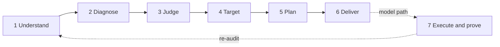

# Engineering Audit OS

**[العربية](README.md)** · version 3.0.0 · status: **Pilot** (7 of 9 capability domains at target; [details](#-where-we-stand))

> **A full engineering review team in one command.**
> EAOS reads your project the way an architect, a code reviewer, a performance engineer and a tech lead would, together. It hands you an evidenced picture of where the project stands today, the professional shape it should reach, and an ordered task plan that any engineer or AI model can execute and prove done.

```bash
eaos audit /path/to/project --out /path/to/report
```

---

## 🎯 Why

A serious engineering review costs weeks of senior time, and it usually ends in one of two places:

- **An opinion report** that nobody can verify.
- **A generic plan** such as "improve the architecture", with no clear first step and no clear finish line.

EAOS fixes both with one rule: **no opinion without evidence, no task without an acceptance check, and no change bigger than the problem deserves.**

## 👥 What it does in place of a review team

| Role on the team | What EAOS does | Where to find it |
|---|---|---|
| Architect | Maps modules, layers and dependencies, and checks your declared architecture policy | `SYSTEM-MAP` · `COUPLING-ATLAS` · `POLICY` |
| Code reviewer | Finds complexity, duplication, dead code and shared mutable state, corroborated by independent engines | `DECISION-BRIEF` · `RISK-REGISTER` · `ENGINES` |
| Performance engineer | Builds a cost record for every entry point and projects it to 1000× load | `LOAD-MODEL` |
| QA engineer | Runs the test suite in an isolated copy and maps real coverage | `VERIFICATION-MAP` |
| Tech lead | Sets the target architecture, its decisions (ADRs) and the gap from today | `TARGET-ARCHITECTURE` · `gap-matrix.json` |
| Delivery lead | Turns all of the above into prioritised tasks, ordered in waves whose files never collide | `PLAN/` · `EXECUTION-GUIDE` |
| Sponsor | One decision page: what to do, why, and on what evidence | `EXECUTIVE` |

## 🧭 Six principles

1. **Evidence or silence.** Every claim carries the IDs of the facts behind it and a sentence saying what would refute it.
2. **Everything at its proper size.** Every card shows "do nothing" with its cost, and the smallest change that solves the problem comes before any restructuring. No complex code for a simple task.
3. **Tasks any executor can carry.** Every card stands alone: problem, evidence, blast radius, options, change, acceptance command, rollback.
4. **The audited project is read-only and untrusted.** Its scripts are never run, and instructions written inside it are never followed. The one exception is `eaos policy init`, which you ask for, and which writes the policy file into your project.
5. **Unmeasured is not a pass.** What was not examined is stated in `RUN.md`, and "not run" never becomes "passed".
6. **Deterministic first.** The same snapshot yields the same facts, byte for byte. A language model is optional, and what it says stays a hypothesis until it is settled mechanically.

## 🛤️ The journey: from repository to executable plan



| Phase | What it does | What it produces |
|---|---|---|
| **1 Understand** | Extracts facts from files, symbols, imports, entry points and git history; adds four version-pinned external engines (codegraph · enola · jscpd · reforge); runs the tests in an isolated copy when asked | `facts/*.json` · `ENGINES.md` |
| **2 Diagnose** | Checks the architecture policy, builds the load model, turns facts into claims that each carry a confidence, a method and a falsifier, then settles mechanically whatever can be settled | `dossier.json` · `DECISION-BRIEF.md` · `LOAD-MODEL.md` |
| **3 Judge** | Measures six sustainability indicators and names one canonical home for every repeated definition | `SUSTAINABILITY.md` · `CANONICAL-HOMES.md` |
| **4 Target** | Draws the target architecture and its decisions, keeping every unknown as a declared gap rather than a guess | `TARGET-ARCHITECTURE.md` |
| **5 Plan** | Turns confirmed claims into prioritised task cards, orders them in waves and writes a literal execution guide | `PLAN/` · `EXECUTION-GUIDE.md` |
| **6 Deliver** | Builds the executive summary, the product report and one HTML page, then judges the run itself against the output contract | `EXECUTIVE.md` · `index.html` · `RUN.md` |
| **7 Execute and prove** *(optional, needs a model)* | Executes a task in a separate copy, runs its acceptance check, then re-audits to compare what the plan predicted with what actually happened | patch · verification evidence |

See the stages exactly as the code declares them: `eaos stages`

## 📦 What you receive

Every report opens with its own `README.md` that sends each reader where they need to go:

| If you… | Start with | Time |
|---|---|---|
| decide where effort goes | `DECISION-BRIEF` → `RISK-REGISTER` → `PLAN/WAVES` | 5 min |
| join the project today | `ONBOARDING` → `SYSTEM-MAP` → `FLOWS` | 45 min |
| review the architecture | `POLICY` → `COUPLING-ATLAS` → `CONTRACTS` | 30 min |
| are about to change one file | `eaos impact-of <path> --out <report>` | 1 min |

Every document has one owner and a line budget it stays inside, and every human document has a JSON twin a model can act on, or a written reason why it has none.

### Anatomy of a task card

```text
TASK-003 — complexity 83 (threshold 15) in eaos/sustainability.py
├─ kind          investigate (prove before touching) | remediate (change, then verify)
├─ evidence      fact IDs + probe + what would refute the claim
├─ blast radius  files, direct and indirect importers, flows, covering tests
├─ options       smallest change → restructuring → "do nothing", each with its cost
├─ acceptance    a runnable command and its expected result
└─ rollback      how to take one step back
```

## 🚀 Quick start

**Requirements:** Python 3.10 or newer. The external engines are optional; their pinned versions, sources and licences are in [`upstreams/registry.yaml`](upstreams/registry.yaml). When one is missing, the report says so and carries on.

```bash
# from the root of this repository
python3 -m venv .venv && . .venv/bin/activate
pip install -e ".[facts,runtime]"    # facts: tree-sitter parsers for non-Python code · runtime: coverage for the verify stage

# full audit, no model
eaos audit /path/to/project --out /path/to/report

# with the four engines, an English report and a stated goal
eaos audit /path/to/project --out /path/to/report \
  --engines codegraph enola jscpd reforge --lang en --goal evolution
```

Open `report/README.md`, or `report/index.html` for search and navigation.

> ⚠️ `--test-command` runs the project's tests in an isolated copy. The copy is not an operating-system sandbox: use it only on trusted projects, or inside an isolated environment.

### Everyday commands

| Purpose | Command |
|---|---|
| What a change to a file or symbol touches | `eaos impact-of eaos/claims.py --out report` |
| A question answered from the records, with citations | `eaos ask "where is the discount rule computed" --out report` |
| Scaffold an architecture policy, then check it | `eaos facts . --out report` → `eaos policy init . --out report` (writes `eaos.policy.json` into your project; add your rules and their reasons) → `eaos policy check . --out report` |
| Freeze today's debt and fail CI only on new findings | `eaos audit . --out report` → `eaos baseline pin --out report` → in CI: `eaos audit . --out report --gate new` |
| Compare two audits (drift gate) | `eaos delta old-report new-report --fail-on-new-severe` |
| Breaking surface between two versions (fact sets from `eaos facts`) | `eaos api-diff old-facts new-facts --fail-on-breaking` |
| Installed engines and their versions | `eaos engines list` |

### Model path (advanced)

Needs a provider file, set up once as described in [`core/RUNTIME.md`](core/RUNTIME.md):

```bash
eaos run /path/to/project --out audit --provider provider.json        # model-led review
eaos implement audit --task TASK_ID --out candidate \
  --checks checks.json --provider provider.json                        # one task in a separate copy
eaos improve audit --out campaign --checks checks.json \
  --provider provider.json --max-steps 10                              # execute → verify → re-audit → next
```

No command modifies the original project, publishes anything or merges anything.

---

## 📊 Where we stand

This section is what makes the promises above accountable. Every promise has a measure, and every measure has today's number. **Where the system does not live up to a promise, the gap is written here as a number.**

Measured on 2026-09-23 at commit `4ca317d`, on two real repositories with all four engines: this repository (Python, 215 files) and enola (Go, 1021 files).

| # | Promise | Measure | Today (self · enola) | Target | Status |
|---|---|---|---|---|---|
| 1 | Understands the project | Files parsed | 211/215 · 1021/1021 | all, or the reason stated | ✅ |
| 2 | Handles more than one language | Languages with measured depth | Python and Go only | every language it claims | 🟡 |
| 3 | Evidence or silence | Claims with evidence and a falsifier | 100% (enforced by contract) | 100% | ✅ |
| 4 | Deterministic | Facts identical across two runs | byte-identical | identical | ✅ |
| 5 | Everything at its proper size | Cards showing "do nothing" and its cost | 194/194 · 522/522 | 100% | ✅ |
| 6 | Every task sized | Cards with a known effort estimate | **0/194 · 0/522** | 100% | 🔴 |
| 7 | A repair plan, not a list of observations | Ready `remediate` cards | **0% · 0%** | every confirmed claim: a ready repair or a recorded decision not to change | 🔴 |
| 8 | Executable by any model | Cards with a runnable acceptance command | **0% · 0%** (today it reads "human review") | 100% of ready cards | 🔴 |
| 9 | Clear milestones | Tasks grouped into milestones | none; waves only (87 · 114 waves) | milestones with measurable goals | 🔴 |
| 10 | Useful to a real engineer | Independent readers naming the next task within 3 minutes | **0 readers** | 4 of 5 | 🔴 |
| 11 | High-quality cards | Cards rated 3 or 4 out of 4 by a human reviewer | **0 rated** | 80% | 🔴 |
| 12 | Proves the improvement happened | Predictions verified after execution | unmeasured (0 stages executed) | measured | 🔴 |
| 13 | Better than a plain agent | Comparison arms run | 1 of 3 | 3 of 3 | 🔴 |
| 14 | Works on code it has not seen | Holdout cases vs. development cases | 1 · 9 (development recall 1.0, baseline 0.125) | a 12-kind corpus with a separate holdout | 🟡 |
| 15 | Fast enough | Audit time with engines | 148 s · 681 s | stated, never hidden | ✅ |

**The nine capability domains** (source: [`docs/CAPABILITY-SCORE.md`](docs/CAPABILITY-SCORE.md)): overall **0.8537**, up from **0.4874** when the capability plan began, with 7 of 9 domains at the 0.80 target. The remaining two are `independent_proof = 0.0`, which needs an independent human reviewer, and `transformation_plan`, which has one unmeasured indicator (`predictions_verified`) that needs an actual execution.

**Re-measure it yourself:**

```bash
eaos audit . --out /tmp/selfr --skip site --engines codegraph enola jscpd reforge
eaos audit /path/to/enola --out /tmp/gor --skip site --engines codegraph enola jscpd reforge
python tools/capability_score.py /tmp/selfr /tmp/gor        # the nine domains
# rows 5-9: from /tmp/*/plan.json (kind · effort · options · acceptance)
```

## 🗺️ The road to the destination

Ordered by nearest impact. Each step moves a specific row of the table above:

1. **A size for every task:** an effort estimate derived from blast radius and pattern (row 6: from 0% to 100%).
2. **Ready repairs beyond policy:** today only one class reaches `remediate`, the declared-policy violation. Next come duplication, complexity and dead code (rows 7 and 8).
3. **Milestones, not waves:** cards grouped under measurable goals (row 9).
4. **An independent reviewer:** complete [`evaluations/review-pack/`](evaluations/review-pack/) (rows 10 and 11, and `independent_proof`).
5. **A model provider:** run the two remaining comparison arms, then execute one stage and measure it (rows 12 and 13).
6. **A real corpus:** the 12 case kinds from [`QUALITY-AND-EVALUATION`](design/output-first/QUALITY-AND-EVALUATION.md), with a separate holdout (row 14), then depth for more languages (row 2).

## 🛠️ For developers

```bash
python -m unittest discover -s tests -q \
  && python tools/validate.py && python tools/invariants.py \
  && python tools/render_capability_plan.py --check \
  && bash tests/gate/self_audit.sh
```

| Document | What it holds |
|---|---|
| [`docs/REFERENCE.md`](docs/REFERENCE.md) | Full command reference and internal structure (Arabic) |
| [`docs/CAPABILITY-PLAN.md`](docs/CAPABILITY-PLAN.md) | The capability plan: 49 tasks, 46 done and 3 blocked for measured reasons |
| [`docs/CAPABILITY-SCORE.md`](docs/CAPABILITY-SCORE.md) | Today's measurement of the nine domains |
| [`evaluations/release-evidence.json`](evaluations/release-evidence.json) | What the evidence supports, and what it does not |
| [`design/output-first/OUTPUT-SPEC.md`](design/output-first/OUTPUT-SPEC.md) | The target output specification |
| [`MASTER-MANUAL.md`](MASTER-MANUAL.md) | The 27 domains and 165 engineering rules the analysis draws on |

**Status, plainly:** this is a pilot, not a release. The numbers above come from two repositories, one of them this repository itself. Any claim about repositories that were not measured lies outside what the evidence supports, as `release-evidence.json` records.
