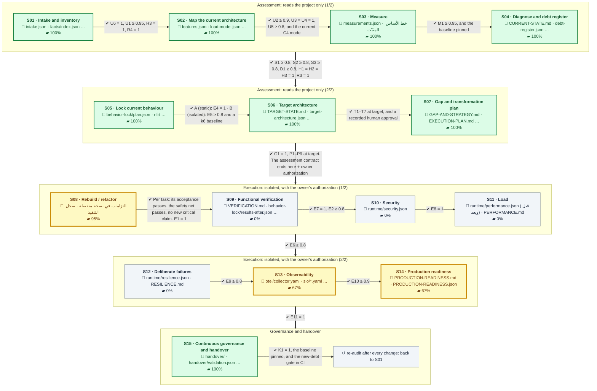
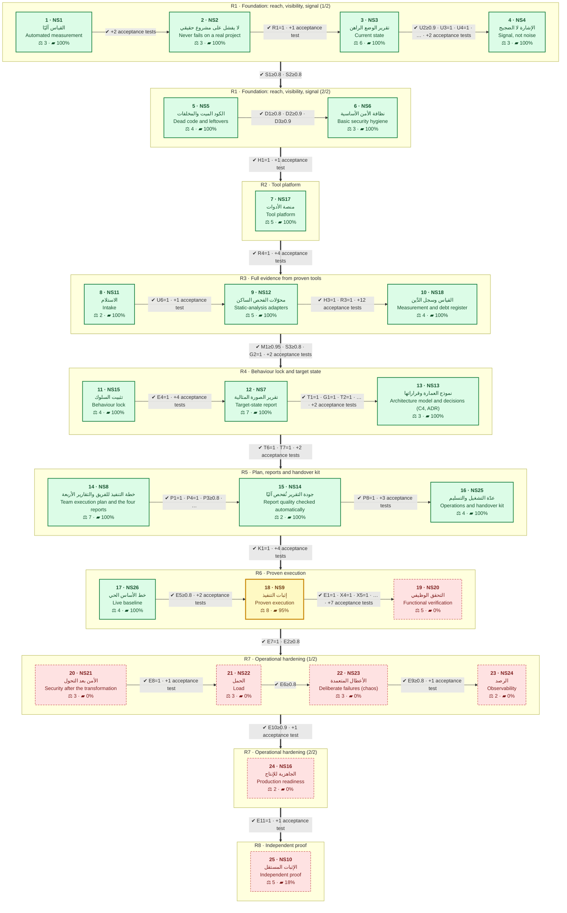

# Engineering Audit OS

**[العربية](README.md)** · version 3.0.0 · status: **Pilot** · progress: [where we stand](#-where-we-stand)

> **A full engineering review team in one command.**
> EAOS reads your project the way an architect, a code reviewer, a performance engineer and a tech lead would, together. It hands you an evidenced picture of where the project stands today, the professional shape it should reach, and an ordered task plan that any engineer or AI model can execute and prove done.

```bash
eaos audit /path/to/project --out /path/to/report
```

---

## 🎯 Why

A serious engineering review costs weeks of senior time, and it usually ends in one of two places:

- **An opinion report** that nobody can verify.
- **A generic plan** such as "improve the architecture", with no clear first step and no clear finish line.

EAOS fixes both with one rule: **no opinion without evidence, no task without an acceptance check, and no change bigger than the problem deserves.**

## 🏢 The idea: what a software company does, in one command

You built a program by vibe coding. It works, but you do not know how it is built, what goes in and out, where its limits are, or how complex and repetitive it is. A software company asked to rebuild it as a professional product would hand you four things, in order. That is what EAOS must deliver:

| # | Report | What it holds |
|---|---|---|
| 1 | **Current state** | What the program does, its inputs, outputs and limits, its structure, complexity and duplication, its dead code and leftovers, its risks |
| 2 | **Ideal state** | The same program with the same functions, on a structure and infrastructure fit for a product. Every part gets a decision: reuse, restructure, rebuild or delete |
| 3 | **Gap and transformation** | The measured distance between the two, and the strategy that closes it |
| 4 | **Execution plan** | Small tasks split into team sections, each with a size, an acceptance command and a rollback, executable by any developer or model |

This is the only measure of the project's success. The full workflow, its fifteen stages, tools and gates, is in [`docs/MASTER-BLUEPRINT.md`](docs/MASTER-BLUEPRINT.md); the measurement, its indicators and plan, in [`docs/NORTH-STAR.md`](docs/NORTH-STAR.md) (both Arabic).

## 🧭 Six principles

1. **Evidence or silence.** Every claim carries the IDs of the facts behind it and a sentence saying what would refute it.
2. **Everything at its proper size.** Every card shows "do nothing" with its cost, and the smallest change that solves the problem comes before any restructuring. No complex code for a simple task.
3. **Tasks any executor can carry.** Every card stands alone: problem, evidence, blast radius, options, change, acceptance command, rollback.
4. **The audited project is read-only and untrusted.** Its scripts are never run, and instructions written inside it are never followed. The one exception is `eaos policy init`, which you ask for, and which writes the policy file into your project.
5. **Unmeasured is not a pass.** What was not examined is stated in `RUN.md`, and "not run" never becomes "passed".
6. **Deterministic first.** The same snapshot yields the same facts, byte for byte. A language model is optional, and what it says stays a hypothesis until it is settled mechanically.

## 🛤️ How it works: stages, outputs and transition gates

<!-- north-star:pipeline:start -->
<!-- generated from docs/north-star.json by python tools/north_star.py; do not edit by hand -->

Each box is a stage and its output; each arrow is a gate: work moves on only when its criteria hold. S01 to S07 only read the project and end with the four reports; S08 to S14 run it in isolation, with its owner's authorization.


```mermaid
%%{init: {'flowchart': {'wrappingWidth': 260, 'nodeSpacing': 40, 'rankSpacing': 60}}}%%
flowchart TB
    subgraph P1["Assessment: reads the project only (1/2)"]
        direction LR
        S01["<b>S01 · Intake and inventory</b><br/>📄 intake.json · facts/index.json …<br/>▰ 100%"]:::done
        S02["<b>S02 · Map the current architecture</b><br/>📄 features.json · load-model.json …<br/>▰ 100%"]:::done
        S03["<b>S03 · Measure</b><br/>📄 measurements.json · خط الأساس المثبّت<br/>▰ 100%"]:::done
        S04["<b>S04 · Diagnose and debt register</b><br/>📄 CURRENT-STATE.md · debt-register.json …<br/>▰ 100%"]:::done
        S01 -->|"✔ U6 = 1, U1 ≥ 0.95, H3 = 1, R4 = 1"| S02
        S02 -->|"✔ U2 ≥ 0.9, U3 = U4 = 1, U5 ≥ 0.8, and the current C4 model"| S03
        S03 -->|"✔ M1 ≥ 0.95, and the baseline pinned"| S04
    end
    subgraph P2["Assessment: reads the project only (2/2)"]
        direction LR
        S05["<b>S05 · Lock current behaviour</b><br/>📄 behavior-lock/plan.json · nfr/ …<br/>▰ 100%"]:::done
        S06["<b>S06 · Target architecture</b><br/>📄 TARGET-STATE.md · target-architecture.json …<br/>▰ 100%"]:::done
        S07["<b>S07 · Gap and transformation plan</b><br/>📄 GAP-AND-STRATEGY.md · EXECUTION-PLAN.md …<br/>▰ 100%"]:::done
        S05 -->|"✔ A (static): E4 = 1 · B (isolated): E5 ≥ 0.8 and a k6 baseline"| S06
        S06 -->|"✔ T1–T7 at target, and a recorded human approval"| S07
    end
    subgraph P3["Execution: isolated, with the owner's authorization (1/2)"]
        direction LR
        S08["<b>S08 · Rebuild / refactor</b><br/>📄 التزامات في نسخة منفصلة · سجل التنفيذ<br/>▰ 95%"]:::current
        S09["<b>S09 · Functional verification</b><br/>📄 VERIFICATION.md · behavior-lock/results-after.json …<br/>▰ 0%"]:::next
        S10["<b>S10 · Security</b><br/>📄 runtime/security.json<br/>▰ 0%"]:::next
        S11["<b>S11 · Load</b><br/>📄 runtime/performance.json (قبل وبعد) · PERFORMANCE.md<br/>▰ 0%"]:::next
        S08 -->|"✔ Per task: its acceptance passes, the safety net passes, no new critical claim. E1 = 1"| S09
        S09 -->|"✔ E7 = 1, E2 ≥ 0.8"| S10
        S10 -->|"✔ E8 = 1"| S11
    end
    subgraph P4["Execution: isolated, with the owner's authorization (2/2)"]
        direction LR
        S12["<b>S12 · Deliberate failures</b><br/>📄 runtime/resilience.json · RESILIENCE.md<br/>▰ 0%"]:::next
        S13["<b>S13 · Observability</b><br/>📄 otel/collector.yaml · slo/*.yaml …<br/>▰ 67%"]:::current
        S14["<b>S14 · Production readiness</b><br/>📄 PRODUCTION-READINESS.md · PRODUCTION-READINESS.json<br/>▰ 67%"]:::current
        S12 -->|"✔ E9 ≥ 0.8"| S13
        S13 -->|"✔ E10 ≥ 0.9"| S14
    end
    subgraph P5["Governance and handover"]
        direction LR
        S15["<b>S15 · Continuous governance and handover</b><br/>📄 handover/ · handover/validation.json …<br/>▰ 100%"]:::done
        LOOP["↺ re-audit after every change: back to S01"]:::next
        S15 -->|"✔ K1 = 1, the baseline pinned, and the new-debt gate in CI"| LOOP
    end
    P1 ==>|"✔ S1 ≥ 0.8, S2 ≥ 0.8, S3 ≥ 0.8, D1 ≥ 0.8, H1 = H2 = H3 = 1, R3 = 1"| P2
    P2 ==>|"✔ G1 = 1, P1–P9 at target. The assessment contract ends here + owner authorization"| P3
    P3 ==>|"✔ E6 ≥ 0.8"| P4
    P4 ==>|"✔ E11 = 1"| P5
    classDef done fill:#dcfce7,stroke:#15803d,color:#14532d,stroke-width:2px
    classDef current fill:#fef9c3,stroke:#ca8a04,color:#713f12,stroke-width:3px
    classDef next fill:#f1f5f9,stroke:#64748b,color:#1e293b
    classDef owner fill:#fee2e2,stroke:#b91c1c,color:#7f1d1d,stroke-dasharray:5 3
```

<!-- north-star:pipeline:end -->

See the stages exactly as the code declares them: `eaos stages` · and whether each stage's gate passes, and why not: `eaos engage status report`

---

## 📦 What you receive

Every report opens with its own `README.md` that sends each reader where they need to go:

| If you… | Start with | Time |
|---|---|---|
| want the whole picture | `CURRENT-STATE` → `TARGET-STATE` → `GAP-AND-STRATEGY` → `EXECUTION-PLAN` | 20 min |
| decide where effort goes | `DECISION-BRIEF` → `RISK-REGISTER` → `PLAN/WAVES` | 5 min |
| join the project today | `ONBOARDING` → `SYSTEM-MAP` → `FLOWS` | 45 min |
| review the architecture | `POLICY` → `COUPLING-ATLAS` → `CONTRACTS` | 30 min |
| are about to change one file | `eaos impact-of <path> --out <report>` | 1 min |

Every document has one owner and a line budget it stays inside, and every human document has a JSON twin a model can act on, or a written reason why it has none.

### Anatomy of a task card

```text
TASK-003 — complexity 83 (threshold 15) in eaos/sustainability.py
├─ kind          investigate (a recorded decision before any change) | remediate (change, then verify)
├─ size, section S/M/L from files and dependents · security, infrastructure, data, backend, frontend, quality
├─ evidence      fact IDs + probe + what would refute the claim
├─ blast radius  files, direct and indirect importers, flows, covering tests
├─ options       smallest change → restructuring → "do nothing", each with its cost
├─ acceptance    a runnable command: `eaos recheck` re-checks the problem itself, or `eaos decided` for an investigation
└─ rollback      how to take one step back
```

## 🚀 Quick start

### The easy way: inside your AI assistant (no technical knowledge needed)

> The full guide, step by step with how long each takes, what you should see, and what to do if something goes wrong: **[`docs/GUIDE.en.md`](docs/GUIDE.en.md)**.

**1. Install EAOS** (once). Paste this line into the Terminal. It installs EAOS and adds it to Claude Code and Codex by itself:

```bash
curl -fsSL https://raw.githubusercontent.com/eom1417/engineering-audit-os/main/install.sh | bash
```

**2. Open your assistant in your project folder, and write:**

> Check my project with EAOS and fix its problems

The assistant checks your project, explains the main problems, and asks you one question before running your app in a separate
copy. Then it carries on alone: it runs the app, records its screens, writes the fixes, and EAOS checks each one. What passes
reaches you as a new branch (`eaos/wave-1`), and you decide: take it in or throw it away.

**3. Read the report:** say "open the report". Everything is in one folder, `~/EAOS/<your project>/`, with `REPORT.html`
(project summary, gaps and risks, structure map, plan and progress) in plain words.

No AI assistant? The same way as commands in the Terminal: `eaos start .`, then `eaos next` after each step.

> How it works inside the assistant: [`docs/MCP.md`](docs/MCP.md). Why it is designed this way: [`docs/USER-EXPERIENCE.md`](docs/USER-EXPERIENCE.md).

### For developers: the direct commands

**Requirements:** Python 3.10 or newer. The external tools (Semgrep, Syft, OSV-Scanner, jscpd, dependency-cruiser, Structurizr and more) install with one command at their pinned versions and verified checksums; their sources and licences are in [`upstreams/toolchain.json`](upstreams/toolchain.json) and [`docs/TOOLCHAIN.md`](docs/TOOLCHAIN.md). When one is missing, the report says so and carries on.

```bash
# from the root of this repository
python3 -m venv .venv && . .venv/bin/activate
pip install -e ".[facts,runtime]"    # facts: tree-sitter parsers for non-Python code · runtime: coverage for the verify stage
eaos tools install --stage assessment  # the assessment tools; eaos tools doctor shows what is installed, at which version

# full audit, no model
eaos audit /path/to/project --out /path/to/report

# with the four engines, an English report and a stated goal
eaos audit /path/to/project --out /path/to/report \
  --engines codegraph enola jscpd reforge --lang en --goal evolution
```

Open `report/README.md` and start with the four reports (`CURRENT-STATE.md` → `TARGET-STATE.md` → `GAP-AND-STRATEGY.md` → `EXECUTION-PLAN.md`), or `report/index.html` for search and navigation.

> ⚠️ `--test-command` runs the project's tests in an isolated copy. The copy is not an operating-system sandbox: use it only on trusted projects, or inside an isolated environment.

### Everyday commands

| Purpose | Command |
|---|---|
| What a change to a file or symbol touches | `eaos impact-of eaos/claims.py --out report` |
| A question answered from the records, with citations | `eaos ask "where is the discount rule computed" --out report` |
| Scaffold an architecture policy, then check it | `eaos facts . --out report` → `eaos policy init . --out report` (writes `eaos.policy.json` into your project; add your rules and their reasons) → `eaos policy check . --out report` |
| Freeze today's debt and fail CI only on new findings | `eaos audit . --out report` → `eaos baseline pin --out report` → in CI: `eaos audit . --out report --gate new` |
| Compare two audits (drift gate) | `eaos delta old-report new-report --fail-on-new-severe` |
| Breaking surface between two versions (fact sets from `eaos facts`) | `eaos api-diff old-facts new-facts --fail-on-breaking` |
| Installed engines and their versions | `eaos engines list` · `eaos tools doctor` |
| Files in each tool's own format (CI, pre-commit, Renovate, k6…), judged by that tool | `eaos emit report --validate` |
| Whether each stage's gate passes, and why not | `eaos engage status report` |

### Model path (advanced)

Needs a provider file, set up once as described in [`core/RUNTIME.md`](core/RUNTIME.md):

```bash
eaos run /path/to/project --out audit --provider provider.json        # model-led review
eaos implement audit --task TASK_ID --out candidate \
  --checks checks.json --provider provider.json                        # one task in a separate copy
eaos improve audit --out campaign --checks checks.json \
  --provider provider.json --max-steps 10                              # execute → verify → re-audit → next
```

No command modifies the original project, publishes anything or merges anything.

---

## 📊 Where we stand

<!-- north-star:progress:start -->
<!-- generated from docs/north-star.json by python tools/north_star.py; do not edit by hand -->

### Progress: **77.5 of 100 points**

`███████████████████░░░░░░` 77.5%

| Steps done | Current step | Points left | Of which wait on the owner | Last measured |
|---|---|---|---|---|
| 17 of 25 | 18 · NS9 Proven execution | 22.5 | 23 | 2026-09-28 · `0a8ea72+` |

`+`: measured on changes over this commit, saved in the next one.

**How it is computed:**

- Every step has a **weight** in points, summing to 100, each with its stated reason.
- **Step completion** = the mean of its tasks weighted by size (S = 1, M = 2, L = 3). A closed task is 100%. An open one counts its indicators' progress toward their gate thresholds (value ÷ threshold), capped at 90% until its acceptance command passes and it is closed.
- **Step points** = weight × completion. **Progress** = the sum over all steps, out of 100.
- **Output quality** = the mean of value ÷ threshold over the step's gate criteria, as measured today on 3 real projects.
- **Transition gate:** the next step does not start until every criterion of the current step's gate holds. `python tools/north_star.py --check` fails when a step closes before the one before it, or a closed step's gate stops holding.

The twenty-five steps in execution order; each arrow carries the gate of the step before it. Every step in full (what it does, its tools, its output, and its gate values today) is in [docs/NORTH-STAR.md](docs/NORTH-STAR.md) (Arabic).


```mermaid
%%{init: {'flowchart': {'wrappingWidth': 260, 'nodeSpacing': 40, 'rankSpacing': 60}}}%%
flowchart TB
    subgraph R1_1["R1 · Foundation: reach, visibility, signal (1/2)"]
        direction LR
        NS1["<b>1 · NS1</b><br/>القياس آليًا<br/>Automated measurement<br/>⚖ 3 · ▰ 100%"]:::done
        NS2["<b>2 · NS2</b><br/>لا يفشل على مشروع حقيقي<br/>Never fails on a real project<br/>⚖ 3 · ▰ 100%"]:::done
        NS3["<b>3 · NS3</b><br/>تقرير الوضع الراهن<br/>Current state<br/>⚖ 6 · ▰ 100%"]:::done
        NS4["<b>4 · NS4</b><br/>الإشارة لا الضجيج<br/>Signal, not noise<br/>⚖ 3 · ▰ 100%"]:::done
        NS1 -->|"✔ +2 acceptance tests"| NS2
        NS2 -->|"✔ R1=1 · +1 acceptance test"| NS3
        NS3 -->|"✔ U2≥0.9 · U3=1 · U4=1 · … · +2 acceptance tests"| NS4
    end
    subgraph R1_2["R1 · Foundation: reach, visibility, signal (2/2)"]
        direction LR
        NS5["<b>5 · NS5</b><br/>الكود الميت والمخلفات<br/>Dead code and leftovers<br/>⚖ 4 · ▰ 100%"]:::done
        NS6["<b>6 · NS6</b><br/>نظافة الأمن الأساسية<br/>Basic security hygiene<br/>⚖ 3 · ▰ 100%"]:::done
        NS5 -->|"✔ D1≥0.8 · D2≥0.9 · D3≥0.9"| NS6
    end
    subgraph R2_1["R2 · Tool platform"]
        direction LR
        NS17["<b>7 · NS17</b><br/>منصة الأدوات<br/>Tool platform<br/>⚖ 5 · ▰ 100%"]:::done
    end
    subgraph R3_1["R3 · Full evidence from proven tools"]
        direction LR
        NS11["<b>8 · NS11</b><br/>الاستلام<br/>Intake<br/>⚖ 2 · ▰ 100%"]:::done
        NS12["<b>9 · NS12</b><br/>محوّلات الفحص الساكن<br/>Static-analysis adapters<br/>⚖ 5 · ▰ 100%"]:::done
        NS18["<b>10 · NS18</b><br/>القياس وسجل الدَّين<br/>Measurement and debt register<br/>⚖ 4 · ▰ 100%"]:::done
        NS11 -->|"✔ U6=1 · +1 acceptance test"| NS12
        NS12 -->|"✔ H3=1 · R3=1 · +12 acceptance tests"| NS18
    end
    subgraph R4_1["R4 · Behaviour lock and target state"]
        direction LR
        NS15["<b>11 · NS15</b><br/>تثبيت السلوك<br/>Behaviour lock<br/>⚖ 4 · ▰ 100%"]:::done
        NS7["<b>12 · NS7</b><br/>تقرير الصورة المثالية<br/>Target-state report<br/>⚖ 7 · ▰ 100%"]:::done
        NS13["<b>13 · NS13</b><br/>نموذج العمارة وقراراتها<br/>Architecture model and decisions (C4, ADR)<br/>⚖ 3 · ▰ 100%"]:::done
        NS15 -->|"✔ E4=1 · +4 acceptance tests"| NS7
        NS7 -->|"✔ T1=1 · G1=1 · T2=1 · … · +2 acceptance tests"| NS13
    end
    subgraph R5_1["R5 · Plan, reports and handover kit"]
        direction LR
        NS8["<b>14 · NS8</b><br/>خطة التنفيذ للفريق والتقارير الأربعة<br/>Team execution plan and the four reports<br/>⚖ 7 · ▰ 100%"]:::done
        NS14["<b>15 · NS14</b><br/>جودة التقرير تُفحص آليًا<br/>Report quality checked automatically<br/>⚖ 2 · ▰ 100%"]:::done
        NS25["<b>16 · NS25</b><br/>عدّة التشغيل والتسليم<br/>Operations and handover kit<br/>⚖ 4 · ▰ 100%"]:::done
        NS8 -->|"✔ P1=1 · P4=1 · P3≥0.8 · …"| NS14
        NS14 -->|"✔ P8=1 · +3 acceptance tests"| NS25
    end
    subgraph R6_1["R6 · Proven execution"]
        direction LR
        NS26["<b>17 · NS26</b><br/>خط الأساس الحي<br/>Live baseline<br/>⚖ 4 · ▰ 100%"]:::done
        NS9["<b>18 · NS9</b><br/>إثبات التنفيذ<br/>Proven execution<br/>⚖ 8 · ▰ 95%"]:::current
        NS20["<b>19 · NS20</b><br/>التحقق الوظيفي<br/>Functional verification<br/>⚖ 5 · ▰ 0%"]:::owner
        NS26 -->|"✔ E5≥0.8 · +2 acceptance tests"| NS9
        NS9 -->|"✔ E1=1 · X4=1 · X5=1 · … · +7 acceptance tests"| NS20
    end
    subgraph R7_1["R7 · Operational hardening (1/2)"]
        direction LR
        NS21["<b>20 · NS21</b><br/>الأمن بعد التحول<br/>Security after the transformation<br/>⚖ 3 · ▰ 0%"]:::owner
        NS22["<b>21 · NS22</b><br/>الحمل<br/>Load<br/>⚖ 3 · ▰ 0%"]:::owner
        NS23["<b>22 · NS23</b><br/>الأعطال المتعمدة<br/>Deliberate failures (chaos)<br/>⚖ 3 · ▰ 0%"]:::owner
        NS24["<b>23 · NS24</b><br/>الرصد<br/>Observability<br/>⚖ 2 · ▰ 0%"]:::owner
        NS21 -->|"✔ E8=1 · +1 acceptance test"| NS22
        NS22 -->|"✔ E6≥0.8"| NS23
        NS23 -->|"✔ E9≥0.8 · +1 acceptance test"| NS24
    end
    subgraph R7_2["R7 · Operational hardening (2/2)"]
        direction LR
        NS16["<b>24 · NS16</b><br/>الجاهزية للإنتاج<br/>Production readiness<br/>⚖ 2 · ▰ 0%"]:::owner
    end
    subgraph R8_1["R8 · Independent proof"]
        direction LR
        NS10["<b>25 · NS10</b><br/>الإثبات المستقل<br/>Independent proof<br/>⚖ 5 · ▰ 18%"]:::owner
    end
    R1_1 ==>|"✔ S1≥0.8 · S2≥0.8"| R1_2
    R1_2 ==>|"✔ H1=1 · +1 acceptance test"| R2_1
    R2_1 ==>|"✔ R4=1 · +4 acceptance tests"| R3_1
    R3_1 ==>|"✔ M1≥0.95 · S3≥0.8 · G2=1 · +2 acceptance tests"| R4_1
    R4_1 ==>|"✔ T6=1 · T7=1 · +2 acceptance tests"| R5_1
    R5_1 ==>|"✔ K1=1 · +4 acceptance tests"| R6_1
    R6_1 ==>|"✔ E7=1 · E2≥0.8"| R7_1
    R7_1 ==>|"✔ E10≥0.9 · +1 acceptance test"| R7_2
    R7_2 ==>|"✔ E11=1 · +1 acceptance test"| R8_1
    classDef done fill:#dcfce7,stroke:#15803d,color:#14532d,stroke-width:2px
    classDef current fill:#fef9c3,stroke:#ca8a04,color:#713f12,stroke-width:3px
    classDef next fill:#f1f5f9,stroke:#64748b,color:#1e293b
    classDef owner fill:#fee2e2,stroke:#b91c1c,color:#7f1d1d,stroke-dasharray:5 3
```

✅ done · 🟡 in progress · ⬜ next · 🔴 needs owner input  
⚖ weight in points (of 100) · ▰ completion · ✔ on an arrow: the transition gate, the criteria that must hold before the next step

<!-- north-star:progress:end -->

**Status, plainly:** this is a pilot, not a release. The numbers are measured on 3 real hobby projects pinned at their commits, and on this repository itself. What was not measured meets no criterion, and a step that needs a real project's code to run closes only when it has actually run.

## 🛠️ For developers

```bash
python -m unittest discover -s tests -q \
  && python tools/validate.py && python tools/invariants.py \
  && python tools/render_capability_plan.py --check \
  && python tools/north_star.py --check \
  && bash tests/gate/self_audit.sh
```

| Document | What it holds |
|---|---|
| [`docs/NORTH-STAR.md`](docs/NORTH-STAR.md) | The destination: 10 capabilities, 54 indicators, and the twenty-five milestones with their tasks and acceptance commands (Arabic) |
| [`docs/MASTER-BLUEPRINT.md`](docs/MASTER-BLUEPRINT.md) | The fifteen stages, their tools and gates (Arabic) |
| [`docs/TOOLCHAIN.md`](docs/TOOLCHAIN.md) | Every external tool: version, checksum, licence, and the stage it runs in |
| [`docs/REFERENCE.md`](docs/REFERENCE.md) | Full command reference and internal structure (Arabic) |
| [`tools/upstream_check.py`](tools/upstream_check.py) | Is an engine upgrade safe? Runs the pinned adapter contracts first (`--offline`) |
| [`docs/CAPABILITY-PLAN.md`](docs/CAPABILITY-PLAN.md) | The capability plan: 49 tasks, 46 done and 3 blocked for measured reasons |
| [`docs/CAPABILITY-SCORE.md`](docs/CAPABILITY-SCORE.md) | Today's measurement of the nine domains |
| [`evaluations/release-evidence.json`](evaluations/release-evidence.json) | What the evidence supports, and what it does not |
| [`design/output-first/OUTPUT-SPEC.md`](design/output-first/OUTPUT-SPEC.md) | The target output specification |
| [`MASTER-MANUAL.md`](MASTER-MANUAL.md) | The 27 domains and 165 engineering rules the analysis draws on |

What the evidence supports, and what it does not, is recorded in `evaluations/release-evidence.json`.
