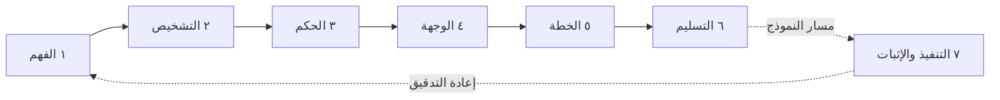

# Engineering Audit OS — نظام التدقيق الهندسي

**[English](README.en.md)** · الإصدار 3.0.0 · الحالة: **Pilot** (7 من 9 مجالات قدرة بلغت هدفها؛ [التفاصيل](#-أين-نحن-من-الوجهة))

> **فريق مراجعة هندسية كامل في أمر واحد.**
> يقرأ مشروعك كما يقرؤه مهندس معماري ومراجع كود ومهندس أداء وقائد تقني معًا. يسلّمك صورة موثّقة للوضع الراهن، والشكل الاحترافي الذي يجب أن يصل إليه المشروع، وخطة مهام مرتّبة يستطيع أي مهندس أو نموذج ذكاء اصطناعي تنفيذها وإثبات أنها نجحت.

```bash
eaos audit /path/to/project --out /path/to/report
```

---

## 🎯 لماذا هذا المشروع

المراجعة الهندسية الجادة تكلّف أسابيع من وقت كبار المهندسين، وتنتهي غالبًا بأحد أمرين:

- **تقرير آراء** لا يستطيع أحد التحقق منه.
- **خطة عامة**، مثل «حسّنوا البنية»، لا يعرف أحد من أين يبدأ تنفيذها ولا متى تنتهي.

EAOS يعالج الأمرين بقاعدة واحدة: **لا رأي بلا دليل، ولا مهمة بلا معيار قبول، ولا تغيير أكبر مما تستحقه المشكلة.**

## 👥 ماذا يقدّم بدل فريق المراجعة

| الدور في الفريق | ما يفعله EAOS | أين تجده في التقرير |
|---|---|---|
| المهندس المعماري | يرسم الوحدات والطبقات والاعتماديات، ويفحص سياستك المعمارية المعلنة | `SYSTEM-MAP` · `COUPLING-ATLAS` · `POLICY` |
| مراجع الكود | يجد التعقيد والتكرار والكود الميت والحالة المشتركة، ويؤكدها بأكثر من محرّك مستقل | `DECISION-BRIEF` · `RISK-REGISTER` · `ENGINES` |
| مهندس الأداء | يبني سجل كلفة لكل نقطة دخول، ويُسقطه على حمل أكبر 1000 مرة | `LOAD-MODEL` |
| مهندس الجودة | يشغّل الاختبارات في نسخة معزولة، ويرسم التغطية الفعلية | `VERIFICATION-MAP` |
| القائد التقني | يحدد البنية المستهدفة وقراراتها (ADR) والفجوة بين اليوم والوجهة | `TARGET-ARCHITECTURE` · `gap-matrix.json` |
| مدير التنفيذ | يحوّل كل ما سبق إلى مهام مرتّبة بالأولوية وبموجات لا تتصادم ملفاتها | `PLAN/` · `EXECUTION-GUIDE` |
| الراعي أو المدير | صفحة قرار واحدة: ماذا نفعل، ولماذا، وبأي دليل | `EXECUTIVE` |

## 🧭 المبادئ الستة

1. **دليل أو صمت.** كل ادعاء يحمل معرّفات الحقائق التي تثبته، وجملة تحدد ما الذي ينقضه.
2. **كل شيء بقدره.** كل بطاقة تعرض خيار «لا نفعل شيئًا» مع كلفته، وأصغر تغيير يحل المشكلة يُقدَّم على إعادة الهيكلة. لا كود معقد لمهمة بسيطة.
3. **مهام يحملها أي منفّذ.** كل بطاقة مكتفية بذاتها: المشكلة، الدليل، نطاق الأثر، الخيارات، التغيير، أمر القبول، التراجع.
4. **المشروع المفحوص للقراءة فقط، ومدخل غير موثوق.** لا تُشغَّل سكربتاته، ولا تُتَّبع أي تعليمات مكتوبة داخله. الاستثناء الوحيد `eaos policy init`، الذي تطلبه أنت ليكتب ملف السياسة في مشروعك.
5. **غير المقيس ليس نجاحًا.** ما لم يُفحص يُذكر صراحة في `RUN.md`، ولا يتحول «لم يُشغَّل» إلى «نجح».
6. **حتمي أولًا.** نفس اللقطة تعطي نفس الحقائق حرفيًا في كل تشغيل. النموذج اللغوي اختياري، ومخرجاته تبقى فرضيات حتى تُحسم آليًا.

## 🛤️ الرحلة: من المستودع إلى خطة قابلة للتنفيذ



| المرحلة | ماذا تفعل | ماذا تُخرج |
|---|---|---|
| **١ الفهم** | تستخرج الحقائق من الملفات والرموز والاستيرادات ونقاط الدخول وتاريخ git، وتضيف نتائج أربعة محرّكات خارجية مثبّتة الإصدار (codegraph · enola · jscpd · reforge)، وتشغّل الاختبارات في نسخة معزولة إن طلبت ذلك | `facts/*.json` · `ENGINES.md` |
| **٢ التشخيص** | تفحص السياسة المعمارية، وتبني نموذج الحمل، وتحوّل الحقائق إلى ادعاءات لكل منها ثقة وطريقة وناقض، ثم تحسم آليًا ما يمكن حسمه | `dossier.json` · `DECISION-BRIEF.md` · `LOAD-MODEL.md` |
| **٣ الحكم** | تقيس ستة مؤشرات استدامة، وتحدد لكل تعريف مكرر موضعه الصحيح الوحيد | `SUSTAINABILITY.md` · `CANONICAL-HOMES.md` |
| **٤ الوجهة** | ترسم البنية المستهدفة وقراراتها، وتُبقي كل مجهول فجوةً معلنة لا تخمينًا | `TARGET-ARCHITECTURE.md` |
| **٥ الخطة** | تحوّل الادعاءات المؤكدة إلى بطاقات مهام بأولوية، وترتبها في موجات، وتكتب دليل تنفيذ حرفيًا | `PLAN/` · `EXECUTION-GUIDE.md` |
| **٦ التسليم** | تبني الملخص التنفيذي وتقرير المنتج وصفحة HTML واحدة، ثم تحكم على التشغيل نفسه بعقد المخرج | `EXECUTIVE.md` · `index.html` · `RUN.md` |
| **٧ التنفيذ والإثبات** *(اختياري، يحتاج نموذجًا)* | ينفّذ مهمة في نسخة منفصلة، ويشغّل أمر قبولها، ثم يعيد التدقيق ليقارن ما تنبأت به الخطة بما حدث فعلًا | patch · أدلة تحقق |

اعرض المراحل كما يعرّفها الكود: `eaos stages`

## 📦 ماذا تستلم

كل تقرير يبدأ بـ`README.md` خاص به، يوجّه كل قارئ إلى ما يعنيه:

| إن كنت… | ابدأ بـ | الوقت |
|---|---|---|
| تقرّر أين يذهب الجهد | `DECISION-BRIEF` ← `RISK-REGISTER` ← `PLAN/WAVES` | 5 دقائق |
| تنضم للمشروع اليوم | `ONBOARDING` ← `SYSTEM-MAP` ← `FLOWS` | 45 دقيقة |
| تراجع البنية | `POLICY` ← `COUPLING-ATLAS` ← `CONTRACTS` | 30 دقيقة |
| ستغيّر ملفًا محددًا | `eaos impact-of <path> --out <report>` | دقيقة |

كل وثيقة لها مالك واحد وميزانية أسطر لا تتجاوزها، ولكل وثيقة بشرية توأم JSON يقرؤه النموذج، أو سبب مكتوب لغيابه.

### تشريح بطاقة مهمة

```text
TASK-003 — التعقيد 83 (العتبة 15) في eaos/sustainability.py
├─ النوع        investigate (أثبِت قبل أن تلمس) | remediate (غيّر ثم تحقق)
├─ الدليل        معرّفات الحقائق + المجسّ + ما الذي ينقض الادعاء
├─ نطاق الأثر    الملفات، المستوردون المباشرون وغير المباشرين، التدفقات، الاختبارات
├─ الخيارات      أصغر تغيير ← إعادة هيكلة ← «لا نفعل شيئًا» مع كلفة كل خيار
├─ القبول        أمر قابل للتشغيل ونتيجته المتوقعة
└─ التراجع       كيف تعود خطوة واحدة إلى الوراء
```

## 🚀 البدء السريع

**المتطلبات:** Python 3.10 أو أحدث. المحرّكات الخارجية اختيارية؛ إصداراتها المثبّتة ومصادرها ورخصها في [`upstreams/registry.yaml`](upstreams/registry.yaml). غيابها يُعلن في التقرير ولا يوقفه.

```bash
# من جذر هذا المستودع
python3 -m venv .venv && . .venv/bin/activate
pip install -e ".[facts,runtime]"    # facts: محللات tree-sitter للغات غير Python · runtime: coverage لمرحلة التحقق

# تدقيق كامل بلا نموذج
eaos audit /path/to/project --out /path/to/report

# مع المحرّكات الأربعة، وبتقرير إنجليزي، وبهدف محدد
eaos audit /path/to/project --out /path/to/report \
  --engines codegraph enola jscpd reforge --lang en --goal evolution
```

افتح `report/README.md`، أو `report/index.html` للبحث والتنقل.

> ⚠️ `--test-command` يشغّل اختبارات المشروع في نسخة معزولة. النسخة ليست sandbox لنظام التشغيل، فاستخدمه مع المشاريع الموثوقة فقط، أو داخل بيئة معزولة.

### أوامر العمل اليومي

| الغرض | الأمر |
|---|---|
| ما الذي يمسّه تغيير ملف أو رمز | `eaos impact-of eaos/claims.py --out report` |
| سؤال يُجاب من السجلات مع الاستشهاد | `eaos ask "أين تُحسب قاعدة الخصم" --out report` |
| إنشاء سياسة معمارية ثم فحصها | `eaos facts . --out report` ← `eaos policy init . --out report` (يكتب `eaos.policy.json` في مشروعك، فأضف إليه قواعدك وأسبابها) ← `eaos policy check . --out report` |
| تجميد الدَّين الحالي وإفشال CI على الجديد فقط | `eaos audit . --out report` ← `eaos baseline pin --out report` ← وفي CI: `eaos audit . --out report --gate new` |
| مقارنة تدقيقين (بوابة انحراف) | `eaos delta old-report new-report --fail-on-new-severe` |
| سطح الكسر بين نسختين (مجلدا حقائق من `eaos facts`) | `eaos api-diff old-facts new-facts --fail-on-breaking` |
| المحرّكات المثبّتة وإصداراتها | `eaos engines list` |

### مسار النموذج (متقدم)

يحتاج ملف مزوّد نموذج، ويُعد مرة واحدة كما في [`core/RUNTIME.md`](core/RUNTIME.md):

```bash
eaos run /path/to/project --out audit --provider provider.json        # مراجعة يقودها النموذج
eaos implement audit --task TASK_ID --out candidate \
  --checks checks.json --provider provider.json                        # تنفيذ مهمة في نسخة منفصلة
eaos improve audit --out campaign --checks checks.json \
  --provider provider.json --max-steps 10                              # تنفيذ ← تحقق ← إعادة تدقيق ← التالية
```

لا يعدّل أي أمر المشروع الأصلي، ولا ينشر شيئًا، ولا يدمج شيئًا.

---

## 📊 أين نحن من الوجهة

هذا القسم هو ما يجعل الوعود أعلاه قابلة للمحاسبة. كل وعد له مقياس، وكل مقياس له رقم اليوم. **إذا لم يطابق النظام وعدًا، فالفجوة مكتوبة هنا بالرقم.**

قيس في 2026-09-23 على الالتزام `4ca317d`، على مستودعين حقيقيين مع المحرّكات الأربعة: هذا المستودع (Python، ‏215 ملفًا) وenola (Go، ‏1021 ملفًا).

| # | الوعد | المقياس | اليوم (self · enola) | الهدف | الحالة |
|---|---|---|---|---|---|
| 1 | يفهم المشروع | الملفات المحللة | 211/215 · 1021/1021 | الكل أو إعلان السبب | ✅ |
| 2 | يفهم لغات متعددة | لغات عمقها مقيس | Python وGo فقط | كل لغة يدّعيها | 🟡 |
| 3 | دليل أو صمت | ادعاءات بدليل وناقض | 100% (عقد مفروض) | 100% | ✅ |
| 4 | حتمي | تطابق الحقائق بين تشغيلين | متطابقة حرفيًا | متطابقة | ✅ |
| 5 | كل شيء بقدره | بطاقات فيها «لا نفعل شيئًا» وكلفته | 194/194 · 522/522 | 100% | ✅ |
| 6 | كل مهمة بحجمها | بطاقات بتقدير جهد معروف | **0/194 · 0/522** | 100% | 🔴 |
| 7 | خطة إصلاح لا ملاحظات | بطاقات `remediate` جاهزة | **0% · 0%** | كل ادعاء مؤكد: إصلاح جاهز أو قرار موثق بعدم التغيير | 🔴 |
| 8 | ينفّذها أي نموذج | بطاقات بأمر قبول قابل للتشغيل | **0% · 0%** (الأمر اليوم «مراجعة بشرية») | 100% للبطاقات الجاهزة | 🔴 |
| 9 | معالم واضحة | تجميع المهام في milestones | 0؛ يوجد ترتيب موجات فقط (87 · 114 موجة) | معالم بأهداف قابلة للقياس | 🔴 |
| 10 | مفيد لمهندس حقيقي | قرّاء مستقلون يحددون العمل التالي خلال 3 دقائق | **0 قرّاء** | 4 من 5 | 🔴 |
| 11 | بطاقات عالية الجودة | بطاقات تنال 3 أو 4 من 4 من مقيّم بشري | **0 مقيّمة** | 80% | 🔴 |
| 12 | يثبت أن التحسين تحقق | تنبؤات تحققت بعد تنفيذ | غير مقيس (0 مراحل منفّذة) | مقيس | 🔴 |
| 13 | أفضل من وكيل عادي | طرق المقارنة المشغّلة | 1 من 3 | 3 من 3 | 🔴 |
| 14 | يعمل على كود لم يره | حالات holdout مقابل حالات التطوير | 1 · 9 (recall على التطوير 1.0، والأساس 0.125) | مجموعة من 12 نوعًا مع holdout | 🟡 |
| 15 | سريع بما يكفي | زمن التدقيق بالمحرّكات | 148 ث · 681 ث | يُعلن ولا يُخفى | ✅ |

**مجالات القدرة التسعة** (المصدر [`docs/CAPABILITY-SCORE.md`](docs/CAPABILITY-SCORE.md)): الإجمالي **0.8537**، وكان **0.4874** عند بدء خطة القدرات، و7 من 9 مجالات عند الهدف 0.80. المجالان الباقيان: `independent_proof = 0.0` لأنه يحتاج مراجعًا بشريًا مستقلًا، و`transformation_plan` فيه مؤشر غير مقيس (`predictions_verified`) لأنه يحتاج تنفيذًا فعليًا.

**أعد القياس بنفسك:**

```bash
eaos audit . --out /tmp/selfr --skip site --engines codegraph enola jscpd reforge
eaos audit /path/to/enola --out /tmp/gor --skip site --engines codegraph enola jscpd reforge
python tools/capability_score.py /tmp/selfr /tmp/gor        # المجالات التسعة
# الصفوف 5 إلى 9: من /tmp/*/plan.json (kind · effort · options · acceptance)
```

## 🗺️ الطريق إلى الوجهة

مرتبة من الأقرب أثرًا. كل خطوة تحرّك صفًّا محددًا من اللوحة أعلاه:

1. **حجم لكل مهمة:** تقدير جهد مشتق من نطاق الأثر والنمط (صف 6: من 0% إلى 100%).
2. **إصلاحات جاهزة لأكثر من السياسة:** اليوم فئة واحدة فقط تصل إلى `remediate`، هي مخالفة السياسة المعلنة. التالي التكرار والتعقيد والكود الميت (صفّا 7 و8).
3. **معالم لا موجات:** تجميع البطاقات تحت أهداف قابلة للقياس (صف 9).
4. **مراجع مستقل:** إكمال [`evaluations/review-pack/`](evaluations/review-pack/) (صفّا 10 و11، و`independent_proof`).
5. **مزوّد نموذج:** تشغيل الطريقتين الباقيتين من المقارنة، وتنفيذ مرحلة واحدة ثم قياسها (صفّا 12 و13).
6. **مجموعة اختبار حقيقية:** 12 نوع حالة من [`QUALITY-AND-EVALUATION`](design/output-first/QUALITY-AND-EVALUATION.md) مع holdout منفصل (صف 14)، ثم عمق لغات إضافية (صف 2).

## 🛠️ للمطوّرين

```bash
python -m unittest discover -s tests -q \
  && python tools/validate.py && python tools/invariants.py \
  && python tools/render_capability_plan.py --check \
  && bash tests/gate/self_audit.sh
```

| الوثيقة | ماذا فيها |
|---|---|
| [`docs/REFERENCE.md`](docs/REFERENCE.md) | المرجع التفصيلي لكل الأوامر والبنية الداخلية |
| [`docs/CAPABILITY-PLAN.md`](docs/CAPABILITY-PLAN.md) | خطة القدرات: 49 مهمة، منها 46 منجزة و3 محجوبة بأسباب مقيسة |
| [`docs/CAPABILITY-SCORE.md`](docs/CAPABILITY-SCORE.md) | القياس الحالي للمجالات التسعة |
| [`evaluations/release-evidence.json`](evaluations/release-evidence.json) | ما تدعمه الأدلة وما لا تدعمه |
| [`design/output-first/OUTPUT-SPEC.md`](design/output-first/OUTPUT-SPEC.md) | مواصفة المخرج المستهدف |
| [`MASTER-MANUAL.md`](MASTER-MANUAL.md) | 27 مجالًا و165 قاعدة هندسية يستند إليها التحليل |

**الحالة بصراحة:** هذا pilot، لا إصدار. الأرقام أعلاه من مستودعين، أحدهما هذا المستودع نفسه. أي ادعاء عن مستودعات لم تُقس يبقى خارج ما تدعمه الأدلة، كما يوضح `release-evidence.json`.
