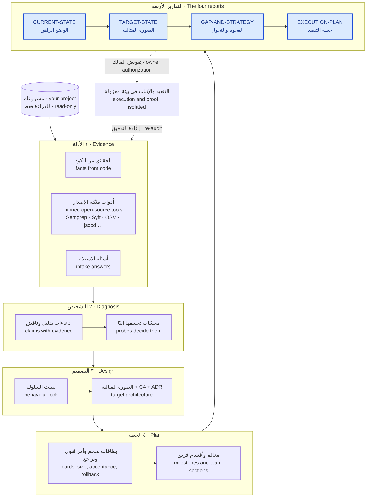
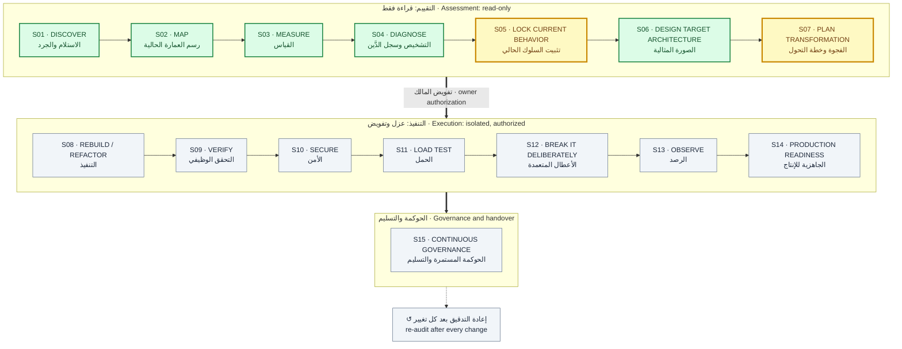
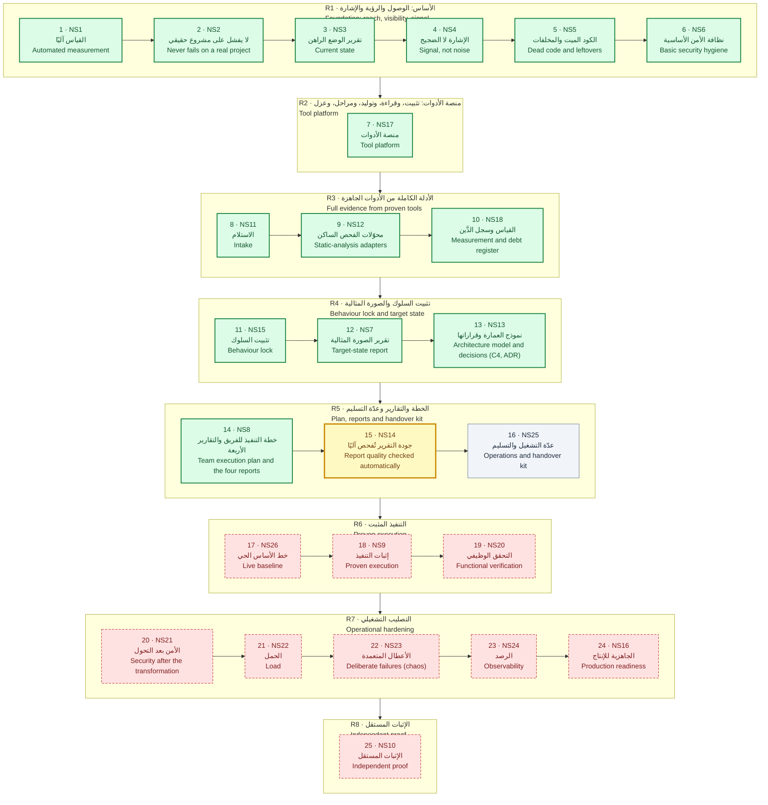

# Engineering Audit OS — نظام التدقيق الهندسي

**[English](README.en.md)** · الإصدار 3.0.0 · الحالة: **Pilot** · التقدم: [أين نحن من الوجهة](#-أين-نحن-من-الوجهة)

> **فريق مراجعة هندسية كامل في أمر واحد.**
> يقرأ مشروعك كما يقرؤه مهندس معماري ومراجع كود ومهندس أداء وقائد تقني معًا. يسلّمك صورة موثّقة للوضع الراهن، والشكل الاحترافي الذي يجب أن يصل إليه المشروع، وخطة مهام مرتّبة يستطيع أي مهندس أو نموذج ذكاء اصطناعي تنفيذها وإثبات أنها نجحت.

```bash
eaos audit /path/to/project --out /path/to/report
```

---

## 🎯 لماذا هذا المشروع

المراجعة الهندسية الجادة تكلّف أسابيع من وقت كبار المهندسين، وتنتهي غالبًا بأحد أمرين:

- **تقرير آراء** لا يستطيع أحد التحقق منه.
- **خطة عامة**، مثل «حسّنوا البنية»، لا يعرف أحد من أين يبدأ تنفيذها ولا متى تنتهي.

EAOS يعالج الأمرين بقاعدة واحدة: **لا رأي بلا دليل، ولا مهمة بلا معيار قبول، ولا تغيير أكبر مما تستحقه المشكلة.**

## 🏢 الفكرة: ما تفعله شركة برمجية، في أمر واحد

بنيتَ برنامجًا بالـvibe coding. البرنامج يعمل، لكنك لا تعرف كيف بُني، ولا مداخله ومخارجه، ولا حدوده، ولا تعقيده ولا تكراره. لو ذهبت إلى شركة برمجية لإعادة إنتاجه كمنتج احترافي، ستسلّمك أربعة أشياء بالترتيب. هذا ما يجب أن يسلّمه EAOS:

| # | التقرير | ماذا فيه |
|---|---|---|
| 1 | **الوضع الراهن** | ماذا يفعل البرنامج، ومداخله ومخارجه وحدوده، وبنيته، وتعقيده وتكراره، وكوده الميت ومخلفاته، ومخاطره |
| 2 | **الصورة المثالية** | البرنامج نفسه بوظائفه نفسها، ببنية وبنية تحتية تصلح منتجًا. لكل جزء قرار: يُعاد استخدامه، أو هيكلته، أو بناؤه، أو يُحذف |
| 3 | **الفجوة والتحول** | المسافة المقيسة بين الاثنين، والاستراتيجية التي تقطعها |
| 4 | **خطة التنفيذ** | مهام صغيرة مقسمة على أقسام فريق، لكل منها حجم وأمر قبول وطريقة تراجع، ينفّذها أي مبرمج أو أي نموذج |

هذا هو المقياس الوحيد لنجاح المشروع. سير العمل الكامل بمراحله الخمس عشرة وأدواته وبواباته في [`docs/MASTER-BLUEPRINT.md`](docs/MASTER-BLUEPRINT.md)، والقياس بمؤشراته وخطته في [`docs/NORTH-STAR.md`](docs/NORTH-STAR.md).

## 👥 ماذا يقدّم بدل فريق المراجعة

| الدور في الفريق | ما يفعله EAOS | أين تجده في التقرير |
|---|---|---|
| المهندس المعماري | يرسم الوحدات والطبقات والاعتماديات والتدفقات، ويفحص سياستك المعمارية المعلنة، ويرسم نموذج C4 الحالي | `CURRENT-STATE` · `SYSTEM-MAP` · `COUPLING-ATLAS` · `POLICY` |
| مراجع الكود | يجد التعقيد والتكرار والكود الميت والحالة المشتركة، ويؤكدها بأكثر من أداة مستقلة، ويجمعها في سجل دَين واحد | `DECISION-BRIEF` · `RISK-REGISTER` · `debt-register.json` |
| مهندس الأداء | يبني سجل كلفة لكل نقطة دخول، ويُسقطه على حمل أكبر 1000 مرة | `LOAD-MODEL` |
| مهندس الجودة | يثبّت سلوك كل ميزة قبل أي تغيير، ويشغّل الاختبارات في نسخة معزولة عند الطلب، ويرسم التغطية الفعلية | `behavior-lock/` · `VERIFICATION-MAP` |
| القائد التقني | يحدد البنية المستهدفة وقراراتها (C4 وADR)، وقرارًا لكل مكوّن، والفجوة بين اليوم والوجهة | `TARGET-STATE` · `GAP-AND-STRATEGY` · `adr/` |
| مدير التنفيذ | يحوّل كل ما سبق إلى بطاقات بحجم (S/M/L) وقسم فريق وأمر قبول، مرتبة في معالم | `EXECUTION-PLAN` · `ROADMAP` · `PLAN/` |
| الراعي أو المدير | صفحة قرار واحدة: ماذا نفعل، ولماذا، وبأي دليل | `EXECUTIVE` |

## 🧭 المبادئ الستة

1. **دليل أو صمت.** كل ادعاء يحمل معرّفات الحقائق التي تثبته، وجملة تحدد ما الذي ينقضه.
2. **كل شيء بقدره.** كل بطاقة تعرض خيار «لا نفعل شيئًا» مع كلفته، وأصغر تغيير يحل المشكلة يُقدَّم على إعادة الهيكلة. لا كود معقد لمهمة بسيطة.
3. **مهام يحملها أي منفّذ.** كل بطاقة مكتفية بذاتها: المشكلة، الدليل، نطاق الأثر، الخيارات، التغيير، أمر القبول، التراجع.
4. **المشروع المفحوص للقراءة فقط، ومدخل غير موثوق.** لا تُشغَّل سكربتاته، ولا تُتَّبع أي تعليمات مكتوبة داخله. الاستثناء الوحيد `eaos policy init`، الذي تطلبه أنت ليكتب ملف السياسة في مشروعك.
5. **غير المقيس ليس نجاحًا.** ما لم يُفحص يُذكر صراحة في `RUN.md`، ولا يتحول «لم يُشغَّل» إلى «نجح».
6. **حتمي أولًا.** نفس اللقطة تعطي نفس الحقائق حرفيًا في كل تشغيل. النموذج اللغوي اختياري، ومخرجاته تبقى فرضيات حتى تُحسم آليًا.

## 🛤️ كيف يعمل: من المستودع إلى التقارير الأربعة


```mermaid
flowchart TB
    P[("مشروعك · your project<br/>للقراءة فقط · read-only")]
    subgraph E1["١ الأدلة · Evidence"]
        direction LR
        F["الحقائق من الكود<br/>facts from code"]
        T["أدوات مثبّتة الإصدار<br/>pinned open-source tools<br/>Semgrep · Syft · OSV · jscpd …"]
        I["أسئلة الاستلام<br/>intake answers"]
    end
    subgraph E2["٢ التشخيص · Diagnosis"]
        direction LR
        C["ادعاءات بدليل وناقض<br/>claims with evidence"]
        PR["مجسّات تحسمها آليًا<br/>probes decide them"]
        C --> PR
    end
    subgraph E3["٣ التصميم · Design"]
        direction LR
        L["تثبيت السلوك<br/>behaviour lock"]
        TA["الصورة المثالية + C4 + ADR<br/>target architecture"]
        L --> TA
    end
    subgraph E4["٤ الخطة · Plan"]
        direction LR
        PL["بطاقات بحجم وأمر قبول وتراجع<br/>cards: size, acceptance, rollback"]
        RM["معالم وأقسام فريق<br/>milestones and team sections"]
        PL --> RM
    end
    subgraph OUT["التقارير الأربعة · The four reports"]
        direction LR
        R1["CURRENT-STATE<br/>الوضع الراهن"] --> R2["TARGET-STATE<br/>الصورة المثالية"] --> R3["GAP-AND-STRATEGY<br/>الفجوة والتحول"] --> R4["EXECUTION-PLAN<br/>خطة التنفيذ"]
    end
    P --> E1 --> E2 --> E3 --> E4 --> OUT
    OUT -. "تفويض المالك · owner authorization" .-> X["التنفيذ والإثبات في بيئة معزولة<br/>execution and proof, isolated"]
    X -. "إعادة التدقيق · re-audit" .-> E1
    classDef out fill:#dbeafe,stroke:#1d4ed8,color:#1e3a8a,stroke-width:2px
    class R1,R2,R3,R4 out
```

| الخطوة | ماذا تفعل | ماذا تُخرج |
|---|---|---|
| **١ الأدلة** | تستخرج الحقائق من الملفات والرموز والاستيرادات ونقاط الدخول وتاريخ git، وتشغّل أدوات خارجية مثبّتة الإصدار ومتحقَّقًا من بصمتها (`upstreams/toolchain.json`)، وتقرأ إجابات المالك عن أسئلة الاستلام | `facts/*.json` · `sbom.cdx.json` · `intake.json` |
| **٢ التشخيص** | تحوّل الحقائق إلى ادعاءات لكل منها ثقة ودليل وجملة تنقضه، وتحسم ما يمكن حسمه بمجسّات آلية، وتجمع الأدلة في سجل دَين واحد | `dossier.json` · `debt-register.json` · `measurements.json` |
| **٣ التصميم** | تثبّت سلوك كل ميزة قبل أي تغيير، ثم تختار المعمارية المستهدفة من سبع معماريات مرجعية بحسب ملفات المشروع نفسه، وتقرر لكل مكوّن: يُستخدم، أو يُعاد هيكلته، أو يُعاد بناؤه، أو يُحذف | `behavior-lock/` · `target-architecture.json` · `architecture/*/workspace.dsl` · `adr/` |
| **٤ الخطة** | تحوّل كل ادعاء إلى بطاقة: إصلاح جاهز بأمر قبول يعيد فحص المشكلة نفسها، أو تحقيق ينتظر قرارًا مسجلًا. ثم ترتّب البطاقات في معالم وأقسام فريق | `plan.json` · `ROADMAP.md` · `PLAN/` |
| **التقارير الأربعة** | ما تسلّمه شركة برمجية: الوضع الراهن، والصورة المثالية، والفجوة والاستراتيجية، وخطة التنفيذ | `CURRENT-STATE.md` · `TARGET-STATE.md` · `GAP-AND-STRATEGY.md` · `EXECUTION-PLAN.md` |

اعرض المراحل كما يعرّفها الكود: `eaos stages` · وحالة بوابة كل مرحلة: `eaos engage status`

---

## 📦 ماذا تستلم

كل تقرير يبدأ بـ`README.md` خاص به، يوجّه كل قارئ إلى ما يعنيه:

| إن كنت… | ابدأ بـ | الوقت |
|---|---|---|
| تريد الصورة كاملة | `CURRENT-STATE` ← `TARGET-STATE` ← `GAP-AND-STRATEGY` ← `EXECUTION-PLAN` | 20 دقيقة |
| تقرّر أين يذهب الجهد | `DECISION-BRIEF` ← `RISK-REGISTER` ← `PLAN/WAVES` | 5 دقائق |
| تنضم للمشروع اليوم | `ONBOARDING` ← `SYSTEM-MAP` ← `FLOWS` | 45 دقيقة |
| تراجع البنية | `POLICY` ← `COUPLING-ATLAS` ← `CONTRACTS` | 30 دقيقة |
| ستغيّر ملفًا محددًا | `eaos impact-of <path> --out <report>` | دقيقة |

كل وثيقة لها مالك واحد وميزانية أسطر لا تتجاوزها، ولكل وثيقة بشرية توأم JSON يقرؤه النموذج، أو سبب مكتوب لغيابه.

### تشريح بطاقة مهمة

```text
TASK-003 — التعقيد 83 (العتبة 15) في eaos/sustainability.py
├─ النوع        investigate (قرار مسجل قبل أي تغيير) | remediate (غيّر ثم تحقق)
├─ الحجم والقسم S/M/L من عدد الملفات والمعتمدين · أمن، بنية تحتية، بيانات، خلفية، واجهة، جودة
├─ الدليل        معرّفات الحقائق + المجسّ + ما الذي ينقض الادعاء
├─ نطاق الأثر    الملفات، المستوردون المباشرون وغير المباشرين، التدفقات، الاختبارات
├─ الخيارات      أصغر تغيير ← إعادة هيكلة ← «لا نفعل شيئًا» مع كلفة كل خيار
├─ القبول        أمر قابل للتشغيل: `eaos recheck` يعيد فحص المشكلة نفسها، أو `eaos decided` للتحقيق
└─ التراجع       كيف تعود خطوة واحدة إلى الوراء
```

## 🚀 البدء السريع

**المتطلبات:** Python 3.10 أو أحدث. الأدوات الخارجية (Semgrep وSyft وOSV-Scanner وjscpd وdependency-cruiser وStructurizr وغيرها) تُثبَّت بأمر واحد بإصدارها المثبّت وبصمتها المتحقَّقة، ومصادرها ورخصها في [`upstreams/toolchain.json`](upstreams/toolchain.json) و[`docs/TOOLCHAIN.md`](docs/TOOLCHAIN.md). غياب أداة يُعلن في التقرير ولا يوقفه.

```bash
# من جذر هذا المستودع
python3 -m venv .venv && . .venv/bin/activate
pip install -e ".[facts,runtime]"    # facts: محللات tree-sitter للغات غير Python · runtime: coverage لمرحلة التحقق
eaos tools install --stage assessment  # أدوات مرحلة التقييم؛ eaos tools doctor يعرض ما ثُبّت وإصداره

# تدقيق كامل بلا نموذج
eaos audit /path/to/project --out /path/to/report

# مع المحرّكات الأربعة، وبتقرير إنجليزي، وبهدف محدد
eaos audit /path/to/project --out /path/to/report \
  --engines codegraph enola jscpd reforge --lang en --goal evolution
```

افتح `report/README.md`، وابدأ بالتقارير الأربعة (`CURRENT-STATE.md` ← `TARGET-STATE.md` ← `GAP-AND-STRATEGY.md` ← `EXECUTION-PLAN.md`)، أو `report/index.html` للبحث والتنقل.

> ⚠️ `--test-command` يشغّل اختبارات المشروع في نسخة معزولة. النسخة ليست sandbox لنظام التشغيل، فاستخدمه مع المشاريع الموثوقة فقط، أو داخل بيئة معزولة.

### أوامر العمل اليومي

| الغرض | الأمر |
|---|---|
| ما الذي يمسّه تغيير ملف أو رمز | `eaos impact-of eaos/claims.py --out report` |
| سؤال يُجاب من السجلات مع الاستشهاد | `eaos ask "أين تُحسب قاعدة الخصم" --out report` |
| إنشاء سياسة معمارية ثم فحصها | `eaos facts . --out report` ← `eaos policy init . --out report` (يكتب `eaos.policy.json` في مشروعك، فأضف إليه قواعدك وأسبابها) ← `eaos policy check . --out report` |
| تجميد الدَّين الحالي وإفشال CI على الجديد فقط | `eaos audit . --out report` ← `eaos baseline pin --out report` ← وفي CI: `eaos audit . --out report --gate new` |
| مقارنة تدقيقين (بوابة انحراف) | `eaos delta old-report new-report --fail-on-new-severe` |
| سطح الكسر بين نسختين (مجلدا حقائق من `eaos facts`) | `eaos api-diff old-facts new-facts --fail-on-breaking` |
| المحرّكات المثبّتة وإصداراتها | `eaos engines list` · `eaos tools doctor` |
| ملفات جاهزة بصيغ الأدوات (CI، pre-commit، Renovate، k6…) تحكم عليها أدواتها | `eaos emit report --validate` |
| هل تمر بوابة كل مرحلة، ولماذا لا | `eaos engage status report` |

### مسار النموذج (متقدم)

يحتاج ملف مزوّد نموذج، ويُعد مرة واحدة كما في [`core/RUNTIME.md`](core/RUNTIME.md):

```bash
eaos run /path/to/project --out audit --provider provider.json        # مراجعة يقودها النموذج
eaos implement audit --task TASK_ID --out candidate \
  --checks checks.json --provider provider.json                        # تنفيذ مهمة في نسخة منفصلة
eaos improve audit --out campaign --checks checks.json \
  --provider provider.json --max-steps 10                              # تنفيذ ← تحقق ← إعادة تدقيق ← التالية
```

لا يعدّل أي أمر المشروع الأصلي، ولا ينشر شيئًا، ولا يدمج شيئًا.

---

## 📊 أين نحن من الوجهة

هذا القسم مولَّد آليًا من [`docs/north-star.json`](docs/north-star.json)، ويفشل فحص `python tools/north_star.py --check` إن تأخر عن السجل. التفصيل الكامل لكل قدرة ومؤشر ومهمة في [`docs/NORTH-STAR.md`](docs/NORTH-STAR.md).

<!-- north-star:start -->
<!-- مولَّد من docs/north-star.json بالأمر python tools/north_star.py؛ لا تحرّره يدويًا -->

### التقدم الفعلي: **14 من 25 معلمًا (56.0%)**

`██████████████░░░░░░░░░░░` 56.0%

| المعلم الحالي | جودة المخرج المقيسة (ليست نسبة إنجاز) | آخر قياس |
|---|---|---|
| 15 · NS14 — جودة التقرير تُفحص آليًا | 87.6% | 2026-09-26 · `f48d997+` |

> **رقم التقدم هو عدد المعالم المكتملة.** المعلم لا يُحسب إلا حين تمر أوامر قبول كل مهامه، والمنتج مكتمل عند 25 من 25. أما «جودة المخرج» فتقيس جودة ما يسلّمه الجزء المبني حتى الآن على 3 مشاريع حقيقية (54 مؤشرًا على 10 قدرات)، وترتفع أسرع لأن أول المعالم بنت القدرات الأثقل وزنًا. التفصيل الكامل، معلمًا معلمًا ومهمة مهمة، في [docs/NORTH-STAR.md](docs/NORTH-STAR.md).

(`+`: على تغييرات فوق هذا الالتزام تُحفظ في الالتزام التالي)

**تحتاج مدخلًا من المالك قبل أن تكتمل:** 17 NS26, 18 NS9, 19 NS20, 20 NS21, 21 NS22, 22 NS23, 23 NS24, 24 NS16, 25 NS10

### خط الإنتاج: المراحل الخمس عشرة

كل مرحلة تمر ببوابتها قبل التي تليها. المراحل S01 إلى S07 تقرأ المشروع فقط وتنتهي بالتقارير الأربعة؛ المراحل S08 إلى S14 تشغّل كود المشروع في بيئة معزولة، ولا تبدأ إلا بتفويض مالكه.


```mermaid
flowchart TB
    subgraph ASSESS["التقييم: قراءة فقط · Assessment: read-only"]
        direction LR
        S01["S01 · DISCOVER<br/>الاستلام والجرد"]:::done
        S02["S02 · MAP<br/>رسم العمارة الحالية"]:::done
        S03["S03 · MEASURE<br/>القياس"]:::done
        S04["S04 · DIAGNOSE<br/>التشخيص وسجل الدَّين"]:::done
        S05["S05 · LOCK CURRENT BEHAVIOR<br/>تثبيت السلوك الحالي"]:::current
        S06["S06 · DESIGN TARGET ARCHITECTURE<br/>الصورة المثالية"]:::done
        S07["S07 · PLAN TRANSFORMATION<br/>الفجوة وخطة التحول"]:::current
        S01 --> S02 --> S03 --> S04 --> S05 --> S06 --> S07
    end
    subgraph EXECUTE["التنفيذ: عزل وتفويض · Execution: isolated, authorized"]
        direction LR
        S08["S08 · REBUILD / REFACTOR<br/>التنفيذ"]:::next
        S09["S09 · VERIFY<br/>التحقق الوظيفي"]:::next
        S10["S10 · SECURE<br/>الأمن"]:::next
        S11["S11 · LOAD TEST<br/>الحمل"]:::next
        S12["S12 · BREAK IT DELIBERATELY<br/>الأعطال المتعمدة"]:::next
        S13["S13 · OBSERVE<br/>الرصد"]:::next
        S14["S14 · PRODUCTION READINESS<br/>الجاهزية للإنتاج"]:::next
        S08 --> S09 --> S10 --> S11 --> S12 --> S13 --> S14
    end
    subgraph GOVERN["الحوكمة والتسليم · Governance and handover"]
        direction LR
        S15["S15 · CONTINUOUS GOVERNANCE<br/>الحوكمة المستمرة والتسليم"]:::next
    end
    ASSESS ==>|تفويض المالك · owner authorization| EXECUTE
    EXECUTE ==> GOVERN
    LOOP["↺ إعادة التدقيق بعد كل تغيير<br/>re-audit after every change"]:::next
    GOVERN -.-> LOOP
    classDef done fill:#dcfce7,stroke:#15803d,color:#14532d,stroke-width:2px
    classDef current fill:#fef9c3,stroke:#ca8a04,color:#713f12,stroke-width:3px
    classDef next fill:#f1f5f9,stroke:#64748b,color:#1e293b
    classDef owner fill:#fee2e2,stroke:#b91c1c,color:#7f1d1d,stroke-dasharray:5 3
```

### خارطة الطريق: المعالم الخمسة والعشرون بترتيب التنفيذ


```mermaid
flowchart TB
    subgraph R1["R1 · الأساس: الوصول والرؤية والإشارة<br/>Foundation: reach, visibility, signal"]
        direction LR
        NS1["1 · NS1<br/>القياس آليًا<br/>Automated measurement"]:::done
        NS2["2 · NS2<br/>لا يفشل على مشروع حقيقي<br/>Never fails on a real project"]:::done
        NS3["3 · NS3<br/>تقرير الوضع الراهن<br/>Current state"]:::done
        NS4["4 · NS4<br/>الإشارة لا الضجيج<br/>Signal, not noise"]:::done
        NS5["5 · NS5<br/>الكود الميت والمخلفات<br/>Dead code and leftovers"]:::done
        NS6["6 · NS6<br/>نظافة الأمن الأساسية<br/>Basic security hygiene"]:::done
        NS1 --> NS2 --> NS3 --> NS4 --> NS5 --> NS6
    end
    subgraph R2["R2 · منصة الأدوات: تثبيت، وقراءة، وتوليد، ومراحل، وعزل<br/>Tool platform"]
        direction LR
        NS17["7 · NS17<br/>منصة الأدوات<br/>Tool platform"]:::done
    end
    R1 --> R2
    subgraph R3["R3 · الأدلة الكاملة من الأدوات الجاهزة<br/>Full evidence from proven tools"]
        direction LR
        NS11["8 · NS11<br/>الاستلام<br/>Intake"]:::done
        NS12["9 · NS12<br/>محوّلات الفحص الساكن<br/>Static-analysis adapters"]:::done
        NS18["10 · NS18<br/>القياس وسجل الدَّين<br/>Measurement and debt register"]:::done
        NS11 --> NS12 --> NS18
    end
    R2 --> R3
    subgraph R4["R4 · تثبيت السلوك والصورة المثالية<br/>Behaviour lock and target state"]
        direction LR
        NS15["11 · NS15<br/>تثبيت السلوك<br/>Behaviour lock"]:::done
        NS7["12 · NS7<br/>تقرير الصورة المثالية<br/>Target-state report"]:::done
        NS13["13 · NS13<br/>نموذج العمارة وقراراتها<br/>Architecture model and decisions (C4, ADR)"]:::done
        NS15 --> NS7 --> NS13
    end
    R3 --> R4
    subgraph R5["R5 · الخطة والتقارير وعدّة التسليم<br/>Plan, reports and handover kit"]
        direction LR
        NS8["14 · NS8<br/>خطة التنفيذ للفريق والتقارير الأربعة<br/>Team execution plan and the four reports"]:::done
        NS14["15 · NS14<br/>جودة التقرير تُفحص آليًا<br/>Report quality checked automatically"]:::current
        NS25["16 · NS25<br/>عدّة التشغيل والتسليم<br/>Operations and handover kit"]:::next
        NS8 --> NS14 --> NS25
    end
    R4 --> R5
    subgraph R6["R6 · التنفيذ المثبت<br/>Proven execution"]
        direction LR
        NS26["17 · NS26<br/>خط الأساس الحي<br/>Live baseline"]:::owner
        NS9["18 · NS9<br/>إثبات التنفيذ<br/>Proven execution"]:::owner
        NS20["19 · NS20<br/>التحقق الوظيفي<br/>Functional verification"]:::owner
        NS26 --> NS9 --> NS20
    end
    R5 --> R6
    subgraph R7["R7 · التصليب التشغيلي<br/>Operational hardening"]
        direction LR
        NS21["20 · NS21<br/>الأمن بعد التحول<br/>Security after the transformation"]:::owner
        NS22["21 · NS22<br/>الحمل<br/>Load"]:::owner
        NS23["22 · NS23<br/>الأعطال المتعمدة<br/>Deliberate failures (chaos)"]:::owner
        NS24["23 · NS24<br/>الرصد<br/>Observability"]:::owner
        NS16["24 · NS16<br/>الجاهزية للإنتاج<br/>Production readiness"]:::owner
        NS21 --> NS22 --> NS23 --> NS24 --> NS16
    end
    R6 --> R7
    subgraph R8["R8 · الإثبات المستقل<br/>Independent proof"]
        direction LR
        NS10["25 · NS10<br/>الإثبات المستقل<br/>Independent proof"]:::owner
    end
    R7 --> R8
    classDef done fill:#dcfce7,stroke:#15803d,color:#14532d,stroke-width:2px
    classDef current fill:#fef9c3,stroke:#ca8a04,color:#713f12,stroke-width:3px
    classDef next fill:#f1f5f9,stroke:#64748b,color:#1e293b
    classDef owner fill:#fee2e2,stroke:#b91c1c,color:#7f1d1d,stroke-dasharray:5 3
```

✅ مكتمل · 🟡 قيد العمل الآن (المرحلة في خط الإنتاج: مبنية جزئيًا) · ⬜ التالي، ينفّذه نموذج أو مطوّر · 🔴 يحتاج مدخلًا من المالك (بيئة معزولة وتفويض، أو مزوّد نموذج، أو مراجع بشري)

<!-- north-star:end -->

**الحالة بصراحة:** هذا pilot، لا إصدار. الأرقام مقيسة على 3 مشاريع هواة حقيقية مثبّتة بالتزامها، وعلى هذا المستودع نفسه. ما لم يُقس لا يُحسب نجاحًا، والمعالم التي تحتاج تشغيل كود مشروع حقيقي لا تُغلق إلا بتشغيله فعلًا.

## 🛠️ للمطوّرين

```bash
python -m unittest discover -s tests -q \
  && python tools/validate.py && python tools/invariants.py \
  && python tools/render_capability_plan.py --check \
  && python tools/north_star.py --check \
  && bash tests/gate/self_audit.sh
```

| الوثيقة | ماذا فيها |
|---|---|
| [`docs/NORTH-STAR.md`](docs/NORTH-STAR.md) | الوجهة: 10 قدرات و54 مؤشرًا، والمعالم الخمسة والعشرون بمهامها وأوامر قبولها |
| [`docs/MASTER-BLUEPRINT.md`](docs/MASTER-BLUEPRINT.md) | المراحل الخمس عشرة بأدواتها وبواباتها |
| [`docs/TOOLCHAIN.md`](docs/TOOLCHAIN.md) | كل أداة خارجية: إصدارها وبصمتها ورخصتها وفي أي مرحلة تعمل |
| [`docs/REFERENCE.md`](docs/REFERENCE.md) | المرجع التفصيلي لكل الأوامر والبنية الداخلية |
| [`tools/upstream_check.py`](tools/upstream_check.py) | هل ترقية محرّك خارجي آمنة؟ تشغّل عقود المحوّلات المثبّتة أولًا (`--offline`) |
| [`docs/CAPABILITY-PLAN.md`](docs/CAPABILITY-PLAN.md) | خطة القدرات: 49 مهمة، منها 46 منجزة و3 محجوبة بأسباب مقيسة |
| [`docs/CAPABILITY-SCORE.md`](docs/CAPABILITY-SCORE.md) | القياس الحالي للمجالات التسعة |
| [`evaluations/release-evidence.json`](evaluations/release-evidence.json) | ما تدعمه الأدلة وما لا تدعمه |
| [`design/output-first/OUTPUT-SPEC.md`](design/output-first/OUTPUT-SPEC.md) | مواصفة المخرج المستهدف |
| [`MASTER-MANUAL.md`](MASTER-MANUAL.md) | 27 مجالًا و165 قاعدة هندسية يستند إليها التحليل |

ما تدعمه الأدلة وما لا تدعمه مكتوب في `evaluations/release-evidence.json`.
