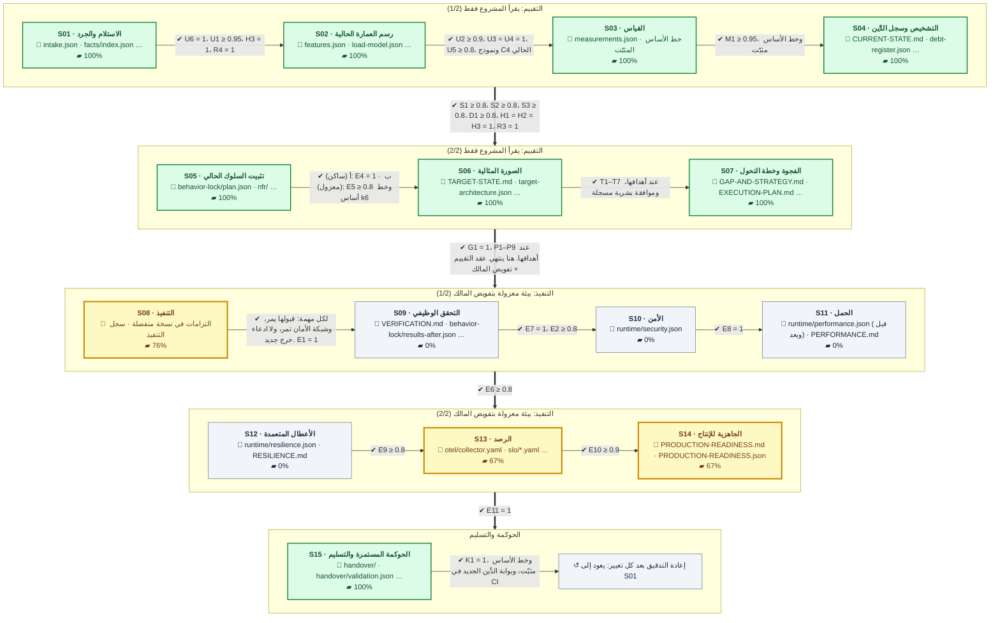
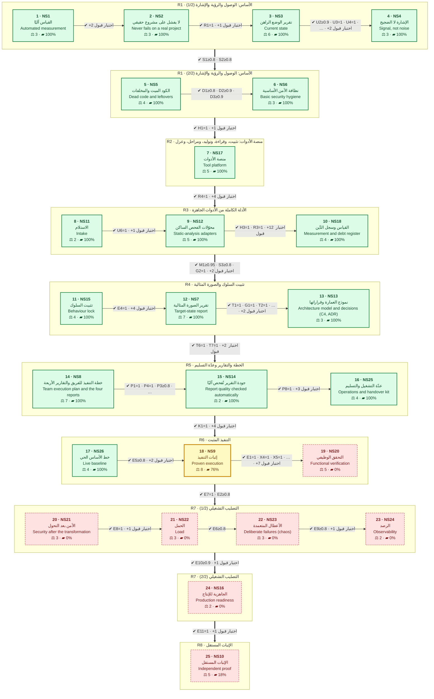

# Engineering Audit OS — نظام التدقيق الهندسي

**[English](README.en.md)** · الإصدار 3.0.0 · الحالة: **Pilot** · التقدم: [أين نحن من الوجهة](#-أين-نحن-من-الوجهة)

> **فريق مراجعة هندسية كامل في أمر واحد.**
> يقرأ مشروعك كما يقرؤه مهندس معماري ومراجع كود ومهندس أداء وقائد تقني معًا. يسلّمك صورة موثّقة للوضع الراهن، والشكل الاحترافي الذي يجب أن يصل إليه المشروع، وخطة مهام مرتّبة يستطيع أي مهندس أو نموذج ذكاء اصطناعي تنفيذها وإثبات أنها نجحت.

```bash
eaos audit /path/to/project --out /path/to/report
```

---

## 🎯 لماذا هذا المشروع

المراجعة الهندسية الجادة تكلّف أسابيع من وقت كبار المهندسين، وتنتهي غالبًا بأحد أمرين:

- **تقرير آراء** لا يستطيع أحد التحقق منه.
- **خطة عامة**، مثل «حسّنوا البنية»، لا يعرف أحد من أين يبدأ تنفيذها ولا متى تنتهي.

EAOS يعالج الأمرين بقاعدة واحدة: **لا رأي بلا دليل، ولا مهمة بلا معيار قبول، ولا تغيير أكبر مما تستحقه المشكلة.**

## 🏢 الفكرة: ما تفعله شركة برمجية، في أمر واحد

بنيتَ برنامجًا بالـvibe coding. البرنامج يعمل، لكنك لا تعرف كيف بُني، ولا مداخله ومخارجه، ولا حدوده، ولا تعقيده ولا تكراره. لو ذهبت إلى شركة برمجية لإعادة إنتاجه كمنتج احترافي، ستسلّمك أربعة أشياء بالترتيب. هذا ما يجب أن يسلّمه EAOS:

| # | التقرير | ماذا فيه |
|---|---|---|
| 1 | **الوضع الراهن** | ماذا يفعل البرنامج، ومداخله ومخارجه وحدوده، وبنيته، وتعقيده وتكراره، وكوده الميت ومخلفاته، ومخاطره |
| 2 | **الصورة المثالية** | البرنامج نفسه بوظائفه نفسها، ببنية وبنية تحتية تصلح منتجًا. لكل جزء قرار: يُعاد استخدامه، أو هيكلته، أو بناؤه، أو يُحذف |
| 3 | **الفجوة والتحول** | المسافة المقيسة بين الاثنين، والاستراتيجية التي تقطعها |
| 4 | **خطة التنفيذ** | مهام صغيرة مقسمة على أقسام فريق، لكل منها حجم وأمر قبول وطريقة تراجع، ينفّذها أي مبرمج أو أي نموذج |

هذا هو المقياس الوحيد لنجاح المشروع. سير العمل الكامل بمراحله الخمس عشرة وأدواته وبواباته في [`docs/MASTER-BLUEPRINT.md`](docs/MASTER-BLUEPRINT.md)، والقياس بمؤشراته وخطته في [`docs/NORTH-STAR.md`](docs/NORTH-STAR.md).

## 🧭 المبادئ الستة

1. **دليل أو صمت.** كل ادعاء يحمل معرّفات الحقائق التي تثبته، وجملة تحدد ما الذي ينقضه.
2. **كل شيء بقدره.** كل بطاقة تعرض خيار «لا نفعل شيئًا» مع كلفته، وأصغر تغيير يحل المشكلة يُقدَّم على إعادة الهيكلة. لا كود معقد لمهمة بسيطة.
3. **مهام يحملها أي منفّذ.** كل بطاقة مكتفية بذاتها: المشكلة، الدليل، نطاق الأثر، الخيارات، التغيير، أمر القبول، التراجع.
4. **المشروع المفحوص للقراءة فقط، ومدخل غير موثوق.** لا تُشغَّل سكربتاته، ولا تُتَّبع أي تعليمات مكتوبة داخله. الاستثناء الوحيد `eaos policy init`، الذي تطلبه أنت ليكتب ملف السياسة في مشروعك.
5. **غير المقيس ليس نجاحًا.** ما لم يُفحص يُذكر صراحة في `RUN.md`، ولا يتحول «لم يُشغَّل» إلى «نجح».
6. **حتمي أولًا.** نفس اللقطة تعطي نفس الحقائق حرفيًا في كل تشغيل. النموذج اللغوي اختياري، ومخرجاته تبقى فرضيات حتى تُحسم آليًا.

## 🛤️ كيف يعمل: المراحل ومخرجاتها وبوابات الانتقال

<!-- north-star:pipeline:start -->
<!-- مولَّد من docs/north-star.json بالأمر python tools/north_star.py؛ لا تحرّره يدويًا -->

كل صندوق مرحلة ومخرجها، وكل سهم بوابة: لا ينتقل العمل إلى المرحلة التالية إلا إذا تحققت معاييرها. المراحل S01 إلى S07 تقرأ المشروع فقط وتنتهي بالتقارير الأربعة؛ S08 إلى S14 تشغّله في بيئة معزولة بتفويض مالكه.


```mermaid
%%{init: {'flowchart': {'wrappingWidth': 260, 'nodeSpacing': 40, 'rankSpacing': 60}}}%%
flowchart TB
    subgraph P1["التقييم: يقرأ المشروع فقط (1/2)"]
        direction LR
        S01["<b>S01 · الاستلام والجرد</b><br/>📄 intake.json · facts/index.json …<br/>▰ 100%"]:::done
        S02["<b>S02 · رسم العمارة الحالية</b><br/>📄 features.json · load-model.json …<br/>▰ 100%"]:::done
        S03["<b>S03 · القياس</b><br/>📄 measurements.json · خط الأساس المثبّت<br/>▰ 100%"]:::done
        S04["<b>S04 · التشخيص وسجل الدَّين</b><br/>📄 CURRENT-STATE.md · debt-register.json …<br/>▰ 100%"]:::done
        S01 -->|"✔ U6 = 1، U1 ≥ 0.95، H3 = 1، R4 = 1"| S02
        S02 -->|"✔ U2 ≥ 0.9، U3 = U4 = 1، U5 ≥ 0.8، ونموذج C4 الحالي"| S03
        S03 -->|"✔ M1 ≥ 0.95، وخط الأساس مثبّت"| S04
    end
    subgraph P2["التقييم: يقرأ المشروع فقط (2/2)"]
        direction LR
        S05["<b>S05 · تثبيت السلوك الحالي</b><br/>📄 behavior-lock/plan.json · nfr/ …<br/>▰ 100%"]:::done
        S06["<b>S06 · الصورة المثالية</b><br/>📄 TARGET-STATE.md · target-architecture.json …<br/>▰ 100%"]:::done
        S07["<b>S07 · الفجوة وخطة التحول</b><br/>📄 GAP-AND-STRATEGY.md · EXECUTION-PLAN.md …<br/>▰ 100%"]:::done
        S05 -->|"✔ أ (ساكن): E4 = 1 · ب (معزول): E5 ≥ 0.8 وخط أساس k6"| S06
        S06 -->|"✔ T1–T7 عند أهدافها، وموافقة بشرية مسجلة"| S07
    end
    subgraph P3["التنفيذ: بيئة معزولة بتفويض المالك (1/2)"]
        direction LR
        S08["<b>S08 · التنفيذ</b><br/>📄 التزامات في نسخة منفصلة · سجل التنفيذ<br/>▰ 76%"]:::current
        S09["<b>S09 · التحقق الوظيفي</b><br/>📄 VERIFICATION.md · behavior-lock/results-after.json …<br/>▰ 0%"]:::next
        S10["<b>S10 · الأمن</b><br/>📄 runtime/security.json<br/>▰ 0%"]:::next
        S11["<b>S11 · الحمل</b><br/>📄 runtime/performance.json (قبل وبعد) · PERFORMANCE.md<br/>▰ 0%"]:::next
        S08 -->|"✔ لكل مهمة: قبولها يمر، وشبكة الأمان تمر، ولا ادعاء حرج جديد. E1 = 1"| S09
        S09 -->|"✔ E7 = 1، E2 ≥ 0.8"| S10
        S10 -->|"✔ E8 = 1"| S11
    end
    subgraph P4["التنفيذ: بيئة معزولة بتفويض المالك (2/2)"]
        direction LR
        S12["<b>S12 · الأعطال المتعمدة</b><br/>📄 runtime/resilience.json · RESILIENCE.md<br/>▰ 0%"]:::next
        S13["<b>S13 · الرصد</b><br/>📄 otel/collector.yaml · slo/*.yaml …<br/>▰ 67%"]:::current
        S14["<b>S14 · الجاهزية للإنتاج</b><br/>📄 PRODUCTION-READINESS.md · PRODUCTION-READINESS.json<br/>▰ 67%"]:::current
        S12 -->|"✔ E9 ≥ 0.8"| S13
        S13 -->|"✔ E10 ≥ 0.9"| S14
    end
    subgraph P5["الحوكمة والتسليم"]
        direction LR
        S15["<b>S15 · الحوكمة المستمرة والتسليم</b><br/>📄 handover/ · handover/validation.json …<br/>▰ 100%"]:::done
        LOOP["↺ إعادة التدقيق بعد كل تغيير: يعود إلى S01"]:::next
        S15 -->|"✔ K1 = 1، وخط الأساس مثبّت، وبوابة الدَّين الجديد في CI"| LOOP
    end
    P1 ==>|"✔ S1 ≥ 0.8، S2 ≥ 0.8، S3 ≥ 0.8، D1 ≥ 0.8، H1 = H2 = H3 = 1، R3 = 1"| P2
    P2 ==>|"✔ G1 = 1، P1–P9 عند أهدافها. هنا ينتهي عقد التقييم + تفويض المالك"| P3
    P3 ==>|"✔ E6 ≥ 0.8"| P4
    P4 ==>|"✔ E11 = 1"| P5
    classDef done fill:#dcfce7,stroke:#15803d,color:#14532d,stroke-width:2px
    classDef current fill:#fef9c3,stroke:#ca8a04,color:#713f12,stroke-width:3px
    classDef next fill:#f1f5f9,stroke:#64748b,color:#1e293b
    classDef owner fill:#fee2e2,stroke:#b91c1c,color:#7f1d1d,stroke-dasharray:5 3
```

<!-- north-star:pipeline:end -->

اعرض المراحل كما يعرّفها الكود: `eaos stages` · وهل تمر بوابة كل مرحلة ولماذا لا: `eaos engage status report`

---

## 📦 ماذا تستلم

كل تقرير يبدأ بـ`README.md` خاص به، يوجّه كل قارئ إلى ما يعنيه:

| إن كنت… | ابدأ بـ | الوقت |
|---|---|---|
| تريد الصورة كاملة | `CURRENT-STATE` ← `TARGET-STATE` ← `GAP-AND-STRATEGY` ← `EXECUTION-PLAN` | 20 دقيقة |
| تقرّر أين يذهب الجهد | `DECISION-BRIEF` ← `RISK-REGISTER` ← `PLAN/WAVES` | 5 دقائق |
| تنضم للمشروع اليوم | `ONBOARDING` ← `SYSTEM-MAP` ← `FLOWS` | 45 دقيقة |
| تراجع البنية | `POLICY` ← `COUPLING-ATLAS` ← `CONTRACTS` | 30 دقيقة |
| ستغيّر ملفًا محددًا | `eaos impact-of <path> --out <report>` | دقيقة |

كل وثيقة لها مالك واحد وميزانية أسطر لا تتجاوزها، ولكل وثيقة بشرية توأم JSON يقرؤه النموذج، أو سبب مكتوب لغيابه.

### تشريح بطاقة مهمة

```text
TASK-003 — التعقيد 83 (العتبة 15) في eaos/sustainability.py
├─ النوع        investigate (قرار مسجل قبل أي تغيير) | remediate (غيّر ثم تحقق)
├─ الحجم والقسم S/M/L من عدد الملفات والمعتمدين · أمن، بنية تحتية، بيانات، خلفية، واجهة، جودة
├─ الدليل        معرّفات الحقائق + المجسّ + ما الذي ينقض الادعاء
├─ نطاق الأثر    الملفات، المستوردون المباشرون وغير المباشرين، التدفقات، الاختبارات
├─ الخيارات      أصغر تغيير ← إعادة هيكلة ← «لا نفعل شيئًا» مع كلفة كل خيار
├─ القبول        أمر قابل للتشغيل: `eaos recheck` يعيد فحص المشكلة نفسها، أو `eaos decided` للتحقيق
└─ التراجع       كيف تعود خطوة واحدة إلى الوراء
```

## 🚀 البدء السريع

### الطريقة الأسهل: داخل مساعدك الذكي (بلا خبرة تقنية)

> الدليل الكامل، خطوة بخطوة مع المدة والنتيجة المتوقعة وحلول الأخطاء: **[`docs/GUIDE.md`](docs/GUIDE.md)**.

**١. ثبّت EAOS** (مرة واحدة). الصق هذا السطر في الطرفية. يثبّت EAOS ويضيفه إلى Claude Code وCodex تلقائيًا:

```bash
curl -fsSL https://raw.githubusercontent.com/eom1417/engineering-audit-os/main/install.sh | bash
```

**٢. افتح مساعدك في مجلد مشروعك، واكتب له:**

> افحص مشروعي بـ EAOS وأصلح مشاكله

يفحص المساعد مشروعك، ويشرح لك أهم المشاكل، ويسألك سؤالًا واحدًا قبل أن يشغّل برنامجك في نسخة منفصلة. بعدها يكمل وحده:
يشغّل البرنامج، ويصوّر شاشاته، ويكتب الإصلاحات، وEAOS يفحص كل إصلاح. ما ينجح يصلك فرعًا جديدًا (`eaos/wave-1`)، وأنت تقرر: تعتمده أو تتراجع عنه.

**٣. اقرأ التقرير:** قل لمساعدك «افتح لي التقرير». كل المخرجات في مجلد واحد: `~/EAOS/<اسم مشروعك>/`،
وفيه `REPORT.html` (ملخص المشروع، والفجوات والمخاطر، وخريطة البنية، والخطة والتقدم) بكلام بسيط.

بلا مساعد ذكي؟ الأوامر نفسها في الطرفية: `eaos start .` ثم `eaos next` بعد كل خطوة.

> كيف يعمل داخل المساعد: [`docs/MCP.md`](docs/MCP.md). لماذا صُمّم هكذا: [`docs/USER-EXPERIENCE.md`](docs/USER-EXPERIENCE.md).

### للمطوّرين: الأوامر المباشرة

**المتطلبات:** Python 3.10 أو أحدث. الأدوات الخارجية (Semgrep وSyft وOSV-Scanner وjscpd وdependency-cruiser وStructurizr وغيرها) تُثبَّت بأمر واحد بإصدارها المثبّت وبصمتها المتحقَّقة، ومصادرها ورخصها في [`upstreams/toolchain.json`](upstreams/toolchain.json) و[`docs/TOOLCHAIN.md`](docs/TOOLCHAIN.md). غياب أداة يُعلن في التقرير ولا يوقفه.

```bash
# من جذر هذا المستودع
python3 -m venv .venv && . .venv/bin/activate
pip install -e ".[facts,runtime]"    # facts: محللات tree-sitter للغات غير Python · runtime: coverage لمرحلة التحقق
eaos tools install --stage assessment  # أدوات مرحلة التقييم؛ eaos tools doctor يعرض ما ثُبّت وإصداره

# تدقيق كامل بلا نموذج
eaos audit /path/to/project --out /path/to/report

# مع المحرّكات الأربعة، وبتقرير إنجليزي، وبهدف محدد
eaos audit /path/to/project --out /path/to/report \
  --engines codegraph enola jscpd reforge --lang en --goal evolution
```

افتح `report/README.md`، وابدأ بالتقارير الأربعة (`CURRENT-STATE.md` ← `TARGET-STATE.md` ← `GAP-AND-STRATEGY.md` ← `EXECUTION-PLAN.md`)، أو `report/index.html` للبحث والتنقل.

> ⚠️ `--test-command` يشغّل اختبارات المشروع في نسخة معزولة. النسخة ليست sandbox لنظام التشغيل، فاستخدمه مع المشاريع الموثوقة فقط، أو داخل بيئة معزولة.

### أوامر العمل اليومي

| الغرض | الأمر |
|---|---|
| ما الذي يمسّه تغيير ملف أو رمز | `eaos impact-of eaos/claims.py --out report` |
| سؤال يُجاب من السجلات مع الاستشهاد | `eaos ask "أين تُحسب قاعدة الخصم" --out report` |
| إنشاء سياسة معمارية ثم فحصها | `eaos facts . --out report` ← `eaos policy init . --out report` (يكتب `eaos.policy.json` في مشروعك، فأضف إليه قواعدك وأسبابها) ← `eaos policy check . --out report` |
| تجميد الدَّين الحالي وإفشال CI على الجديد فقط | `eaos audit . --out report` ← `eaos baseline pin --out report` ← وفي CI: `eaos audit . --out report --gate new` |
| مقارنة تدقيقين (بوابة انحراف) | `eaos delta old-report new-report --fail-on-new-severe` |
| سطح الكسر بين نسختين (مجلدا حقائق من `eaos facts`) | `eaos api-diff old-facts new-facts --fail-on-breaking` |
| المحرّكات المثبّتة وإصداراتها | `eaos engines list` · `eaos tools doctor` |
| ملفات جاهزة بصيغ الأدوات (CI، pre-commit، Renovate، k6…) تحكم عليها أدواتها | `eaos emit report --validate` |
| هل تمر بوابة كل مرحلة، ولماذا لا | `eaos engage status report` |

### مسار النموذج (متقدم)

يحتاج ملف مزوّد نموذج، ويُعد مرة واحدة كما في [`core/RUNTIME.md`](core/RUNTIME.md):

```bash
eaos run /path/to/project --out audit --provider provider.json        # مراجعة يقودها النموذج
eaos implement audit --task TASK_ID --out candidate \
  --checks checks.json --provider provider.json                        # تنفيذ مهمة في نسخة منفصلة
eaos improve audit --out campaign --checks checks.json \
  --provider provider.json --max-steps 10                              # تنفيذ ← تحقق ← إعادة تدقيق ← التالية
```

لا يعدّل أي أمر المشروع الأصلي، ولا ينشر شيئًا، ولا يدمج شيئًا.

---

## 📊 أين نحن من الوجهة

<!-- north-star:progress:start -->
<!-- مولَّد من docs/north-star.json بالأمر python tools/north_star.py؛ لا تحرّره يدويًا -->

### التقدم: **76.0 من 100 نقطة**

`███████████████████░░░░░░` 76.0%

| الخطوات المكتملة | الخطوة الحالية | النقاط الباقية | منها تنتظر مدخلًا منك | آخر قياس |
|---|---|---|---|---|
| 17 من 25 | 18 · NS9 إثبات التنفيذ | 24.0 | 23 | 2026-09-28 · `89ce178+` |

`+`: قيس على تغييرات فوق هذا الالتزام، حُفظت في الالتزام التالي.

**كيف يُحسب:**

- لكل خطوة **وزن** بالنقاط، مجموعها 100، ومكتوب سبب كل وزن.
- **إنجاز الخطوة** = متوسط إنجاز مهامها موزونًا بحجمها (S = 1، M = 2، L = 3). المهمة المغلقة 100%. المفتوحة = تقدم مؤشراتها نحو حد بوابتها (القيمة ÷ الحد)، بسقف 90% حتى يمر أمر قبولها وتُغلق.
- **نقاط الخطوة** = الوزن × الإنجاز. **التقدم** = مجموع نقاط الخطوات من 100.
- **جودة المخرج** = متوسط (القيمة ÷ الحد) لمعايير بوابة الخطوة كما تُقاس اليوم على 3 مشاريع حقيقية.
- **بوابة الانتقال:** لا تبدأ الخطوة التالية قبل أن تتحقق كل معايير بوابة الخطوة الحالية. و`python tools/north_star.py --check` يفشل إن أُغلقت خطوة قبل سابقتها، أو سقط معيار من بوابة خطوة مغلقة.

الخطوات الخمس والعشرون بترتيب التنفيذ. على كل سهم بوابة الخطوة التي قبله. التفصيل الكامل لكل خطوة (ماذا تفعل، وأدواتها، ومخرجها، وقيم بوابتها اليوم) في [docs/NORTH-STAR.md](docs/NORTH-STAR.md).


```mermaid
%%{init: {'flowchart': {'wrappingWidth': 260, 'nodeSpacing': 40, 'rankSpacing': 60}}}%%
flowchart TB
    subgraph R1_1["R1 · الأساس: الوصول والرؤية والإشارة (1/2)"]
        direction LR
        NS1["<b>1 · NS1</b><br/>القياس آليًا<br/>Automated measurement<br/>⚖ 3 · ▰ 100%"]:::done
        NS2["<b>2 · NS2</b><br/>لا يفشل على مشروع حقيقي<br/>Never fails on a real project<br/>⚖ 3 · ▰ 100%"]:::done
        NS3["<b>3 · NS3</b><br/>تقرير الوضع الراهن<br/>Current state<br/>⚖ 6 · ▰ 100%"]:::done
        NS4["<b>4 · NS4</b><br/>الإشارة لا الضجيج<br/>Signal, not noise<br/>⚖ 3 · ▰ 100%"]:::done
        NS1 -->|"✔ +2 اختبار قبول"| NS2
        NS2 -->|"✔ R1=1 · +1 اختبار قبول"| NS3
        NS3 -->|"✔ U2≥0.9 · U3=1 · U4=1 · … · +2 اختبار قبول"| NS4
    end
    subgraph R1_2["R1 · الأساس: الوصول والرؤية والإشارة (2/2)"]
        direction LR
        NS5["<b>5 · NS5</b><br/>الكود الميت والمخلفات<br/>Dead code and leftovers<br/>⚖ 4 · ▰ 100%"]:::done
        NS6["<b>6 · NS6</b><br/>نظافة الأمن الأساسية<br/>Basic security hygiene<br/>⚖ 3 · ▰ 100%"]:::done
        NS5 -->|"✔ D1≥0.8 · D2≥0.9 · D3≥0.9"| NS6
    end
    subgraph R2_1["R2 · منصة الأدوات: تثبيت، وقراءة، وتوليد، ومراحل، وعزل"]
        direction LR
        NS17["<b>7 · NS17</b><br/>منصة الأدوات<br/>Tool platform<br/>⚖ 5 · ▰ 100%"]:::done
    end
    subgraph R3_1["R3 · الأدلة الكاملة من الأدوات الجاهزة"]
        direction LR
        NS11["<b>8 · NS11</b><br/>الاستلام<br/>Intake<br/>⚖ 2 · ▰ 100%"]:::done
        NS12["<b>9 · NS12</b><br/>محوّلات الفحص الساكن<br/>Static-analysis adapters<br/>⚖ 5 · ▰ 100%"]:::done
        NS18["<b>10 · NS18</b><br/>القياس وسجل الدَّين<br/>Measurement and debt register<br/>⚖ 4 · ▰ 100%"]:::done
        NS11 -->|"✔ U6=1 · +1 اختبار قبول"| NS12
        NS12 -->|"✔ H3=1 · R3=1 · +12 اختبار قبول"| NS18
    end
    subgraph R4_1["R4 · تثبيت السلوك والصورة المثالية"]
        direction LR
        NS15["<b>11 · NS15</b><br/>تثبيت السلوك<br/>Behaviour lock<br/>⚖ 4 · ▰ 100%"]:::done
        NS7["<b>12 · NS7</b><br/>تقرير الصورة المثالية<br/>Target-state report<br/>⚖ 7 · ▰ 100%"]:::done
        NS13["<b>13 · NS13</b><br/>نموذج العمارة وقراراتها<br/>Architecture model and decisions (C4, ADR)<br/>⚖ 3 · ▰ 100%"]:::done
        NS15 -->|"✔ E4=1 · +4 اختبار قبول"| NS7
        NS7 -->|"✔ T1=1 · G1=1 · T2=1 · … · +2 اختبار قبول"| NS13
    end
    subgraph R5_1["R5 · الخطة والتقارير وعدّة التسليم"]
        direction LR
        NS8["<b>14 · NS8</b><br/>خطة التنفيذ للفريق والتقارير الأربعة<br/>Team execution plan and the four reports<br/>⚖ 7 · ▰ 100%"]:::done
        NS14["<b>15 · NS14</b><br/>جودة التقرير تُفحص آليًا<br/>Report quality checked automatically<br/>⚖ 2 · ▰ 100%"]:::done
        NS25["<b>16 · NS25</b><br/>عدّة التشغيل والتسليم<br/>Operations and handover kit<br/>⚖ 4 · ▰ 100%"]:::done
        NS8 -->|"✔ P1=1 · P4=1 · P3≥0.8 · …"| NS14
        NS14 -->|"✔ P8=1 · +3 اختبار قبول"| NS25
    end
    subgraph R6_1["R6 · التنفيذ المثبت"]
        direction LR
        NS26["<b>17 · NS26</b><br/>خط الأساس الحي<br/>Live baseline<br/>⚖ 4 · ▰ 100%"]:::done
        NS9["<b>18 · NS9</b><br/>إثبات التنفيذ<br/>Proven execution<br/>⚖ 8 · ▰ 76%"]:::current
        NS20["<b>19 · NS20</b><br/>التحقق الوظيفي<br/>Functional verification<br/>⚖ 5 · ▰ 0%"]:::owner
        NS26 -->|"✔ E5≥0.8 · +2 اختبار قبول"| NS9
        NS9 -->|"✔ E1=1 · X4=1 · X5=1 · … · +7 اختبار قبول"| NS20
    end
    subgraph R7_1["R7 · التصليب التشغيلي (1/2)"]
        direction LR
        NS21["<b>20 · NS21</b><br/>الأمن بعد التحول<br/>Security after the transformation<br/>⚖ 3 · ▰ 0%"]:::owner
        NS22["<b>21 · NS22</b><br/>الحمل<br/>Load<br/>⚖ 3 · ▰ 0%"]:::owner
        NS23["<b>22 · NS23</b><br/>الأعطال المتعمدة<br/>Deliberate failures (chaos)<br/>⚖ 3 · ▰ 0%"]:::owner
        NS24["<b>23 · NS24</b><br/>الرصد<br/>Observability<br/>⚖ 2 · ▰ 0%"]:::owner
        NS21 -->|"✔ E8=1 · +1 اختبار قبول"| NS22
        NS22 -->|"✔ E6≥0.8"| NS23
        NS23 -->|"✔ E9≥0.8 · +1 اختبار قبول"| NS24
    end
    subgraph R7_2["R7 · التصليب التشغيلي (2/2)"]
        direction LR
        NS16["<b>24 · NS16</b><br/>الجاهزية للإنتاج<br/>Production readiness<br/>⚖ 2 · ▰ 0%"]:::owner
    end
    subgraph R8_1["R8 · الإثبات المستقل"]
        direction LR
        NS10["<b>25 · NS10</b><br/>الإثبات المستقل<br/>Independent proof<br/>⚖ 5 · ▰ 18%"]:::owner
    end
    R1_1 ==>|"✔ S1≥0.8 · S2≥0.8"| R1_2
    R1_2 ==>|"✔ H1=1 · +1 اختبار قبول"| R2_1
    R2_1 ==>|"✔ R4=1 · +4 اختبار قبول"| R3_1
    R3_1 ==>|"✔ M1≥0.95 · S3≥0.8 · G2=1 · +2 اختبار قبول"| R4_1
    R4_1 ==>|"✔ T6=1 · T7=1 · +2 اختبار قبول"| R5_1
    R5_1 ==>|"✔ K1=1 · +4 اختبار قبول"| R6_1
    R6_1 ==>|"✔ E7=1 · E2≥0.8"| R7_1
    R7_1 ==>|"✔ E10≥0.9 · +1 اختبار قبول"| R7_2
    R7_2 ==>|"✔ E11=1 · +1 اختبار قبول"| R8_1
    classDef done fill:#dcfce7,stroke:#15803d,color:#14532d,stroke-width:2px
    classDef current fill:#fef9c3,stroke:#ca8a04,color:#713f12,stroke-width:3px
    classDef next fill:#f1f5f9,stroke:#64748b,color:#1e293b
    classDef owner fill:#fee2e2,stroke:#b91c1c,color:#7f1d1d,stroke-dasharray:5 3
```

✅ مكتملة · 🟡 قيد العمل · ⬜ التالية · 🔴 تحتاج مدخلًا منك  
⚖ الوزن بالنقاط (من 100) · ▰ نسبة الإنجاز · ✔ على السهم: بوابة الانتقال، أي المعايير التي يجب أن تتحقق قبل الخطوة التالية

<!-- north-star:progress:end -->

**الحالة بصراحة:** هذا pilot، لا إصدار. الأرقام مقيسة على 3 مشاريع هواة حقيقية مثبّتة بالتزامها، وعلى هذا المستودع نفسه. ما لم يُقس لا يحقق أي شرط، والخطوات التي تحتاج تشغيل كود مشروع حقيقي لا تُغلق إلا بتشغيله فعلًا.

## 🛠️ للمطوّرين

```bash
python -m unittest discover -s tests -q \
  && python tools/validate.py && python tools/invariants.py \
  && python tools/render_capability_plan.py --check \
  && python tools/north_star.py --check \
  && bash tests/gate/self_audit.sh
```

| الوثيقة | ماذا فيها |
|---|---|
| [`docs/NORTH-STAR.md`](docs/NORTH-STAR.md) | الوجهة: 10 قدرات و54 مؤشرًا، والمعالم الخمسة والعشرون بمهامها وأوامر قبولها |
| [`docs/MASTER-BLUEPRINT.md`](docs/MASTER-BLUEPRINT.md) | المراحل الخمس عشرة بأدواتها وبواباتها |
| [`docs/TOOLCHAIN.md`](docs/TOOLCHAIN.md) | كل أداة خارجية: إصدارها وبصمتها ورخصتها وفي أي مرحلة تعمل |
| [`docs/REFERENCE.md`](docs/REFERENCE.md) | المرجع التفصيلي لكل الأوامر والبنية الداخلية |
| [`tools/upstream_check.py`](tools/upstream_check.py) | هل ترقية محرّك خارجي آمنة؟ تشغّل عقود المحوّلات المثبّتة أولًا (`--offline`) |
| [`docs/CAPABILITY-PLAN.md`](docs/CAPABILITY-PLAN.md) | خطة القدرات: 49 مهمة، منها 46 منجزة و3 محجوبة بأسباب مقيسة |
| [`docs/CAPABILITY-SCORE.md`](docs/CAPABILITY-SCORE.md) | القياس الحالي للمجالات التسعة |
| [`evaluations/release-evidence.json`](evaluations/release-evidence.json) | ما تدعمه الأدلة وما لا تدعمه |
| [`design/output-first/OUTPUT-SPEC.md`](design/output-first/OUTPUT-SPEC.md) | مواصفة المخرج المستهدف |
| [`MASTER-MANUAL.md`](MASTER-MANUAL.md) | 27 مجالًا و165 قاعدة هندسية يستند إليها التحليل |

ما تدعمه الأدلة وما لا تدعمه مكتوب في `evaluations/release-evidence.json`.
