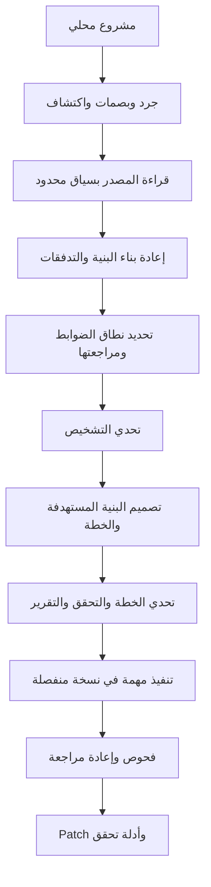

# مراجعة المشروع وتجهيزه للتطوير

التاريخ: 2026-09-20. الأساس: الإصدار 3.0.0، commit `c50f374` المستعاد من Git bundle المرفق. التغييرات الحالية محلية ولم تُنشر.

## الخلاصة التنفيذية

Engineering Audit OS محرك لسطر الأوامر يساعد وكيلًا برمجيًا أو نموذجًا لغويًا على مراجعة بنية مشروع وتحويل الملاحظات إلى أدلة وخطة إصلاح قابلة للتحقق. يوجد تنفيذ فعلي للتحليل المرحلي والاستئناف وتنفيذ الإصلاحات، وليس مجرد ملفات إرشادية. جودة الحكم الهندسي النهائي تعتمد على النموذج والسياق والاختبارات المتاحة.

المشروع مناسب كأساس لأداة يستخدمها المطور أو قائد الفريق لفهم مشروع موروث، تحديد أسباب تعقيد التغيير، أو تجهيز خطة إعادة هيكلة. لا توجد حاليًا واجهة ويب أو إدارة مستخدمين أو خدمة SaaS أو قاعدة بيانات. الاسم OS يصف نظام عمل للمراجعة، وليس نظام تشغيل للحاسوب.

## القيمة التي يقدمها

- يبني تصورًا لمسؤوليات المكونات وعلاقاتها والعقود وقواعد المنتج، ويربطه بالملفات والأسطر.
- يميز بين المعلومة المثبتة والفرضية والجزء الذي تعذر فحصه، بدل تقديم نتيجة نجاح عامة.
- يراجع السبب الجذري، ثم ينتج بنية مستهدفة وخطة انتقال واختبارات وتراجع واعتماديات بين المهام.
- يحتفظ بالحالة والمخرجات ويستأنف الأعمال المكتملة عند توافق بصماتها ومدخلاتها.
- ينفذ إصلاحًا ضمن ملفات الخطة في نسخة منفصلة، مع فحوص قبل التغيير وبعده وإعادة مراجعة.

مثال المنتج المرفق: مسار عرض السعر يخصم 5% للعميل المميز، ومسار التصدير يخصم 10%، بينما المتطلب يقول 10% لكليهما. القيمة المطلوبة من الأداة هي ربط اختلاف السلوك بازدواجية ملكية قاعدة التسعير، واقتراح مالك واحد لها واختبارات للمسارين. تغيير الرقم وحده يصلح العرض الحالي لكنه يترك سبب احتمال اختلافهما مستقبلًا. نتيجة النموذج في المثال مبرمجة مسبقًا؛ الفحوص والتنفيذ حقيقيان.

هذه قيمة تصميمية مقصودة وموجودة في سير التنفيذ. لم تُقَس بعد نسبة اكتشاف المشاكل أو الوقت الذي توفره على فرق فعلية.

## ماذا تحتوي الحزمة؟

| العنصر | النتيجة |
|---|---|
| ملفات المصدر المتتبعة عند الاستلام | 139 ملفًا |
| كود حزمة Python عند الاستلام | 1825 سطرًا، دون الاختبارات والمحتوى المعرفي |
| قاعدة المعرفة | 27 مجالًا، 165 ضابطًا، 41 سجل مصدر |
| الاعتماديات التشغيلية المعلنة | لا توجد حزم خارج المكتبة القياسية |
| بناء الحزمة | setuptools، مع CLI باسم `eaos` |
| Python | المعلن 3.10+؛ التحقق المحلي على 3.12.3 |
| الاختبارات | 92 أصلية، ثم اختباران للإصلاح الحالي؛ 94 ناجحة |
| تاريخ التطوير | مستعاد محليًا من `history/EAOS-development-history.bundle` |
| التخزين | ملفات JSON وMarkdown ومخرجات Mermaid داخل مجلد كل جلسة |

المجالات تشمل البنية ومنطق المنتج والصيانة والأمن والصلاحيات والبيانات وواجهات API والواجهة الأمامية والأداء والموثوقية والفوترة والاختبارات والبنية التحتية والتشغيل والخصوصية والذكاء الاصطناعي. وجود ضابط في القائمة لا يعني وجود ماسح متخصص ينفذه تلقائيًا؛ النموذج أو الوكيل يطبق إجراءات المراجعة على الأدلة.

## الهيكلة ومسؤولياتها

| المسار | المسؤولية |
|---|---|
| `eaos/cli.py` | استقبال الأوامر وتوجيهها، توليد حزم السياق ونقاط الحفظ |
| `sessions.py` و`workspace.py` | إنشاء الجلسات، الجرد والبصمات، القراءة والكتابة وقفل الجلسة |
| `discovery.py` | ملاحظات ثابتة؛ AST للـPython وإشارات نصية للـJS/TS |
| `architecture.py` | نموذج البنية، دورات الاعتماديات وأثر التغيير؛ دون I/O |
| `audit_records.py` و`surface_records.py` | اتساق الأدلة والنتائج والتغطية وشروط اكتمال المراجعة |
| `workflow.py` | سير العمل مع وكيل مستضيف، ترتيب المهام والتحقق من الخطة |
| `runtime/provider.py` | نقل طلبات النموذج عبر HTTP أو أمر adapter محدد |
| `runtime/context.py` | قراءة الأسطر، إخفاء أنماط الأسرار، ميزانية السياق ومراجع الأدلة |
| `runtime/jobs.py` | طلبات القراءة، التحقق من الردود، التخزين والاستئناف وحدود الاستدعاء |
| `runtime/contracts.py` | تعليمات النموذج وعقود مخرجات المراحل |
| `runtime/pipeline.py` | تنسيق التحليل وإعادة بناء البنية والمراجعة والتحدي والتصميم |
| `runtime/remediate.py` و`campaign.py` | تنفيذ الإصلاح والفحوص ثم حملات إعادة المراجعة |
| `runtime/reporting.py` | التقارير المقروءة ورسومات Mermaid |
| `controls.json` و`sources.json` و`core/` و`schemas/` | المصادر المرجعية التي نعدلها |
| `modules/` و`eaos/data/` و`MASTER-MANUAL.md` | مخرجات مولدة؛ تُحدّث عبر `tools/render.py` |

الفصل بين حسابات الرسم البياني والنقل وسير التنفيذ جيد. حجم الكود يسمح حاليًا بالإبقاء على حزمة واحدة؛ لا تظهر حاجة مثبتة إلى خدمات منفصلة. بعض الملفات مضغوطة بعدة عبارات في السطر، ما يزيد كلفة القراءة والتعديل، خاصة في منطق العقود والتحقق.

## أوضاع التشغيل

1. `audit` ثم `next`: ينشئان الجلسة ويحددان ما يلزم؛ الوكيل المستضيف يجري التفكير والمراجعة. إصدار تقرير مكتمل يحتاج استكمال السجلات والأدلة فعليًا.
2. `run` ثم `continue`: يستدعيان مزود النموذج المحدد وينفذان مراحل التحليل؛ يحتاجان إعداد مزود، ويرسلان إليه بيانات المصدر المؤهلة.
3. `implement`: ينفذ مهمة محددة في نسخة جديدة مع أوامر فحص يحددها المستخدم.
4. `improve`: يكرر التنفيذ والفحص ومراجعة النسخة الجديدة ضمن عدد خطوات محدود.

هناك أيضًا أوامر للأدلة والرسم البياني وأثر التغيير وحزم السياق والتحقق ونقاط الحفظ. المخرجات الأساسية: `EXECUTIVE.md` و`ARCHITECTURE.md` و`TARGET-ARCHITECTURE.md` و`IMPLEMENTATION-PLAN.md` و`report.md`، مع السجلات المنظمة والبصمات.

## التحقق المنفذ فعليًا

- مطابقة جميع بصمات الحزمة الـ316؛ لم تظهر اختلافات.
- مطابقة ملفات Git المستعادة الـ139 مع المصدر الموجود في ZIP قبل التعديل؛ متطابقة.
- التحقق من سجل المراجعة الذاتية المرفق: الاتساق VALID، والاكتمال PARTIALLY_COMPLETE بسبب فجوة تقييم النموذج الحي وتغطيتها والأسئلة المتبقية.
- تشغيل الاختبارات الأصلية: 92 ناجحة. أول محاولة داخل عزل الشبكة منعت إنشاء socket لاختبار HTTP؛ نجح بعد تشغيله بالصلاحية المناسبة، دون تعديل الاختبار.
- إضافة اختبارين لإخفاء مفتاح وهمي أثناء القراءة الجزئية وتجزئة المصدر؛ فشلا قبل الإصلاح ونجحا بعده.
- مجموعة الاختبارات النهائية: 94 ناجحة؛ السجل في `/workspace/eaos-review/tests.log`.
- إعادة توليد الوثائق والبيانات ثم `tools/validate.py`: لا أخطاء، ولا اختلاف غير متوقع في المخرجات المولدة.
- تثبيت wheel المرفق ثم تثبيت نسخة التطوير editable؛ اختبار CLI من خارج مجلد الريبو أثبت استخدام مصدر التطوير.
- تجربة `audit` المحلية أنشأت جلسة عند مرحلة SCOPE، ولم تدّعِ انتهاء المراجعة.
- تجربة كاملة بمزود الاختبارات: تقرير COMPLETE، ثم إصلاح VERIFIED_IN_ISOLATED_COPY واختبارات فعلية، وبقاء المصدر الأصلي دون تغيير. مخرجاتها في `/workspace/eaos-review/scripted-demo/`، وسكربت إعادة التنفيذ في المجلد الأب.

لم أشغّل نموذجًا خارجيًا أو أقيّم مشاريع عملاء، ولم أتحقق من استيعاب كل ضابط لكل حالة واقعية أو صحة جميع المراجع البحثية الخارجية. تمت مراجعة التنفيذ والمسارات الحرجة والعقود وأدوات التوليد والاختبارات والتوثيق التشغيلي؛ هذه مراجعة تأسيسية وليست ادعاء استنفاد جميع العيوب المحتملة.

## نتائج المراجعة وأولوياتها

| الأولوية | النتيجة والدليل | الحالة أو العمل المطلوب |
|---|---|---|
| P1 | `Context.source` كان يخفي الأسرار بعد تقطيع الأسطر؛ جزء من وسط مفتاح PEM لا يحمل علامات البداية والنهاية فيمر إلى السياق | أُصلح بإخفاء الملف كاملًا قبل تقطيع النطاق، مع إبقاء بصمات الأدلة على النص الأصلي واختبارين للرجوع |
| P1 | `SECURITY.md` كان ينفي كل اتصال شبكي وتنفيذ أوامر، خلافًا لتنفيذ provider/remediate | صُحّح ليشرح صلاحيات كل وضع ووراثة بيئة adapter وحدود النسخة المنفصلة |
| P1 | اختبارات جودة التشخيص تعتمد على `FixtureProvider`، والفجوة G-LIVE-QUALITY ما زالت مفتوحة في المراجعة المرفقة | بناء تقييم بمشاريع معروفة المشاكل وأخرى سليمة، ثم قياس دقة النتائج وكلفة اكتشافها باستخدام مزود فعلي |
| P1 | `packet` ينسخ المصدر المؤهل دون تطبيق `redact`؛ أما مسار runtime فيخفي أنماطًا محددة. adapter يرث بيئة العملية كاملة | توحيد سياسة تداول البيانات بين الأوضاع، واختبارات للأسرار في الحزم والسجلات وبيئة adapter. إنشاء packet محلي وحده لا يرسل بيانات |
| P2 | `fresh` يعيد جرد الملفات وقراءتها، وبصمة inventory تتضمن `mtime_ns`؛ تغيير الوقت فقط يبطل الاستئناف | فصل هوية المحتوى عن بيانات الجرد التشغيلية وقياس الأداء على مستودعات كبيرة قبل التحسين |
| P2 | حد `max_calls` تابع لسجل Jobs؛ الإصلاح وإعادة مراجعته والتدقيق الجديد لها سجلات مستقلة | ميزانية إجمالية واضحة للحملة وتقدير تكلفة قبل البدء؛ حد الاستدعاءات ليس سقفًا نقديًا ولا حدًا موحدًا للحملة |
| P2 | `_implement` يتطلب نجاح baseline قبل أي تعديل | تصميم وضع صريح ومضبوط لإصلاح فشل موجود أصلًا، دون تحويل اختبار فاشل غير متوقع إلى نجاح صوري |
| P2 | معالجة timeout موجودة، لكن أخطاء النقل توقف التشغيل حتى الاستئناف؛ مخرجات subprocess تُحد بعد الكتابة إلى ملف مؤقت | سياسة إعادة محاولة للأخطاء المؤقتة وضبط موارد العمليات والسجلات عند اعتماد التشغيل الآلي |
| P2 | لا ملفات CI في المصدر المستلم، والتحقق المحلي على Python 3.12 فقط | إضافة فحوص آلية للإصدارات المعلنة، بناء wheel وتثبيته، واختبار اتساق المحتوى المولد |
| P2 | `schema_errors` تحقق يدوي جزئي، و`tools/validate.py` يقارن الملفات الموجودة داخل data ولا يثبت وجود كل ملف متوقع | توحيد العقود أو توثيق subset صريح، وإضافة تحقق من اكتمال مجموعة الملفات المولدة |
| P3 | كثافة العبارات في السطر وغياب واجهة استعراض موحدة | تحسين قراءة الكود تدريجيًا؛ ثم واجهة للمراحل والأدلة والفروقات بعد ثبات الجودة |

الأولويات تقدير هندسي لهذه المراجعة، وليست درجات خطورة محسوبة بواسطة EAOS. البنود المفتوحة لم تُنفذ في هذه الجولة. لا توجد حاليًا رخصة LICENSE ضمن الملفات المتتبعة؛ اختيارها قرار لصاحب المشروع قبل التوزيع العام.

## خطة التطوير المقترحة

**المرحلة الأولى — تثبيت موثوقية المحرك:** توحيد حدود البيانات، تقوية العقود، CI وتثبيت حزمة مستقلة، وتحسين رسائل الأخطاء. معيار القبول: اختبارات رجوع لكل عيب مثبت، وعدم إرسال القيم الوهمية الحساسة عبر المسارات المشمولة باختبارات السياسة.

**المرحلة الثانية — إثبات القيمة:** مجموعة مشاريع صغيرة ومتوسطة بها عيوب موثقة وحالات سليمة؛ حفظ النموذج والإعدادات والوقت والاستهلاك. تقييم النتائج بشريًا من حيث صحة السبب الجذري، الإنذارات الخاطئة، المشاكل الفائتة، وجودة خطة الإصلاح. تحديد عتبات القبول قبل التجارب، دون اختراع أرقام نتائج.

**المرحلة الثالثة — التشغيل اليومي:** إعداد مزود أبسط، تقدير أولي للحجم والكلفة، عرض التقدم، ميزانية للحملة، وإعادة محاولات واستئناف أوضح. دعم إصلاح baseline الفاشل يحتاج عقدًا مستقلًا واختبارات تعزل الفشل المتوقع عن الأعطال الجديدة.

**المرحلة الرابعة — تجربة المنتج:** واجهة محلية تعرض الجلسات والخريطة والأدلة وخطة العمل وفرق الكود. تبقى قواعد التحقق في المحرك وتستخدمها الواجهة. تصبح مشاركة الفرق وإدارة الصلاحيات مطلبًا منفصلًا إذا تقرر تحويله إلى خدمة متعددة المستخدمين.

أفضل بداية للتطوير التالي هي موثوقية النتائج وحدود البيانات والتقييم الحي؛ هذا ما يحدد إن كان المنتج مفيدًا فعلًا، ثم نبني تجربة الاستخدام على أساس مثبت.
