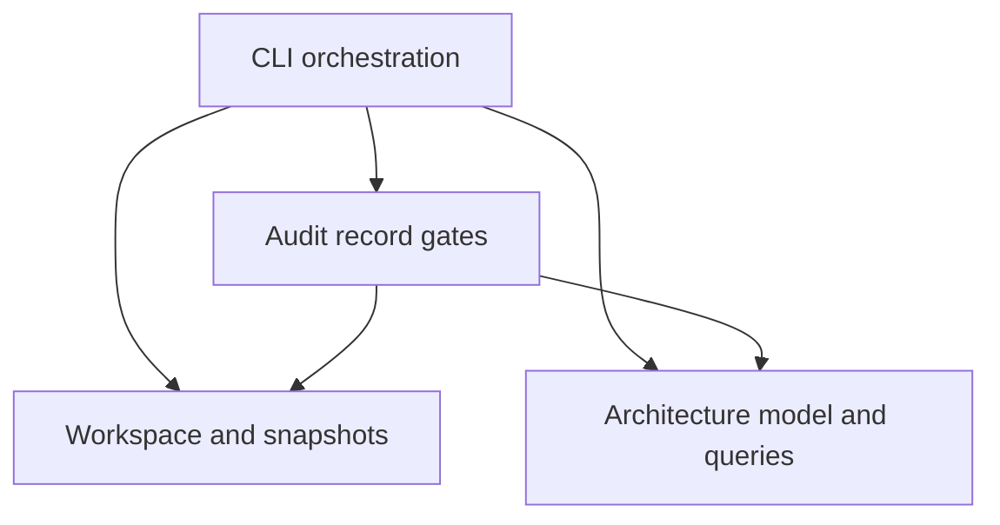

# Architecture & Structure Operating Protocol — 2.0

## الغرض وحدود الحكم

الغرض الأساسي هو أن يبقى المنتج **مفهومًا، قابلًا للتعديل والاختبار، وقابلًا لإضافة وظائف عبر الزمن بكلفة معقولة**. ليست الاستدامة ضمان حياة لعدد سنوات، وليست مرادفًا للبنية السحابية أو زيادة عدد الخدمات. لا نستبدل المنتج بarchitecture مثالية متخيلة.

المرجع المعياري هو invariant وعقد المشروع والدليل والاختبار. الفيديوهات بذور أمثلة تاريخية؛ لا تصبح سلطة تحدد صلاحية كل منتج. المصادر الهندسية تدعم طرق التفكير، لكن شروط التطبيق والمفاضلات تبقى معلنة. انظر [تعريفات Fowler](https://martinfowler.com/architecture/) و[سيناريوهات الجودة لدى SEI](https://www.sei.cmu.edu/library/quality-attribute-workshops-qaws-third-edition/). فرضية [Design Stamina](https://martinfowler.com/bliki/DesignStaminaHypothesis.html) تساعد على التفكير بالكلفة المستقبلية؛ لا نستخدمها كبرهان عددي على العائد.

## أربعة مستويات مترابطة

| العدسة | ما الذي نفهمه؟ | الإثبات | علامة تستحق التحقيق |
|---|---|---|---|
| Contract | ما الذي يعد به المكوّن؟ inputs/outputs/errors/side effects/state/version | واجهة فعلية واختبارات ومستهلكون | consumer يعتمد تفاصيل غير معلنة |
| Structure | أين تسكن المسؤوليات والقواعد؟ وكيف نقسمها؟ | ملفات/رموز/حدود/ملكية | تغيير قاعدة واحدة في مواضع متباعدة بلا سبب |
| Architecture | لماذا ترتبط الوحدات هكذا؟ ومن يملك القرارات؟ | dependency/data/control/lifecycle maps وقرارات | سياسة لا تصمد عبر مسار آخر |
| Local implementation | كيف ينفذ الجزء عقده؟ | source trace وnegative tests | خوارزمية أو serialization أو concurrency تكسر invariant |

هذه العدسات ليست disjoint layers يجب إنشاؤها في الكود. لا تحول أسماء العدسات إلى أربعة مجلدات. Infrastructure تدخل الخريطة فقط بالقدر الذي تشارك به في علاقات المنتج وقيوده أو ضمن profile شامل.

## ترتيب التنفيذ الإلزامي

1. **Discover**: ثبت revision وscope، وابحث عن التطبيقات والـmanifests ونقاط الدخول. inventory ليس فهمًا معماريًا.
2. **Explain the product**: اكتب actors والرحلات والقواعد؛ ميّز observed/required/hypothesized. لا تفترض أن منتجًا يحتاج وظيفة لم يطلبها.
3. **Reconstruct structure**: عرّف وحدات بمسؤولية دلالية. لا تجعل كل ملف node ولا تجمع كل المشروع في node يخفي الاعتماديات. وثق abstraction level.
4. **Reconstruct contracts and relationships**: consumer→provider، source dependencies منفصلة عن runtime calls/data access. كل edge له source evidence وstatus.
5. **Map ownership and lifecycle**: من يملك القرار؟ ما consumers؟ create/save/load/apply/update/delete. اذكر أين يتكرر enforcement عمدًا.
6. **Exercise change scenarios**: إضافة قاعدة، تغيير contract، استبدال adapter، استعادة حالة بعد update؛ اختر السيناريوهات ذات الصلة فعليًا.
7. **Challenge boundaries**: قارن expected touchpoints بما وجد؛ ابحث عن consumers من خارج القائمة وعن bypass وhidden state. تستخدم تخصصات الأمن والأداء كعدسات لدعم السؤال البنيوي.
8. **Assess**: لكل finding invariant وأثر على تغيير/فهم/اختبار مع evidence وcounter-evidence. الروائح إشارات لا أحكام.
9. **Design minimal correction**: قارن keep / local fix / extraction / boundary repair / staged migration. أظهر لماذا الحل الأقل تدخلًا لا يكفي إذا رفضته.
10. **Verify and preserve**: أعد سيناريو التغيير نفسه واختبار الحدود والمستهلكين؛ حدّث العقد والنموذج والـADR وfitness checks.

## بنية الأدلة المطلوبة

`architecture.json` هو المصدر الوحيد للخريطة لهذا التشغيل. `architecture.md` وصف توضيحي لا بديل عن السجل. يتضمن:

- `nodes`: معرف، اسم، kind، responsibility، domain، boundary، owner، exact source paths، evidence_ids. owner هنا مسؤولية تنظيمية/منطقية؛ لا يلزم كشف أسماء أشخاص.
- `edges`: from/to/relation/reason/status/evidence_ids. الاتجاه دائمًا من المستهلك إلى ما يعتمد عليه. العلاقات: imports/calls/uses_contract/reads/writes/configures. لا تُنشئ edge معكوسة لتجميل الرسم.
- `contracts`: owner node، consumers، description، invariant، failure_semantics، compatibility، evidence_ids.
- `business_rules`: owner node، consumers، description، invariant، evidence_ids. يمكن static site تسجيل invariant مثل ملكية المحتوى وعقد البناء دون اختراع business domain.
- `change_scenarios`: stimulus/environment/artifact/response/measure/method/affected_nodes/status/evidence_ids. TRACED تحليل من source؛ TESTED يحتاج دليل test. لا تعتبر design rehearsal تنفيذًا ناجحًا.
- `dependency_policies`: علاقة forbidden محددة وأسبابها وأدلتها. عدم ذكر policy لا يعني حرية كل علاقة؛ يعني عدم وجود policy قابلة للفحص في النموذج.
- `coverage`: UNREVIEWED/PARTIAL/REVIEWED، scope وحدود لم تحسم. REVIEWED يعبّر عن النطاق المذكور ولا يصح إن بقيت limitations غير محسومة.

إذا لم يعرف المراجع العلاقة يسجل HYPOTHESIS ولا يثبتها بالرسم. absence في graph لا يثبت عدم وجود علاقة فعلية. adapters/DI/events/reflection/generated clients/SQL/stored procedures/feature flags قد تخفي edges؛ وثق طريقة كشفها أو gap.

## قراءة graph دون تضليل

`eaos graph RUN` يحسب strongly connected components لعلاقات imports وuses_contract المؤكدة، وfan-in/fan-out من تلك العلاقات، ويطابق forbidden policies المعلنة فقط. لا يحول النتائج إلى findings تلقائية. شبكة calls دورية قد تمثل callback مشروعًا؛ كثرة fan-in قد تمثل core stable contract. التفسير يحتاج المستوى المعماري والمفاضلة وسيناريو تغيير.

`eaos impact RUN --node billing --depth 2` يسير عكسيًا عبر علاقات مؤكدة من جميع الأنواع. يعرض dependents المحتملين وdependencies المباشرة وconsumers المذكورين في العقود والقواعد، وfrontier لم يُوسّع. هذه قائمة من يجب فحصه، وليست أمر تعديل للجميع. نقص edge أو عمق محدود يجعل النتيجة غير شاملة، وتظهر هذه الحدود صراحة.

`eaos context RUN --node billing --depth 2 --budget-chars 18000` يضم علاقات النطاق وعقوده وقواعده وسيناريوهاته وأدلته وhash النموذج. يحفظ references إلى ملفات المصدر ولا يرسل الكود إلى مزود خارجي. للمصدر المحدد استخدم packet --file بعد مراجعة eligibility. لا يدخل كل المستودع في السياق. إذا تجاوزت البيانات الميزانية يفشل صراحةً، فلا يسقط شرطًا بصمت.

## مصفوفة مراجعة الاستدامة

| السؤال | دليل مناسب | ما لا يكفي |
|---|---|---|
| هل نعرف أين نضيف سلوكًا؟ | route→use case→rule→adapter→test trace | README يزعم clean architecture |
| هل التغيير موضعي عند ملاءمته؟ | سيناريو مع required touchpoints والمستهلكين | مجرد diff قصير |
| هل الوحدات مستقلة بالقدر المطلوب؟ | عقود وpolicy dependencies واختبار isolation | مجلدات بأسماء services وrepositories |
| هل نفس القاعدة متسقة؟ | owner ومستهلكون واختبار semantic consistency | dedup نصي يخلط معاني مختلفة |
| هل يمكن اختبارها؟ | seams وfixtures وفحص فشل وتزامن relevant | coverage رقمية وحدها |
| هل سيبقى الفهم بعد تبدل المطور؟ | خريطة source-backed وADRs وقرار trade-off | شفهيات أو summary بلا evidence |
| هل يمكن تحسين البنية بأمان؟ | مراحل compatibility وتراجع/rollforward | إعادة كتابة واسعة بلا success criteria |

## سيناريوهات التطور

لا تضع أرقامًا عالمية مثل «أي ميزة يجب أن تحتاج ملفين». لكل سيناريو عرّف measure يناسب المنتج: عدد حدود العقود المتغيرة، actors المتأثرون، اختبارات يجب أن تتغير، الحاجة لتنسيق إصدارات، migration، أو زمن فهم مقاس. التقدير يوسم ESTIMATE، والقياس يوسم OBSERVED مع بيئته.

1. **إضافة rule**: سجل owner ووحدة التنفيذ وواجهة التحكم إن كانت من متطلبات المنتج؛ تتبع UI/API/jobs/import/export والـdefaults. hidden default عيب إذا يناقض العقد أو يخلق مصدر حقيقة آخر، لا لأنه ليس في UI دائمًا.
2. **استبدال خدمة خارجية**: اقرأ contract والاستخدامات الفعلية للفشل/timeout؛ تحقق إن كانت تفاصيل provider تتسرب إلى domain/UI. لا تنفذ الاستبدال فقط لإثبات وجود interface.
3. **تغيير entitlement/permission**: تتبع cache/background tasks/routes/gateway وفق الخريطة. لا يختفي الشرط عند مسار ثانٍ، ولا تضف تعديل proxy إن لم يكن جزءًا من enforcement.
4. **تغيير schema**: تحقق من consumers وwriters أثناء mixed versions؛ compatibility جزء من architecture لا مهمة SQL منعزلة.
5. **حذف ميزة**: هل يمكن إزالة UI/API/jobs/config/dependencies/flags دون ترك قاعدة مخفية أو dangling event؟ سجل shared ownership قبل الحذف.
6. **استعادة حالة**: إثبات persistence منفصل عن activation. جرب restart/upgrade على بيانات اختبار قديمة وجديدة.

## الانضباط ضد الإفراط

قارن الحلول بمقدار حماية invariant وبساطة تفسيرها وscope وخطر regression، لا بعدد الأنماط أو الطبقات أو الاختبارات. إعادة تسمية مجلدات وحدها STYLE، لا تحسين معماري مثبت. DI وDDD وCQRS وevent sourcing وmicroservices خيارات مشروطة، لا سلم احتراف. قد يكون monolith بسيط بعقود واضحة أفضل من خدمات موزعة بلا استقلال حقيقي.

قبل أي refactor: اذكر المشكلة المثبتة، لماذا تؤثر على التغيير، البدائل الأقل تدخلًا، cost assumptions، وما إذا كان الحل يزيد عدد المفاهيم اللازمة لفهم السلوك. امنع abstraction مبنية على احتمال وحيد متخيل؛ إن كان هناك تغيّر متكرر بدليل فصمم seam قابلًا للاختبار.

## Profile وسياسة الإكمال

`architecture` هو الافتراضي: المجالات 01/02/03/04/15/22/26/27 أساسية. باقي المجالات OUT_OF_SCOPE مبدئيًا للـfull-domain audit، وليست NOT_APPLICABLE ولا PASS. فعّل المجال المساند أو instance منه عند تقاطع التغيير معه. احتفظ بتقرير نطاق يوضح مثلًا «تحققنا من حدود authorization المؤثرة في التصميم، ولم ننجز pentest كاملًا».

`full` يحتفظ بطلب المراجعة الشاملة؛ كل المجالات تحتاج applicability decision. القواعد الأصلية باقية، ولا يسقط security/privacy/runtime المطلوب في النطاق بمجرد اختيار الاسم.

COMPLETE يتطلب أيضًا نموذجًا صحيحًا وأدلته وعقوده وقواعده وسيناريو تغيير واحدًا على الأقل، مع scope مراجع ولا limitations غير محسومة. هذا حد آلي أدنى؛ المشروع متعدد المجالات يحتاج سيناريوهات تمثل تغيراته الحرجة كلها وفق سجل scope. لا يُختصر مشروع كبير إلى عقد وnode واحد لتمرير البوابة. reviewer يقارن النموذج بالمستودع، لأن الآلة لا تستطيع إثبات صدق corpus المقدم لها.

الترقية من1.0 إلى2.0 كاسرة لعقد التشغيل: أنشئ run جديدًا؛ لا ترفع version يدويًا ولا تنسخ حالات complete. يمكن نقل evidence بعد إعادة ربط revision وإعادة فحصها. يبقى archive1.0 متاحًا كتاريخ، والإصدار2.1 يضيف مسار الوكيل وخطة التحسين؛ يتطلب run جديدًا كذلك.

## بنية الأداة نفسها

`eaos/architecture.py` لا يقرأ filesystem ولا يشغل tools؛ يعمل على نموذج صريح، ما يسمح باختبار direction/cycles/impact بمعزل عن واجهة الأوامر. `workspace.py` يملك جرد وقراءة المصدر وfingerprints وحدود المسارات. `audit_records.py` يملك اتساق الأدلة والتغطية والإغلاق. `cli.py` يملك arguments وتنسيق المخرجات وتركيب العمليات. لا تعتمد أي وحدة على CLI كي تعمل، ولا توجد provider SDK داخل graph domain.

اختير هذا الفصل لسبب تغير حقيقي: سياسة الأدلة تختلف عن خوارزمية أثر التغيير وعن واجهة الأوامر. لم نضف plugin framework أو DI container إلى برنامج صغير. لو أضيف AST parser لاحقًا، ينتج نموذج candidate مستقلًا ثم يمر بنفس validation، ولا يغير domain كي يدعم لغة معينة.
