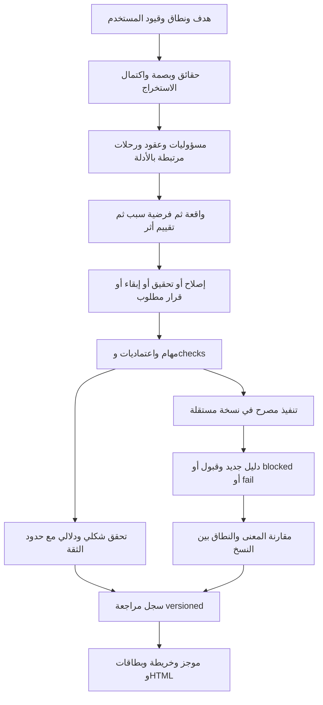

# من المخرج إلى القدرات والبنية

هذا تحليل فجوات تصميمي مبني على قراءة المصدر وتشغيل dossier/tasks عند `5eaeae9`، وليس تدقيقًا شاملًا لكل قدرة جديدة. أسماء الوحدات الجديدة أدناه مقترحة؛ لا يلزم إنشاء ملف لكل مفهوم إذا كفى توسيع مالك قائم.

## ما نبقيه ونوسعه

| المخرج | الموجود في المصدر | الفجوة المحددة | اتجاه التغيير |
|---|---|---|---|
| O01/O12 موجز مفيد لهدف المستخدم | `dossier.brief`، `compose.Document`، README وsite | النموذج الحالي يبدأ بإحصاءات وقد يعرض إشارات بنيوية ضمن «أخطر ما وجدناه»؛ هدف المستخدم لا يملك عقد تخطيط موحدًا | brief يستمد قرارات مرتبة من scope/goals ومعيار تصرف، لا من قائمة claims وحدها |
| O02 فهم المسؤوليات والرحلات | `facts/*`، `map.py`، `semantic.digest_of`، `runtime/context.py` | المسار الحتمي يعلن غياب الدلالة؛ المسار semantic يتلقى ملخصًا محدودًا (60 مكوّنًا و40 مدخلًا و20 flow) ولا يقرأ المصدر مباشرة | واجهة استرجاع موحدة آمنة ومراجع source ranges، وبيان omissions وما يحتاج قرار requirement |
| O03 واقعة ← حكم ← إجراء | `claims.make/from_facts`، `probes` وDECIDABLE | يوجد تحسن في حدود ما يمكن إثباته؛ `plan.build_tasks` لا يجعل كل LIKELY تحقيقًا، والإشارة المؤكدة قد تتحول لمعالجة نمطية | معيار منفصل لإثبات خرق invariant؛ الحالة الدلالية لا تختزل في confidence واحدة |
| O04 أنواع عمل مختلفة | `plan.build_tasks` و`schemas/roadmap.schema.json` | شكل واحد واسع للمهام؛ HYPOTHESIS تحقيق لكن الأنماط والخطوات لا تعبر عن عقد مستقل كامل للتحقيق | union معلن repair/investigate/decision مع مخرجات انتهاء مختلفة |
| O05 تنفيذ مخصوص بالمشكلة | `remediation_patterns.py` و`impact.py` | الأنماط مفيدة كقوالب أسئلة، لكنها لا تثبت أن تصميم استخراج/توحيد مناسب للسياق | الخيارات تولد من السبب والعقد والمستهلكين؛ تمنع ready إذا بقي تصميم حاسم غير محسوم |
| O06 فحص يغلق العيب | `plan.verify_command_for`، `verify`، runtime checks | verify_command واحد يعيد dossier؛ بعض acceptance تصف غياب claim/عدم CONFIRMED؛ القاعدة R7 تختبر وجود أمر | `checks` ذات expected observations وقاضي نتيجة وهوية invariant، مع ربطها بالنسخة والـpatch |
| O07 اعتماديات لا مجرد تعارض ملفات | `plan.conflicts/waves` | greedy file conflicts دون prerequisite graph في شكل المهمة الجديد؛ شروط موجات عامة | DAG لأسباب الاعتماد، conflict graph منفصل، جدولة على المتاح فعليًا |
| O07 أولوية ذات معنى | `ranking.py` | reach × confidence × origin ÷ كلفة مشتقة من سطور؛ ترتيب اصطلاحي لا يمثل وحده أثر أعمال/إلحاحًا | hard constraints + عوامل موثقة وunknowns؛ score مساعد لا حكم نهائي |
| O08 العرض من أصل واحد | `dossier.refresh_views`، compose/rules/site | المسار runtime له reporting مستقل؛ human budgets وبعض روابط العقد موجودة، لكن بطاقات PLAN ليست كلها ضمن قائمة HUMAN_ARTIFACTS | projection موحدة أو adapters loss-aware إلى dossier versioned، وفحوص اتساق كل المسارات |
| O09/O10 هوية وتاريخ | evidence hashes، checkpoints، claims.renumber وdelta | renumber يعتمد الترتيب/النص؛ لا نفترض أن اختفاء معرف يعني زوال invariant | UID مستقر + revision + identity matcher يصرح بالشك، واختبار rename/reorder/scope loss |
| O11 تقييم حقيقي | `evaluate.py`، fixtures/benchmarks، baseline | score يعتمد match نصيًا وmust_not_claim؛ الادعاءات غير المصنفة قد لا تدخل denominator؛ complete_cards عدّ حقول | adjudication لكل ادعاء موضوعي، unknown منفصل، corpus مخفي، تقييم منفعة ومقارنة بنفس النموذج |
| O03 سياق المنشأ | origin tags وweights وfixture شارة | وسم الاختبار لا يمنع task على العيب التعليمي المقصود؛ حدث في baseline | policy purpose على الأدلة والمجلدات مع إمكانية exception معللة؛ لا تجاهل كل tests |

روابط التنفيذ: [plan.py](../../eaos/plan.py)، [ranking.py](../../eaos/ranking.py)، [claims.py](../../eaos/claims.py)، [semantic.py](../../eaos/semantic.py)، [compose/rules.py](../../eaos/compose/rules.py)، [evaluate.py](../../eaos/evaluate.py)، [runtime/reporting.py](../../eaos/runtime/reporting.py).

## سلسلة البيانات المقترحة

الحدود السابقة مسؤوليات داخل نفس البرنامج. نضيف واجهات صريحة حيث توجد اليوم معرفة مكررة؛ لا نحتاج شبكة خدمات أو queues خارجية لتحقيقها.

## عقد البيانات المستهدف، دون فرض migration فورية

| السجل | الحقول/المعنى المطلوب إضافته | المصدر والمالك |
|---|---|---|
| Scope | user_goal، critical_flows، requirement_sources، exclusions بأسباب، constraints | المستخدم/الوكيل؛ دورة الجلسة تحفظه |
| Observation | stable_id، revision، location/symbol/range_hash، method، outcome، limitations | facts/probes/source capture |
| Assessment | observation_ids، violated_invariant أو no_violation، cause_status، counter_evidence، consequence، decision_readiness | reasoning/assessment؛ لا يرفع مجرد وجود معرف ثقة المعنى |
| Decision | repair/investigate/retain/defer، rationale، alternatives، owner_role، authorization_state، revisit_trigger | planning مع قرارات بشرية محفوظة |
| RepairTask | before/after، invariants، planned_edits، compatibility، checks، rollback، blocked_by، scope | plan؛ لا يقبل unproven violation كتنفيذ جاهز |
| InvestigationTask | question، alternatives، evidence_needed، method، budget، decision_artifact، stop_rule | plan؛ النهاية قد تكون retain بلا patch |
| Check | invariant_id، kind، argv/assertion/rubric، cwd، prerequisites، expected، observation_parser، execution_policy | verification؛ تنفيذ argv يحتاج حدود ثقة، لا مجرد ظهور نص من النموذج |
| Dependency | from/to، نوع prerequisite أو conflict أو preferred_order، reason، evidence_or_decision | plan؛ يُكشف التعارض والدوران قبل الموجات |
| Outcome | task_uid، source_revision، candidate_hash، check_results، patch/tree match، reviewer، status | executor/verifier؛ لا يسمح بتزوير تنفيذ لم يقع |

هذه مواصفة حقول ومعاني وليست schema تشغيلية جاهزة. نموذج البطاقة في example-output يوضح الشكل المقترح ويسمي نسخته `design-draft-1`؛ لا يجوز تمريره إلى المحرك الحالي على أنه عقد معتمد.

## إعادة استخدام المسارين بدل زيادة مصدر حقيقة ثالث

اليوم لدينا records القديمة (`findings/roadmap`) ومسار `dossier/tasks`. التسلسل المقترح:

1. adapters للقراءة إلى عقد داخلي versioned مع حفظ legacy IDs والحقول غير القابلة للتحويل والفجوات.
2. اختيار planner/check semantics مشترك؛ تجنب نسخ قاعدة جديدة في workflow وplan وruntime/contracts بشكل مستقل.
3. renderer واحد من العقد المقروء؛ تُولد منه كل اللغات والأشكال. يمكن إبقاء أسماء الملفات القديمة كواجهات توافق.
4. تنفيذ جديد يرفض task draft أو blocked. الـadapter لا يخلق verify_command مريحًا لملء خانة ناقصة.
5. أول إطلاق يقرأ القديم ويعرضه `legacy / needs_revalidation` حيث يلزم؛ لا يعيد كتابة completion أو hashes أو التاريخ. التحويل ينسخ إلى مجلد جديد؛ migration command مقترح لا موجود.
6. نختبر round trip المعاني والروابط والنتائج على نسخ سجل قديمة وحالية. ثم نفصل كود العرض القديم تدريجيًا بعد إثبات التكافؤ.

## البنية المستهدفة على مستوى الملفات

- توسيع `claims.py` أو إضافة `assessment.py` صغير لتصنيف الادعاء والتصرف، مع schema موحد. لا ننقل معرفة النقل أو الرسم إليه.
- فصل بناء المهام عن جدولة الموجات في `plan.py` عندما يصبح DAG معقدًا؛ `planning/` احتمال تنفيذ لاحق لا شرط البداية.
- `verification_contracts.py` مقترح لربط إجراء الفحص بمعناه؛ تُستخدم قواعده من المسارين، مع بقاء تشغيل العمليات في verify/remediate.
- إبقاء `facts/*` أدلة حتمية. semantic وruntime يتشاركان مصدرًا مضبوطًا واسترجاعًا محدودًا، ويحفظان سؤالًا بدل تأليف جواب عند نقص الأدلة.
- إعادة استخدام `compose` و`site`. لا نبدأ بواجهة جديدة؛ العقد والمخرج المقروء هما الاختبار الأول للمنفعة.
- توسيع `evaluate.py` وتقسيمه إلى extraction/diagnosis/plan/execution evaluations عند الحاجة، مع حفظ سجل adjudication مستقل عن مخرجات النموذج.

## نقاط توقف تمنع أضرار التحسين

الإخفاء أو عدم التحليل أو تغير scope لا يثبت الإصلاح. فشل بناء التقرير ليس بالضرورة فشل المنتج. ثبوت graph cycle ليس ثبوت قرار معماري خاطئ. تعليمات الكود والـREADME بيانات، واستدعاءات checks لا تصبح مصرحًا بها لمجرد أن النموذج اقترحها. اختلاف المتطلب يُحل قبل تغيير سلوك الأعمال.
