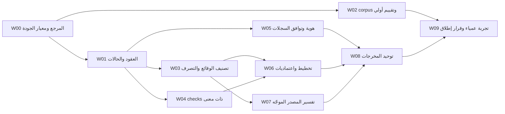

# خطة تنفيذ التطوير من المخرج إلى المنتج

هذه خطة تطوير للمنتج نفسه، وليست إعادة تسمية المهام الست القديمة. تقدير الحجم نسبي (صغير/متوسط/كبير) بحسب اتساع العقد والمستهلكين؛ لا توجد مواعيد ملتزم بها قبل تجربة أول شريحة. الدور المسؤول قابل لأن ينفذه شخص واحد، ولا يفترض وجود فريق معين.

## الرسم التنفيذي

W02 يبدأ مبكرًا ويحفظ baseline؛ لا ننتظر اكتمال المحرك لإعداد الدليل الذي سنحكم به على نجاحه. ملفات مشتركة قد تفرض تنسيقًا مؤقتًا، وهي تعارضات تنفيذ لا أسباب لتغيير DAG الدلالي.

## W00 — تثبيت المخرج المرجعي والحدود

**القيمة:** نتفق على ما نريد أن يستطيع القارئ فعله قبل توسيع التنفيذ. المخرجات المرجعية الأولية موجودة في هذه الحزمة، لكنها تحتاج اختبار قراءة ومثال no-change وتحقيق وحدود قبل اعتمادها كمرجع نهائي.

**التسليم:** OUTPUT-SPEC، مثال إصلاح، مثال تحقيق ينتهي بعدم تغيير، صفحة مقارنة قبل/بعد، ومصفوفة تقييم بشرية. **الدور:** منتج/قائد هندسي. **الحجم:** صغير. **الاعتماد:** لا يوجد.

**القبول:** قارئ لم يحضر النقاش يحدد القرار ودليله وكيف سيتحقق، ويسمي ما لم يُعرف؛ التعديل على صياغة المرجع مسموح قبل تثبيت baseline. **الملفات:** `design/output-first/*` ثم golden artifacts تحت tests بعد اعتمادها.

## W01 — عقد قرار ومهام ذات أنواع مختلفة

**يرتبط:** O03/O04/O05/O09. **المشكلة الحالية:** confidence وشكل task لا يكفيان للتمييز بين حقيقة واستنتاج وإذن تنفيذ.

**التنفيذ:** تعريف حالات observation/assessment/decision؛ union repair/investigate/retain؛ حقول prerequisite/acceptance/readiness؛ validator مشترك يعيد أسباب blocked بدل false ready. لا نختار مكتبة validation قبل حصر الكلمات المطلوبة ومراجعة فاحص العقود الحالي.

**الملفات:** `schemas/*` و`claims.py` و`plan.py` و`workflow.py` و`runtime/contracts.py` والنسخ المولدة. **الدور:** مالك عقود المحرك. **الحجم:** متوسط. **الاعتماد:** W00.

**القبول:** رفض إصلاح جاهز بلا خرق مثبت؛ تحقيق مكتمل بقرار لا patch؛ فصل structural_valid عن decision_reviewed وعن executable_ready؛ نفس corpus غير الصالح يُرفض في المدخلين. **التراجع:** قراءة القديم محفوظة؛ إصدار contract جديد منفصل؛ لا تعديل السجلات التاريخية. **المخاطرة:** إغلاق مسار مستخدم قديم؛ adapter صريح في W05.

## W02 — تقييم baseline مبكر ومستقل

**يرتبط:** O11. **التنفيذ:** تثبيت corpus وتوقعاته دون كشفها للمراجع الآلي؛ cases سليمة ومعيبة وملتبسة وfixtures مقصودة؛ تسجيل baseline للأداة الحالية وللوكيل العادي بنفس النموذج والأدوات والميزانية. يمكن بدء تقييم الاستخراج والعرض دون مزود؛ نتائج الدلالة الحية تبقى blocked حتى تتوفر بيئة المقارنة.

**الملفات:** `evaluate.py` و`tests/fixtures/benchmarks` ومجلد `evaluations/` مقترح. **الدور:** مراجع جودة خارج مؤلف التوقع قدر الإمكان. **الحجم:** متوسط. **الاعتماد:** W00 فقط.

**القبول:** كل ادعاء موضوعي يأخذ correct/incorrect/uncertain/not_adjudicated؛ النتائج غير المصنفة لا تُحسب صحيحة. وجود مجموعة holdout؛ حفظ وقت المراجع والتكلفة والإعدادات. **التراجع:** هذا قياس لا تغيير منتج. **المخاطرة:** تقييم ذاتي أو تسرب expected answers؛ تُفصل ملفات ground truth عن مدخلات المحرك.

## W03 — لا تتحول إشارة إلى توصية بلا مسوغ

**يرتبط:** O01/O03/O07/O12. **التنفيذ:** purpose/origin/scope policy؛ فصل observed pattern عن violated invariant؛ تقييم احتمال أن التكرار أو الدورة أو التعقيد مقصود؛ ربط التصرف بهدف المستخدم. دعم عدم التغيير كقرار أولي له دليل، وowner approval عند قبول خطر فعلي.

**الملفات:** `claims.py`، `probes.py`، `dossier.py`، `ranking.py`، `remediation_patterns.py`. **الدور:** مالك التشخيص. **الحجم:** متوسط. **الاعتماد:** W01.

**القبول:** fixture مكسور عمدًا لا ينتج إصلاح منتج لمجرد رصده؛ تكرار أسماء بمعنيين مختلفين لا يفرض دمجًا؛ دورة سليمة لا تفرض استخراج خدمة؛ سلوك مخالف موثق ينتج إصلاحًا؛ parser gap ينتج سؤال فهم. **المخاطرة:** suppression يخفي خطأ اختباريًا حقيقيًا؛ الاستثناء قابل للتتبع والرفع بدليل. **التراجع:** حفظ observation قبل policy يسمح بإعادة التقييم دون فقد.

## W04 — قبول يختبر المطلوب فعلًا

**يرتبط:** O06. **التنفيذ:** check مع invariant وهوية source/target وprerequisites وexpected وparser أو rubric؛ حكام pass/fail/blocked/inconclusive؛ baseline؛ patch/candidate integrity؛ الإجراءات المقترحة لا تُنفذ تلقائيًا من سجلات غير موثوقة. يُستخدم تنفيذ العمليات الموجود بعد مراجعة حدوده، لا runner خارجي جديد دون حاجة.

**الملفات:** `plan.acceptance_for/verify_command_for`، `verify.py`، `runtime/remediate.py`، schema checks مقترح، `compose/rules.py`. **الدور:** مالك التحقق. **الحجم:** كبير. **الاعتماد:** W01.

**القبول:** إعادة dossier وحدها لا تحقق task؛ check سلوكي يفشل قبل الإصلاح ويمر بعده؛ إعادة تسمية claim أو حذف parser أو توسيع exclusion لا تمنح pass؛ check بشري يظهر غير آلي؛ command/cwd/env غير صالح يعطي blocked واضحًا؛ تسليم patch مطابق للمصدر الموافق عليه. **المخاطرة:** فرض اختبارات Python على بقية اللغات أو قبول عملية ضارة؛ الإجراء مستنتج من بيئة الهدف ومصرح. **التراجع:** إصلاحات legacy بلا checks جديدة تبقى needs_revalidation، لا تُرفع تلقائيًا.

## W05 — هوية مستمرة وتوافق بين المسارين

**يرتبط:** O08/O09/O10. **التنفيذ:** UID ثابت + revision observation + aliases لقديم ID؛ لا تطابق صامت إذا ambiguity؛ adapters للقراءة من legacy وdossier مع تقرير فقد بيانات؛ projections في مجلد جديد. سياسة خصائص الأداة/المزود المتغيرة جزء من source of truth.

**الملفات:** `claims.renumber`، `delta.py`، `dossier.legacy_records`، workspace/sessions، schemas. **الدور:** مالك البيانات. **الحجم:** متوسط. **الاعتماد:** W01.

**القبول:** إدراج claim قبله لا يغلق القديم أو ينقل task لشخص آخر؛ rename ومسار مجهول ينتجان matching uncertain عند الحاجة؛ مستندات قديمة لا تتغير byte-for-byte؛ changed scope يمنع مقارنة healed. **المخاطرة:** دمج قضيتين متشابهتين؛ المعرف لا يشتق من صياغة الجملة وحدها. **التراجع:** الاحتفاظ بالقديم وإتاحة تعطيل adapter الجديد في تشغيل منفصل.

## W06 — خطة مبررة قابلة للالتقاط والتنفيذ

**يرتبط:** O04/O05/O07. **التنفيذ:** planner يستخدم type-specific contracts؛ DAG للاعتماد السببي مع reason؛ conflicts منفصلة؛ التحقيق يحجب مستهلك قراره فقط؛ الأولوية تراعي الضرر والسياق مع unknown effort؛ قبل/بعد والبدائل مخصصة للسياق، والأنماط قوالب أسئلة لا أوامر refactor.

**الملفات:** `plan.py`، `ranking.py`، `remediation_patterns.py`، `impact.py` وworkflow/runtime planner adapters. **الدور:** مالك التخطيط. **الحجم:** كبير. **الاعتماد:** W03 وW04.

**القبول:** prerequisite بملفات مختلفة يحترم؛ conflict بنفس الملف لا يخترع حاجة وظيفية؛ no-change قرار صحيح؛ remediation LIKELY غير جاهزة؛ مجهول تكلفة يظل مجهولًا؛ كل task يمكن قراءته دون الفهم من اجتماع سابق. **المخاطرة:** تعقيد scheduler دون فائدة؛ DAG صغير وخوارزمية ترتيب واضحة تكفي أولًا. **التراجع:** حفظ plan revision؛ لا إعادة ترتيب سجل تنفيذ وقع بالفعل.

## W07 — فهم دلالي يستطيع الرجوع إلى المصدر

**يرتبط:** O02/O03/O12. **التنفيذ:** ربط semantic باسترجاع النطاقات الموجود في runtime/context؛ تقسيم الفهم حول critical flows والعقود؛ حفظ الأسئلة والاختصارات/omissions؛ تعقب مصادر متطلبات الأعمال؛ دفاعات إخفاء الأسرار والإحالات متسقة؛ comparison بين documented/observed/inferred.

**الملفات:** `semantic.py`، `runtime/context.py` وjobs/pipeline، `facts/flows.py`، `map.py` وعقد evidence. **الدور:** مالك فهم المصدر. **الحجم:** كبير. **الاعتماد:** W03؛ تعريف واجهته يستفيد من W01.

**القبول:** معلومة حاسمة خارج أول 60 مكونًا يمكن استرجاعها أو يُعلن العجز؛ النظام لا يستنتج قاعدة أعمال من اسم ثابت فقط؛ مدخلان يشتركان بقاعدة يربطان بنفس العقد عندما الدليل يؤيده؛ سبب تاريخي غير موجود لا يختلق. **المخاطرة:** زيادة تكلفة/context أو وصول غير مصرح؛ budgets + raw refs + freshness مطلوبة. **التراجع:** facts-only صالح بعنوانه ونطاقه؛ لا يدعي فهمًا دلاليًا مكتملًا.

## W08 — مخرج واحد بأشكال متعددة

**يرتبط:** O01/O02/O08/O10. **التنفيذ:** renderer من النموذج المشترك لكل run/dossier/host mode؛ جدول قرار موجز وروابط deep detail؛ خرائط قبل/بعد تبرز التغيير فقط؛ بطاقات repair/investigate مختلفة؛ دعم لغوي متسق؛ تضمين PLAN وSEMANTIC في فحوص العرض لا الملفات العليا وحدها.

**الملفات:** `compose/*`، `dossier.refresh_views`، `runtime/reporting.py`، `workflow.render_report`، `site.py`. **الدور:** مالك تجربة المخرج. **الحجم:** متوسط. **الاعتماد:** W05 وW06 وW07 للإطلاق المتكامل؛ يمكن عرض fixture العقد مبكرًا بعد W01.

**القبول:** Markdown/HTML/JSON متطابقة في حالة المهمة والمعنى والأدلة؛ blocker لا يختفي تحت limit؛ كل بطاقة لها لغة واحدة قابلة للقراءة مع الرموز الأصلية؛ لا تتكرر النتيجة كاملة؛ section unsupported يظهر كفجوة. **التراجع:** الملفات القديمة تبقى أسماء توافق أو روابط، دون مصدر معنى ثانٍ.

## W09 — قرار إطلاق مبني على النتيجة

**يرتبط:** كل O01–O12. **التنفيذ:** تشغيل holdout والعمياء مع مؤلف مستقل للتوقعات؛ إصلاح مشروع مصرح واحد على الأقل وفحص negative/no-change؛ تحليل نتائج القراءة والمهام؛ نشر حدود stacks والأحجام التي اختبرت.

**الملفات:** evaluation results + acceptance/validation docs؛ لا نعدّل ground truth لتمرير إخفاق. **الدور:** مراجعة جودة ومالك منتج. **الحجم:** متوسط يعتمد على corpus وتوفر المزود. **الاعتماد:** W02 وW08.

**القبول:** تحقيق الحدود المقترحة في QUALITY-AND-EVALUATION أو إعلان عدم تحقيقها؛ لا نتيجة scalar واحدة تخفي فشلًا حاسمًا. **قرار الإطلاق:** feature محدودة للنطاق المثبت، أو pilot، أو استمرار تطوير. **التراجع:** الرجوع لمخرجات وصفية موسومة مع تعطيل ready-to-execute عند إخفاق موثوقية القرار.

## أول شريحة عملية دون انتظار كل الخطة

W00 + جزء W01 + W03 لحالتي duplicated rule/healthy separation + W04 check سلوكي + W06 بطاقة واحدة + W08 صفحة واحدة. تستخدم مثال الحزمة المرجعي ثم مثالًا لم يُبنَ عليه المنطق. W02 يعمل بالتوازي لتحديد إن كانت هذه الشريحة مفيدة. لا نوظف اعتماديات جزئية كادعاء إكمال الوحدات الكبيرة.

**التوقف المبكر:** إذا كان المراجع يفهم المشكلة من التقرير لكنه لا يستطيع اختيار التنفيذ دون إعادة التحليل، نصلح reasoning/task contract. إذا التفاصيل صحيحة لكنه لا يجدها، نصلح العرض. إذا الحل غلط، لا نكتفي بتجميل الصفحة. هذه قرارات مختلفة ولها اختبارات مختلفة.

## ما نؤجله عمدًا

واجهات تحرير تعاونية، إدارة شركات ومستخدمين، نشر خدمة سحابية، graph database، تعدد وكلاء إلزامي، parsers شاملة لكل لغة، وتسعير تجاري. غيابها الآن لا يمنع المخرج المقترح، ووجودها لا يعوض خطة غير موثوقة.
