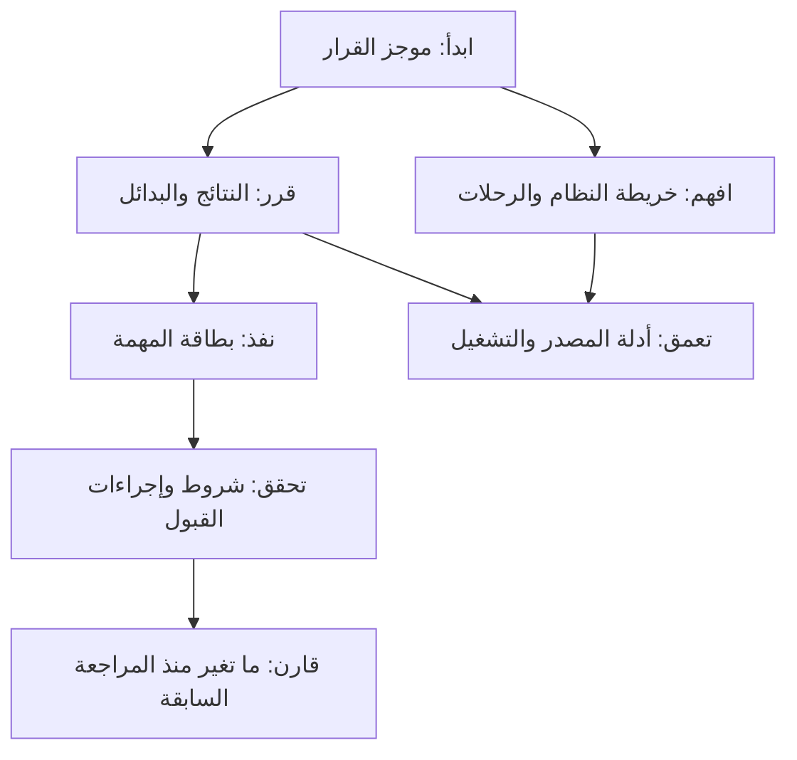

# المخرج المطلوب: ملف قرار وفهم وتنفيذ

هذه مواصفة منتج مستهدفة. كل ميزة ترتبط بسؤال المستخدم ثم بالبيانات اللازمة ثم بطريقة تقييمها. ليس كل تشغيل بحاجة إلى جميع الأقسام؛ القسم غير المنطبق يصرح بالسبب، ولا يملأ بنص إنشائي.

## من يستخدمه وما القرار الذي يتخذه؟

| المستخدم | السؤال الذي يجب أن يجيب عنه المخرج | معيار المنفعة |
|---|---|---|
| مالك المنتج/قائد الفريق | هل أصلح أم أبحث أم أترك البنية؟ وما البداية؟ | يستطيع اختيار عمل محدود بأسباب واضحة ومعرفة ما قد يغير القرار |
| مهندس يستلم المشروع | كيف تبدأ الرحلة؟ أين القاعدة؟ من يستهلكها؟ | ينتقل من وظيفة المنتج إلى الرموز والعقود والاختبارات دون إعادة اكتشاف المشروع |
| مهندس ينفذ مهمة | ما السلوك المطلوب وما حدود التعديل وكيف أتحقق؟ | بطاقة مستقلة لا تحتاج تفسيرًا شفهيًا إضافيًا في الأمور الحاسمة |
| مراجع التغيير | هل أصلحنا السبب وهل بقي السلوك المجاور؟ | مقارنة دليل قبل/بعد وتطابق النسخة المختبرة والمسلّمة |

الوضع الافتراضي: فريق تطوير صغير، مراجعة مستودع محلي، عرض عربي مع أسماء الرموز كما هي، دون افتراض نشر إنتاجي أو متطلبات أعمال غير معطاة. تكتب هذه الافتراضات في ملف run وتسمح بتعديلها صراحة.

## طبقات القراءة

### O01 — موجز قرار يصلح للقراءة السريعة

صفحة إلى صفحتين بصريًا كهدف عرض، لا ضمان يعتمد على عدد الأسطر وحده. يحتوي: هدف التشغيل، ما يفعله المنتج بلغة الأعمال، النطاق والثقة، أهم القرارات وأسبابها، ما نحتفظ به، ما نؤجله، والأسئلة التي تغير القرار. يُظهر أن «الدليل سليم» و«الخطة قابلة للتنفيذ» و«الإصلاح متحقق» و«جاهزية الإنتاج» حالات مستقلة.

يعرض مثلًا: «ابدأ بإصلاح اتساق التسعير لأن المسارين يخالفان المتطلب نفسه؛ لا تقسّم الخدمة؛ قرار التخزين المؤقت ينتظر قياسًا». لا يعرض قائمة أسماء ملفات بوصفها تفسيرًا للمنتج، ولا يجعل كل إشارة بنيوية خطرًا.

**القبول:** كل قرار مرتبط بنتيجة أو هدف مصرح؛ التفاصيل بنقرة/رابط؛ لا إخفاء لعائق حاسم بسبب حد العرض؛ قائمة كاملة متاحة إذا اختُصرت النتائج.

### O02 — هندسة عكسية تشرح لماذا يعمل النظام هكذا

ثلاثة مناظير مرتبطة: أطراف وحدود ثقة، مسؤوليات ومخازن ومزودون، ثم رحلة وظيفية من المدخل حتى الأثر والفشل والاستعادة. يوضح كل منظور مستوى التجميع؛ الملف ليس تلقائيًا مجالًا، والاستيراد ليس تلقائيًا استدعاءً وقت التشغيل.

لكل قاعدة: المتطلب ومصدره، مالكها، مواضع تطبيقها، المستهلكون والاختبارات. يميز التصميم الموثق والسلوك المشاهد والتصميم المستنتج. إذا لم يُعرف سبب قرار قديم، يكتب «السبب التاريخي غير معروف» بدل اختراع مبرر.

يشمل «أين أغير X؟» مع نطاق أثر مباشر/محتمل وما لم يتتبعه المحلل، و«ما الجيد الذي نحافظ عليه؟». دليل الانضمام يذكر أوامر معلنة ويصنفها: مقروءة/منفذة/ناجحة؛ لا يشغل سكربتًا تلقائيًا لأنه وجد في manifest.

**القبول:** الرحلات الحرجة المحددة في الهدف ممثلة، وكل علاقة مصنفة ولها دليل أو سؤال صريح. أي مسار غير محلول يبقى فجوة معرفة، وليس عيب منتج مؤكدًا.

### O03 — نتيجة هندسية تفصل المشاهدة عن الحكم

كل نتيجة تتكون من: واقعة المصدر/التشغيل، المتطلب أو القيد، السلوك المخالف، السبب الجذري ودرجة إثباته، العاقبة، الدليل المضاد، حدود الحكم، ومعنى اتخاذ إجراء أو عدمه.

ثلاث درجات منفصلة: ثقة الواقعة، وثقة السبب، وجاهزية الإجراء. مثال: تكرار اسم ثابت حقيقة، وازدواجية قاعدة واحدة استنتاج يحتاج دلالة، وضررها على المستخدم يحتاج متطلبًا أو سلوكًا. تأكيد الأولى لا يؤكد الثلاثة.

**القبول:** دورة imports أو كثرة branches أو نقص parser لا تنتج `ready_to_implement` وحدها. عيب مزروع عمدًا في fixture لا يدخل خطة إصلاح المنتج تلقائيًا؛ يظل ظاهرًا ضمن الغرض الاختباري ما لم يثبت ضرر مختلف.

### O04 — ثلاث طرق صحيحة للتصرف

- **إصلاح:** عقد مكسور مثبت، ونطاق تغيير، واختبارات قبول، ومخاطر وتوافق وتراجع.
- **تحقيق:** سؤال حاسم، وما الدليل الذي يفصل بين الخيارات، وميزانية التحقيق، ومخرج قرار. النتيجة الممكنة «لا تغيير». لا يُطلب patch لكي يكتمل التحقيق.
- **إبقاء/تأجيل مقصود:** السبب والدليل والدور المسؤول وشرط إعادة النظر. لا نمنح قبول خطر نيابة عن صاحبه؛ نفرق بين توصية الإبقاء وقبول مصرح.

**القبول:** لا تعليمات تنفيذ إلزامية في مهمة تحقيق. `LIKELY` لا يتحول تلقائيًا لإصلاح. بطاقة العمل التي تحتاج قرارًا سابقًا تُظهره قبل التعليمات، ولا تحمل حالة ready.

### O05 — بطاقة تنفيذ مكتفية بذاتها

تحتوي: النتيجة المقصودة، لماذا الآن، رمز/دالة/عقد موضع التغيير، الفرق قبل/بعد، ما يبقى ثابتًا، خطوات مخصوصة بالمشكلة، الملفات الحالية والمقترحة مع تمييزهما، أثر التغيير وحدوده، الاعتماديات وأسبابها، حالات القبول، التراجع، وتقدير بدرجة ثقة وافتراضات.

إذا لم نعرف واجهة الحل أو إجراء التحقق بعد، تكون البطاقة design_needed أو verification_needed. «أضف tests وحسّن الجودة» ليست خطوة تنفيذ كافية. لا نفترض Python tests لكل مشروع.

### O06 — قبول سلوكي يصعب الحصول عليه بصورة مضللة

كل check يربط requirement/invariant محددًا بإجراء وبيئة وملاحظة متوقعة وآلية حكم. أنواع الإجراءات: أمر argv، assertion على مخرجات منظمة، أو مراجعة بشرية ببنود حكم. غير القابل للأتمتة يبقى كذلك، ولا نستبدله بأمر صوري.

نحتفظ بالـbaseline وحالات pass/fail/blocked/not_run/inconclusive. إعادة بناء التقرير لا تغلق عيبًا. عدم ظهور claim قد ينتج من تغير ID أو parser أو نطاق البحث؛ لا يكفي كدليل إصلاح. نتحقق من نفس المعنى/الثابت وبقاء النطاق عبر النسختين. نطابق patch بالمرشح المتحقق ونكشف تعديل أو حذف الفحوص للتهرب من الفشل.

**القبول:** التنفيذ على الحالة المعيبة يفشل لسبب محدد؛ الحالة المصححة تمر؛ fixture التهرب بحذف detector أو rename لا تحصل على verified؛ فشل متطلب البيئة يعطي blocked لا healed.

### O07 — ترتيب يعكس القيمة والاعتماديات

نبدأ بالقيود الصلبة: فقد بيانات، عقد أعمال مكسور، عائق تشغيل مثبت، أو موعد مصرح. بعدها نوازن أثرًا مثبتًا ومدى انتشار وثقة وجهدًا ومخاطر تغيير. لا نحول قلة السطور إلى رخص تغيير أو كثرة العلاقات إلى أثر أعمال بلا تبرير.

نميز ثلاث علاقات: prerequisite مع سبب، resource/file conflict، وoptional sequencing. التحقيق يحجب فقط ما يعتمد على نتيجته، لا كل الإصلاحات. العمل الممكن الآن والقرار المطلوب والفرع البديل إن نُقض الافتراض ظاهرة.

**القبول:** prerequisite بين ملفين مختلفين محفوظ؛ ملف مشترك يمنع التوازي عندما السياسة تقتضي لكنه لا يُختلق كسبب وظيفي؛ التحقيق المستقل لا يؤخر إصلاحًا عاجلًا. تعرض الخطة لماذا ترتيب A قبل B قابل للتغيير.

### O08 — عرض موحد موجز دون فقد الأدلة

دossier معياري واحد يغذي Markdown وHTML وCLI واللغة العربية/الإنجليزية. لكل ادعاء موضع شرح رئيسي وروابط من بقية الصفحات. لا تلصق JSON في صفحة اتخاذ القرار. لا تستخدم أرقام الثقة الاصطلاحية كنسب احتمالية.

المهمة الواحدة لا تُظهر «تحقيق» في النص العربي و«نفّذ تغييرًا» في السجل. حدود العرض تكشف العناصر المحذوفة وتتيحها، ولا تخفي blocker. عنوان الصفحة ونتيجة الفحص يحددان هل الكلام observation أم proposed أم executed.

### O09 — سلسلة دليل وعمر واضحان

المخرج يسجل بصمة المصدر، نسخة الأداة، إعداد الاستخراج/النموذج دون أسرار، وقت الدليل، مصدره، ونطاقه. نحتاج معرفًا دائمًا للاستنتاج ومعرفًا لكل نسخة منه، وعلاقات supersedes/refutes/supports، وتغيرًا محفوظًا لقرارات البشر.

العثور على ID معروف ليس إثبات دعم الجملة. المصادقة البنيوية آلية؛ كفاية الدليل الدلالي تُراجع وتُقاس. لا يرسل النموذج أوامر تحقق إلى التنفيذ بلا سياسة تفويض صريحة.

### O10 — تقدم يمكن مقارنته دون تزوير الإغلاق

تقرير الجولة التالية يميز: أُصلح بدليل، اختفى لغياب التغطية، بقي، تغير تشخيصه، استُحدث، أو قبل خطره. يحفظ المدخل القديم بدل تعديل تاريخه. تغير الترتيب أو صياغة العنوان لا يغير هوية القضية.

### O11 — قيمة مثبتة خارج الأمثلة التي بنينا عليها الأداة

يخرج تقرير تقييم يفرق بين صحة الاستخراج، جودة التشخيص، جودة الخطة، ونجاح التنفيذ. المقارنة تشمل وكيلًا عاديًا بنفس النموذج والميزانية، لا grep فقط. حالات no-change والحالات التي يكفي فيها إصلاح محلي جزء أساسي.

### O12 — تكيّف مع هدف المستخدم

طلب onboarding ينتج أولويات فهم وتشغيل؛ طلب تشخيص عطل ينتج المسار المتأثر؛ طلب تطور ميزة يقارن سيناريوهات التغيير. نفس القاعدة المعرفية، لكن لا نحول كل هدف إلى تقرير شامل من 27 مجالًا. يظهر ما خرج من النطاق ولماذا.

## الحدود الأولى للمنتج

لا نحتاج الآن خدمة SaaS أو قاعدة graph خارجية أو محرك agents متعدد أو UI جديد. نستعمل JSON المحلي وsite الموجود. نؤجل عرضًا تفاعليًا أوسع حتى ينجح مهندس في العمل من البطاقات الحالية وتثبت جودة الأحكام.
