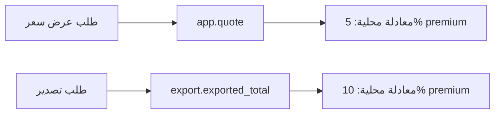
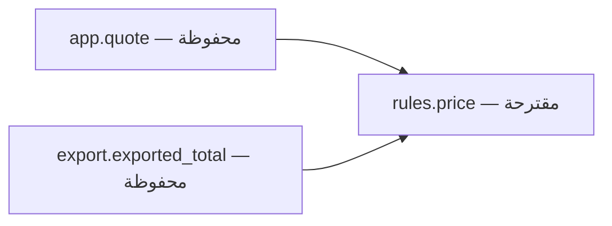

# نموذج فهم النظام في صفحة واحدة

هذا شرح للمثال الاصطناعي فقط. المعرفة الدلالية مستندة إلى README والدالتين؛ لا ندعي تاريخًا معماريًا غير مسجل.

**المسؤوليات:** app يوفّر حساب عرض السعر، export يوفّر حساب التصدير. كلاهما يستقبل amount وpremium ويعيد total. لا يوجد مخزن أو شبكة في المصدر المراجع.

**العقد الذي يجمعهما:** خصم premium نفسه، ثابت في [README](../../../examples/benchmark/coupled-billing/README.md). لا نستنتج الاشتراك من اسم الدالة وحده.

**مصدر القرار الحالي:** معادلتان داخل واجهتي الدخول. **المستهلك المعروف:** اختبار standard المرفق وواجهة كل دالة. المستهلكون خارج هذا المثال غير معروفين. **سبب الاختلاف التاريخي:** غير موثق؛ لا نحتاج اختراع سببه لإثبات الخلل الحالي.

**التغيير المقترح فقط:** كل مدخل يفوض إلى `rules.price(amount, premium=False)`؛ تبقى نقاط الدخول مفصولة.

**سيناريو التغيير:** تعديل نسبة premium لاحقًا يجب أن يغير مصدر السياسة الواحد واختبارات العقد، لا معادلتين مستقلتين. هذه خاصية مستهدفة؛ لم ننفذها بعد.

**أين أبدأ القراءة؟** المتطلب ثم app/export ثم [اختبار العقد المرجعي](check_acceptance.py). نطاق الأثر المؤكد هو المدخلان، وأي مستهلك خارجي يحتاج مراجعة توافق قبل تطبيق الفكرة خارج المثال.
