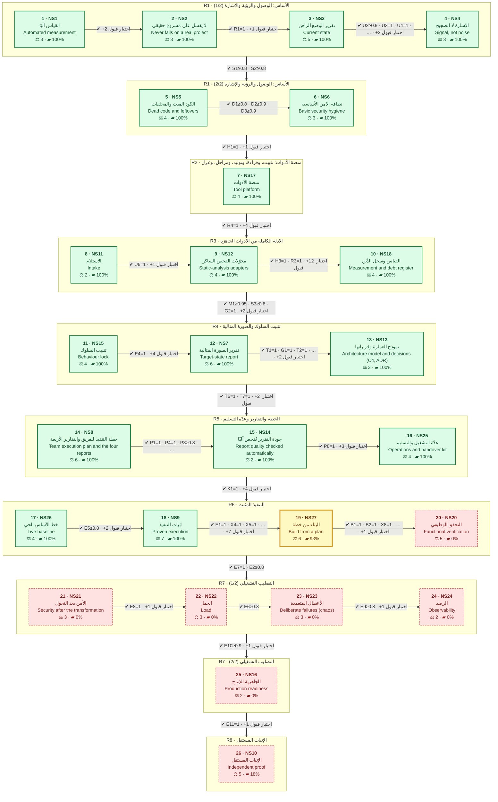
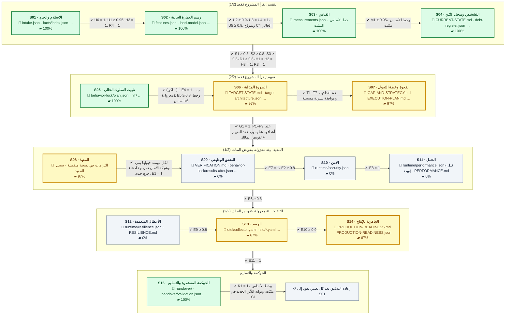

# الوجهة: EAOS يعمل عمل شركة برمجية تعيد إنتاج مشروع هواة كمنتج احترافي

> مولَّد من `docs/north-star.json` — لا تحرّره يدويًا. أعد توليده بـ`python tools/north_star.py`.

## أين نحن

### التقدم: **77.5 من 100 نقطة**

`███████████████████░░░░░░` 77.5%

| الخطوات المكتملة | الخطوة الحالية | النقاط الباقية | منها تنتظر مدخلًا منك | آخر قياس |
|---|---|---|---|---|
| 18 من 26 | 19 · NS27 البناء من خطة | 22.5 | 23 | 2026-09-28 · `0a8ea72+` |

`+`: قيس على تغييرات فوق هذا الالتزام، حُفظت في الالتزام التالي.

**كيف يُحسب:**

- لكل خطوة **وزن** بالنقاط، مجموعها 100، ومكتوب سبب كل وزن.
- **إنجاز الخطوة** = متوسط إنجاز مهامها موزونًا بحجمها (S = 1، M = 2، L = 3). المهمة المغلقة 100%. المفتوحة = تقدم مؤشراتها نحو حد بوابتها (القيمة ÷ الحد)، بسقف 90% حتى يمر أمر قبولها وتُغلق.
- **نقاط الخطوة** = الوزن × الإنجاز. **التقدم** = مجموع نقاط الخطوات من 100.
- **جودة المخرج** = متوسط (القيمة ÷ الحد) لمعايير بوابة الخطوة كما تُقاس اليوم على 3 مشاريع حقيقية.
- **بوابة الانتقال:** لا تبدأ الخطوة التالية قبل أن تتحقق كل معايير بوابة الخطوة الحالية. و`python tools/north_star.py --check` يفشل إن أُغلقت خطوة قبل سابقتها، أو سقط معيار من بوابة خطوة مغلقة.

## الخريطة: الخطوات الخمس والعشرون ومعايير الانتقال

كل صندوق خطوة: وزنها بالنقاط ونسبة إنجازها. على كل سهم بوابة الخطوة التي قبله: المعايير التي يجب أن تتحقق قبل الانتقال.



✅ مكتملة · 🟡 قيد العمل · ⬜ التالية · 🔴 تحتاج مدخلًا منك  
⚖ الوزن بالنقاط (من 100) · ▰ نسبة الإنجاز · ✔ على السهم: بوابة الانتقال، أي المعايير التي يجب أن تتحقق قبل الخطوة التالية

## جدول الخطوات

| # | الخطوة | الحزمة | الوزن | الإنجاز | النقاط | جودة المخرج | الحالة | بوابة الانتقال |
| --- | --- | --- | --- | --- | --- | --- | --- | --- |
| 1 | [**NS1** القياس آليًا: النسبة تُحسب بأمر لا باليد](#step-1) | R1 | 3 | 100% | 3 | — | ✅ مكتملة | +2 اختبار قبول |
| 2 | [**NS2** لا يفشل على مشروع حقيقي](#step-2) | R1 | 3 | 100% | 3 | 100% | ✅ مكتملة | R1=1 · +1 اختبار قبول |
| 3 | [**NS3** تقرير الوضع الراهن: رؤية البرنامج كله](#step-3) | R1 | 5 | 100% | 5 | 100% | ✅ مكتملة | U2≥0.9 · U3=1 · U4=1 · U5≥0.8 · +2 اختبار قبول |
| 4 | [**NS4** الإشارة لا الضجيج](#step-4) | R1 | 3 | 100% | 3 | 100% | ✅ مكتملة | S1≥0.8 · S2≥0.8 |
| 5 | [**NS5** الكود الميت والمخلفات: كشف وحذف آمن](#step-5) | R1 | 4 | 100% | 4 | 100% | ✅ مكتملة | D1≥0.8 · D2≥0.9 · D3≥0.9 |
| 6 | [**NS6** نظافة الأمن الأساسية](#step-6) | R1 | 3 | 100% | 3 | 100% | ✅ مكتملة | H1=1 · +1 اختبار قبول |
| 7 | [**NS17** منصة الأدوات: كل أداة تدخل بطريقة واحدة](#step-7) | R2 | 4 | 100% | 4 | 100% | ✅ مكتملة | R4=1 · +4 اختبار قبول |
| 8 | [**NS11** الاستلام: ماذا يجب أن يُحمى، وإلى أين](#step-8) | R3 | 2 | 100% | 2 | 100% | ✅ مكتملة | U6=1 · +1 اختبار قبول |
| 9 | [**NS12** محوّلات الفحص الساكن: أدوات جاهزة بدل كود نكتبه](#step-9) | R3 | 4 | 100% | 4 | 100% | ✅ مكتملة | H3=1 · R3=1 · +12 اختبار قبول |
| 10 | [**NS18** القياس وسجل الدَّين: الأرقام لكل ملف، والخطر حين تجتمع الأدلة](#step-10) | R3 | 4 | 100% | 4 | 100% | ✅ مكتملة | M1≥0.95 · S3≥0.8 · G2=1 · +2 اختبار قبول |
| 11 | [**NS15** تثبيت السلوك: المواصفات قبل أي تغيير (ساكن)](#step-11) | R4 | 4 | 100% | 4 | 100% | ✅ مكتملة | E4=1 · +4 اختبار قبول |
| 12 | [**NS7** تقرير الصورة المثالية](#step-12) | R4 | 6 | 100% | 6 | 100% | ✅ مكتملة | T1=1 · G1=1 · T2=1 · T4=1 · T5=1 · +2 اختبار قبول |
| 13 | [**NS13** نموذج العمارة وقراراتها](#step-13) | R4 | 3 | 100% | 3 | 100% | ✅ مكتملة | T6=1 · T7=1 · +2 اختبار قبول |
| 14 | [**NS8** خطة التنفيذ للفريق والتقارير الأربعة](#step-14) | R5 | 6 | 100% | 6 | 100% | ✅ مكتملة | P1=1 · P4=1 · P3≥0.8 · P6=1 · P7=1 · P9≥0.8 |
| 15 | [**NS14** جودة التقرير تُفحص آليًا](#step-15) | R5 | 2 | 100% | 2 | 100% | ✅ مكتملة | P8=1 · +3 اختبار قبول |
| 16 | [**NS25** عدّة التشغيل والتسليم: ملفات بصيغ الأدوات تعمل كما هي](#step-16) | R5 | 4 | 100% | 4 | 100% | ✅ مكتملة | K1=1 · +4 اختبار قبول |
| 17 | [**NS26** خط الأساس الحي: السلوك والأرقام قبل أي تغيير](#step-17) | R6 | 4 | 100% | 4 | 100% | ✅ مكتملة | E5≥0.8 · +2 اختبار قبول |
| 18 | [**NS9** إثبات التنفيذ](#step-18) | R6 | 7 | 100% | 7 | 100% | ✅ مكتملة | E1=1 · X4=1 · X5=1 · X2=1 · X1=1 · X6≥0.9 · … · +7 اختبار قبول |
| 19 | [**NS27** البناء من خطة](#step-19) | R6 | 6 | 93% | 5.6 | 88% | 🟡 قيد العمل | B1=1 · B2=1 · X8=1 · B3=1 · B4=1 · X1=1 · … · +1 اختبار قبول |
| 20 | [**NS20** التحقق الوظيفي: الوظائف نفسها باقية، والتنبؤ حدث](#step-20) | R6 | 5 | 0% | 0 | 0% | 🔴 تحتاج مدخلًا منك | E7=1 · E2≥0.8 |
| 21 | [**NS21** الأمن بعد التحول: ساكنًا وحيًا](#step-21) | R7 | 3 | 0% | 0 | 0% | 🔴 تحتاج مدخلًا منك | E8=1 · +1 اختبار قبول |
| 22 | [**NS22** الحمل: قبل وبعد بالشروط نفسها](#step-22) | R7 | 3 | 0% | 0 | 0% | 🔴 تحتاج مدخلًا منك | E6≥0.8 |
| 23 | [**NS23** الأعطال المتعمدة: ماذا يحدث حين يسقط ما نعتمد عليه](#step-23) | R7 | 3 | 0% | 0 | 0% | 🔴 تحتاج مدخلًا منك | E9≥0.8 · +1 اختبار قبول |
| 24 | [**NS24** الرصد: كل سطح حرج مرئي](#step-24) | R7 | 2 | 0% | 0 | 0% | 🔴 تحتاج مدخلًا منك | E10≥0.9 · +1 اختبار قبول |
| 25 | [**NS16** الجاهزية للإنتاج: كل بند بأمر](#step-25) | R7 | 2 | 0% | 0 | 0% | 🔴 تحتاج مدخلًا منك | E11=1 · +1 اختبار قبول |
| 26 | [**NS10** الإثبات المستقل](#step-26) | R8 | 5 | 18% | 0.9 | 15% | 🔴 تحتاج مدخلًا منك | V4=1 · V3=1 |
| | **المجموع** | | **100** | | **77.5** | | | |

## الخطوات بالتفصيل

<a id="step-1"></a>

### الخطوة 1 · NS1 — القياس آليًا: النسبة تُحسب بأمر لا باليد ✅ مكتملة

| الوزن | الإنجاز | النقاط | جودة المخرج | الحزمة | مراحل خط الإنتاج |
| --- | --- | --- | --- | --- | --- |
| 3 | 100% | 3 من 3 | — | R1 | — |

**الهدف:** كل مؤشر قابل للأتمتة يُحسب من تقارير العيّنة بأمر واحد، ويُرفض أي تراجع.

**لماذا هذا الوزن:** أساس القياس: بدونه لا رقم يُصدَّق، لكنه صغير الحجم.

**ماذا تفعل:**

1. يجلب عيّنة المشاريع الحقيقية مثبّتة بالتزامها
2. يحسب كل مؤشر آليًا من تقارير العيّنة بأمر واحد
3. يرفض أي تراجع عن أفضل قيمة وصلها مؤشر

**الأدوات:** north_star.py measure · git

**المخرج:** `docs/north-star.json` · `docs/NORTH-STAR.md` · `docs/north-star-high-water.json`

**بوابة الانتقال إلى الخطوة التالية** (تتحقق كلها، وإلا لا انتقال):

| المعيار | الشرط | اليوم | الحال |
| --- | --- | --- | --- |
| استدعاء العيوب المعروفة | `D1` مقيس | 1.0 | ✅ |
| دقة مرشحات الكود الميت | `S2` مقيس | 1.0 | ✅ |

**المهام:**

| المهمة | الحجم | الحالة | الإنجاز | أمر القبول |
| --- | --- | --- | --- | --- |
| [NS1.T1](#ns1t1) جلب العيّنة المثبّتة | M | ✅ | 100% | `python tools/north_star.py fetch && test -d "${EAOS_CORPUS:-/tmp/eaos-corpus}/finance-os-a0192b7b/.git"` |
| [NS1.T2](#ns1t2) قياس المؤشرات الآلية من التقارير | M | ✅ | 100% | `python tools/north_star.py measure && python tools/north_star.py --check` |
| [NS1.T3](#ns1t3) قياس الكود الميت على الحقيقة الأرضية الذاتية | M | ✅ | 100% | `python tools/north_star.py measure --only D1 && python tools/north_star.py measure --only S2` |
| [NS1.T4](#ns1t4) حد أعلى لا يتراجع | M | ✅ | 100% | `python tools/north_star.py measure && python tools/north_star.py --no-regression` |

<a id="step-2"></a>

### الخطوة 2 · NS2 — لا يفشل على مشروع حقيقي ✅ مكتملة

| الوزن | الإنجاز | النقاط | جودة المخرج | الحزمة | مراحل خط الإنتاج |
| --- | --- | --- | --- | --- | --- |
| 3 | 100% | 3 من 3 | 100% | R1 | S01 |

**الهدف:** R1 = 1.0: كل تدقيق على العيّنة يكتمل.

**لماذا هذا الوزن:** شرط دخول: الأداة التي تفشل على مشروع حقيقي لا تنفع، والإصلاح محدود.

**ماذا تفعل:**

1. يكمل التدقيق على كل مشروع في العيّنة دون انهيار
2. يقص الوثائق إلى ميزانيتها بدل أن يفشل

**الأدوات:** eaos audit

**المخرج:** `RUN.md` · `dossier.json`

**بوابة الانتقال إلى الخطوة التالية** (تتحقق كلها، وإلا لا انتقال):

| المعيار | الشرط | اليوم | الحال |
| --- | --- | --- | --- |
| تدقيقات العيّنة المكتملة بلا فشل | `R1 = 1` | 1.0 | ✅ |
| اختبار قبول | `unittest tests.test_completion_regressions` | — | ✅ |

**المهام:**

| المهمة | الحجم | الحالة | الإنجاز | أمر القبول |
| --- | --- | --- | --- | --- |
| [NS2.T1](#ns2t1) الوثائق تُقصّ إلى ميزانيتها بدل مخالفتها | M | ✅ | 100% | `python tools/north_star.py measure --only R1 --min 1.0` |
| [NS2.T2](#ns2t2) شجرة بلا ملف مصدر ليست تدقيقًا مكتملًا | M | ✅ | 100% | `python -m unittest tests.test_completion_regressions -q` |

<a id="step-3"></a>

### الخطوة 3 · NS3 — تقرير الوضع الراهن: رؤية البرنامج كله ✅ مكتملة

| الوزن | الإنجاز | النقاط | جودة المخرج | الحزمة | مراحل خط الإنتاج |
| --- | --- | --- | --- | --- | --- |
| 5 | 100% | 5 من 5 | 100% | R1 | S02 |

**الهدف:** U2 ≥ 0.9 و U3 = 1.0 و U4 = 1.0 و U5 ≥ 0.8 على العيّنة.

**لماذا هذا الوزن:** أول التقارير الأربعة وأساس كل ما بعده: الوظائف والمداخل والبيانات.

**ماذا تفعل:**

1. يجد كل صفحة ومسار ودالة خادم كنقطة دخول
2. يقرأ نموذج البيانات وسياسات الوصول من SQL وSupabase
3. يجرد الوظائف ويحدد مداخل كل سطح ومخارجه وحدوده

**الأدوات:** حقائق EAOS (tree-sitter) · GitNexus · CodeGraph · dependency-cruiser

**المخرج:** `features.json` · `FEATURES.md` · `load-model.json` · `SYSTEM-MAP.md`

**بوابة الانتقال إلى الخطوة التالية** (تتحقق كلها، وإلا لا انتقال):

| المعيار | الشرط | اليوم | الحال |
| --- | --- | --- | --- |
| أسطح المستخدم المكتشفة | `U2 ≥ 0.9` | 1.0 | ✅ |
| نموذج البيانات مقروء | `U3 = 1` | 1.0 | ✅ |
| جرد الوظائف | `U4 = 1` | 1.0 | ✅ |
| المداخل والمخارج والحدود | `U5 ≥ 0.8` | 0.918 | ✅ |
| اختبار قبول | `facts data_access` | — | ✅ |
| اختبار قبول | `contract features` | — | ✅ |

**المهام:**

| المهمة | الحجم | الحالة | الإنجاز | أمر القبول |
| --- | --- | --- | --- | --- |
| [NS3.T1](#ns3t1) المسارات والصفحات كنقاط دخول | M | ✅ | 100% | `python tools/north_star.py measure --only U2 --min 0.9` |
| [NS3.T2](#ns3t2) Supabase كطبقة وصول للبيانات | S | ✅ | 100% | `python tools/north_star.py measure --only U3 && python tools/acceptance.py facts data_access finance-os-a0192b7b --min 86 && python tools/acceptance.py facts data_access FleetManageWeb --min 18` |
| [NS3.T3](#ns3t3) قراءة نموذج البيانات من SQL | M | ✅ | 100% | `python tools/north_star.py measure --only U3 --min 1.0` |
| [NS3.T4](#ns3t4) جرد الوظائف | M | ✅ | 100% | `python tools/north_star.py measure --only U4 --min 1.0 && python tools/acceptance.py contract features` |
| [NS3.T5](#ns3t5) المداخل والمخارج والحدود على أسطح المستخدم | M | ✅ | 100% | `python tools/north_star.py measure --only U5 --min 0.8` |

<a id="step-4"></a>

### الخطوة 4 · NS4 — الإشارة لا الضجيج ✅ مكتملة

| الوزن | الإنجاز | النقاط | جودة المخرج | الحزمة | مراحل خط الإنتاج |
| --- | --- | --- | --- | --- | --- |
| 3 | 100% | 3 من 3 | 100% | R1 | S04 |

**الهدف:** S1 ≥ 0.8 و S2 ≥ 0.8.

**لماذا هذا الوزن:** يمنع الضجيج من إغراق الخطة؛ عمل مركّز.

**ماذا تفعل:**

1. يستبعد التشابه الشكلي الذي ليس قاعدة أعمال
2. لا يتهم ملفًا بالموت إن أشار إليه سجل

**الأدوات:** jscpd · reforge · Semgrep

**المخرج:** `dossier.json (claims)`

**بوابة الانتقال إلى الخطوة التالية** (تتحقق كلها، وإلا لا انتقال):

| المعيار | الشرط | اليوم | الحال |
| --- | --- | --- | --- |
| الادعاءات غير الضجيجية | `S1 ≥ 0.8` | 0.883 | ✅ |
| دقة مرشحات الكود الميت | `S2 ≥ 0.8` | 1.0 | ✅ |

**المهام:**

| المهمة | الحجم | الحالة | الإنجاز | أمر القبول |
| --- | --- | --- | --- | --- |
| [NS4.T1](#ns4t1) تشابه مكوّنات الواجهة ليس قاعدة أعمال | M | ✅ | 100% | `python tools/north_star.py measure --only S1 --min 0.8` |
| [NS4.T2](#ns4t2) المرشح الميت لا يُتهم إن أشار إليه سجل | M | ✅ | 100% | `python tools/north_star.py measure --only S2 --min 0.8 && python tools/north_star.py --no-regression` |

<a id="step-5"></a>

### الخطوة 5 · NS5 — الكود الميت والمخلفات: كشف وحذف آمن ✅ مكتملة

| الوزن | الإنجاز | النقاط | جودة المخرج | الحزمة | مراحل خط الإنتاج |
| --- | --- | --- | --- | --- | --- |
| 4 | 100% | 4 من 4 | 100% | R1 | S04 |

**الهدف:** D1 ≥ 0.8 و D2 ≥ 0.9 و D3 ≥ 0.9.

**لماذا هذا الوزن:** قيمة مباشرة للمالك: حذف آمن للكود الميت والمعطّل.

**ماذا تفعل:**

1. يحسب قابلية الوصول من نقاط الدخول الحقيقية
2. يكشف الأسماء غير المعرّفة والمفاتيح المكررة
3. يجد مخلفات الهواة ويكتب لكل منها بطاقة حذف جاهزة

**الأدوات:** حقائق EAOS · CodeGraph · reforge

**المخرج:** `DEAD-CODE.md` · `plan.json (remove_dead)`

**بوابة الانتقال إلى الخطوة التالية** (تتحقق كلها، وإلا لا انتقال):

| المعيار | الشرط | اليوم | الحال |
| --- | --- | --- | --- |
| استدعاء العيوب المعروفة | `D1 ≥ 0.8` | 1.0 | ✅ |
| المخلفات المكتشفة | `D2 ≥ 0.9` | 1.0 | ✅ |
| بطاقات حذف آمن جاهزة | `D3 ≥ 0.9` | 1.0 | ✅ |

**المهام:**

| المهمة | الحجم | الحالة | الإنجاز | أمر القبول |
| --- | --- | --- | --- | --- |
| [NS5.T1](#ns5t1) قابلية الوصول من نقاط الدخول الحقيقية | L | ✅ | 100% | `python tools/north_star.py measure --only D1 --min 0.8` |
| [NS5.T2](#ns5t2) الكود المعطّل: أسماء غير معرّفة ومفاتيح مكررة | M | ✅ | 100% | `python tools/north_star.py measure --only D1 --min 0.8` |
| [NS5.T3](#ns5t3) مخلفات الهواة | M | ✅ | 100% | `python tools/north_star.py measure --only D2 --min 0.9` |
| [NS5.T4](#ns5t4) بطاقة حذف آمن جاهزة | S | ✅ | 100% | `python tools/north_star.py measure --only D3 --min 0.9` |

<a id="step-6"></a>

### الخطوة 6 · NS6 — نظافة الأمن الأساسية ✅ مكتملة

| الوزن | الإنجاز | النقاط | جودة المخرج | الحزمة | مراحل خط الإنتاج |
| --- | --- | --- | --- | --- | --- |
| 3 | 100% | 3 من 3 | 100% | R1 | S04 |

**الهدف:** H1 = 1.0 و H2 = 1.0.

**لماذا هذا الوزن:** أمن أساسي: أسرار مرفوعة وسياسات وصول.

**ماذا تفعل:**

1. يجد الأسرار المرفوعة بخطورتها الصحيحة
2. يتحقق من تغطية سياسات الوصول لكل جدول

**الأدوات:** Trivy · Semgrep · حقائق Supabase

**المخرج:** `SECURITY-SURFACE.md`

**بوابة الانتقال إلى الخطوة التالية** (تتحقق كلها، وإلا لا انتقال):

| المعيار | الشرط | اليوم | الحال |
| --- | --- | --- | --- |
| مواد الاعتماد المرفوعة بخطورتها الصحيحة | `H1 = 1` | 1.0 | ✅ |
| اختبار قبول | `unittest tests.test_access_gaps` | — | ✅ |

**المهام:**

| المهمة | الحجم | الحالة | الإنجاز | أمر القبول |
| --- | --- | --- | --- | --- |
| [NS6.T1](#ns6t1) الأسرار المرفوعة | M | ✅ | 100% | `python tools/north_star.py measure --only H1 --min 1.0` |
| [NS6.T2](#ns6t2) تغطية سياسات الوصول | M | ✅ | 100% | `python -m unittest tests.test_access_gaps -q` |

<a id="step-7"></a>

### الخطوة 7 · NS17 — منصة الأدوات: كل أداة تدخل بطريقة واحدة ✅ مكتملة

| الوزن | الإنجاز | النقاط | جودة المخرج | الحزمة | مراحل خط الإنتاج |
| --- | --- | --- | --- | --- | --- |
| 4 | 100% | 4 من 4 | 100% | R2 | — |

**الهدف:** R4 = 1، وقارئ SARIF، وإطار التوليد، والمراحل كبيانات، والبيئة المعزولة مختبرة.

**لماذا هذا الوزن:** منصة كل الأدوات: تثبيت موحد، وقراءة SARIF، وتوليد، وبوابات، وعزل.

**ماذا تفعل:**

1. يثبّت كل أداة بإصدارها المثبّت وبصمتها بأمر واحد
2. يقرأ نتائج ست أدوات بقارئ SARIF واحد
3. يولّد ملفات بصيغ الأدوات وتحكم عليها الأداة نفسها
4. يعرّف المراحل الخمس عشرة كبيانات ببوابة لكل منها
5. يشغّل كود المشروع في بيئة معزولة بتفويض وبلا أسرار

**الأدوات:** eaos tools · eaos emit · eaos engage · upstreams/toolchain.json

**المخرج:** `tools-doctor.json` · `handover-validation.json` · `authorization.json`

**بوابة الانتقال إلى الخطوة التالية** (تتحقق كلها، وإلا لا انتقال):

| المعيار | الشرط | اليوم | الحال |
| --- | --- | --- | --- |
| الأدوات المعتمدة مثبّتة بإصداراتها | `R4 = 1` | 1.0 | ✅ |
| اختبار قبول | `test ns17_t2_sarif` | — | ✅ |
| اختبار قبول | `test ns17_t3_emit` | — | ✅ |
| اختبار قبول | `test ns17_t4_engage` | — | ✅ |
| اختبار قبول | `test ns17_t5_sandbox` | — | ✅ |

**المهام:**

| المهمة | الحجم | الحالة | الإنجاز | أمر القبول |
| --- | --- | --- | --- | --- |
| [NS17.T1](#ns17t1) سجل الأدوات ومثبّتها: أمر واحد يثبّت كل أداة بإصدارها | M | ✅ | 100% | `python -m eaos tools install --stage assessment && python tools/north_star.py measure --only R4 --min 1.0` |
| [NS17.T2](#ns17t2) قارئ SARIF واحد لست أدوات | S | ✅ | 100% | `python tools/acceptance.py test ns17_t2_sarif` |
| [NS17.T3](#ns17t3) التوليد بصيغ الأدوات الأصلية، والأداة نفسها هي المدقق | M | ✅ | 100% | `python tools/acceptance.py test ns17_t3_emit` |
| [NS17.T4](#ns17t4) المراحل الخمس عشرة كبيانات، وبوابة كل مرحلة بأمر | M | ✅ | 100% | `python tools/acceptance.py test ns17_t4_engage` |
| [NS17.T5](#ns17t5) البيئة المعزولة: تشغيل كود المشروع بتفويض وبلا أسرار | M | ✅ | 100% | `python tools/acceptance.py test ns17_t5_sandbox` |

<a id="step-8"></a>

### الخطوة 8 · NS11 — الاستلام: ماذا يجب أن يُحمى، وإلى أين ✅ مكتملة

| الوزن | الإنجاز | النقاط | جودة المخرج | الحزمة | مراحل خط الإنتاج |
| --- | --- | --- | --- | --- | --- |
| 2 | 100% | 2 من 2 | 100% | R3 | S01 |

**الهدف:** U6 = 1.0.

**لماذا هذا الوزن:** استبيان قصير يحدد ما يجب حمايته وإلى أين.

**ماذا تفعل:**

1. يسأل المالك أسئلة الاستلام بقيم افتراضية معلنة
2. يحوّل الإجابات إلى سيناريوهات جودة قابلة للقياس

**الأدوات:** eaos audit --intake

**المخرج:** `intake.json`

**بوابة الانتقال إلى الخطوة التالية** (تتحقق كلها، وإلا لا انتقال):

| المعيار | الشرط | اليوم | الحال |
| --- | --- | --- | --- |
| الاستلام | `U6 = 1` | 1.0 | ✅ |
| اختبار قبول | `contract intake` | — | ✅ |

**المهام:**

| المهمة | الحجم | الحالة | الإنجاز | أمر القبول |
| --- | --- | --- | --- | --- |
| [NS11.T1](#ns11t1) استبيان الاستلام بقيم افتراضية معلنة | M | ✅ | 100% | `python tools/north_star.py measure --only U6 --min 1.0 && python tools/acceptance.py contract intake` |
| [NS11.T2](#ns11t2) سيناريوهات الجودة من الاستلام | S | ✅ | 100% | `python tools/north_star.py measure --only U6 && python tools/acceptance.py contract intake --where "any(s['kind'] == 'load' for s in data['scenarios'])"` |

<a id="step-9"></a>

### الخطوة 9 · NS12 — محوّلات الفحص الساكن: أدوات جاهزة بدل كود نكتبه ✅ مكتملة

| الوزن | الإنجاز | النقاط | جودة المخرج | الحزمة | مراحل خط الإنتاج |
| --- | --- | --- | --- | --- | --- |
| 4 | 100% | 4 من 4 | 100% | R3 | S01, S04 |

**الهدف:** R3 = 1.0 و H3 = 1.0.

**لماذا هذا الوزن:** عشرة محوّلات لأدوات جاهزة بدل كود نكتبه: أدلة مستقلة.

**ماذا تفعل:**

1. يبني قائمة الاعتماديات وثغراتها
2. يشغّل Semgrep وTrivy وCheckov وSQLFluff وSpectral وoasdiff
3. يرسم حدود JS/TS بقواعد dependency-cruiser
4. يضيف GitNexus شاهدًا ثالثًا لنطاق الأثر

**الأدوات:** Syft · OSV-Scanner · scc · Semgrep · Trivy · Checkov · dependency-cruiser · SQLFluff · Spectral · oasdiff · GitNexus

**المخرج:** `sbom.cdx.json` · `facts/external.json`

**بوابة الانتقال إلى الخطوة التالية** (تتحقق كلها، وإلا لا انتقال):

| المعيار | الشرط | اليوم | الحال |
| --- | --- | --- | --- |
| سلسلة الإمداد | `H3 = 1` | 1.0 | ✅ |
| محوّلات الفحص الساكن تعمل | `R3 = 1` | 1.0 | ✅ |
| اختبار قبول | `adapter syft` | — | ✅ |
| اختبار قبول | `adapter osv-scanner` | — | ✅ |
| اختبار قبول | `contract sbom` | — | ✅ |
| اختبار قبول | `adapter scc` | — | ✅ |
| اختبار قبول | `adapter semgrep` | — | ✅ |
| اختبار قبول | `adapter trivy` | — | ✅ |
| اختبار قبول | `adapter checkov` | — | ✅ |
| اختبار قبول | `adapter dependency-cruiser` | — | ✅ |
| اختبار قبول | `adapter sqlfluff` | — | ✅ |
| اختبار قبول | `adapter spectral` | — | ✅ |
| اختبار قبول | `adapter oasdiff` | — | ✅ |
| اختبار قبول | `adapter gitnexus` | — | ✅ |

**المهام:**

| المهمة | الحجم | الحالة | الإنجاز | أمر القبول |
| --- | --- | --- | --- | --- |
| [NS12.T1](#ns12t1) Syft و OSV-Scanner: قائمة الاعتماديات وثغراتها | M | ✅ | 100% | `python tools/north_star.py measure --only H3 --min 1.0 && python tools/acceptance.py adapter syft && python tools/acceptance.py adapter osv-scanner && python tools/acceptance.py contract sbom` |
| [NS12.T2](#ns12t2) scc: الحجم واللغات | S | ✅ | 100% | `python tools/north_star.py measure --only R3 && python tools/acceptance.py adapter scc` |
| [NS12.T3](#ns12t3) Semgrep بقواعد EAOS | M | ✅ | 100% | `python tools/north_star.py measure --only R3 && python tools/acceptance.py adapter semgrep` |
| [NS12.T4](#ns12t4) Trivy: الأسرار وIaC وDocker | S | ✅ | 100% | `python tools/north_star.py measure --only R3 && python tools/acceptance.py adapter trivy` |
| [NS12.T5](#ns12t5) Checkov: GitHub Actions وIaC | S | ✅ | 100% | `python tools/north_star.py measure --only R3 && python tools/acceptance.py adapter checkov` |
| [NS12.T6](#ns12t6) dependency-cruiser: الحدود كقواعد لـJS/TS | S | ✅ | 100% | `python tools/north_star.py measure --only R3 && python tools/acceptance.py adapter dependency-cruiser` |
| [NS12.T7](#ns12t7) SQLFluff: جودة SQL والهجرات | S | ✅ | 100% | `python tools/north_star.py measure --only R3 && python tools/acceptance.py adapter sqlfluff` |
| [NS12.T8](#ns12t8) Spectral و oasdiff عند وجود OpenAPI | S | ✅ | 100% | `python tools/north_star.py measure --only R3 && python tools/acceptance.py adapter spectral && python tools/acceptance.py adapter oasdiff` |
| [NS12.T10](#ns12t10) GitNexus: رسم المعرفة ونطاق الأثر كشاهد ثالث | M | ✅ | 100% | `python tools/north_star.py measure --only R3 && python tools/acceptance.py adapter gitnexus` |
| [NS12.T9](#ns12t9) كل المحوّلات المنطبقة تعمل على العيّنة | S | ✅ | 100% | `python tools/north_star.py measure --only R3 --min 1.0` |

<a id="step-10"></a>

### الخطوة 10 · NS18 — القياس وسجل الدَّين: الأرقام لكل ملف، والخطر حين تجتمع الأدلة ✅ مكتملة

| الوزن | الإنجاز | النقاط | جودة المخرج | الحزمة | مراحل خط الإنتاج |
| --- | --- | --- | --- | --- | --- |
| 4 | 100% | 4 من 4 | 100% | R3 | S03, S04 |

**الهدف:** M1 ≥ 0.95 و S3 ≥ 0.8 و G2 = 1.0.

**لماذا هذا الوزن:** الأرقام لكل ملف وسجل دَين واحد يجمع الأدلة.

**ماذا تفعل:**

1. يقيس الحجم والتعقيد والتقلّب والاعتمادية لكل ملف
2. يسجل كل خطر عالٍ بشاهدين مستقلين
3. يكشف العمل المكرر في TypeScript وJavaScript

**الأدوات:** scc · reforge · CodeGraph · jscpd · git

**المخرج:** `measurements.json` · `MEASUREMENTS.md` · `debt-register.json` · `RISK-REGISTER.md`

**بوابة الانتقال إلى الخطوة التالية** (تتحقق كلها، وإلا لا انتقال):

| المعيار | الشرط | اليوم | الحال |
| --- | --- | --- | --- |
| القياس لكل ملف مصدر | `M1 ≥ 0.95` | 1.0 | ✅ |
| الخطر العالي مؤكد بشاهدين | `S3 ≥ 0.8` | 1.0 | ✅ |
| مؤشرات الاستدامة المقيسة | `G2 = 1` | 1.0 | ✅ |
| اختبار قبول | `contract measurements` | — | ✅ |
| اختبار قبول | `contract debt-register` | — | ✅ |

**المهام:**

| المهمة | الحجم | الحالة | الإنجاز | أمر القبول |
| --- | --- | --- | --- | --- |
| [NS18.T1](#ns18t1) جدول القياس لكل ملف | M | ✅ | 100% | `python tools/north_star.py measure --only M1 --min 0.95 && python tools/acceptance.py contract measurements` |
| [NS18.T2](#ns18t2) سجل الدَّين التقني: كل خطر عالٍ بشاهدين | M | ✅ | 100% | `python tools/north_star.py measure --only S3 --min 0.8 && python tools/acceptance.py contract debt-register` |
| [NS18.T3](#ns18t3) كشف العمل المكرر في TypeScript و JavaScript | M | ✅ | 100% | `python tools/north_star.py measure --only G2 --min 1.0` |

<a id="step-11"></a>

### الخطوة 11 · NS15 — تثبيت السلوك: المواصفات قبل أي تغيير (ساكن) ✅ مكتملة

| الوزن | الإنجاز | النقاط | جودة المخرج | الحزمة | مراحل خط الإنتاج |
| --- | --- | --- | --- | --- | --- |
| 4 | 100% | 4 من 4 | 100% | R4 | S05 |

**الهدف:** E4 = 1، ومواصفات الحمل والأعطال والفحص الحي مولّدة ومقبولة من أدواتها.

**لماذا هذا الوزن:** شبكة الأمان قبل أي تغيير: لا تحول بدونها.

**ماذا تفعل:**

1. يكتب مواصفة سلوك لكل ميزة
2. يولّد سيناريوهات الحمل والأعطال والفحص الحي بصيغ أدواتها

**الأدوات:** Playwright · Schemathesis · k6 · Toxiproxy · OWASP ZAP

**المخرج:** `behavior-lock/plan.json` · `nfr/k6/` · `nfr/toxiproxy.json` · `nfr/zap.yaml`

**بوابة الانتقال إلى الخطوة التالية** (تتحقق كلها، وإلا لا انتقال):

| المعيار | الشرط | اليوم | الحال |
| --- | --- | --- | --- |
| مواصفات تثبيت السلوك | `E4 = 1` | 1.0 | ✅ |
| اختبار قبول | `contract behavior-lock-plan` | — | ✅ |
| عدّة التشغيل والتسليم تقبلها أدواتها | `K1` مقيس | 1.0 | ✅ |
| اختبار قبول | `emitted nfr/k6/` | — | ✅ |
| اختبار قبول | `contract nfr-experiments` | — | ✅ |

**المهام:**

| المهمة | الحجم | الحالة | الإنجاز | أمر القبول |
| --- | --- | --- | --- | --- |
| [NS15.T1](#ns15t1) توليد مواصفات تثبيت السلوك | L | ✅ | 100% | `python tools/north_star.py measure --only E4 --min 1.0 && python tools/acceptance.py contract behavior-lock-plan` |
| [NS15.T2](#ns15t2) مواصفات الحمل والأعطال والفحص الحي (ساكنة) | M | ✅ | 100% | `python tools/north_star.py measure --only K1 && python tools/acceptance.py emitted nfr/k6/ nfr/toxiproxy.json nfr/zap.yaml && python tools/acceptance.py contract nfr-experiments` |

<a id="step-12"></a>

### الخطوة 12 · NS7 — تقرير الصورة المثالية ✅ مكتملة

| الوزن | الإنجاز | النقاط | جودة المخرج | الحزمة | مراحل خط الإنتاج |
| --- | --- | --- | --- | --- | --- |
| 6 | 100% | 6 من 6 | 100% | R4 | S06 |

**الهدف:** T1 = 1.0 و T2 = 1.0 و T3 ≥ 0.6 و T4 = 1.0 و T5 = 1.0 و G1 = 1.0.

**لماذا هذا الوزن:** قلب الوعد: الصورة المثالية بالوظائف نفسها وقرار لكل مكوّن.

**ماذا تفعل:**

1. يختار المعمارية المرجعية من سبع بحسب ملفات المشروع
2. يضع كل ملف في مكوّن مستهدف ويقرر قرارات البنية التحتية
3. يقرر لكل مكوّن: إعادة استخدام أو هيكلة أو إعادة بناء أو حذف، بدليله
4. يثبت أن كل وظيفة لها مكان في الصورة المثالية

**الأدوات:** eaos/rules/reference-architectures.json · eaos/rules/disposition-rules.json

**المخرج:** `target-architecture.json` · `TARGET-STATE.md`

**بوابة الانتقال إلى الخطوة التالية** (تتحقق كلها، وإلا لا انتقال):

| المعيار | الشرط | اليوم | الحال |
| --- | --- | --- | --- |
| مكوّنات مستهدفة ملموسة | `T1 = 1` | 1.0 | ✅ |
| فجوة مربوطة بالمكوّنات المستهدفة | `G1 = 1` | 1.0 | ✅ |
| قرارات البنية التحتية | `T2 = 1` | 1.0 | ✅ |
| قرار لكل مكوّن حالي | `T4 = 1` | 1.0 | ✅ |
| الوظائف نفسها في الصورة المثالية | `T5 = 1` | 1.0 | ✅ |
| اختبار قبول | `test ns7_t1_reference` | — | ✅ |
| اختبار قبول | `contract features` | — | ✅ |

**المهام:**

| المهمة | الحجم | الحالة | الإنجاز | أمر القبول |
| --- | --- | --- | --- | --- |
| [NS7.T1](#ns7t1) كتالوج بنى مرجعية لكل نوع مشروع | M | ✅ | 100% | `python tools/acceptance.py test ns7_t1_reference` |
| [NS7.T2](#ns7t2) إسقاط المشروع على البنية المرجعية | L | ✅ | 100% | `python tools/north_star.py measure --only T1 --min 1.0 && python tools/north_star.py measure --only G1 --min 1.0` |
| [NS7.T3](#ns7t3) قرارات البنية التحتية | M | ✅ | 100% | `python tools/north_star.py measure --only T2 --min 1.0` |
| [NS7.T4](#ns7t4) قرار لكل مكوّن: إعادة استخدام، هيكلة، إعادة بناء، حذف | M | ✅ | 100% | `python tools/north_star.py measure --only T4 --min 1.0` |
| [NS7.T5](#ns7t5) الصورة المثالية تحفظ الوظائف | S | ✅ | 100% | `python tools/north_star.py measure --only T5 --min 1.0 && python tools/acceptance.py contract features --where "all(f.get('target_component') for f in data['features'])"` |

<a id="step-13"></a>

### الخطوة 13 · NS13 — نموذج العمارة وقراراتها ✅ مكتملة

| الوزن | الإنجاز | النقاط | جودة المخرج | الحزمة | مراحل خط الإنتاج |
| --- | --- | --- | --- | --- | --- |
| 3 | 100% | 3 من 3 | 100% | R4 | S02, S06 |

**الهدف:** T6 = 1.0 و T7 = 1.0.

**لماذا هذا الوزن:** رسم العمارة وقراراتها بصيغ معيارية تتحقق منها أدواتها.

**ماذا تفعل:**

1. يرسم نموذج C4 للوضع الحالي من الحقائق
2. يرسم نموذج C4 للصورة المثالية
3. يكتب كل قرار عمارة بصيغة MADR

**الأدوات:** Structurizr CLI · MADR

**المخرج:** `architecture/current/workspace.dsl` · `architecture/target/workspace.dsl` · `adr/ADR-NNN.md`

**بوابة الانتقال إلى الخطوة التالية** (تتحقق كلها، وإلا لا انتقال):

| المعيار | الشرط | اليوم | الحال |
| --- | --- | --- | --- |
| نموذج C4 حالي ومستهدف | `T6 = 1` | 1.0 | ✅ |
| قرارات العمارة بصيغة MADR | `T7 = 1` | 1.0 | ✅ |
| اختبار قبول | `dsl architecture/current/workspace.dsl` | — | ✅ |
| اختبار قبول | `dsl architecture/target/workspace.dsl` | — | ✅ |

**المهام:**

| المهمة | الحجم | الحالة | الإنجاز | أمر القبول |
| --- | --- | --- | --- | --- |
| [NS13.T1](#ns13t1) نموذج C4 للوضع الحالي من الحقائق | M | ✅ | 100% | `python tools/north_star.py measure --only T6 && python tools/acceptance.py dsl architecture/current/workspace.dsl --names current_components` |
| [NS13.T2](#ns13t2) نموذج C4 للصورة المثالية | S | ✅ | 100% | `python tools/north_star.py measure --only T6 --min 1.0 && python tools/acceptance.py dsl architecture/target/workspace.dsl --names target_components` |
| [NS13.T3](#ns13t3) قرارات العمارة بصيغة MADR | S | ✅ | 100% | `python tools/north_star.py measure --only T7 --min 1.0` |

<a id="step-14"></a>

### الخطوة 14 · NS8 — خطة التنفيذ للفريق والتقارير الأربعة ✅ مكتملة

| الوزن | الإنجاز | النقاط | جودة المخرج | الحزمة | مراحل خط الإنتاج |
| --- | --- | --- | --- | --- | --- |
| 6 | 100% | 6 من 6 | 100% | R5 | S07 |

**الهدف:** P1 = 1.0 و P2 ≥ 0.5 و P3 ≥ 0.8 و P4 = 1.0 و P6 = 1.0 و P7 = 1.0 و P9 ≥ 0.8.

**لماذا هذا الوزن:** ما يستلمه الفريق فعلًا: الخطة والتقارير الأربعة.

**ماذا تفعل:**

1. يحدد حجم كل بطاقة وقسمها في الفريق
2. يجمع البطاقات في معالم بأهداف وشروط خروج
3. يعطي كل بطاقة أمر قبول قابلًا للتشغيل
4. يجرب أداة التحويل الآلي لكل بطاقة آلية على نسخة معزولة
5. يكتب التقارير الأربعة

**الأدوات:** jscodeshift · npm · Python AST · eaos recheck · eaos decided

**المخرج:** `plan.json` · `ROADMAP.md` · `CURRENT-STATE.md` · `TARGET-STATE.md` · `GAP-AND-STRATEGY.md` · `EXECUTION-PLAN.md`

**بوابة الانتقال إلى الخطوة التالية** (تتحقق كلها، وإلا لا انتقال):

| المعيار | الشرط | اليوم | الحال |
| --- | --- | --- | --- |
| مهام محددة الحجم | `P1 = 1` | 1.0 | ✅ |
| معالم بأهداف مقيسة | `P4 = 1` | 1.0 | ✅ |
| أوامر قبول قابلة للتشغيل | `P3 ≥ 0.8` | 1.0 | ✅ |
| أقسام الفريق | `P6 = 1` | 1.0 | ✅ |
| التقارير الأربعة | `P7 = 1` | 1.0 | ✅ |
| المهام الآلية معها أداة تحويل | `P9 ≥ 0.8` | 0.842 | ✅ |

**المهام:**

| المهمة | الحجم | الحالة | الإنجاز | أمر القبول |
| --- | --- | --- | --- | --- |
| [NS8.T1](#ns8t1) حجم لكل مهمة | S | ✅ | 100% | `python tools/north_star.py measure --only P1 --min 1.0` |
| [NS8.T2](#ns8t2) معالم لا موجات | M | ✅ | 100% | `python tools/north_star.py measure --only P4 --min 1.0` |
| [NS8.T3](#ns8t3) أوامر قبول قابلة للتشغيل للفئات الآلية | M | ✅ | 100% | `python tools/north_star.py measure --only P3 --min 0.8` |
| [NS8.T4](#ns8t4) أقسام الفريق | S | ✅ | 100% | `python tools/north_star.py measure --only P6 --min 1.0` |
| [NS8.T5](#ns8t5) التقارير الأربعة مدخلًا للتقرير | M | ✅ | 100% | `python tools/north_star.py measure --only P7 --min 1.0` |
| [NS8.T6](#ns8t6) أداة تحويل لكل مهمة آلية | M | ✅ | 100% | `python tools/north_star.py measure --only P9 --min 0.8` |

<a id="step-15"></a>

### الخطوة 15 · NS14 — جودة التقرير تُفحص آليًا ✅ مكتملة

| الوزن | الإنجاز | النقاط | جودة المخرج | الحزمة | مراحل خط الإنتاج |
| --- | --- | --- | --- | --- | --- |
| 2 | 100% | 2 من 2 | 100% | R5 | S07 |

**الهدف:** P8 = 1.0.

**لماذا هذا الوزن:** فحص آلي لجودة كتابة التقارير.

**ماذا تفعل:**

1. يفحص التقارير الأربعة بأسلوب EAOS في Vale وقواعد markdownlint
2. يضيف مرحلة فحص التقارير إلى خط الإنتاج
3. يولّد ملخصًا تنفيذيًا PDF بصفحة واحدة

**الأدوات:** Vale · markdownlint-cli2 · Typst

**المخرج:** `report-quality.json` · `EXECUTIVE.pdf`

**بوابة الانتقال إلى الخطوة التالية** (تتحقق كلها، وإلا لا انتقال):

| المعيار | الشرط | اليوم | الحال |
| --- | --- | --- | --- |
| جودة التقارير الأربعة | `P8 = 1` | 1.0 | ✅ |
| اختبار قبول | `test ns14_t1_style` | — | ✅ |
| اختبار قبول | `contract report-quality` | — | ✅ |
| اختبار قبول | `file EXECUTIVE.pdf` | — | ✅ |

**المهام:**

| المهمة | الحجم | الحالة | الإنجاز | أمر القبول |
| --- | --- | --- | --- | --- |
| [NS14.T1](#ns14t1) حزمة أسلوب EAOS لـVale وإعداد markdownlint | S | ✅ | 100% | `python tools/acceptance.py test ns14_t1_style` |
| [NS14.T2](#ns14t2) مرحلة فحص التقارير في الـpipeline | M | ✅ | 100% | `python tools/north_star.py measure --only P8 --min 1.0 && python tools/acceptance.py contract report-quality` |
| [NS14.T3](#ns14t3) ملخص تنفيذي PDF بصفحة واحدة | S | ✅ | 100% | `python tools/north_star.py measure --only P8 && python tools/acceptance.py file EXECUTIVE.pdf` |

<a id="step-16"></a>

### الخطوة 16 · NS25 — عدّة التشغيل والتسليم: ملفات بصيغ الأدوات تعمل كما هي ✅ مكتملة

| الوزن | الإنجاز | النقاط | جودة المخرج | الحزمة | مراحل خط الإنتاج |
| --- | --- | --- | --- | --- | --- |
| 4 | 100% | 4 من 4 | 100% | R5 | S13, S14, S15 |

**الهدف:** K1 = 1.

**لماذا هذا الوزن:** ما يبقى مع الفريق بعد التسليم: ملفات تعمل كما هي.

**ماذا تفعل:**

1. يولّد CI وpre-commit وRenovate وقواعد الحدود
2. يولّد إعداد الرصد OpenTelemetry وأهداف SLO
3. يولّد قائمة الجاهزية Goss وموقع التسليم
4. يتحقق أن كل ملف تقبله أداته

**الأدوات:** actionlint · pre-commit · Renovate · OpenTelemetry Collector · Sloth · Goss · MkDocs

**المخرج:** `handover/`

**بوابة الانتقال إلى الخطوة التالية** (تتحقق كلها، وإلا لا انتقال):

| المعيار | الشرط | اليوم | الحال |
| --- | --- | --- | --- |
| عدّة التشغيل والتسليم تقبلها أدواتها | `K1 = 1` | 1.0 | ✅ |
| اختبار قبول | `emitted handover/.github/workflows/eaos.yml` | — | ✅ |
| اختبار قبول | `emitted handover/otel/collector.yaml` | — | ✅ |
| اختبار قبول | `emitted handover/readiness/goss.yaml` | — | ✅ |
| اختبار قبول | `emitted handover/mkdocs.yml` | — | ✅ |

**المهام:**

| المهمة | الحجم | الحالة | الإنجاز | أمر القبول |
| --- | --- | --- | --- | --- |
| [NS25.T1](#ns25t1) عدّة الحوكمة: CI و pre-commit و Renovate وقواعد الحدود | M | ✅ | 100% | `python tools/north_star.py measure --only K1 && python tools/acceptance.py emitted handover/.github/workflows/eaos.yml handover/.pre-commit-config.yaml handover/renovate.json handover/semgrep/` |
| [NS25.T2](#ns25t2) عدّة الرصد: OpenTelemetry و SLO | M | ✅ | 100% | `python tools/north_star.py measure --only K1 && python tools/acceptance.py emitted handover/otel/collector.yaml handover/slo/` |
| [NS25.T3](#ns25t3) عدّة الجاهزية: Goss وقائمة فحص كل بند فيها أمر | S | ✅ | 100% | `python tools/north_star.py measure --only K1 && python tools/acceptance.py emitted handover/readiness/goss.yaml` |
| [NS25.T4](#ns25t4) موقع التسليم: التقارير وقرارات العمارة والرسوم في مكان واحد | S | ✅ | 100% | `python tools/north_star.py measure --only K1 && python tools/acceptance.py emitted handover/mkdocs.yml` |
| [NS25.T5](#ns25t5) كل العدّة مقبولة من أدواتها على العيّنة | S | ✅ | 100% | `python tools/north_star.py measure --only K1 --min 1.0` |

<a id="step-17"></a>

### الخطوة 17 · NS26 — خط الأساس الحي: السلوك والأرقام قبل أي تغيير ✅ مكتملة

| الوزن | الإنجاز | النقاط | جودة المخرج | الحزمة | مراحل خط الإنتاج |
| --- | --- | --- | --- | --- | --- |
| 4 | 100% | 4 من 4 | 100% | R6 | S05 |

**الهدف:** E5 ≥ 0.8، وخط أساس k6 مسجل لكل سيناريو حمل.

**لماذا هذا الوزن:** أرقام قبل التغيير: بدونها لا يُقاس أي تحسن.

**ماذا تفعل:**

1. يشغّل شبكة الأمان على الكود الأصلي في بيئة معزولة
2. يسجل خط أساس الحمل بـk6 لكل سيناريو

**الأدوات:** Playwright · Schemathesis · k6 · البيئة المعزولة

**المخرج:** `behavior-lock/results.json` · `runtime/performance.json (قبل)`

**بوابة الانتقال إلى الخطوة التالية** (تتحقق كلها، وإلا لا انتقال):

| المعيار | الشرط | اليوم | الحال |
| --- | --- | --- | --- |
| شبكة الأمان تمر على الكود الحالي | `E5 ≥ 0.8` | 1.0 | ✅ |
| اختبار قبول | `contract behavior-lock-results` | — | ✅ |
| اختبار قبول | `contract runtime-performance` | — | ✅ |

**المهام:**

| المهمة | الحجم | الحالة | الإنجاز | أمر القبول |
| --- | --- | --- | --- | --- |
| [NS26.T1](#ns26t1) تشغيل شبكة الأمان على الكود الأصلي | M | ✅ | 100% | `python tools/north_star.py measure --only E5 --min 0.8 && python tools/acceptance.py contract behavior-lock-results` |
| [NS26.T2](#ns26t2) خط أساس الحمل قبل أي تغيير | S | ✅ | 100% | `python tools/acceptance.py contract runtime-performance --where "all(s['before'] for s in data['scenarios'])"` |

<a id="step-18"></a>

### الخطوة 18 · NS9 — إثبات التنفيذ ✅ مكتملة

| الوزن | الإنجاز | النقاط | جودة المخرج | الحزمة | مراحل خط الإنتاج |
| --- | --- | --- | --- | --- | --- |
| 7 | 100% | 7 من 7 | 100% | R6 | S08 |

**الهدف:** E1 = 1.0 و E2 ≥ 0.8.

**لماذا هذا الوزن:** أثقل خطوة: تنفيذ فعلي لبطاقات الخطة على مشروع حقيقي.

**ماذا تفعل:**

1. ينفّذ بطاقات الخطة بنموذج في نسخة منفصلة
2. يشغّل أمر قبول كل بطاقة وشبكة الأمان بعدها
3. يسجل كل تنفيذ في سجل التنفيذ

**الأدوات:** مزوّد النموذج · jscodeshift · Renovate · eaos implement

**المخرج:** `execution-log.json` · `التزامات في نسخة منفصلة`

**بوابة الانتقال إلى الخطوة التالية** (تتحقق كلها، وإلا لا انتقال):

| المعيار | الشرط | اليوم | الحال |
| --- | --- | --- | --- |
| تنفيذ حقيقي بنموذج على مشروع من العيّنة | `E1 = 1` | 1.0 | ✅ |
| الخطوة التالية دائمًا | `X4 = 1` | 1.0 | ✅ |
| كل خطأ برسالة وحل | `X5 = 1` | 1.0 | ✅ |
| أسئلة قليلة وبسيطة | `X2 = 1` | 1.0 | ✅ |
| صفر ملفات يدوية | `X1 = 1` | 1.0 | ✅ |
| المساعد يفهم القصد | `X6 ≥ 0.9` | 0.976 | ✅ |
| كل القدرات داخل المساعد | `X8 = 1` | 1.0 | ✅ |
| المساعد يُكمل وحده | `X9 = 1` | 1.0 | ✅ |
| تقرير يفهمه أي إنسان | `X10 = 1` | 1.0 | ✅ |
| اختبار قبول | `contract execution-log` | — | ✅ |
| اختبار قبول | `unittest tests.test_guided` | — | ✅ |
| اختبار قبول | `unittest tests.test_live_setup` | — | ✅ |
| اختبار قبول | `unittest tests.test_execute` | — | ✅ |
| اختبار قبول | `unittest tests.test_intents` | — | ✅ |
| اختبار قبول | `unittest tests.test_mcp` | — | ✅ |
| اختبار قبول | `unittest tests.test_human_report` | — | ✅ |

**المهام:**

| المهمة | الحجم | الحالة | الإنجاز | أمر القبول |
| --- | --- | --- | --- | --- |
| [NS9.T1](#ns9t1) تنفيذ حقيقي على مشروع من العيّنة | L | ✅ | 100% | `python tools/north_star.py measure --only E1 --min 1.0 && python tools/acceptance.py contract execution-log` |
| [NS9.T2](#ns9t2) بداية سهلة: تثبيت بسطر واحد، وفحص جاهزية، وأوامر موجِّهة | L | ✅ | 100% | `python -m unittest tests.test_guided && python tools/north_star.py measure --only X4 --min 1.0 && python tools/north_star.py measure --only X5 --min 1.0` |
| [NS9.T3](#ns9t3) إعداد تشغيل تلقائي: لا ملف يدوي ولا سكربت | L | ✅ | 100% | `python -m unittest tests.test_live_setup && python tools/north_star.py measure --only X2 --min 1.0` |
| [NS9.T4](#ns9t4) تنفيذ بالدفعات، وتطبيق فرعًا، وتراجع | M | ✅ | 100% | `python -m unittest tests.test_execute && python tools/north_star.py measure --only X1 --min 1.0` |
| [NS9.T5](#ns9t5) المساعد الذكي يفهم الطلب العادي (Claude Code وCodex) | M | ✅ | 100% | `python -m unittest tests.test_intents && python tools/north_star.py measure --only X6 --min 0.9` |
| [NS9.T7](#ns9t7) EAOS داخل المساعد: أدوات MCP للتشخيص والتشغيل | L | ✅ | 100% | `python -m unittest tests.test_mcp && python tools/north_star.py measure --only X8 --min 1.0` |
| [NS9.T8](#ns9t8) EAOS داخل المساعد: الإصلاح والتسليم بالمساعد | L | ✅ | 100% | `python -m unittest tests.test_mcp && python tools/north_star.py measure --only X9 --min 1.0` |
| [NS9.T9](#ns9t9) التثبيت يضع EAOS داخل المساعد تلقائيًا | S | ✅ | 100% | `python -m unittest tests.test_intents tests.test_mcp && python tools/north_star.py measure --only X8 --min 1.0` |
| [NS9.T10](#ns9t10) تقارير للبشر، ومخرجات في مجلد واحد | M | ✅ | 100% | `python -m unittest tests.test_human_report tests.test_mcp && python tools/north_star.py measure --only X10 --min 1.0` |

<a id="step-19"></a>

### الخطوة 19 · NS27 — البناء من خطة 🟡 قيد العمل

| الوزن | الإنجاز | النقاط | جودة المخرج | الحزمة | مراحل خط الإنتاج |
| --- | --- | --- | --- | --- | --- |
| 6 | 93% | 5.6 من 6 | 88% | R6 | S06, S07, S08 |

**الهدف:** B1 إلى B4 عند أهدافها: من خطة بأي صيغة إلى مشروع مبني يجده الفحص نظيفًا.

**لماذا هذا الوزن:** قدرة جديدة كاملة بطلب المالك (2026-09-28): الوقاية بدل العلاج، على أدوات الفحص والتنفيذ الموجودة.

**ماذا تفعل:**

1. يقرأ أي خطة ويحوّلها لمواصفات مكتملة بأسئلة اختيار وتوصيات
2. يرسم البنية المستهدفة والتقنيات وخطة البناء
3. يبني بطاقة بطاقة خلف بوابات الفحص ويسلّم كل مرحلة فرعًا

**الأدوات:** eaos/blueprint.py · eaos/build_tools.py · أدوات MCP: blueprint_* وbuild_* · المساعد الذكي

**المخرج:** `~/EAOS/<المشروع>/blueprint/` · `eaos.policy.json وdocs/blueprint/ في المشروع` · `فروع eaos/build-N`

**تحتاج منك قبل أن تكتمل:** بيئة معزولة وتفويض بتشغيل كود المشروع

**بوابة الانتقال إلى الخطوة التالية** (تتحقق كلها، وإلا لا انتقال):

| المعيار | الشرط | اليوم | الحال |
| --- | --- | --- | --- |
| أي خطة تُقرأ | `B1 = 1` | 1.0 | ✅ |
| مخطط مكتمل | `B2 = 1` | 1.0 | ✅ |
| كل القدرات داخل المساعد | `X8 = 1` | 1.0 | ✅ |
| مبني نظيفًا | `B3 = 1` | 1.0 | ✅ |
| كل ميزة مبنية ومختبرة | `B4 = 1` | 1.0 | ✅ |
| صفر ملفات يدوية | `X1 = 1` | 1.0 | ✅ |
| أول تقرير خلال 30 دقيقة | `X3 = 1` | 1.0 | ✅ |
| المالك غير التقني نجح وحده | `X7 = 1` | — | ❌ |
| اختبار قبول | `unittest tests.test_blueprint` | — | ✅ |

**المهام:**

| المهمة | الحجم | الحالة | الإنجاز | أمر القبول |
| --- | --- | --- | --- | --- |
| [NS27.T1](#ns27t1) أي خطة تُقرأ وتصير مواصفات مكتملة | M | ✅ | 100% | `python -m unittest tests.test_blueprint && python tools/north_star.py measure --only B1 --min 1.0` |
| [NS27.T2](#ns27t2) البنية المستهدفة وخطة البناء من المواصفات | L | ✅ | 100% | `python -m unittest tests.test_blueprint && python tools/north_star.py measure --only B2 --min 1.0` |
| [NS27.T3](#ns27t3) البناء بحراسة: كل بطاقة تمر من البوابات | L | ✅ | 100% | `python -m unittest tests.test_blueprint tests.test_mcp && python tools/north_star.py measure --only X8 --min 1.0` |
| [NS27.T4](#ns27t4) الإثبات: مشروع حقيقي من خطة إلى بناء يجده الفحص نظيفًا | M | ✅ | 100% | `python tools/north_star.py measure --only B3 --min 1.0 && python tools/north_star.py measure --only B4 --min 1.0` |
| [NS27.T5](#ns27t5) تجربة المالك: الطريقان بالدليل وحده (الفحص والإصلاح، والبناء من خطة) | M | ⬜ | 60% | `python tools/north_star.py measure --only X1 --min 1.0 && python tools/north_star.py measure --only X3 --min 1.0 && python tools/north_star.py measure --only X7 --min 1.0` |

<a id="step-20"></a>

### الخطوة 20 · NS20 — التحقق الوظيفي: الوظائف نفسها باقية، والتنبؤ حدث 🔴 تحتاج مدخلًا منك

| الوزن | الإنجاز | النقاط | جودة المخرج | الحزمة | مراحل خط الإنتاج |
| --- | --- | --- | --- | --- | --- |
| 5 | 0% | 0 من 5 | 0% | R6 | S09 |

**الهدف:** E7 = 1 و E2 ≥ 0.8.

**لماذا هذا الوزن:** يثبت أن الوظائف باقية وأن ما تنبأت به الخطة حدث.

**ماذا تفعل:**

1. يعيد شبكة الأمان بعد كل معلم
2. يعيد التدقيق ويقارن التنبؤ بالنتيجة

**الأدوات:** Playwright · Schemathesis · oasdiff · eaos delta · eaos guarantee

**المخرج:** `behavior-lock/results-after.json` · `guarantee.json` · `VERIFICATION.md`

**تحتاج منك قبل أن تكتمل:** بيئة معزولة وتفويض بتشغيل كود المشروع

**بوابة الانتقال إلى الخطوة التالية** (تتحقق كلها، وإلا لا انتقال):

| المعيار | الشرط | اليوم | الحال |
| --- | --- | --- | --- |
| تكافؤ السلوك بعد التحول | `E7 = 1` | 0.0 | ❌ |
| تنبؤات تحققت | `E2 ≥ 0.8` | 0.0 | ❌ |

**المهام:**

| المهمة | الحجم | الحالة | الإنجاز | أمر القبول |
| --- | --- | --- | --- | --- |
| [NS20.T1](#ns20t1) شبكة الأمان وإعادة التدقيق بعد كل معلم | M | ⬜ | 0% | `python tools/north_star.py measure --only E7 --min 1.0 && python tools/north_star.py measure --only E2 --min 0.8` |

<a id="step-21"></a>

### الخطوة 21 · NS21 — الأمن بعد التحول: ساكنًا وحيًا 🔴 تحتاج مدخلًا منك

| الوزن | الإنجاز | النقاط | جودة المخرج | الحزمة | مراحل خط الإنتاج |
| --- | --- | --- | --- | --- | --- |
| 3 | 0% | 0 من 3 | 0% | R7 | S10 |

**الهدف:** E8 = 1.

**لماذا هذا الوزن:** لا خطر عالٍ مفتوح، ساكنًا وحيًا.

**ماذا تفعل:**

1. يعيد الفحص الساكن بعد التحول
2. يشغّل فحصًا حيًا على التطبيق وهو يعمل

**الأدوات:** Semgrep · Trivy · OSV-Scanner · Checkov · OWASP ZAP

**المخرج:** `runtime/security.json`

**تحتاج منك قبل أن تكتمل:** بيئة معزولة وتفويض بتشغيل كود المشروع

**بوابة الانتقال إلى الخطوة التالية** (تتحقق كلها، وإلا لا انتقال):

| المعيار | الشرط | اليوم | الحال |
| --- | --- | --- | --- |
| لا خطر عالٍ مفتوح بعد التحول | `E8 = 1` | 0.0 | ❌ |
| اختبار قبول | `contract runtime-security` | — | ⬜ |

**المهام:**

| المهمة | الحجم | الحالة | الإنجاز | أمر القبول |
| --- | --- | --- | --- | --- |
| [NS21.T1](#ns21t1) فحص ساكن وحي بلا خطر عالٍ مفتوح | M | ⬜ | 0% | `python tools/north_star.py measure --only E8 --min 1.0 && python tools/acceptance.py contract runtime-security` |

<a id="step-22"></a>

### الخطوة 22 · NS22 — الحمل: قبل وبعد بالشروط نفسها 🔴 تحتاج مدخلًا منك

| الوزن | الإنجاز | النقاط | جودة المخرج | الحزمة | مراحل خط الإنتاج |
| --- | --- | --- | --- | --- | --- |
| 3 | 0% | 0 من 3 | 0% | R7 | S11 |

**الهدف:** E6 ≥ 0.8.

**لماذا هذا الوزن:** الحمل قبل وبعد بالشروط نفسها.

**ماذا تفعل:**

1. يشغّل سيناريوهات k6 بعد التحول
2. يقارنها بخط الأساس

**الأدوات:** k6

**المخرج:** `runtime/performance.json (بعد)` · `PERFORMANCE.md`

**تحتاج منك قبل أن تكتمل:** بيئة معزولة وتفويض بتشغيل كود المشروع

**بوابة الانتقال إلى الخطوة التالية** (تتحقق كلها، وإلا لا انتقال):

| المعيار | الشرط | اليوم | الحال |
| --- | --- | --- | --- |
| الحمل مقيس قبل وبعد | `E6 ≥ 0.8` | 0.0 | ❌ |

**المهام:**

| المهمة | الحجم | الحالة | الإنجاز | أمر القبول |
| --- | --- | --- | --- | --- |
| [NS22.T1](#ns22t1) k6 بعد التحول مقابل خط الأساس | S | ⬜ | 0% | `python tools/north_star.py measure --only E6 --min 0.8` |

<a id="step-23"></a>

### الخطوة 23 · NS23 — الأعطال المتعمدة: ماذا يحدث حين يسقط ما نعتمد عليه 🔴 تحتاج مدخلًا منك

| الوزن | الإنجاز | النقاط | جودة المخرج | الحزمة | مراحل خط الإنتاج |
| --- | --- | --- | --- | --- | --- |
| 3 | 0% | 0 من 3 | 0% | R7 | S12 |

**الهدف:** E9 ≥ 0.8.

**لماذا هذا الوزن:** ماذا يحدث حين يسقط ما نعتمد عليه.

**ماذا تفعل:**

1. يحقن بطئًا وانقطاعًا في كل اعتمادية حرجة
2. يتحقق أن التطبيق يتصرف كما هو متوقع

**الأدوات:** Toxiproxy · Pumba

**المخرج:** `runtime/resilience.json` · `RESILIENCE.md`

**تحتاج منك قبل أن تكتمل:** بيئة معزولة وتفويض بتشغيل كود المشروع

**بوابة الانتقال إلى الخطوة التالية** (تتحقق كلها، وإلا لا انتقال):

| المعيار | الشرط | اليوم | الحال |
| --- | --- | --- | --- |
| المرونة مجرّبة | `E9 ≥ 0.8` | 0.0 | ❌ |
| اختبار قبول | `contract runtime-resilience` | — | ⬜ |

**المهام:**

| المهمة | الحجم | الحالة | الإنجاز | أمر القبول |
| --- | --- | --- | --- | --- |
| [NS23.T1](#ns23t1) تجارب Toxiproxy على كل اعتمادية حرجة | M | ⬜ | 0% | `python tools/north_star.py measure --only E9 --min 0.8 && python tools/acceptance.py contract runtime-resilience` |

<a id="step-24"></a>

### الخطوة 24 · NS24 — الرصد: كل سطح حرج مرئي 🔴 تحتاج مدخلًا منك

| الوزن | الإنجاز | النقاط | جودة المخرج | الحزمة | مراحل خط الإنتاج |
| --- | --- | --- | --- | --- | --- |
| 2 | 0% | 0 من 2 | 0% | R7 | S13 |

**الهدف:** E10 ≥ 0.9.

**لماذا هذا الوزن:** كل سطح حرج مرئي في الرصد.

**ماذا تفعل:**

1. يتحقق من وجود span لكل سطح حرج أثناء شبكة الأمان والحمل

**الأدوات:** OpenTelemetry Collector

**المخرج:** `runtime/telemetry.json`

**تحتاج منك قبل أن تكتمل:** بيئة معزولة وتفويض بتشغيل كود المشروع

**بوابة الانتقال إلى الخطوة التالية** (تتحقق كلها، وإلا لا انتقال):

| المعيار | الشرط | اليوم | الحال |
| --- | --- | --- | --- |
| تغطية الرصد | `E10 ≥ 0.9` | 0.0 | ❌ |
| اختبار قبول | `contract runtime-telemetry` | — | ⬜ |

**المهام:**

| المهمة | الحجم | الحالة | الإنجاز | أمر القبول |
| --- | --- | --- | --- | --- |
| [NS24.T1](#ns24t1) التحقق من الرصد أثناء شبكة الأمان والحمل | M | ⬜ | 0% | `python tools/north_star.py measure --only E10 --min 0.9 && python tools/acceptance.py contract runtime-telemetry` |

<a id="step-25"></a>

### الخطوة 25 · NS16 — الجاهزية للإنتاج: كل بند بأمر 🔴 تحتاج مدخلًا منك

| الوزن | الإنجاز | النقاط | جودة المخرج | الحزمة | مراحل خط الإنتاج |
| --- | --- | --- | --- | --- | --- |
| 2 | 0% | 0 من 2 | 0% | R7 | S14 |

**الهدف:** E11 = 1.

**لماذا هذا الوزن:** قائمة الجاهزية للإنتاج، كل بند بأمر ينجح.

**ماذا تفعل:**

1. يشغّل كل بند في قائمة الجاهزية ويسجل نتيجته

**الأدوات:** Goss · pre-commit · act

**المخرج:** `production-readiness.json` · `PRODUCTION-READINESS.md`

**تحتاج منك قبل أن تكتمل:** بيئة معزولة وتفويض بتشغيل كود المشروع

**بوابة الانتقال إلى الخطوة التالية** (تتحقق كلها، وإلا لا انتقال):

| المعيار | الشرط | اليوم | الحال |
| --- | --- | --- | --- |
| الجاهزية للإنتاج | `E11 = 1` | 0.0 | ❌ |
| اختبار قبول | `contract production-readiness` | — | ⬜ |

**المهام:**

| المهمة | الحجم | الحالة | الإنجاز | أمر القبول |
| --- | --- | --- | --- | --- |
| [NS16.T1](#ns16t1) تشغيل قائمة الجاهزية | M | ⬜ | 0% | `python tools/north_star.py measure --only E11 --min 1.0 && python tools/acceptance.py contract production-readiness` |

<a id="step-26"></a>

### الخطوة 26 · NS10 — الإثبات المستقل 🔴 تحتاج مدخلًا منك

| الوزن | الإنجاز | النقاط | جودة المخرج | الحزمة | مراحل خط الإنتاج |
| --- | --- | --- | --- | --- | --- |
| 5 | 18% | 0.9 من 5 | 15% | R8 | — |

**الهدف:** V3 = 1.0 و V4 = 1.0.

**لماذا هذا الوزن:** الحكم النهائي: عيّنة أوسع ومراجع مستقل.

**ماذا تفعل:**

1. يوسّع العيّنة إلى 10 مشاريع منها 3 محجوزة لم تُضبط عليها الأداة
2. يسلّم حزمة المراجعة لمراجع بشري مستقل

**الأدوات:** north_star.py · tools/build_review_pack.py

**المخرج:** `evaluations/review-pack/`

**تحتاج منك قبل أن تكتمل:** مراجع بشري من خارج المشروع

**بوابة الانتقال إلى الخطوة التالية** (تتحقق كلها، وإلا لا انتقال):

| المعيار | الشرط | اليوم | الحال |
| --- | --- | --- | --- |
| حجم العيّنة الحقيقية | `V4 = 1` | 0.3 | ❌ |
| مراجعة بشرية مستقلة | `V3 = 1` | 0.0 | ❌ |

**المهام:**

| المهمة | الحجم | الحالة | الإنجاز | أمر القبول |
| --- | --- | --- | --- | --- |
| [NS10.T1](#ns10t1) عيّنة من 10 مشاريع منها 3 holdout | M | ⬜ | 27% | `python tools/north_star.py measure --only V4 --min 1.0` |
| [NS10.T2](#ns10t2) مراجع بشري مستقل | S | ⬜ | 0% | `python tools/north_star.py measure --only V3 --min 1.0` |

## خط الإنتاج: المراحل الخمس عشرة التي يمر بها أي مشروع

هذا خط المنتج نفسه، لا خطوات بنائه: ما يفعله EAOS بمشروعك. كل مرحلة «مبنية» بقدر الخطوات التي تخدمها.



| # | المرحلة | العقد | السؤال | المخرج | البوابة | الخطوات التي تبنيها |
| --- | --- | --- | --- | --- | --- | --- |
| S01 | **DISCOVER** الاستلام والجرد | تقييم: قراءة فقط | مما يتكون النظام، وماذا يجب أن يُحمى، وإلى أين يريد المالك أن يصل؟ | `intake.json` · `facts/index.json` · `sbom.cdx.json` · `facts/external.json` | U6 = 1، U1 ≥ 0.95، H3 = 1، R4 = 1 | NS2, NS11, NS12 |
| S02 | **MAP** رسم العمارة الحالية | تقييم: قراءة فقط | ما العمارة الحقيقية الآن: الوظائف والأسطح والبيانات والحدود والتدفقات؟ | `features.json` · `load-model.json` · `architecture/current/workspace.dsl` | U2 ≥ 0.9، U3 = U4 = 1، U5 ≥ 0.8، ونموذج C4 الحالي | NS3, NS13 |
| S03 | **MEASURE** القياس | تقييم: قراءة فقط | ما حجم كل ملف وتعقيده وتكراره وتقلّبه ومن يعتمد عليه، بالأرقام؟ | `measurements.json` · `خط الأساس المثبّت` | M1 ≥ 0.95، وخط الأساس مثبّت | NS18 |
| S04 | **DIAGNOSE** التشخيص وسجل الدَّين | تقييم: قراءة فقط | ما المشكلات الحقيقية، وأيها الأخطر حين تجتمع الأدلة؟ | `CURRENT-STATE.md` · `debt-register.json` · `SECURITY-SURFACE.md` | S1 ≥ 0.8، S2 ≥ 0.8، S3 ≥ 0.8، D1 ≥ 0.8، H1 = H2 = H3 = 1، R3 = 1 | NS4, NS5, NS6, NS12, NS18 |
| S05 | **LOCK CURRENT BEHAVIOR** تثبيت السلوك الحالي | تقييم ثم تنفيذ | ما الذي يفعله النظام اليوم ويجب ألا ينكسر، وما أرقامه قبل أي تغيير؟ | `behavior-lock/plan.json` · `nfr/` · `behavior-lock/results.json` · `runtime/performance.json (قبل)` | أ (ساكن): E4 = 1 · ب (معزول): E5 ≥ 0.8 وخط أساس k6 | NS15, NS26 |
| S06 | **DESIGN TARGET ARCHITECTURE** الصورة المثالية | تقييم: قراءة فقط | كيف يجب أن يكون هذا النظام نفسه بوظائفه نفسها، وما القرار في كل جزء منه؟ | `TARGET-STATE.md` · `target-architecture.json` · `architecture/target/workspace.dsl` · `adr/ADR-*.md` | T1–T7 عند أهدافها، وموافقة بشرية مسجلة | NS7, NS13, NS27 |
| S07 | **PLAN TRANSFORMATION** الفجوة وخطة التحول | تقييم: قراءة فقط | ما المسافة المقيسة، وبأي معالم ومهام وفريق تُقطع؟ | `GAP-AND-STRATEGY.md` · `EXECUTION-PLAN.md` · `plan.json` · `report-quality.json` | G1 = 1، P1–P9 عند أهدافها. هنا ينتهي عقد التقييم | NS8, NS14, NS27 |
| S08 | **REBUILD / REFACTOR** التنفيذ | تنفيذ: عزل وتفويض | هل نُفذت كل مهمة كما وُصفت دون كسر ما ثُبّت؟ | `التزامات في نسخة منفصلة` · `سجل التنفيذ` | لكل مهمة: قبولها يمر، وشبكة الأمان تمر، ولا ادعاء حرج جديد. E1 = 1 | NS9, NS27 |
| S09 | **VERIFY** التحقق الوظيفي | تنفيذ: عزل وتفويض | هل الوظائف نفسها باقية، وهل حدث ما تنبأت به الخطة؟ | `VERIFICATION.md` · `behavior-lock/results-after.json` · `guarantee.json` | E7 = 1، E2 ≥ 0.8 | NS20 |
| S10 | **SECURE** الأمن | تنفيذ: عزل وتفويض | هل بقي خطر عالٍ، في الكود أو في التطبيق وهو يعمل؟ | `runtime/security.json` | E8 = 1 | NS21 |
| S11 | **LOAD TEST** الحمل | تنفيذ: عزل وتفويض | هل يتحمل النظام الحمل المتوقع، وكم تغيّر عن خط الأساس؟ | `runtime/performance.json (قبل وبعد)` · `PERFORMANCE.md` | E6 ≥ 0.8 | NS22 |
| S12 | **BREAK IT DELIBERATELY** الأعطال المتعمدة | تنفيذ: عزل وتفويض | ماذا يحدث حين تبطؤ قاعدة البيانات أو تسقط خدمة خارجية؟ | `runtime/resilience.json` · `RESILIENCE.md` | E9 ≥ 0.8 | NS23 |
| S13 | **OBSERVE** الرصد | تنفيذ: عزل وتفويض | هل يرى المالك ما يحدث داخل النظام، ولكل وعد جودة هدف SLO؟ | `otel/collector.yaml` · `slo/*.yaml` · `runtime/telemetry.json` | E10 ≥ 0.9 | NS25, NS24 |
| S14 | **PRODUCTION READINESS** الجاهزية للإنتاج | تنفيذ: عزل وتفويض | هل كل بند جاهزية يمر بأمر، لا بتصريح؟ | `PRODUCTION-READINESS.md` · `PRODUCTION-READINESS.json` | E11 = 1 | NS25, NS16 |
| S15 | **CONTINUOUS GOVERNANCE** الحوكمة المستمرة والتسليم | تقييم ثم تنفيذ | كيف يبقى النظام احترافيًا بعد أن نغادر؟ | `handover/` · `handover/validation.json` · `GOVERNANCE.md` | K1 = 1، وخط الأساس مثبّت، وبوابة الدَّين الجديد في CI | NS25 |

### الأدوات في كل مرحلة

**تقرأ:** يشغّلها EAOS ويقرأ مخرجها. **يولّد لها:** يكتب EAOS ملف إدخالها بصيغتها الأصلية وتقبله الأداة نفسها. **تُشغَّل:** في بيئة معزولة بتفويض. **يوصي:** تدخل الصورة المثالية للمشروع.

| # | تقرأ | يولّد لها | تُشغَّل | يوصي |
| --- | --- | --- | --- | --- |
| S01 DISCOVER | حقائق EAOS, Syft, OSV-Scanner, scc | — | — | — |
| S02 MAP | GitNexus, CodeGraph, enola, dependency-cruiser | Structurizr DSL, Mermaid | — | — |
| S03 MEASURE | scc, reforge, CodeGraph, jscpd, تاريخ git في EAOS, Lizard (اختياري) | — | — | — |
| S04 DIAGNOSE | GitNexus, Semgrep بقواعد EAOS, Trivy, OSV-Scanner, Checkov, SQLFluff, Spectral, oasdiff, jscpd, reforge | — | — | SonarQube إن كان للمالك خادم |
| S05 LOCK CURRENT BEHAVIOR | تقارير Playwright و k6 بصيغة JSON | Playwright, Schemathesis, Pact, ApprovalTests, k6, Toxiproxy, OWASP ZAP | Playwright, Schemathesis, Pact, ApprovalTests, k6 | — |
| S06 DESIGN TARGET ARCHITECTURE | — | Structurizr DSL, MADR, قواعد dependency-cruiser, قواعد Semgrep, ArchUnit (Java) | — | GitHub Actions, pre-commit, Renovate, OpenTelemetry, SigNoz, Sloth, OpenTofu, Ansible, Unleash, Traefik, أداة الهجرات الأصلية أو Liquibase, Bytebase |
| S07 PLAN TRANSFORMATION | Vale, markdownlint-cli2 | jscodeshift, OpenRewrite (Java), Typst | — | — |
| S08 REBUILD / REFACTOR | تدقيق EAOS بعد كل مهمة | — | jscodeshift, OpenRewrite, Renovate, مزوّد النموذج | Unleash, Traefik |
| S09 VERIFY | oasdiff, delta و guarantee في EAOS | — | Playwright, Schemathesis, Pact, ApprovalTests | — |
| S10 SECURE | Semgrep, Trivy, OSV-Scanner, Checkov, OpenSSF Scorecard | — | OWASP ZAP | — |
| S11 LOAD TEST | ملخص k6 | — | k6, Grafana Pyroscope (اختياري) | — |
| S12 BREAK IT DELIBERATELY | — | — | Toxiproxy, Pumba (إن توفر Docker) | Chaos Mesh (Kubernetes فقط) |
| S13 OBSERVE | — | OpenTelemetry Collector, Sloth | OpenTelemetry Collector | SigNoz, Grafana Pyroscope |
| S14 PRODUCTION READINESS | — | Goss | Goss, pre-commit, act (إن توفر Docker) | — |
| S15 CONTINUOUS GOVERNANCE | actionlint, مدققات العدّة | GitHub Actions, pre-commit, Renovate, قواعد dependency-cruiser, قواعد Semgrep, Zensical أو MkDocs | — | Apache DevLake, SonarQube, OpenSSF Scorecard |

## ملحق أ: المؤشرات التي تقيس البوابات

كل معيار في بوابة أي خطوة مؤشر من هذه المؤشرات، يُحسب بأمر من تقارير عيّنة المشاريع الحقيقية؛ والمؤشر غير المقيس لا يحقق أي شرط. المؤشرات مجمّعة في قدرات (C1 إلى C10) للقراءة فقط؛ التقدم يُحسب من الخطوات أعلاه، لا من القدرات.

**تعريف القيمة:** قيمة بين 0 و1، تُحسب بتعريفها المكتوب على عيّنة المشاريع أو الحقيقة الأرضية المسجلة. القيمة null تعني غير مقيس، وتُحسب صفرًا.

### C1 — الوصول: يعمل على مشاريع الهواة الحقيقية

**الصورة المثالية:** يكتمل التدقيق على أي مشروع من العيّنة دون أن يفشل أو يخالف عقده، ويتعرّف على إطار كل مشروع.

| المؤشر | التعريف | الهدف | اليوم | الدليل |
| --- | --- | --- | --- | --- |
| R1 تدقيقات العيّنة المكتملة بلا فشل | عدد مشاريع العيّنة التي ينتهي فيها eaos audit برمز خروج 0 ÷ عدد مشاريع العيّنة | 100% | 100% | exit codes: FleetManageWeb 0 · finance-os-a0192b7b 0 · RendaPerene 0 |
| R2 الأطر المفهومة | مشاريع العيّنة التي اكتشف فيها EAOS أسطح المستخدم عبر إطارها (مسارات، صفحات، سكربتات) ÷ عدد المشاريع | 100% | 100% | user surfaces found: FleetManageWeb 43 · finance-os-a0192b7b 29 · RendaPerene 4 |
| R3 محوّلات الفحص الساكن تعمل | متوسط (المحوّلات المعتمدة المنطبقة على المشروع التي عملت فعلًا ÷ المنطبقة)، لكل مشروع. قائمة المحوّلات وشروط انطباقها في adopted_adapters. | 100% | 100% | adopted adapters that ran / applicable: FleetManageWeb 7/7 · finance-os-a0192b7b 8/8 · RendaPerene 7/7 |
| R4 الأدوات المعتمدة مثبّتة بإصداراتها | الأدوات المعتمدة لعقد التقييم في upstreams/registry.yaml (role = read أو validate) التي يجدها eaos tools doctor بإصدارها المثبّت ÷ تلك الأدوات | 100% | 100% | 29/29 assessment tools at their pinned version |
| X1 صفر ملفات يدوية | مشاريع التجربة التي وصلت من الصفر إلى أول إصلاح مطبّق بلا أي ملف كتبه المستخدم أو المطوّر باليد ÷ مشاريع التجربة | 100% | 100% | trials that reached an applied fix with no file written by hand: 2/2 (chief-ops, endomap) |
| X2 أسئلة قليلة وبسيطة | مشاريع التجربة التي سُئل فيها المستخدم 3 أسئلة أو أقل، كلها نعم/لا أو اختيار ÷ مشاريع التجربة | 100% | 100% | trials finished with at most 3 yes/no or choice questions: 2/2 (chief-ops, endomap) |
| X3 أول تقرير خلال 30 دقيقة | مشاريع التجربة التي وصلت من التثبيت إلى أول تقرير في 30 دقيقة أو أقل ÷ مشاريع التجربة | 100% | 100% | trials that reached the first report within 30 minutes: 2/2 (chief-ops, endomap) |
| X4 الخطوة التالية دائمًا | أوامر المستخدم (start، next، status، doctor، audit، live …) التي تنتهي بمربع «الخطوة التالية» ÷ هذه الأوامر، بفحص آلي | 100% | 100% | user commands ending with the next-step box: 10/10 |
| X5 كل خطأ برسالة وحل | أخطاء كتالوج eaos/data/errors.json التي لها رسالة بسيطة بالعربية والإنجليزية وحل قابل للنسخ ÷ أخطاء الكتالوج | 100% | 100% | known errors with a plain message, a fix and a command in Arabic and English: 17/17 |
| X6 المساعد يفهم القصد | طلبات بلغة عادية (عربي وإنجليزي) في tests/fixtures/intents.json يختار لها جدول النوايا الأمر الصحيح ÷ الطلبات | 90% | 98% | plain requests the intent table maps to the right command: cases 47/47, held_out 17/18, untuned 19/20 (83/85) |
| X7 المالك غير التقني نجح وحده | المالك (غير تقني) أكمل حتى أول إصلاح مطبّق، بطلب عادي لمساعده الذكي (Claude Code أو Codex) وبالدليل وحده، بلا مساعدة | 100% | — | not measured yet: docs/USER-EXPERIENCE.md |
| X8 كل القدرات داخل المساعد | قدرات الطريق الموجَّه (الحال، الفحص، متابعة العمل الطويل، الأدلة، تشغيل البرنامج، تصوير الشاشات، إصلاح بطاقة، التسليم، الاعتماد، التراجع) التي لها أداة MCP مسجّلة ومختبرة ÷ هذه القدرات | 100% | 100% | capabilities of the guided way with a tested MCP tool: 16/16 |
| X9 المساعد يُكمل وحده | مشاريع التجربة التي أوصلها مساعد حقيقي (Claude Code بلا تدخل بشري) من طلب عادي إلى فرع إصلاحات مسلّم في المشروع، بموافقة واحدة من الشخص (دورتان على الأكثر) وبلا ملف يدوي ÷ مشاريع التجربة | 100% | 100% | trials an assistant drove from a plain request to a delivered branch, with at most one agreement: 2/2 (chief-ops, endomap) |
| X10 تقرير يفهمه أي إنسان | تقارير البشر (REPORT.html) لمشاريع العيّنة التي فيها الأقسام الأربعة (الملخص، والفجوات والمخاطر، وخريطة البنية، والخطة والتقدم)، ومفتاح لمستويات الخطورة، ولا رقم ظاهر بلا معناه ÷ هذه التقارير | 100% | 100% | reports for people with the four reports, a severity legend and no number without its meaning: 5/5 (FleetManageWeb, RendaPerene, chief-ops, finance-os-a0192b7b, self-truth) |

### C2 — تقرير الوضع الراهن: يرى البرنامج كله

**الصورة المثالية:** كل ملف محلَّل، وكل وظيفة وسطح يصل إليه المستخدم مكتشف، ونموذج البيانات مقروء، والمداخل والمخارج والحدود معروفة.

| المؤشر | التعريف | الهدف | اليوم | الدليل |
| --- | --- | --- | --- | --- |
| U1 تغطية التحليل | متوسط parse_coverage على مشاريع العيّنة | 95% | 95% | parse_coverage: FleetManageWeb 0.978 · finance-os-a0192b7b 0.888 · RendaPerene 0.987 |
| U2 أسطح المستخدم المكتشفة | متوسط (الأسطح المكتشفة ÷ الأسطح الحقيقية في truth.user_surfaces) لكل مشروع | 90% | 100% | found/true surfaces: FleetManageWeb 43/43 · finance-os-a0192b7b 29/29 · RendaPerene 4/4 |
| U3 نموذج البيانات مقروء | مشاريع العيّنة ذات قاعدة بيانات التي قُرئت جداولها بحالة RLS لكل جدول، وسياساتها ÷ عدد تلك المشاريع | 100% | 100% | data_table facts with RLS state, and db_policy facts, vs truth: finance-os-a0192b7b 31/31 tables, 108/108 policies |
| U4 جرد الوظائف | مشاريع العيّنة التي يسرد تقريرها وظائف البرنامج (ماذا يفعل للمستخدم) مربوطة بأسطحها وبياناتها ÷ عدد المشاريع | 100% | 100% | features in features.json: FleetManageWeb 24 · finance-os-a0192b7b 21 · RendaPerene 4 |
| U5 المداخل والمخارج والحدود | متوسط الأسئلة المجابة في نموذج الحمل (منها rate_limited و data_access_calls و outbound_calls_protected) ÷ كل أسئلته، لكل مشروع | 80% | 92% | answered load questions: FleetManageWeb 360/368 · finance-os-a0192b7b 216/232 · RendaPerene 27/32 |
| U6 الاستلام | مشاريع العيّنة التي في تقريرها intake.json وكل أسئلته إما مجابة أو معلّمة افتراضية ÷ عدد المشاريع | 100% | 100% | intake.json complete: FleetManageWeb True · finance-os-a0192b7b True · RendaPerene True |
| M1 القياس لكل ملف مصدر | متوسط (ملفات المصدر المحلَّلة التي لها في measurements.json الحجم وأعلى تعقيد وعدد التغييرات وعدد المعتمِدين عليها ÷ ملفات المصدر المحلَّلة)، لكل مشروع | 95% | 100% | source files with size, complexity, churn and fan-in: FleetManageWeb 273/273 · finance-os-a0192b7b 301/301 · RendaPerene 74/74 |

### C3 — الإشارة: كل ادعاء مشكلة حقيقية

**الصورة المثالية:** ما يصل إلى القارئ مشكلات حقيقية مرتبة بالأثر، لا تشابهًا طبيعيًا في الشكل ولا مرشحات كاذبة.

| المؤشر | التعريف | الهدف | اليوم | الدليل |
| --- | --- | --- | --- | --- |
| S1 الادعاءات غير الضجيجية | متوسط (الادعاءات − ادعاءات 'share the same structure up to identifier names') ÷ الادعاءات، لكل مشروع | 80% | 88% | claims that are not structural clones: FleetManageWeb 194/214 · finance-os-a0192b7b 193/243 · RendaPerene 56/59 |
| S2 دقة مرشحات الكود الميت | المرشحات الميتة فعلًا ÷ كل الرموز التي يؤكدها EAOS مرشحةً، على self_truth. المرشح الذي نقضه التحكيم (refuted) أو لا يسمّي رمزًا (not_a_symbol) ليس ادعاءً، والوحدة الكاملة يحكم عليها D1. والاسم الذي لا تقرؤه إلا الاختبارات (test_only) مرشح مراجعة لا ادعاء، فلا يُحسب. | 80% | 100% | 12 dead of 12 distinct candidates (by path and symbol): CASE_BODY, HUMAN_ARTIFACTS, ORIGIN_RANK, OWNED, VERDICTS, _CONFIG_NAMES, _scope_chain, _steps, _trace_evidence, _walk_tree_sitter, run_absence_search, write_next |
| S3 الخطر العالي مؤكد بشاهدين | متوسط (عناصر debt-register.json بخطورة high أو critical التي يدعمها شاهدان مستقلان من أداتين مختلفتين، أو دليل حتمي واحد ÷ تلك العناصر)، لكل مشروع. مشروع بلا سجل يُحسب صفرًا. | 80% | 100% | high and critical debt items with two independent witnesses: FleetManageWeb 24/24 · finance-os-a0192b7b 11/11 · RendaPerene 0/0 |

### C4 — الكود الميت والمخلفات: يجدها ويحذفها بأمان

**الصورة المثالية:** يجد كل وحدة ودالة وثابت وملف لا يصل إليه شيء، وكل كود معطّل ومخلفات الهواة، ويصدر بطاقة حذف آمن جاهزة لكل منها.

| المؤشر | التعريف | الهدف | اليوم | الدليل |
| --- | --- | --- | --- | --- |
| D1 استدعاء العيوب المعروفة | العيوب المكتشفة من self_truth.defects ÷ 15 | 80% | 100% | 15 of 15 known defects found: eaos/identity.py; eaos/outcomes.py; execution_guide._steps; structure._scope_chain; load_model._trace_evidence; probes.run_absence_search; workflow.seed_roadmap; workflow.write_next; compose/rules.HUMAN_ARTIFACTS; discover.OWNED; dossier.ORIGIN_RANK; go_command.CASE_BODY; cli ALL_SETS undefined in three commands; compose/labels.py; START-HERE.md and three core documents instructed commands that no longer exist |
| D2 المخلفات المكتشفة | عناصر truth.leftovers المذكورة في التقرير ÷ مجموعها | 90% | 100% | leftovers reported: FleetManageWeb 4/4 |
| D3 بطاقات حذف آمن جاهزة | بطاقات remediate جاهزة (ready) بنمط remove_dead وأمر قبول قابل للتشغيل ÷ ادعاءات الكود الميت والمخلفات (render.key = dead_code أو leftover) | 90% | 100% | ready remove_dead cards: 152 for 152 dead-code and leftover claims |

### C5 — نظافة الأمن الأساسية

**الصورة المثالية:** يلتقط الأخطاء القاتلة الشائعة في تطبيقات الهواة: أسرار مرفوعة، وجداول بلا سياسات وصول، ومسارات خادم بلا تحقق.

| المؤشر | التعريف | الهدف | اليوم | الدليل |
| --- | --- | --- | --- | --- |
| H1 مواد الاعتماد المرفوعة بخطورتها الصحيحة | عناصر truth.credentials التي ذكرها التقرير كحقيقة committed_credential بالخطورة الصحيحة (public أو secret) ÷ مجموعها. مفتاح anon/publishable عام بطبيعته: تصنيفه secret إنذار كاذب ولا يُحتسب. | 100% | 100% | committed credentials reported with the right severity: FleetManageWeb 1/1 · finance-os-a0192b7b 1/1 |
| H2 تغطية سياسات الوصول مقروءة | مشاريع ذات قاعدة بيانات قُرئت فيها سياسات RLS وحُدد كل جدول بلا سياسة ÷ عدد تلك المشاريع | 100% | 100% | db_policy facts vs truth: finance-os-a0192b7b 108/108 |
| H3 سلسلة الإمداد | مشاريع العيّنة التي في تقريرها قائمة اعتماديات (SBOM) فيها مكوّن واحد على الأقل، وفُحصت ثغراتها بـOSV-Scanner ÷ عدد المشاريع | 100% | 100% | SBOM with components and OSV-Scanner observed: FleetManageWeb True · finance-os-a0192b7b True · RendaPerene True |

### C6 — تقرير الصورة المثالية

**الصورة المثالية:** البرنامج نفسه بوظائفه نفسها، ببنية وبنية تحتية تصلح منتجًا: مكوّنات مستهدفة، وحدود، وقرارات بنية تحتية، وقرار لكل مكوّن حالي، كل قرار بدليله وبديله.

| المؤشر | التعريف | الهدف | اليوم | الدليل |
| --- | --- | --- | --- | --- |
| T1 مكوّنات مستهدفة ملموسة | مشاريع العيّنة التي فيها target_components غير فارغة ÷ عدد المشاريع | 100% | 100% | target_components: FleetManageWeb 29 · finance-os-a0192b7b 27 · RendaPerene 9 |
| T2 قرارات البنية التحتية | مشاريع العيّنة التي تحمل قرارات مسبّبة في الاستضافة والبيانات والهوية والإعدادات وCI والمراقبة ÷ عدد المشاريع | 100% | 100% | infrastructure decisions: FleetManageWeb 9 · finance-os-a0192b7b 10 · RendaPerene 7 |
| T3 قرارات تغيّر البنية | القرارات التي تنقل أو تقسم أو تدمج أو تستخرج أو تضيف طبقة أو تكسر دورة أو تحذف أو تعيد بناء ÷ كل القرارات | 60% | 81% | decisions that change structure: FleetManageWeb 33/35 · finance-os-a0192b7b 21/29 · RendaPerene 5/9 |
| T4 قرار لكل مكوّن حالي | (المكوّنات الحالية التي لها قرار صريح بدليله ÷ المكوّنات الحالية) × (عدد القرارات الأربعة التي ينتجها المنتج فعلًا: إعادة استخدام، هيكلة، إعادة بناء، حذف ÷ 4) | 100% | 100% | components with a disposition and reason: FleetManageWeb 47/47 · finance-os-a0192b7b 36/36 · RendaPerene 9/9; dispositions the tool produced: ['delete', 'rebuild', 'restructure', 'reuse'] of 4 |
| T5 الوظائف نفسها في الصورة المثالية | وظائف جرد U4 التي لها مكان في مكوّن مستهدف ÷ وظائف الجرد | 100% | 100% | features placed in a target component: FleetManageWeb 24/24 · finance-os-a0192b7b 21/21 · RendaPerene 4/4 |
| T6 نموذج C4 حالي ومستهدف | مشاريع العيّنة التي في تقريرها architecture/current/workspace.dsl و architecture/target/workspace.dsl، ويذكر النموذج المستهدف اسم كل مكوّن في target_components ÷ عدد المشاريع | 100% | 100% | current and target C4 models naming every target component: FleetManageWeb True · finance-os-a0192b7b True · RendaPerene True |
| T7 قرارات العمارة بصيغة MADR | ملفات adr/ADR-*.md التي فيها أقسام MADR الثلاثة (Context and Problem Statement، Considered Options، Decision Outcome) ÷ قرارات target-architecture.json | 100% | 100% | MADR files for decisions: FleetManageWeb 35/35 · finance-os-a0192b7b 29/29 · RendaPerene 9/9 |

### C7 — تقرير الفجوة والتحول الاستراتيجي

**الصورة المثالية:** لكل مكوّن مستهدف فرق مقيس بين اليوم والوجهة، ولكل مؤشر استدامة قيمة وهدف.

| المؤشر | التعريف | الهدف | اليوم | الدليل |
| --- | --- | --- | --- | --- |
| G1 فجوة مربوطة بالمكوّنات المستهدفة | صفوف gap_matrix المربوطة بمكوّن مستهدف ومعها فرق قابل للقياس ÷ صفوفها | 100% | 100% | gap rows tied to a target component: FleetManageWeb 47/47 · finance-os-a0192b7b 36/36 · RendaPerene 9/9 |
| G2 مؤشرات الاستدامة المقيسة | متوسط (مؤشرات الاستدامة الستة ذات القيمة ÷ 6) لكل مشروع | 100% | 100% | sustainability indicators with a value: FleetManageWeb 6/6 · finance-os-a0192b7b 6/6 · RendaPerene 6/6 |

### C8 — خطة التنفيذ للفريق

**الصورة المثالية:** مهام صغيرة محددة الحجم ومرتبة ومتناسبة، مجمعة في معالم وأقسام فريق، لكل منها أمر قبول قابل للتشغيل وطريقة تراجع، ضمن أربعة تقارير واضحة.

| المؤشر | التعريف | الهدف | اليوم | الدليل |
| --- | --- | --- | --- | --- |
| P1 مهام محددة الحجم | بطاقات effort معروف ÷ كل البطاقات في العيّنة | 100% | 100% | cards with a known effort: 507/507 |
| P2 إصلاحات جاهزة | بطاقات remediate بقرار ready ÷ كل البطاقات في العيّنة | 50% | 59% | ready remediate cards: 300/507 |
| P3 أوامر قبول قابلة للتشغيل | بطاقات أمر قبولها قابل للتشغيل (ليس مراجعة بشرية) ÷ كل البطاقات | 80% | 100% | cards with a runnable acceptance command: 507/507 |
| P4 معالم بأهداف مقيسة | مشاريع العيّنة التي تجمع خطتها البطاقات في معالم لكل منها هدف وشرط خروج ÷ عدد المشاريع | 100% | 100% | milestones with a goal and exit criterion: FleetManageWeb 7 · finance-os-a0192b7b 8 · RendaPerene 7 |
| P5 التناسب | بطاقات فيها خياران على الأقل، منها 'لا نفعل شيئًا' بكلفته، وطريقة تراجع ÷ كل البطاقات | 100% | 100% | cards with options, do-nothing and rollback: 507/507 |
| P6 أقسام الفريق | مشاريع العيّنة التي توزّع خطتها المهام على أقسام (واجهة، خادم، بيانات، بنية تحتية، أمن، جودة) مع الاعتماديات بينها ÷ عدد المشاريع | 100% | 100% | every card carries a team section: FleetManageWeb True · finance-os-a0192b7b True · RendaPerene True |
| P7 التقارير الأربعة | من التقارير الأربعة (الوضع الراهن، الصورة المثالية، الفجوة والتحول، خطة التنفيذ)، عدد ما له وثيقة مخصصة ÷ 4. جودة محتواها تقيسها المؤشرات الأخرى. | 100% | 100% | of the four reports present: FleetManageWeb 4/4 · finance-os-a0192b7b 4/4 · RendaPerene 4/4 |
| P8 جودة التقارير الأربعة | متوسط (التقارير الأربعة التي مرّت فحص Vale بحزمة EAOS وفحص markdownlint بلا أخطاء ÷ 4)، لكل مشروع | 100% | 100% | of the four reports passing Vale and markdownlint: FleetManageWeb 4/4 · finance-os-a0192b7b 4/4 · RendaPerene 4/4 |
| P9 المهام الآلية معها أداة تحويل | بطاقات الفئات الآلية (حذف مخلفات أو كود ميت، نقل وحدة وتحديث استيراداتها، ترقية اعتمادية) التي تحمل codemod يعمل تجريبيًا على نسخة بلا خطأ ÷ بطاقات تلك الفئات | 80% | 84% | mechanical cards whose codemod ran dry without error: FleetManageWeb 125/138 · finance-os-a0192b7b 33/52 · RendaPerene 12/12 |
| K1 عدّة التشغيل والتسليم تقبلها أدواتها | متوسط (الملفات التي يولّدها EAOS بصيغ الأدوات الأصلية ويقبلها مدقق الأداة نفسها ÷ الملفات المتوقعة للمشروع)، لكل مشروع. الملفات: سير GitHub Actions (actionlint)، و.pre-commit-config.yaml (pre-commit validate-config)، وrenovate.json (renovate-config-validator)، وقواعد dependency-cruiser، وقواعد Semgrep (semgrep --validate)، وسكربتات k6 (k6 inspect)، وتجارب Toxiproxy وخطة ZAP (مخطط JSON)، وإعداد OpenTelemetry Collector (otelcol validate)، ومواصفات Sloth (sloth validate)، وgoss.yaml (goss render)، وموقع التسليم (zensical build). ملف لم يُدقَّق لغياب أداته يُحسب فاشلًا. | 100% | 100% | handover kit files accepted by their own tool: FleetManageWeb 12/12 · finance-os-a0192b7b 12/12 · RendaPerene 11/11 |

### C9 — ضمان التنفيذ: يثبت أن التحول حدث

**الصورة المثالية:** مهمة تُنفَّذ بنموذج في نسخة منفصلة، وتمر أوامر قبولها، وتُظهر إعادة التدقيق أن التنبؤ تحقق ولم ينكسر شيء.

| المؤشر | التعريف | الهدف | اليوم | الدليل |
| --- | --- | --- | --- | --- |
| E1 تنفيذ حقيقي بنموذج على مشروع من العيّنة | 1 إن نُفّذت بطاقة واحدة على الأقل بنموذج (لا بأداة تحويل) على مشروع من العيّنة في نسخة معزولة، وحالتها VERIFIED_IN_ISOLATED_COPY، ومرّ أمر قبولها؛ وإلا 0 | 100% | 100% | a card executed by a model, verified in an isolated copy, acceptance passing: chief-ops True |
| E2 تنبؤات تحققت | فروق المؤشرات التي تنبأت بها الخطة وحكم عليها eaos guarantee بأنها HONEST ÷ كل الفروق المقارنة، بعد تنفيذ حقيقي | 80% | 0% | predicted indicator deltas the change actually produced: chief-ops 0/0 |
| E3 حارس التراجع مثبت | 1 إن كانت baseline و delta وبوابة عدم التراجع تعمل وتختبر على هذا المستودع | 100% | 100% | tests/gate/capability_no_regression.sh و no_new_debt.sh تمر. |
| E4 مواصفات تثبيت السلوك | وظائف features.json التي لها مواصفة اختبار واحدة على الأقل (Playwright أو Schemathesis أو Pact أو ApprovalTests) في behavior-lock/plan.json وملفها موجود ÷ الوظائف | 100% | 100% | features with a behavior-lock spec: FleetManageWeb 24/24 · finance-os-a0192b7b 21/21 · RendaPerene 4/4 |
| E5 شبكة الأمان تمر على الكود الحالي | مواصفات behavior-lock التي شُغّلت في بيئة معزولة ومرّت على الكود الحالي ÷ المواصفات | 100% | 100% | behavior-lock specs passing on current code: chief-ops 28/28 |
| E6 الحمل مقيس قبل وبعد | سيناريوهات الحمل في nfr/k6 التي لها p95 ونسبة خطأ مقيستان بـk6 على الكود الأصلي وبعد التحول، في بيئة معزولة وبالشروط نفسها ÷ سيناريوهات الحمل | 100% | 0% | load scenarios measured before and after: chief-ops 0/1 |
| E7 تكافؤ السلوك بعد التحول | مواصفات تثبيت السلوك التي مرّت على الكود الأصلي ومرّت أيضًا بعد التحول ÷ التي مرّت على الأصلي | 100% | 0% | specs passing before that still pass after: chief-ops 0/28 |
| E8 لا خطر عالٍ مفتوح بعد التحول | مشاريع نُفّذ فيها التحول وفُحصت ساكنًا (Semgrep وTrivy وOSV-Scanner وCheckov) وحيًا (OWASP ZAP) بلا نتيجة critical أو high مفتوحة ÷ المشاريع المنفّذة | 100% | 0% | no project executed yet |
| E9 المرونة مجرّبة | الاعتماديات الخارجية الحرجة (قاعدة البيانات والخدمات في الحقائق) التي جُرّب عليها عطل بـToxiproxy وطابق سلوك التطبيق المتوقع ÷ تلك الاعتماديات | 80% | 0% | fault experiments where the application behaved as expected: chief-ops 0/0 |
| E10 تغطية الرصد | الأسطح الحرجة التي ظهر لها span في مخرج OpenTelemetry Collector أثناء تشغيل شبكة الأمان والحمل ÷ الأسطح الحرجة | 90% | 0% | critical surfaces with at least one span: chief-ops 0/0 |
| E11 الجاهزية للإنتاج | بنود قائمة الجاهزية التي يمر أمر فحصها (Goss، والاستعادة من النسخة الاحتياطية، والتراجع، وتشغيل عدّة الحوكمة) ÷ البنود | 100% | 0% | readiness items whose command passed: chief-ops 0/0 |

### C10 — الثقة والإثبات المستقل

**الصورة المثالية:** حتمي، وكل ادعاء بدليل، ومحكوم عليه من خارج المشروع على مشاريع لم يُضبط عليها.

| المؤشر | التعريف | الهدف | اليوم | الدليل |
| --- | --- | --- | --- | --- |
| V1 الحتمية | 1 إن تطابقت الحقائق حرفيًا بين تشغيلين لنفس اللقطة | 100% | 100% | evaluations/release-evidence.json supported_scope. |
| V2 دليل وناقض لكل ادعاء | ادعاءات تحمل دليلًا وجملة نقض ÷ كل الادعاءات | 100% | 100% | عقد المخرج يرفض غير ذلك. |
| V3 مراجعة بشرية مستقلة | 1 إن أكمل مراجع من خارج المشروع نموذج المراجعة على تقرير لمشروع من العيّنة | 100% | 0% | N9.T2 محجوبة: لا مراجع. |
| V4 حجم العيّنة الحقيقية | مشاريع حقيقية مقيسة ÷ 10، ومنها 3 holdout لم تُستخدم في الضبط | 100% | 30% | 3 real projects, 0 held out |

### C11 — البناء من خطة: مشروع جديد بأفضل هيكلة من أول سطر

**الصورة المثالية:** من خطة بأي صيغة إلى مشروع مبني بهيكلة مستدامة: لا تكرار، ولا كود ميت، ولا تشابك، ولا مخالفة طبقات، وكل تقنية في مكان واحد يمكن تغييرها، وكل ميزة باختبار.

| المؤشر | التعريف | الهدف | اليوم | الدليل |
| --- | --- | --- | --- | --- |
| B1 أي خطة تُقرأ | صيغ ملفات الخطة (Markdown ونص وHTML وWord وPDF) التي تُقرأ إلى نصها كاملًا ÷ الصيغ | 100% | 100% | plan formats read to their text: 5/5 (.docx, .html, .md, .pdf, .txt) |
| B2 مخطط مكتمل | فحوص المخطط التي تصح على مواصفات العيّنة (كل ميزة لها بطاقة بمعايير قبول واختبارات، وكل بيانات لها مالك واحد، وكل تقنية معزولة لها مكان واحد، وكل بطاقة بعد ما تحتاجه) ÷ الفحوص | 100% | 100% | blueprint checks held (every feature a card with acceptance and tests, every entity one owner, every vendor one home, every card after what it needs): 17/17 |
| B3 مبني نظيفًا | مشاريع التجربة المبنية من خطة التي يجدها فحص EAOS نفسه نظيفة (لا حلقات، ولا مخالفة طبقات أو هيكل أو تقنية خارج مكانها، ولا كود منسوخ، ولا كود ميت، ولا مرجع معطّل) ÷ مشاريع التجربة | 100% | 100% | projects built from a plan that their own audit finds clean (no cycle, layer break, copy, dead code, broken reference): 1/1 (clinic) |
| B4 كل ميزة مبنية ومختبرة | ميزات خطط التجربة المبنية عبر بواباتها باختباراتها ÷ ميزات الخطط | 100% | 100% | features of the plans built through their gates, with tests: 7/7 (clinic) |

## ملحق ب: الرؤية

- صاحب مشروع بناه بالـvibe coding: البرنامج يعمل، لكنه لا يعرف كيف بُني، ولا مداخله ومخارجه، ولا حدوده، ولا تعقيده ولا تكراره.
- لو ذهب إلى شركة برمجية لإعادة إنتاجه، ستفعل أربعة أشياء بالترتيب، وهذا بالضبط ما يجب أن يفعله EAOS:
- ١. تقرير الوضع الراهن: تحليل الكود كله بالتفصيل: ماذا يفعل البرنامج، ومداخله ومخارجه وحدوده، وبنيته، وتعقيده وتكراره، وكوده الميت ومخلفاته، ومخاطره.
- ٢. تقرير الصورة المثالية: البرنامج نفسه بوظائفه نفسها، لكن ببنية وبنية تحتية تتحمل الاستخدام والتوسع وتصلح منتجًا. لكل جزء قرار: يُعاد استخدامه، أو يُعاد هيكلته، أو يُعاد بناؤه، أو يُحذف.
- ٣. تقرير الفجوة والتحول الاستراتيجي: المسافة المقيسة بين الاثنين، والاستراتيجية التي تقطعها.
- ٤. خطة التنفيذ: الفجوة مقسمة إلى مهام صغيرة واضحة، مجمعة في أقسام يتوزعها فريق (واجهة، خادم، بيانات، بنية تحتية، أمن، جودة)، لكل مهمة حجم وأمر قبول وطريقة تراجع، ينفّذها أي مبرمج أو أي نموذج.
- والنتيجة: البرنامج ينتقل من نموذج بدائي إلى منتج احترافي، وكل خطوة في الطريق مثبتة بإعادة التدقيق.

## ملحق ج: تعريف «وصلنا»: ما يجب أن يسلّمه EAOS لأي مشروع

1. CURRENT-STATE: جرد الوظائف؛ كل صفحة ومسار وأمر ودالة خادم وجدول وسياسة وصول؛ المداخل والمخارج وحدود المعدّل؛ التعقيد والتكرار؛ الكود الميت والمعطّل والمخلفات؛ مخاطر الأمن؛ وما لم يُفحص معلنًا.
2. TARGET-STATE: البنية المثالية لهذا المشروع بالوظائف نفسها: طبقات ومكوّنات وحدود وقرارات بنية تحتية، وقرار لكل مكوّن حالي (إعادة استخدام، هيكلة، إعادة بناء، حذف) بدليله وبديله.
3. GAP-AND-STRATEGY: فرق مقيس بين كل مكوّن اليوم ومكانه في الصورة المثالية، ومراحل التحول وترتيبها وسببه.
4. EXECUTION-PLAN: معالم بأهداف قابلة للقياس، ومهام صغيرة محددة الحجم مجمعة في أقسام فريق، لكل منها أمر قبول قابل للتشغيل وطريقة تراجع.
5. إثبات بعد التنفيذ: إعادة تدقيق تُظهر أن ما تنبأت به الخطة حدث فعلًا، ولا شيء انكسر، والوظائف نفسها باقية.
6. عدّة التشغيل والتسليم: ملفات بصيغ الأدوات الأصلية (CI، و pre-commit، و Renovate، وقواعد الحدود، وسكربتات k6، وتجارب الأعطال، وخطة الفحص الحي، وإعداد الرصد، و SLO، و Goss، وموقع التسليم) تقبلها أدواتها كما هي.
7. التصليب التشغيلي بعد التنفيذ: الأمن والحمل والأعطال والرصد والجاهزية مقيسة قبل وبعد على نسخة تعمل في بيئة معزولة.

## ملحق د: عيّنة القياس

مشاريع حقيقية مثبّتة بالتزامها. حقيقتها الأرضية مكتوبة في السجل.

| المشروع | النوع | الالتزام |
| --- | --- | --- |
| [FleetManageWeb](https://github.com/hojayevadurli/FleetManageWeb) | React + Vite + TypeScript (Lovable) | `e0e2576096` |
| [finance-os-a0192b7b](https://github.com/dougfbc01/finance-os-a0192b7b) | React + TanStack Router + TypeScript + Supabase (Lovable) | `cc51c1ea77` |
| [RendaPerene](https://github.com/R-Mascarenhas/RendaPerene) | Python desktop/CLI application | `1e8aea406d` |
| هذا المستودع (حقيقة ذاتية: 15 عيبًا معروفًا) | Python | `879b5625e2` |

### المشاريع التي تُشغَّل (الخطوات 17 إلى 24)

العيّنة أعلاه عامة: تُدقَّق ولا تُشغَّل، لأن أصحابها لم يفوّضوا تشغيلها. مؤشرات التشغيل (E1، E2، E5 إلى E11) تُحسب من هذه المشاريع وحدها، وكلها بتفويض مالكها، وفي البيئة المعزولة فقط.

| المشروع | النوع | الالتزام | المالك | أساس التفويض |
| --- | --- | --- | --- | --- |
| chief-ops | React + Vite client, its own Node server, PostgreSQL with row-level security (app/) | `29f3d8e460` | eom1417 | The owner uploaded it for analysis and, on 2026-09-27, asked for steps 17 onward to be carried out on it («بخصوص الخطوات التالية ١٧ وبعدها ... فكمل»). Runs happen only in the EAOS sandbox on this machine, against a local PostgreSQL, with no secret of the owner and nothing sent to Railway or production. |

## ملحق هـ: كل مهمة بتفاصيلها

كل مهمة لها أمر قبول يفشل قبلها وينجح حين تكتمل. المهمة المنجزة تحمل في خطواتها ما نُفّذ فعلًا («كما نُفّذ»).

### الخطوة 1 · NS1 — القياس آليًا: النسبة تُحسب بأمر لا باليد ✅ مكتملة

<a id="ns1t1"></a>

#### NS1.T1 — جلب العيّنة المثبّتة ✅

**يحرّك:** V4 · **ينفّذه:** نموذج أو مطوّر

**الملفات:** `tools/north_star.py`

**الخطوات:**

1. أضف الأمر fetch: يستنسخ كل مشروع في corpus عند commit المثبّت إلى ${EAOS_CORPUS:-/tmp/eaos-corpus}، للقراءة فقط، ولا يشغّل شيئًا منه.
2. إن وُجد المشروع عند commit آخر أعد تثبيته؛ إن فشل الجلب اطبع السبب واخرج بغير صفر.

**أمر القبول:**

```bash
python tools/north_star.py fetch && test -d "${EAOS_CORPUS:-/tmp/eaos-corpus}/finance-os-a0192b7b/.git"
```

**التراجع:** احذف الأمر fetch.

<a id="ns1t2"></a>

#### NS1.T2 — قياس المؤشرات الآلية من التقارير ✅

**يحرّك:** R1, R2, U1, U2, U3, S1, D2, H1, H2, T1, T2, T3, G1, G2, P1, P2, P3, P4, P5 · **ينفّذه:** نموذج أو مطوّر · **يعتمد على:** NS1.T1

**الملفات:** `tools/north_star.py` · `docs/north-star.json` · `tests/test_north_star.py`

**الخطوات:**

1. أضف الأمر measure: يدقق كل مشروع بالمحرّكات الأربعة ويحسب كل مؤشر من تعريفه المكتوب، ويكتب القيمة ودليلها في docs/north-star.json.
2. أضف --only ID و--min X: يخرج بغير صفر إن كانت قيمة المؤشر أقل من X. هذه صيغة أوامر القبول في المعالم التالية.
3. علّم المؤشرات التي لا تُحسب آليًا (E1, E3, V1, V2, V3) بـ'recorded' ولا تغيّرها.

**أمر القبول:**

```bash
python tools/north_star.py measure && python tools/north_star.py --check
```

**التراجع:** أعد docs/north-star.json إلى نسخته السابقة.

<a id="ns1t3"></a>

#### NS1.T3 — قياس الكود الميت على الحقيقة الأرضية الذاتية ✅

**يحرّك:** D1, S2 · **ينفّذه:** نموذج أو مطوّر · **يعتمد على:** NS1.T2

**الملفات:** `tools/north_star.py` · `docs/north-star.json`

**الخطوات:**

1. ادقق self_truth.commit في git worktree مؤقت، واحسب D1 و S2 من مرشحات الكود الميت والادعاءات مقابل self_truth.defects.
2. أضف لكل عيب في self_truth نمط مطابقة (مسار ورمز) بدل النص الحر.

**أمر القبول:**

```bash
python tools/north_star.py measure --only D1 && python tools/north_star.py measure --only S2
```

**التراجع:** احذف الحقول الجديدة من self_truth.

<a id="ns1t4"></a>

#### NS1.T4 — حد أعلى لا يتراجع ✅

**يحرّك:** E3 · **ينفّذه:** نموذج أو مطوّر · **يعتمد على:** NS1.T2

**الملفات:** `tools/north_star.py` · `docs/north-star-high-water.json` · `CONTRIBUTING.md`

**الخطوات:**

1. سجّل أعلى قيمة بلغها كل مؤشر في docs/north-star-high-water.json، ولا تكتب فيه إلا صعودًا.
2. أضف --no-regression: يفشل إن هبط مؤشر عن حده الأعلى بأكثر من 0.02.
3. أضفه إلى بوابة CONTRIBUTING.md لأي تغيير يمس ما يقيسه المنتج.

**أمر القبول:**

```bash
python tools/north_star.py measure && python tools/north_star.py --no-regression
```

**التراجع:** احذف ملف الحد الأعلى والخيار.

### الخطوة 2 · NS2 — لا يفشل على مشروع حقيقي ✅ مكتملة

<a id="ns2t1"></a>

#### NS2.T1 — الوثائق تُقصّ إلى ميزانيتها بدل مخالفتها ✅

**يحرّك:** R1 · **ينفّذه:** نموذج أو مطوّر · **يعتمد على:** NS1.T2

**الملفات:** `eaos/transform_plan.py` · `tests/test_transform_plan.py`

**الخطوات:**

1. اجعل transform-plan.md يقص الجداول إلى ميزانيته ويذكر العدد الحقيقي والسجل الذي يحمل الباقي، كما تفعل بقية الوثائق.
2. اختبار: خطة تحويل أطول من الميزانية تُقص ولا تخالف R2.

**أمر القبول:**

```bash
python tools/north_star.py measure --only R1 --min 1.0
```

**التراجع:** revert الالتزام.

<a id="ns2t2"></a>

#### NS2.T2 — شجرة بلا ملف مصدر ليست تدقيقًا مكتملًا ✅

**يحرّك:** R1 · **ينفّذه:** نموذج أو مطوّر · **يعتمد على:** NS1.T2

**الملفات:** `eaos/pipeline/runners.py` · `tests/test_completion_regressions.py`

**الخطوات:**

1. وُجد أثناء بناء القياس: استنساخ بلا checkout ترك .git وحده، فأعلن التدقيق COMPLETE بخروج 0 وثمانية ادعاءات من سجل git.
2. مرحلة facts ترفع SkipStage حين لا تجد ملف مصدر مقروءًا، فيصير التدقيق INCOMPLETE والسبب مكتوب.

**أمر القبول:**

```bash
python -m unittest tests.test_completion_regressions -q
```

**التراجع:** revert الالتزام.

### الخطوة 3 · NS3 — تقرير الوضع الراهن: رؤية البرنامج كله ✅ مكتملة

<a id="ns3t1"></a>

#### NS3.T1 — المسارات والصفحات كنقاط دخول ✅

**يحرّك:** U2, R2 · **ينفّذه:** نموذج أو مطوّر · **يعتمد على:** NS1.T2

**الملفات:** `eaos/facts/frameworks/js_routes.py` · `eaos/facts/frameworks/__init__.py` · `eaos/dossier.py` · `eaos/facts/flows.py` · `tests/test_js_routes.py`

**الخطوات:**

1. اكتشف مسارات React Router (<Route path>، createBrowserRouter) و TanStack Router (src/routes) و Next.js (app/ و pages/) كأسطح مستخدم.
2. كل مسار يربط بمكوّنه ليتتبعه FLOWS.

**أمر القبول:**

```bash
python tools/north_star.py measure --only U2 --min 0.9
```

**التراجع:** revert الالتزام.

<a id="ns3t2"></a>

#### NS3.T2 — Supabase كطبقة وصول للبيانات ✅

**لماذا:** المستخرج موجود ومختبر، لكن التدقيق لا يستدعيه: eaos/facts/frameworks/__init__.py لا يستورده، فلا يصل إلى أي مشروع في العيّنة حقيقة data_access واحدة. عُلّمت المهمة done سابقًا لأن قبولها كان اختبارًا يستدعي الدالة مباشرة.

**يحرّك:** U2, U3 · **ينفّذه:** نموذج أو مطوّر · **يعتمد على:** NS3.T1 · **الحجم:** S

**الملفات:** `eaos/facts/frameworks/supabase_access.py` · `eaos/facts/run.py` · `schemas/fact.schema.json` · `tests/test_supabase_access.py`

**الخطوات:**

1. افتح eaos/facts/frameworks/__init__.py: السطر 7 يستورد كل مستخرجات الأطر عدا supabase_access. اقرأ كيف تُستدعى هذه الوحدات (ابحث عن أسمائها في eaos/facts/entrypoints.py).
2. صِل supabase_access بالمسار نفسه الذي تُكتب منه حقائق الملفات المصدرية. لا تكتب حلقة قراءة ملفات ثانية: إن كانت واجهته مختلفة (يرجع data_access لا entry_point)، فاستدعه من الحلقة الموجودة.
3. وسّع TABLE_CALL ليقبل السلسلة المقسومة على أسطر: `.from("x")` في سطر و`.select()` في السطر التالي. في finance-os 19 نداء في سطر واحد، وأغلب السلاسل الأخرى مقسومة.
4. اكتب اختبارًا يشغّل eaos facts على مجلد مؤقت فيه ملف TypeScript بنداءين (سطر واحد وسطران)، ويقرأ الحقائق من الملف المكتوب، لا من استدعاء الدالة.
5. مراجعة 2026-09-25: القبول الأول (20 حقيقة) كان أقل من الواقع؛ الكاشف كان يجد 24 من 86 نداء في finance-os، لأن الخدمات ترث العميل من BaseService وتناديه this.client. الحل: bound_files يحل أسماء العملاء عبر الاستيرادات، والمستقبِل (receiver) هو الذي يقرر، لا أي ذكر لـSupabase قريب منه.

**تنتهي حين:**

- [ ] كل نداءات جداول Supabase في العيّنة مكتشفة: 86 في finance-os و18 في FleetManageWeb (truth.supabase_table_calls)، بما فيها السلاسل المقسومة على أسطر، والعميل المحقون (this.client)، والمستورد باسم آخر (supabaseAdmin).
- [ ] لا نداء من عميل آخر بالشكل نفسه (myClient.from(...).select()).
- [ ] اختبار عبر مسار التدقيق نفسه يمر.
- [ ] python -m unittest discover -s tests -q يمر، و python tools/north_star.py --no-regression يمر.

**فخاخ معروفة:**

- `Array.from(` ليست نداء Supabase: المطابقة تحتاج اسمًا ينتهي بـsupabase في السلسلة (SB_NAME).
- الاختبار القديم tests/test_supabase_access.py يبقى، لكنه لا يثبت الوصل.
- لا تعدّل tools/acceptance.py ولا acceptance/ ولا تعريف أي مؤشر لتمر المهمة؛ يملكها المخطِّط. عيب فيها يُكتب في blocked_reason.

**أمر القبول:**

```bash
python tools/north_star.py measure --only U3 && python tools/acceptance.py facts data_access finance-os-a0192b7b --min 86 && python tools/acceptance.py facts data_access FleetManageWeb --min 18
```

**التراجع:** revert الالتزام.

<a id="ns3t3"></a>

#### NS3.T3 — قراءة نموذج البيانات من SQL ✅

**يحرّك:** U3, H2 · **ينفّذه:** نموذج أو مطوّر · **يعتمد على:** NS1.T2

**الملفات:** `eaos/facts/domain.py` · `schemas/fact.schema.json` · `tests/test_domain_sql.py`

**الخطوات:**

1. حلّل CREATE TABLE و ALTER TABLE و ENABLE ROW LEVEL SECURITY و CREATE POLICY من ملفات الهجرة إلى حقائق جداول وأعمدة وسياسات.
2. اربط كل جدول بمن يقرؤه ويكتبه (من NS3.T2).
3. العقد مع القياس: الجداول تبقى حقائق kind="data_table" (ينتجها domain.py أصلًا) مع value.rls_enabled و value.policies، والسياسات حقائق kind="db_policy".

**أمر القبول:**

```bash
python tools/north_star.py measure --only U3 --min 1.0
```

**التراجع:** revert الالتزام.

<a id="ns3t4"></a>

#### NS3.T4 — جرد الوظائف ✅

**لماذا:** الوظيفة (ماذا يفعل البرنامج لمستخدمه) هي الوحدة التي يُثبَّت بها السلوك ويُنقل إلى الصورة المثالية. بدونها لا مواصفات تثبيت (E4) ولا حفظ للوظائف (T5).

**يحرّك:** U4 · **ينفّذه:** نموذج أو مطوّر · **يعتمد على:** NS3.T2, NS3.T3 · **الحجم:** M

**الملفات:** `eaos/features.py` · `eaos.policy.json` · `tests/test_features.py`

**يكتب:** `contract:features` (العقد: `schemas/artifacts/features.schema.json`) · `FEATURES.md`

**الخطوات:**

1. اكتب eaos/features.py بدالة build(facts) تعيد dict بعقد schemas/artifacts/features.schema.json، وأضف مرحلة features في eaos/pipeline/stages.py بعد facts تكتب features.json و FEATURES.md. أعلن الوحدة في طبقتها في eaos.policy.json.
2. الأسطح: حقائق entry_point بـsurface = page أو http أو cli، عدا framework = npm_script أو public_api، وعدا value.test_only.
3. التجميع بالمسار: احذف من route مقاطع التخطيط (تبدأ بـ_ مثل /_authenticated) والمعاملات ($id و :id و [id])، وأول مقطع متبقٍّ اسم الوظيفة. مثال: /_authenticated/cartoes و/_authenticated/cartoes/$id كلاهما في وظيفة cartoes، والجذر / وحده في home. أسطح cli تُجمّع حسب الوحدة (location.path) التي تعرّفها.
4. لكل وظيفة: files هي ملفات أسطحها مع touched_files من حقائق flow لتلك الأسطح؛ tables هي الجداول في حقائق data_access لتلك الملفات (NS3.T2)؛ evidence هي معرّفات حقائق entry_point و data_access التي بُني منها الربط.
5. critical = true إن كتبت الوظيفة في جدول (insert أو update أو upsert أو delete)، أو احتوى مسارها auth أو login أو signup أو payment أو checkout أو billing؛ وإلا false. اكتب القاعدة في رأس الملف.
6. description جملة مولّدة من البيانات لا إنشائية: «4 صفحات، تقرأ accounts و transactions، وتكتب transactions».
7. كل سطح لم يدخل وظيفة يُكتب في unassigned_surfaces، ولا يُسقط.

**تنتهي حين:**

- [ ] features.json في تقارير المشاريع الثلاثة يمر عقده.
- [ ] كل سطح مستخدم إما في وظيفة أو في unassigned_surfaces.
- [ ] U4 = 1.0.
- [ ] python -m unittest discover -s tests -q يمر، و python tools/north_star.py --no-regression يمر.

**فخاخ معروفة:**

- لا تجعل كل صفحة وظيفة: تطبيق من 30 صفحة جرده الجيد 5 إلى 15 وظيفة.
- في TanStack Router المسار مشتق من اسم الملف؛ اعتمد value.route لا المسار.
- اطبع الحقائق الحقيقية من /tmp/eaos-measure/<مشروع>/facts/ قبل كتابة أي ربط؛ أغلب عيوب هذا المستودع جاءت من منتج وقارئ اختلفا على اسم حقل.
- شغّل python tools/contracts.py /tmp/eaos-measure/<مشروع> على مخرجك؛ ملف يخالف عقده يُقاس غائبًا.

**أمر القبول:**

```bash
python tools/north_star.py measure --only U4 --min 1.0 && python tools/acceptance.py contract features
```

**التراجع:** revert الالتزام.

<a id="ns3t5"></a>

#### NS3.T5 — المداخل والمخارج والحدود على أسطح المستخدم ✅

**لماذا:** حدود كل سطح (كم نداء بيانات، وهل النداءات الخارجية محمية، وهل النتيجة محدودة) هي ما تُبنى منه سيناريوهات الحمل وسكربتات k6 لاحقًا. اليوم 56% فقط مجاب.

**يحرّك:** U5 · **ينفّذه:** نموذج أو مطوّر · **يعتمد على:** NS3.T1, NS3.T2 · **الحجم:** M

**الملفات:** `eaos/load_model.py` · `tests/test_load_model.py`

**الخطوات:**

1. شغّل التدقيق على finance-os واطبع من load-model.json لكل entry_point الأسئلة التي حالتها ليست answered، مع السبب. اكتب جدولًا بأكثر الأسباب تكرارًا قبل تعديل أي شيء.
2. ابنِ النموذج على أسطح page و http و cli، لا على npm scripts.
3. data_access_calls: عُدّ حقائق data_access في ملف السطح وملفات تدفقه (touched_files)، بعد وصل NS3.T2.
4. outbound_calls_protected: نداء fetch أو axios أو supabase داخل try/catch، أو متبوع بـ.catch، أو يُفحص error من نتيجته، يُعدّ protected. غير ذلك unprotected بموضعه. الإجابة answered بالعدد في الحالتين.
5. rate_limited في مشروع بلا خادم خاص به (واجهة فقط): answered بقيمة "no server of its own" ودليلها غياب ملفات الخادم. الإجابة تكون بالدليل لا بالافتراض.
6. أي سؤال يبقى unknown يحمل reason يسمّي ما ينقص بالضبط.

**تنتهي حين:**

- [ ] U5 ≥ 0.8.
- [ ] لا جواب answered بلا evidence.
- [ ] python -m unittest discover -s tests -q يمر، و python tools/north_star.py --no-regression يمر.

**فخاخ معروفة:**

- رفع U5 بتحويل unknown إلى answered بلا دليل يُرد عند المراجعة.
- اطبع الحقائق الحقيقية من /tmp/eaos-measure/<مشروع>/facts/ قبل كتابة أي ربط؛ أغلب عيوب هذا المستودع جاءت من منتج وقارئ اختلفا على اسم حقل.

**أمر القبول:**

```bash
python tools/north_star.py measure --only U5 --min 0.8
```

**التراجع:** revert الالتزام.

### الخطوة 4 · NS4 — الإشارة لا الضجيج ✅ مكتملة

<a id="ns4t1"></a>

#### NS4.T1 — تشابه مكوّنات الواجهة ليس قاعدة أعمال ✅

**يحرّك:** S1 · **ينفّذه:** نموذج أو مطوّر · **يعتمد على:** NS1.T2

**الملفات:** `eaos/claims.py` · `eaos/facts/scope.py` · `tests/test_claims.py`

**الخطوات:**

1. استثنِ مكتبات الواجهة المضمّنة (components/ui من shadcn وما يشبهها) كما يُستثنى vendored.
2. تشابه البنية بين مكوّنات JSX لا يصير ادعاء قاعدة أعمال إلا إذا تجاوز حجمًا معلنًا وتكرر منطق غير عرضي.

**أمر القبول:**

```bash
python tools/north_star.py measure --only S1 --min 0.8
```

**التراجع:** revert الالتزام.

<a id="ns4t2"></a>

#### NS4.T2 — المرشح الميت لا يُتهم إن أشار إليه سجل ✅

**لماذا:** دقة الكود الميت (S2) 22%: أغلب المرشحات تبدو ميتة لأن سجلًا يشير إليها بالاسم (قاموس، أو getattr، أو entry point)، فيُتهم كود حي.

**يحرّك:** S2 · **ينفّذه:** نموذج أو مطوّر · **يعتمد على:** NS1.T3 · **الحجم:** M

**الملفات:** `eaos/correlate.py` · `tests/test_correlate.py`

**الخطوات:**

1. على الشجرة عمل غير ملتزم لهذه المهمة (eaos/correlate.py، و eaos/facts/run.py، و tests/test_correlate_dead_code.py، و eaos.policy.json، و docs/invariants.json). اقرأه بـgit diff أولًا وأكمله، لا تبدأ من جديد.
2. مصادر الإشارة بالاسم التي تُسقط الاتهام: قيم قاموس هي دوال أو أصناف، و __all__، و getattr(obj, "name")، و importlib.import_module("x")، و [project.scripts] في pyproject.toml، وأسماء نصية في ملفات JSON تحت eaos/data.
3. مرشح تشير إليه إحدى هذه المصادر يبقى حقيقة engine_finding، ولا يصير ادعاء dead_code.
4. قِس على self_truth: اطبع كل مرشح وحكمه (ميت فعلًا أم لا) مقابل self_truth.true_dead_symbols قبل الالتزام.

**تنتهي حين:**

- [ ] S2 ≥ 0.8.
- [ ] D1 لم يهبط (--no-regression).
- [ ] python -m unittest discover -s tests -q يمر، و python tools/north_star.py --no-regression يمر.

**فخاخ معروفة:**

- إسقاط كل المرشحات يرفع الدقة ويُسقط D1، والقياس يفحص الاثنين.
- لا تعدّل tools/acceptance.py ولا acceptance/ ولا تعريف أي مؤشر لتمر المهمة؛ يملكها المخطِّط. عيب فيها يُكتب في blocked_reason.

**أمر القبول:**

```bash
python tools/north_star.py measure --only S2 --min 0.8 && python tools/north_star.py --no-regression
```

**التراجع:** revert الالتزام.

### الخطوة 5 · NS5 — الكود الميت والمخلفات: كشف وحذف آمن ✅ مكتملة

<a id="ns5t1"></a>

#### NS5.T1 — قابلية الوصول من نقاط الدخول الحقيقية ✅

**لماذا:** الكشف (D1) 33%: EAOS يجد 5 من 15 عيبًا معروفًا، لأنه لا يعرف ما الذي يصل إليه المستخدم فعلًا من نقاط الدخول.

**يحرّك:** D1 · **ينفّذه:** نموذج أو مطوّر · **يعتمد على:** NS3.T1 · **الحجم:** L

**الملفات:** `eaos/reachability.py` · `eaos.policy.json` · `tests/test_reachability.py`

**الخطوات:**

1. اكتب eaos/reachability.py: نقاط البداية حقائق entry_point الإنتاجية (ليست test_only، ولا framework = npm_script).
2. امشِ حقائق module_edge (من location.path إلى value.to_path) من كل نقطة بداية. الوحدة (source_file) التي لا تُبلغ، وليست اختبارًا ولا ملف إعداد (*.config.*، و conftest.py، و setup.py)، غير قابلة للوصول.
3. الاستيراد الديناميكي (import() بنص ثابت، و lazy(() => import(...))، و importlib بنص) حافة مثل غيره.
4. الرمز: symbol لا تصله أي call_edge ولا يُصدَّر لسطح عام مرشح. يُحسم بالبحث النصي عن اسمه في المستودع خارج تعريفه: وجوده في أي مكان يُسقط الاتهام.
5. كل وحدة أو رمز ميت يصير ادعاءً render.key = "dead_code"، بجملة تحتوي unreachable أو unused (القياس يطابق هذه الكلمات)، ودليله مسار البحث.

**تنتهي حين:**

- [ ] D1 ≥ 0.8.
- [ ] S2 لم يهبط.
- [ ] python -m unittest discover -s tests -q يمر، و python tools/north_star.py --no-regression يمر.

**فخاخ معروفة:**

- ملفات الإعداد والاختبارات ليست كودًا ميتًا.
- في مشاريع Vite، ملفات src/main.tsx و index.html نقطة بداية حتى لو لم تكن entry_point.
- اطبع الحقائق الحقيقية من /tmp/eaos-measure/<مشروع>/facts/ قبل كتابة أي ربط؛ أغلب عيوب هذا المستودع جاءت من منتج وقارئ اختلفا على اسم حقل.

**أمر القبول:**

```bash
python tools/north_star.py measure --only D1 --min 0.8
```

**التراجع:** revert الالتزام.

<a id="ns5t2"></a>

#### NS5.T2 — الكود المعطّل: أسماء غير معرّفة ومفاتيح مكررة ✅

**لماذا:** الكود المعطّل (اسم غير معرّف، ومفتاح مكرر، واستيراد اسم غير موجود) ينهار عند التشغيل، وهو من العيوب المعروفة التي لا يجدها EAOS اليوم.

**يحرّك:** D1 · **ينفّذه:** نموذج أو مطوّر · **يعتمد على:** NS1.T3 · **الحجم:** M

**الملفات:** `eaos/facts/broken.py` · `eaos.policy.json` · `tests/test_broken.py`

**الخطوات:**

1. Python: بـast و symtable من المكتبة القياسية. اسم يُقرأ في دالة، ولا يُعرَّف في نطاقها ولا في الوحدة ولا في builtins، ادعاء CONFIRMED بموضعه. star import يُسقط الحكم على تلك الوحدة ويُعلَن.
2. مفتاح يتكرر في literal قاموس واحد بقيمتين مختلفتين ادعاء بموضعي المفتاحين.
3. TypeScript: استيراد { X } من ملف داخلي لا تصدّره حقائق symbol فيه. استيراد النوع وحده (import type) يُعامل مثل غيره.
4. الجملة تحتوي undefined أو duplicate key (القياس يطابقها).

**تنتهي حين:**

- [ ] D1 ≥ 0.8 (بالاشتراك مع NS5.T1).
- [ ] لا ادعاء على ملفات الاختبار.
- [ ] python -m unittest discover -s tests -q يمر، و python tools/north_star.py --no-regression يمر.

**فخاخ معروفة:**

- الأسماء المعرّفة شرطيًا (داخل try/except ImportError) معرّفة.
- لا تعدّل tools/acceptance.py ولا acceptance/ ولا تعريف أي مؤشر لتمر المهمة؛ يملكها المخطِّط. عيب فيها يُكتب في blocked_reason.

**أمر القبول:**

```bash
python tools/north_star.py measure --only D1 --min 0.8
```

**التراجع:** revert الالتزام.

<a id="ns5t3"></a>

#### NS5.T3 — مخلفات الهواة ✅

**يحرّك:** D2, H1 · **ينفّذه:** نموذج أو مطوّر · **يعتمد على:** NS1.T2

**الملفات:** `eaos/facts/leftovers.py` · `eaos.policy.json` · `tests/test_leftovers.py`

**الخطوات:**

1. ملفات مؤقتة ونسخ احتياطية (temp_ و _old و copy و backup)، ومخرجات بناء ملتزمة، وثنائيات، ومجلدات أرشيف غير مستوردة، و.env ملتزم.
2. كل عنصر يُثبت بأنه لا يستورده شيء قبل أن يصير مرشح حذف.
3. العقد مع القياس: اكتب كل عنصر كحقيقة kind="leftover" ومسارها في location.path (هذا ما يقرؤه D2).
4. وكل عنصر مخلفات يصير ادعاءً render.key="leftover" إلى جانب الحقيقة.

**أمر القبول:**

```bash
python tools/north_star.py measure --only D2 --min 0.9
```

**التراجع:** revert الالتزام.

<a id="ns5t4"></a>

#### NS5.T4 — بطاقة حذف آمن جاهزة ✅

**لماذا:** الكود الميت والمخلفات دليلها آلي بالكامل، فبطاقتها يجب أن تكون جاهزة للتنفيذ دون مراجعة بشرية (D3 = 0 اليوم).

**يحرّك:** D3, P2, P3 · **ينفّذه:** نموذج أو مطوّر · **يعتمد على:** NS5.T1, NS5.T3 · **الحجم:** S

**الملفات:** `eaos/remediation_patterns.py` · `eaos/dead_code_assessment.py` · `eaos.policy.json` · `tests/test_decisions.py`

**يكتب:** `contract:plan-fragment` (العقد: `schemas/artifacts/plan-fragment.schema.json`)

**الخطوات:**

1. في eaos/remediation_patterns.py أضف النمط remove_dead بجانب dead_code القائم (لا تعد تسمية القائم): التغيير حذف الملف أو الرمز.
2. أمر القبول: python -m eaos audit <المشروع> ثم التحقق أن لا استيراد جديدًا غير محلول، وأن الاختبارات المعلنة تمر. لا يحتوي "human review".
3. البطاقة: kind = "remediate"، و decision.readiness = "ready"، و effort = "S"، والتراجع revert واحد.
4. لكل ادعاء render.key = dead_code أو leftover بطاقة واحدة.
5. تنفيذ 2026-09-25: القاعدة remove_dead_code في eaos.engagement.json (افتراضية معلنة، والمالك يطفئها) هي المتطلب ومراجع السجل؛ أمر القبول يعيد المستخرج على النسخة ويخرج 0 حين يختفي المرشح، وثبت ذلك باختبار ينفّذه قبل الحذف وبعده. المرشح الذي تذكره الاختبارات وحدها مفتاحه dead_code_review ويبقى تحقيقًا.

**تنتهي حين:**

- [ ] D3 ≥ 0.9.
- [ ] plan.json يمر عقد plan-fragment في الحقول التي كتبتها.
- [ ] python -m unittest discover -s tests -q يمر، و python tools/north_star.py --no-regression يمر.

**فخاخ معروفة:**

- القياس يقرأ pattern == "remove_dead" حرفيًا.
- شغّل python tools/contracts.py /tmp/eaos-measure/<مشروع> على مخرجك؛ ملف يخالف عقده يُقاس غائبًا.

**أمر القبول:**

```bash
python tools/north_star.py measure --only D3 --min 0.9
```

**التراجع:** revert الالتزام.

### الخطوة 6 · NS6 — نظافة الأمن الأساسية ✅ مكتملة

<a id="ns6t1"></a>

#### NS6.T1 — الأسرار المرفوعة ✅

**يحرّك:** H1 · **ينفّذه:** نموذج أو مطوّر · **يعتمد على:** NS5.T3

**الملفات:** `eaos/facts/secrets.py` · `eaos.policy.json` · `tests/test_secrets.py`

**الخطوات:**

1. اكتب حقيقة kind="committed_credential" لكل ملف .env* متتبَّع (عدا .env.example و .env.sample و .env.template)، ولكل مفتاح مضمّن في الكود (JWT، sk_live_، sb_secret_، مفاتيح خاصة PEM).
2. الخطورة من المفتاح نفسه لا من اسم الملف: فك حمولة JWT واقرأ role؛ anon أو publishable = "public"، service_role أو sb_secret_ أو مفتاح خاص = "secret". لا تطبع القيمة ولا تخزنها أبدًا؛ الدليل اسم المتغير وموضعه والدور.
3. secret → ادعاء risk مؤكد. public داخل ملف .env متتبَّع → ملاحظة نظافة منخفضة الخطورة في SECURITY-SURFACE.md، لا ادعاء تسريب.
4. العقد مع القياس: kind="committed_credential"، location.path، value.severity ∈ {public, secret}.

**أمر القبول:**

```bash
python tools/north_star.py measure --only H1 --min 1.0
```

**التراجع:** revert الالتزام.

<a id="ns6t2"></a>

#### NS6.T2 — تغطية سياسات الوصول ✅

**يحرّك:** H2 · **ينفّذه:** نموذج أو مطوّر · **يعتمد على:** NS3.T3

**الملفات:** `eaos/claims.py` · `eaos/probes.py` · `eaos/remediation_patterns.py` · `eaos/compose/labels.py` · `eaos/discover.py` · `tests/test_access_gaps.py`

**الخطوات:**

1. جدول بلا ENABLE ROW LEVEL SECURITY أو بلا سياسة، وسياسة using (true) على جدول يُكتب من الواجهة: ادعاء بموضعه.
2. قراءة السياسات وحدها (NS3.T3) تكمل H2؛ عمل هذه المهمة الادعاء، ولذلك أمر قبولها اختبار على عيّنة فيها جدول بلا RLS وسياسة كتابة مفتوحة، لا المؤشر.

**أمر القبول:**

```bash
python -m unittest tests.test_access_gaps -q
```

**التراجع:** revert الالتزام.

### الخطوة 7 · NS17 — منصة الأدوات: كل أداة تدخل بطريقة واحدة ✅ مكتملة

<a id="ns17t1"></a>

#### NS17.T1 — سجل الأدوات ومثبّتها: أمر واحد يثبّت كل أداة بإصدارها ✅

**لماذا:** كل أداة خارجية تدخل من باب واحد بإصدار مثبّت، فيعرف كل نموذج وكل مستخدم ما المثبّت وما الناقص بأمر واحد، ولا يعمل EAOS بنسخة غير التي اختُبر عليها.

**يحرّك:** R4 · **ينفّذه:** نموذج أو مطوّر · **يعتمد على:** NS1.T2 · **الحجم:** M

**الملفات:** `upstreams/toolchain.json` · `eaos/toolchain.py` · `eaos/cli.py` · `eaos/engines/process.py` · `tools/north_star_measure.py` · `tests/test_toolchain.py` · `/workspace/setup.sh`

**يكتب:** `contract:tools-doctor` (العقد: `schemas/artifacts/tools-doctor.schema.json`)

**الخطوات:**

1. السجل الآلي upstreams/toolchain.json (JSON لأن المستودع بلا مكتبات خارجية؛ upstreams/registry.yaml يبقى سجل المصدر): لكل أداة name و role (read أو emit أو run أو validate) و stages و license و version و binary و install {method: release | pip | npm | script, url, sha256 منسوخ من ملف checksums الذي ينشره المشروع, archive, member, package}.
2. أضف عناصر لأدوات عقد التقييم بآخر release مستقر يوم التنفيذ، والرخصة والمستودع من docs/TOOLCHAIN.md: syft، و osv-scanner، و scc، و semgrep، و trivy، و checkov، و dependency-cruiser، و sqlfluff، و spectral، و oasdiff، و gitnexus (role = read)، و vale، و markdownlint-cli2 (role = validate).
3. اكتب eaos/toolchain.py. install(names أو stage) يثبّت في /workspace/engine-tools فقط: release ← تنزيل ثم تحقق sha256 ثم bin/؛ pip ← engine-tools/venv؛ npm ← npm install --prefix engine-tools/node ثم رابط في bin/. لا apt ولا sudo: أداة تحتاج حزمة نظام (Java لـZAP) تطبع السطر المطلوب وتخرج بغير صفر.
4. doctor: لكل أداة {name, role, pinned, found, ok, reason}، ويخرج بغير صفر إن نقصت أداة read أو validate لعقد التقييم. سجّل في eaos/cli.py: eaos tools install [--stage assessment|execution] [--only NAME[,NAME]] و eaos tools doctor [--json].
5. تأكد أن which() في eaos/engines/process.py يبحث في /workspace/engine-tools/bin قبل PATH، حتى لا تُستخدم نسخة بإصدار آخر.
6. اجعل /workspace/setup.sh يستدعي python -m eaos tools install --stage assessment، واحذف منه أسطر التثبيت اليدوية للمحرّكات الأربعة بعد أن يثبّتها الأمر.
7. أضف قياس R4 إلى tools/north_star_measure.py من eaos tools doctor --json (تعديل مسموح بنص هذه المهمة). الاختبار يثبت أن أداة بإصدار غير المثبّت تُحسب ناقصة.
8. which() في eaos/engines/process.py يقرأ مجلد الأدوات من المتغير EAOS_ENGINE_TOOLS (الافتراضي /workspace/engine-tools)، ويبحث في bin/ فيه أولًا ثم PATH. اختبارات القبول تعتمد على هذا المتغير.
9. eaos tools doctor --json يكتب إلى stdout كائنًا بعقد schemas/artifacts/tools-doctor.schema.json بالضبط.

**تنتهي حين:**

- [ ] eaos tools install --stage assessment ينهي بـ0 على حاوية نظيفة.
- [ ] R4 = 1.0.
- [ ] setup.sh لا يحوي أسطر تثبيت يدوية للمحرّكات.
- [ ] python -m unittest discover -s tests -q يمر، و python tools/north_star.py --no-regression يمر.

**فخاخ معروفة:**

- sha256 مختلف يوقف التثبيت ولا يُتجاوز.
- GitNexus رخصتها غير تجارية: التثبيت يطبع تنبيهًا، و--skip gitnexus مسموح.
- لا sudo ولا apt من داخل الأمر.
- لا تعدّل tools/acceptance.py ولا acceptance/ ولا تعريف أي مؤشر لتمر المهمة؛ يملكها المخطِّط. عيب فيها يُكتب في blocked_reason.

**أمر القبول:**

```bash
python -m eaos tools install --stage assessment && python tools/north_star.py measure --only R4 --min 1.0
```

**التراجع:** revert الالتزام.

<a id="ns17t2"></a>

#### NS17.T2 — قارئ SARIF واحد لست أدوات ✅

**لماذا:** ست أدوات تكتب SARIF؛ قارئ واحد مختبر يجعل محوّل كل منها نحو 20 سطرًا، بدل ست قرّاءات JSON مختلفة.

**يحرّك:** R3 · **ينفّذه:** نموذج أو مطوّر · **يعتمد على:** NS17.T1 · **الحجم:** S

**الملفات:** `eaos/engines/sarif.py` · `eaos/rules/sarif-rules.json` · `eaos/engines/contract.py` · `tests/test_sarif.py` · `tests/contracts/sarif-sample.json`

**الخطوات:**

1. SARIF 2.1.0 هو المخرج المشترك لـSemgrep و Trivy و Checkov و OSV-Scanner و Spectral و OWASP ZAP. اكتب eaos/engines/sarif.py: read(path, engine, version) يحوّل runs[].results[] إلى finding() الموجودة في contract.py: ruleId ← rule، و locations[].physicalLocation ← sites، و message.text ← الرسالة، و level أو properties.security-severity ← measurement("severity").
2. الترجمة إلى مفردات EAOS بيانات لا كود: eaos/rules/sarif-rules.json → {engine: [{match: نمط ruleId بـfnmatch, kind, severity_floor}]}. نتيجة بلا صف مطابق تُعدّ في unmapped ولا تُسقط.
3. أضف إلى KINDS في contract.py: vulnerability، و misconfiguration، و secret، و sql_quality، و api_contract. لا تضف نوعًا لا تنتجه أداة معتمدة.
4. بعدها يصير محوّل أي أداة تُخرج SARIF دالة analyze() من نحو 20 سطرًا: تبني الأمر، وتشغّله بـprocess.run، وتستدعي sarif.read.
5. الاختبار يقرأ عيّنة SARIF حقيقية فيها ثلاث نتائج: اثنتان مطابقتان وواحدة unmapped، ويثبت أن الثالثة معدودة لا مسقطة.
6. الواجهة وسلّم الخطورة مكتوبان بالضبط في رأس acceptance/test_ns17_t2_sarif.py. اقرأه قبل أن تكتب سطرًا.

**تنتهي حين:**

- [ ] python tools/acceptance.py test ns17_t2_sarif يمر (7 اختبارات).
- [ ] eaos/rules/sarif-rules.json فيه صفوف للأدوات الست.
- [ ] python -m unittest discover -s tests -q يمر، و python tools/north_star.py --no-regression يمر.

**فخاخ معروفة:**

- contract.finding يرفض kind خارج KINDS: أضف الأنواع الخمسة أولًا.
- sites في finding() قائمة tuples مرتبة؛ مرّر كل المواضع.
- لا تعدّل tools/acceptance.py ولا acceptance/ ولا تعريف أي مؤشر لتمر المهمة؛ يملكها المخطِّط. عيب فيها يُكتب في blocked_reason.

**أمر القبول:**

```bash
python tools/acceptance.py test ns17_t2_sarif
```

**التراجع:** revert الالتزام.

<a id="ns17t3"></a>

#### NS17.T3 — التوليد بصيغ الأدوات الأصلية، والأداة نفسها هي المدقق ✅

**لماذا:** الأدوات التي تعمل على نسخة حية لا نعيد كتابتها: نكتب لها ملف إدخالها بصيغتها، والأداة نفسها تحكم عليه. هذا الإطار تستعمله كل مهام العدّة بعده.

**يحرّك:** K1 · **ينفّذه:** نموذج أو مطوّر · **يعتمد على:** NS17.T1 · **الحجم:** M

**الملفات:** `eaos/emit/__init__.py` · `eaos/emit/validate.py` · `eaos/templates/emit/` · `eaos/cli.py` · `eaos/pipeline/stages.py` · `tools/north_star_measure.py` · `tests/test_emit.py`

**يكتب:** `contract:handover-validation` (العقد: `schemas/artifacts/handover-validation.schema.json`) · `handover/README.md`

**الخطوات:**

1. المبدأ: لا يعيد EAOS كتابة أداة تشغيل؛ يكتب لها ملف إدخالها (سكربت k6، مواصفة Playwright، إعداد Collector، …) من الحقائق، ثم يطلب من الأداة نفسها أن تقبله.
2. eaos/emit/__init__.py: سجل EMITTERS {name: (function(workspace, out_dir) → [paths], validator)}. القوالب في eaos/templates/emit/<tool>/ (داخل الحزمة كي تُشحن مع pip install) بـstring.Template من المكتبة القياسية؛ لا تضف محرّك قوالب. JSON و YAML يُكتبان من dict مباشرة، لا بدمج نصوص.
3. eaos/emit/validate.py: لكل ملف مولَّد يشغّل مدقق أداته (من registry.yaml، role = validate) ويكتب handover/validation.json → files[] {path, tool, ok, output}. أداة غير مثبتة ← ok = false و reason "validator unavailable"؛ لا تُحسب نجاحًا.
4. أمر eaos emit <workspace> [--only NAME] [--validate]، ومرحلة اختيارية emit في eaos/pipeline/stages.py بعد compose، و absent_when: no emitter applies.
5. أول مولّد يثبت الإطار: handover/README.md فهرسًا للعدّة، ومدققه markdownlint-cli2. أضف قياس K1 إلى tools/north_star_measure.py (تعديل مسموح بنص هذه المهمة).
6. الواجهة مكتوبة في رأس acceptance/test_ns17_t3_emit.py: اسم المولّد الأول handover-readme، ونص السبب "validator unavailable: <binary>".

**تنتهي حين:**

- [ ] python tools/acceptance.py test ns17_t3_emit يمر.
- [ ] handover/validation.json يمر عقده.
- [ ] python -m unittest discover -s tests -q يمر، و python tools/north_star.py --no-regression يمر.

**فخاخ معروفة:**

- مدقق غير مثبت يُكتب ok = false، ولا يُحسب نجاحًا.
- لا تضف محرّك قوالب؛ string.Template يكفي.
- لا تعدّل tools/acceptance.py ولا acceptance/ ولا تعريف أي مؤشر لتمر المهمة؛ يملكها المخطِّط. عيب فيها يُكتب في blocked_reason.

**أمر القبول:**

```bash
python tools/acceptance.py test ns17_t3_emit
```

**التراجع:** revert الالتزام.

<a id="ns17t4"></a>

#### NS17.T4 — المراحل الخمس عشرة كبيانات، وبوابة كل مرحلة بأمر ✅

**لماذا:** المراحل الخمس عشرة يجب أن تكون قابلة للفحص بأمر، لا وصفًا فقط: أين وصل هذا المشروع، وما الذي يمنعه من المرحلة التالية.

**يحرّك:** — · **ينفّذه:** نموذج أو مطوّر · **يعتمد على:** NS17.T1 · **الحجم:** M

**الملفات:** `eaos/engage.py` · `eaos/cli.py` · `tests/test_engage.py` · `eaos/indicators.py` · `eaos/artifact_contracts.py` · `tools/north_star_measure.py` · `tools/contracts.py`

**الخطوات:**

1. اكتب eaos/engage.py: STAGES كبيانات بنمط eaos/pipeline/stages.py، بالمعرّفات والمفاتيح نفسها في docs/north-star.json → pipeline (من S01 DISCOVER إلى S15 CONTINUOUS GOVERNANCE)، ولكل مرحلة: contract (assessment أو execution)، و requires، و artifacts، و gate: فحوص {artifact, field, predicate} تقرأ JSON التقرير.
2. البوابات تحسب بالمنطق نفسه لمؤشرات القياس: انقل دوال الحساب المشتركة من tools/north_star_measure.py إلى eaos/ واجعل القياس يستوردها. لا يُكتب حساب مرتين.
3. eaos engage status <workspace>: جدول لكل مرحلة (المخرجات موجودة؟ البوابة تمر؟ ولماذا لا). eaos engage gate <Sxx> <workspace>: يخرج 0 فقط إن مرت بوابتها وبوابات ما قبلها. مراحل execution ترفض دون authorization.json صالح (NS17.T5).
4. لا يحرّك مؤشرًا؛ يثبت عدم الهبوط بأمر القبول. الاختبار يثبت: بوابة S04 تفشل إن فشلت S02، ومرحلة تنفيذ بلا تفويض ترفض، ومعرّفات STAGES تطابق pipeline في docs/north-star.json.
5. شكل المخرج ورموز الخروج (0 و1 و3) وقيم contract (assessment و execution و mixed) مكتوبة بالضبط في رأس acceptance/test_ns17_t4_engage.py.

**تنتهي حين:**

- [ ] python tools/acceptance.py test ns17_t4_engage يمر.
- [ ] python -m unittest discover -s tests -q يمر، و python tools/north_star.py --no-regression يمر.

**فخاخ معروفة:**

- لا تكرر حساب المؤشرات: البوابة تستورد الدوال نفسها التي يستعملها القياس.
- لا تعدّل tools/acceptance.py ولا acceptance/ ولا تعريف أي مؤشر لتمر المهمة؛ يملكها المخطِّط. عيب فيها يُكتب في blocked_reason.

**أمر القبول:**

```bash
python tools/acceptance.py test ns17_t4_engage
```

**التراجع:** revert الالتزام.

<a id="ns17t5"></a>

#### NS17.T5 — البيئة المعزولة: تشغيل كود المشروع بتفويض وبلا أسرار ✅

**لماذا:** كل مراحل التنفيذ (S05-ب إلى S14) تشغّل كود المشروع. هذا لا يحدث إلا بتفويض مكتوب، وفي نسخة، وبلا أسرار. تُبنى الآن وتُختبر على تطبيق تجريبي، فلا تحتاج تفويض أحد.

**يحرّك:** — · **ينفّذه:** نموذج أو مطوّر · **يعتمد على:** NS17.T4 · **الحجم:** M

**الملفات:** `eaos/sandbox.py` · `eaos/verify.py` · `tests/fixtures/sandbox-app/` · `tests/test_sandbox.py`

**يكتب:** `contract:sandbox-run` (العقد: `schemas/artifacts/sandbox-run.schema.json`) · `contract:authorization` (العقد: `schemas/artifacts/authorization.schema.json`)

**الخطوات:**

1. authorization.json في مساحة العمل شرط لأي تشغيل: {project, commit, granted_by, stages, env_allow, expires}. غيابه أو انتهاؤه أو اختلاف commit ← رفض برسالة تسمّي الناقص.
2. Sandbox(target, authorization): نسخة معزولة بإعادة استخدام isolated_copy في eaos/verify.py (لا نسخة ثانية)، وبيئة نظيفة فيها PATH و HOME مؤقت و LANG فقط، ومتغيرات env_allow بالاسم. قبل التشغيل تحقق أن لا متغير ينتهي بـ_TOKEN أو _KEY أو _SECRET أو _PASSWORD وصل إلى العملية.
3. backend بالترتيب: docker إن وُجد (--network none ومنفذ منشور)، ثم unshare -rn إن سُمح، ثم process مع تسجيل القيد "network not isolated". لا يُكتم القيد.
4. start(command, port, health_path) يشغّل التطبيق في مجموعة عمليات وينتظر health حتى مهلة؛ stop() يقتل المجموعة؛ run(argv, timeout) يشغّل أداة ضد التطبيق. كل تشغيل في sandbox-run.json {backend, commands[], exit, seconds, limitations[]}.
5. أمر التشغيل من intake.json → run_command إن وُجد، وإلا من package.json (preview ثم start ثم dev) بقيمة افتراضية معلنة.
6. الاختبار على tests/fixtures/sandbox-app (خادم http.server من سطرين): يرفض بلا تفويض، ويشغّل ويتحقق من health، ويثبت أن متغيرًا سريًا في بيئة الاختبار لم يصل، ولا يترك عملية بعد stop().
7. الواجهة مكتوبة بالضبط في رأس acceptance/test_ns17_t5_sandbox.py: Sandbox(target, authorization, workdir, stage)، و AuthorizationError، والبيئة PATH و HOME و LANG ومتغيرات env_allow فقط.

**تنتهي حين:**

- [ ] python tools/acceptance.py test ns17_t5_sandbox يمر (3 اختبارات).
- [ ] لا عملية تبقى بعد stop().
- [ ] python -m unittest discover -s tests -q يمر، و python tools/north_star.py --no-regression يمر.

**فخاخ معروفة:**

- start_new_session=True ثم os.killpg، وإلا تبقى عمليات أبناء.
- backend = process يسجّل "network not isolated" في limitations، ولا يُكتم.
- لا تعدّل tools/acceptance.py ولا acceptance/ ولا تعريف أي مؤشر لتمر المهمة؛ يملكها المخطِّط. عيب فيها يُكتب في blocked_reason.
- من NS17.T4: بوابة engage تتحقق من صلاحية authorization.json وانتهائه والمرحلة الممنوحة، لكن التقرير لا يسجّل commit المشروع المدقَّق. البيئة المعزولة يجب أن تتحقق أن HEAD للنسخة التي تشغّلها يساوي authorization.commit قبل أي أمر، وإلا ترفض.

**أمر القبول:**

```bash
python tools/acceptance.py test ns17_t5_sandbox
```

**التراجع:** revert الالتزام.

### الخطوة 8 · NS11 — الاستلام: ماذا يجب أن يُحمى، وإلى أين ✅ مكتملة

<a id="ns11t1"></a>

#### NS11.T1 — استبيان الاستلام بقيم افتراضية معلنة ✅

**لماذا:** ما يجب حمايته وأين يريد المالك أن يصل لا يُستنتج من الكود. يُسأل، وكل سؤال بلا جواب يأخذ قيمة افتراضية معلنة بسببها.

**يحرّك:** U6 · **ينفّذه:** نموذج أو مطوّر · **يعتمد على:** NS1.T2 · **الحجم:** M

**الملفات:** `eaos/intake.py` · `eaos/rules/intake-questions.json` · `eaos/cli.py` · `eaos.policy.json` · `tests/test_intake.py`

**يكتب:** `contract:intake` (العقد: `schemas/artifacts/intake.schema.json`)

**الخطوات:**

1. أسئلة ثابتة في eaos/rules/intake-questions.json: الوظائف التي لا يجوز أن تضيع، وتوقع النمو (مستخدمون متزامنون)، ومتطلبات الأمن والخصوصية، والمشاكل المعروفة، والقيود (الفريق، الميزانية، المنصة). لكل سؤال قيمة افتراضية معلنة.
2. eaos audit --intake FILE يقرأ إجابات المالك؛ بدونه تُستخدم الافتراضيات. اكتب intake.json في التقرير: questions[] لكل سؤال {id, answer, status: answered | default}.
3. امتد من عقد التكليف في eaos/engagement.py ولا تكرره: ما يعرفه العقد (الأهداف، والنطاق) يُقرأ منه.
4. العقد مع القياس: intake.json → questions[].status ∈ {answered, default}.
5. الأسئلة في eaos/rules/intake-questions.json، ولكل سؤال id و question و default و default_reason، بهذه القيم الافتراضية بالضبط: critical_features = الوظائف critical في features.json؛ و concurrent_users = 100؛ و personal_data = نعم إن وُجد جدول أو نموذج فيه email أو phone أو cpf أو name؛ و payments = لا؛ و hosting = كما هو (vercel.json ← Vercel، وإلا غير معروف)؛ و team_size = 1؛ و availability_target = 99.5؛ و known_problems = [].
6. ملف الإجابات لـ--intake هو JSON {id: answer}. سؤال أجاب عنه المالك status = answered، وغيره default ومعه default_reason.
7. run_command من package.json: preview إن وُجد، ثم start، ثم dev. وإلا null.

**تنتهي حين:**

- [ ] intake.json في المشاريع الثلاثة يمر عقده، وكل سؤال answered أو default.
- [ ] U6 = 1.0.
- [ ] python -m unittest discover -s tests -q يمر، و python tools/north_star.py --no-regression يمر.

**فخاخ معروفة:**

- لا تسأل عما يعرفه عقد التكليف في eaos/engagement.py: اقرأه منه.
- شغّل python tools/contracts.py /tmp/eaos-measure/<مشروع> على مخرجك؛ ملف يخالف عقده يُقاس غائبًا.

**أمر القبول:**

```bash
python tools/north_star.py measure --only U6 --min 1.0 && python tools/acceptance.py contract intake
```

**التراجع:** revert الالتزام.

<a id="ns11t2"></a>

#### NS11.T2 — سيناريوهات الجودة من الاستلام ✅

**لماذا:** سيناريوهات الجودة هي ما تقيسه k6 وToxiproxy وSLO لاحقًا. كل رقم فيها يجب أن يأتي من إجابة أو من قيمة افتراضية معلنة.

**يحرّك:** U6 · **ينفّذه:** نموذج أو مطوّر · **يعتمد على:** NS11.T1 · **الحجم:** S

**الملفات:** `eaos/engagement.py` · `tests/test_intake.py`

**يكتب:** `contract:intake` (العقد: `schemas/artifacts/intake.schema.json`)

**الخطوات:**

1. حوّل إجابات الاستلام إلى سيناريوهات جودة مرقّمة بأسلوب ATAM المختصر (مثير، استجابة، مقياس)، مثل: توقع 10 آلاف مستخدم ← سيناريو حمل؛ بيانات شخصية ← سيناريو خصوصية.
2. كل سيناريو يذكر مصدره: إجابة المالك أو قيمة افتراضية. لا رقم بلا مصدر.
3. الاختبار يثبت: إجابة نمو صريحة تنتج سيناريو حمل برقمها؛ وسؤال على قيمته الافتراضية ينتج سيناريو معلّمًا default.
4. الاشتقاق: concurrent_users ← سيناريو load (المقياس p95_ms بعتبة 800 ms) وسيناريو latency (نسبة الخطأ بعتبة 0.01)؛ و personal_data = نعم ← privacy؛ و availability_target ← availability بالنسبة نفسها. المعرّفات QS-001 فما فوق.
5. اكتب السيناريوهات في intake.json → scenarios (بالعقد)، وانسخها إلى engagement.json → scenarios بالحقول الموجودة هناك (name و stimulus و response و measure)، ولا تنشئ مكانًا ثالثًا.

**تنتهي حين:**

- [ ] في كل مشروع سيناريو load واحد على الأقل مصدره answer أو default.
- [ ] python -m unittest discover -s tests -q يمر، و python tools/north_star.py --no-regression يمر.

**فخاخ معروفة:**

- لا رقم بلا source.
- شغّل python tools/contracts.py /tmp/eaos-measure/<مشروع> على مخرجك؛ ملف يخالف عقده يُقاس غائبًا.

**أمر القبول:**

```bash
python tools/north_star.py measure --only U6 && python tools/acceptance.py contract intake --where "any(s['kind'] == 'load' for s in data['scenarios'])"
```

**التراجع:** revert الالتزام.

### الخطوة 9 · NS12 — محوّلات الفحص الساكن: أدوات جاهزة بدل كود نكتبه ✅ مكتملة

<a id="ns12t1"></a>

#### NS12.T1 — Syft و OSV-Scanner: قائمة الاعتماديات وثغراتها ✅

**لماذا:** قائمة الاعتماديات (SBOM) وثغراتها هي نصف أمن المشروع، ولا يراها EAOS اليوم (H3 = 0).

**يحرّك:** H3, R3 · **ينفّذه:** نموذج أو مطوّر · **يعتمد على:** NS17.T1 · **الحجم:** M

**الملفات:** `eaos/engines/syft.py` · `eaos/engines/osv_scanner.py` · `eaos/engines/__init__.py` · `upstreams/toolchain.json` · `tests/contracts/syft.json` · `tests/contracts/osv-scanner.json` · `tests/test_engine_contracts.py` · `eaos/engines/tool.py` · `eaos/dependency_assessment.py` · `eaos/claims.py` · `eaos/engagement.py` · `eaos/remediation_patterns.py` · `eaos/compose/labels.py` · `eaos/probes.py` · `eaos/facts/external.py` · `eaos/toolchain.py` · `tests/test_supply_chain.py`

**يكتب:** `contract:sbom` (العقد: `schemas/artifacts/sbom.schema.json`)

**الخطوات:**

1. اتبع نمط المحوّل الموجود (eaos/engines/jscpd.py، 66 سطرًا): capabilities() و version() و analyze(target, workdir) تعيد Report موحّدًا. شغّل syft كعملية منفصلة، واقرأ مخرجه المنظم (CycloneDX JSON).
2. ترجم مخرجه إلى مفردات EAOS: اكتب sbom.cdx.json في التقرير كما هو. ما لا يقابل مفردة يُعدّ في unmapped ولا يُسقط بصمت.
3. احفظ مخرجًا حقيقيًا في tests/contracts/syft.json، واكتب اختبار عقد يفشل إن تغيّر شكله. أضف سطرًا في upstreams/toolchain.json (الإصدار والرخصة والمستودع)، مع حقل install ليثبّتها eaos tools install (NS17.T1)؛ لا سطر يدوي في setup.sh.
4. أضف الاسم إلى ENGINES في tools/north_star_measure.py ليعمل في القياس (هذا تعديل مسموح بنص هذه المهمة).
5. OSV-Scanner يقرأ sbom.cdx.json (--sbom) ويعطي حقائق kind="vulnerable_dependency" (أضفها للمخطط ثم python tools/render.py): الحزمة، والإصدار، والمعرّف، والخطورة. كل ثغرة معروفة الإصلاح تصير ادعاء risk بنمط علاج "ترقية الاعتمادية".
6. كما نُفّذ (2026-09-25): OSV-Scanner يقرأ ملفات القفل بنفسه (scan source -r) لأنها الأدق: 17 حزمة مصابة في finance-os مقابل 7 عبر SBOM وحده، ويقرأ SBOM من Syft للمكوّنات التي لا يذكرها ملف قفل؛ الحزمة الواحدة من عدة مصادر شاهد واحد. النتائج engine_finding بنوع vulnerability و method deterministic، لا نوع حقيقة جديد. Syft لا يقرأ نطاقات pyproject؛ المحوّل يكمل SBOM التقرير بها مع eaos:declared، فيظهر أن إصداراتها غير مقفلة. كل حزمة لها إصلاح تصير ادعاء vulnerable_dependency وبطاقة upgrade_dependency جاهزة تحت قاعدة upgrade_vulnerable_dependencies، وفحصها يعيد الفحص ويفشل قبل الترقية وينجح بعدها.

**تنتهي حين:**

- [ ] sbom.cdx.json في المشاريع الثلاثة يمر عقده.
- [ ] H3 = 1.0.
- [ ] لا ملف كُتب داخل مشروع المالك (target_unchanged = true).
- [ ] python -m unittest discover -s tests -q يمر، و python tools/north_star.py --no-regression يمر.

**فخاخ معروفة:**

- المحوّل لا يُسقط ما لا يفهمه: كل قاعدة بلا ترجمة تُعدّ في unmapped.
- أداة غير مثبتة تُسجَّل unavailable ولا تُفشل التدقيق.
- لا تشغّل شيئًا من مشاريع العيّنة ولا تكتب داخلها؛ هي مدخل غير موثوق.
- لا تعدّل tools/acceptance.py ولا acceptance/ ولا تعريف أي مؤشر لتمر المهمة؛ يملكها المخطِّط. عيب فيها يُكتب في blocked_reason.

**أمر القبول:**

```bash
python tools/north_star.py measure --only H3 --min 1.0 && python tools/acceptance.py adapter syft && python tools/acceptance.py adapter osv-scanner && python tools/acceptance.py contract sbom
```

**التراجع:** revert الالتزام.

<a id="ns12t2"></a>

#### NS12.T2 — scc: الحجم واللغات ✅

**لماذا:** scc: شاهد إضافي من أداة ناضجة بدل كود نكتبه، يدخل الربط والادعاءات تلقائيًا.

**يحرّك:** R3 · **ينفّذه:** نموذج أو مطوّر · **يعتمد على:** NS17.T1, NS12.T1 · **الحجم:** S

**الملفات:** `eaos/engines/scc.py` · `eaos/engines/__init__.py` · `upstreams/toolchain.json` · `tests/contracts/scc.json` · `tests/test_engine_contracts.py`

**الخطوات:**

1. اتبع نمط المحوّل الموجود (eaos/engines/jscpd.py، 66 سطرًا): capabilities() و version() و analyze(target, workdir) تعيد Report موحّدًا. شغّل scc كعملية منفصلة، واقرأ مخرجه المنظم (scc --format json).
2. ترجم مخرجه إلى مفردات EAOS: قياسات symbol_metric_external لكل ملف (أسطر، وتعقيد)؛ شاهد مستقل على الحجم. ما لا يقابل مفردة يُعدّ في unmapped ولا يُسقط بصمت.
3. احفظ مخرجًا حقيقيًا في tests/contracts/scc.json، واكتب اختبار عقد يفشل إن تغيّر شكله. أضف سطرًا في upstreams/toolchain.json (الإصدار والرخصة والمستودع)، مع حقل install ليثبّتها eaos tools install (NS17.T1)؛ لا سطر يدوي في setup.sh.
4. أضف الاسم إلى ENGINES في tools/north_star_measure.py ليعمل في القياس (هذا تعديل مسموح بنص هذه المهمة).
5. كما نُفّذ: قياسات scc لكل ملف تُكتب حقائق symbol_metric_external عبر قناة metrics العامة في Report، لا engine_finding، فلا تدخل الربط ولا تصنع ادعاءات.

**تنتهي حين:**

- [ ] python tools/acceptance.py adapter scc يمر: الأداة ظاهرة في engines_observed لكل مشروع تنطبق عليه، وعيّنة عقدها محفوظة.
- [ ] لا ملف كُتب داخل مشروع المالك (target_unchanged = true).
- [ ] python -m unittest discover -s tests -q يمر، و python tools/north_star.py --no-regression يمر.

**فخاخ معروفة:**

- المحوّل لا يُسقط ما لا يفهمه: كل قاعدة بلا ترجمة تُعدّ في unmapped.
- أداة غير مثبتة تُسجَّل unavailable ولا تُفشل التدقيق.
- لا تشغّل شيئًا من مشاريع العيّنة ولا تكتب داخلها؛ هي مدخل غير موثوق.
- لا تعدّل tools/acceptance.py ولا acceptance/ ولا تعريف أي مؤشر لتمر المهمة؛ يملكها المخطِّط. عيب فيها يُكتب في blocked_reason.

**أمر القبول:**

```bash
python tools/north_star.py measure --only R3 && python tools/acceptance.py adapter scc
```

**التراجع:** revert الالتزام.

<a id="ns12t3"></a>

#### NS12.T3 — Semgrep بقواعد EAOS ✅

**لماذا:** semgrep: شاهد إضافي من أداة ناضجة بدل كود نكتبه، يدخل الربط والادعاءات تلقائيًا.

**يحرّك:** R3 · **ينفّذه:** نموذج أو مطوّر · **يعتمد على:** NS17.T1, NS12.T1, NS17.T2 · **الحجم:** M

**الملفات:** `eaos/engines/semgrep.py` · `eaos/rules/semgrep/` · `eaos/engines/__init__.py` · `upstreams/toolchain.json` · `tests/contracts/semgrep.json` · `tests/test_engine_contracts.py` · `eaos/rules/sarif-rules.json`

**الخطوات:**

1. المحوّل نحو 20 سطرًا فوق eaos/engines/sarif.py (NS17.T2): يبني الأمر (semgrep --config eaos/rules/semgrep --sarif)، ويشغّله بـprocess.run، ويعيد sarif.read(...). لا تكتب قارئ JSON خاصًا بالأداة.
2. الترجمة إلى مفردات EAOS صفوف في eaos/rules/sarif-rules.json لا كود. كل قاعدة تحمل في metadata نوعها من KINDS في eaos/engines/contract.py. ما لا يقابل مفردة يُعدّ في unmapped ولا يُسقط بصمت.
3. احفظ مخرجًا حقيقيًا في tests/contracts/semgrep.json، واكتب اختبار عقد يفشل إن تغيّر شكله. أضف سطرًا في upstreams/toolchain.json (الإصدار والرخصة والمستودع)، مع حقل install ليثبّتها eaos tools install (NS17.T1)؛ لا سطر يدوي في setup.sh.
4. أضف الاسم إلى ENGINES في tools/north_star_measure.py ليعمل في القياس (هذا تعديل مسموح بنص هذه المهمة).
5. مصدران للقواعد: (1) قواعد EAOS في eaos/rules/semgrep/*.yml: نداء fetch أو supabase بلا معالجة خطأ، و eval، وSQL مبني بدمج نصوص، وأسرار service_role في كود الواجهة، وكل قاعدة معها مثال يطابقها ومثال لا يطابقها. (2) مكتبة semgrep-rules الرسمية: رخصتها تمنع توزيعها، فلا تُنسخ إلى هذا المستودع أبدًا؛ eaos tools install يجلبها إلى /workspace/engine-tools/semgrep-rules عند التزام مثبّت على جهاز المستخدم، ويشغّل المحوّل منها مجموعات بعينها (javascript و typescript و python و secrets) إن وُجدت، ويسجّل في التقرير أيها استُخدم.
6. كما نُفّذ: خمس قواعد EAOS في eaos/rules/semgrep مع أمثلة ruleid/ok يثبتها semgrep --test (7/7). المكتبة الرسمية تُجلب بطريقة git عند التزام مثبّت في toolchain.json (semgrep-rules) ولا تُنسخ للمستودع، ويُقرأ منها الأمن والأسرار فقط (أنماطها الأسلوبية أعطت 1000 نتيجة بلا خطر). القواعد تُجمع في تخطيط ثابت وتُزال بادئة المسار والمسارات تصير نسبية قبل حساب المعرّف.

**تنتهي حين:**

- [ ] python tools/acceptance.py adapter semgrep يمر: الأداة ظاهرة في engines_observed لكل مشروع تنطبق عليه، وعيّنة عقدها محفوظة.
- [ ] لا ملف كُتب داخل مشروع المالك (target_unchanged = true).
- [ ] python -m unittest discover -s tests -q يمر، و python tools/north_star.py --no-regression يمر.

**فخاخ معروفة:**

- المحوّل لا يُسقط ما لا يفهمه: كل قاعدة بلا ترجمة تُعدّ في unmapped.
- أداة غير مثبتة تُسجَّل unavailable ولا تُفشل التدقيق.
- لا تشغّل شيئًا من مشاريع العيّنة ولا تكتب داخلها؛ هي مدخل غير موثوق.
- لا تعدّل tools/acceptance.py ولا acceptance/ ولا تعريف أي مؤشر لتمر المهمة؛ يملكها المخطِّط. عيب فيها يُكتب في blocked_reason.
- قواعد semgrep-rules الرسمية تُجلب إلى /workspace/engine-tools ولا تُنسخ إلى المستودع أبدًا: رخصتها تمنع التوزيع.

**أمر القبول:**

```bash
python tools/north_star.py measure --only R3 && python tools/acceptance.py adapter semgrep
```

**التراجع:** revert الالتزام.

<a id="ns12t4"></a>

#### NS12.T4 — Trivy: الأسرار وIaC وDocker ✅

**لماذا:** trivy: شاهد إضافي من أداة ناضجة بدل كود نكتبه، يدخل الربط والادعاءات تلقائيًا.

**يحرّك:** R3, H1 · **ينفّذه:** نموذج أو مطوّر · **يعتمد على:** NS17.T1, NS12.T1, NS17.T2 · **الحجم:** S

**الملفات:** `eaos/engines/trivy.py` · `eaos/engines/__init__.py` · `upstreams/toolchain.json` · `tests/contracts/trivy.json` · `tests/test_engine_contracts.py` · `eaos/rules/sarif-rules.json`

**الخطوات:**

1. المحوّل نحو 20 سطرًا فوق eaos/engines/sarif.py (NS17.T2): يبني الأمر (trivy fs --format sarif --scanners vuln,secret,misconfig)، ويشغّله بـprocess.run، ويعيد sarif.read(...). لا تكتب قارئ JSON خاصًا بالأداة.
2. الترجمة إلى مفردات EAOS صفوف في eaos/rules/sarif-rules.json لا كود. ثغرات، وإعدادات خاطئة (boundary)، وأسرار: الأسرار شاهد ثانٍ على committed_credential، لا ادعاء جديد إن طابقت الموضع نفسه. ما لا يقابل مفردة يُعدّ في unmapped ولا يُسقط بصمت.
3. احفظ مخرجًا حقيقيًا في tests/contracts/trivy.json، واكتب اختبار عقد يفشل إن تغيّر شكله. أضف سطرًا في upstreams/toolchain.json (الإصدار والرخصة والمستودع)، مع حقل install ليثبّتها eaos tools install (NS17.T1)؛ لا سطر يدوي في setup.sh.
4. أضف الاسم إلى ENGINES في tools/north_star_measure.py ليعمل في القياس (هذا تعديل مسموح بنص هذه المهمة).
5. لا تطبع قيمة أي سر؛ خذ نوع القاعدة وموضعها فقط.
6. كما نُفّذ: سطر Match ووصف قاعدة السر يُحذفان من SARIF في مكانه قبل أي حقيقة؛ الملف الخام في التقرير لا يحمل قيمة ولا اسم متغير. الثغرات لا تصير engine_cluster: شاهد ثانٍ بجانب OSV.

**تنتهي حين:**

- [ ] python tools/acceptance.py adapter trivy يمر: الأداة ظاهرة في engines_observed لكل مشروع تنطبق عليه، وعيّنة عقدها محفوظة.
- [ ] لا ملف كُتب داخل مشروع المالك (target_unchanged = true).
- [ ] python -m unittest discover -s tests -q يمر، و python tools/north_star.py --no-regression يمر.

**فخاخ معروفة:**

- المحوّل لا يُسقط ما لا يفهمه: كل قاعدة بلا ترجمة تُعدّ في unmapped.
- أداة غير مثبتة تُسجَّل unavailable ولا تُفشل التدقيق.
- لا تشغّل شيئًا من مشاريع العيّنة ولا تكتب داخلها؛ هي مدخل غير موثوق.
- لا تعدّل tools/acceptance.py ولا acceptance/ ولا تعريف أي مؤشر لتمر المهمة؛ يملكها المخطِّط. عيب فيها يُكتب في blocked_reason.

**أمر القبول:**

```bash
python tools/north_star.py measure --only R3 && python tools/acceptance.py adapter trivy
```

**التراجع:** revert الالتزام.

<a id="ns12t5"></a>

#### NS12.T5 — Checkov: GitHub Actions وIaC ✅

**لماذا:** checkov: شاهد إضافي من أداة ناضجة بدل كود نكتبه، يدخل الربط والادعاءات تلقائيًا.

**يحرّك:** R3 · **ينفّذه:** نموذج أو مطوّر · **يعتمد على:** NS17.T1, NS12.T1, NS17.T2 · **الحجم:** S

**الملفات:** `eaos/engines/checkov.py` · `eaos/engines/__init__.py` · `upstreams/toolchain.json` · `tests/contracts/checkov.json` · `tests/test_engine_contracts.py` · `eaos/rules/sarif-rules.json`

**الخطوات:**

1. المحوّل نحو 20 سطرًا فوق eaos/engines/sarif.py (NS17.T2): يبني الأمر (checkov -d TARGET -o sarif)، ويشغّله بـprocess.run، ويعيد sarif.read(...). لا تكتب قارئ JSON خاصًا بالأداة.
2. الترجمة إلى مفردات EAOS صفوف في eaos/rules/sarif-rules.json لا كود. إعدادات خاطئة في CI وIaC بخطورتها. ما لا يقابل مفردة يُعدّ في unmapped ولا يُسقط بصمت.
3. احفظ مخرجًا حقيقيًا في tests/contracts/checkov.json، واكتب اختبار عقد يفشل إن تغيّر شكله. أضف سطرًا في upstreams/toolchain.json (الإصدار والرخصة والمستودع)، مع حقل install ليثبّتها eaos tools install (NS17.T1)؛ لا سطر يدوي في setup.sh.
4. أضف الاسم إلى ENGINES في tools/north_star_measure.py ليعمل في القياس (هذا تعديل مسموح بنص هذه المهمة).
5. ينطبق فقط إن وُجد .github/workflows أو Dockerfile أو ملفات IaC؛ وإلا يُسجَّل غير منطبق لا غائبًا.
6. كما نُفّذ: JSON بجانب SARIF لتسجيل عدد الفحوص الناجحة لكل إطار (RendaPerene: 116 ناجحًا، 0 فاشلًا)، فالنتيجة النظيفة دليل لا صمت.

**تنتهي حين:**

- [ ] python tools/acceptance.py adapter checkov يمر: الأداة ظاهرة في engines_observed لكل مشروع تنطبق عليه، وعيّنة عقدها محفوظة.
- [ ] لا ملف كُتب داخل مشروع المالك (target_unchanged = true).
- [ ] python -m unittest discover -s tests -q يمر، و python tools/north_star.py --no-regression يمر.

**فخاخ معروفة:**

- المحوّل لا يُسقط ما لا يفهمه: كل قاعدة بلا ترجمة تُعدّ في unmapped.
- أداة غير مثبتة تُسجَّل unavailable ولا تُفشل التدقيق.
- لا تشغّل شيئًا من مشاريع العيّنة ولا تكتب داخلها؛ هي مدخل غير موثوق.
- لا تعدّل tools/acceptance.py ولا acceptance/ ولا تعريف أي مؤشر لتمر المهمة؛ يملكها المخطِّط. عيب فيها يُكتب في blocked_reason.

**أمر القبول:**

```bash
python tools/north_star.py measure --only R3 && python tools/acceptance.py adapter checkov
```

**التراجع:** revert الالتزام.

<a id="ns12t6"></a>

#### NS12.T6 — dependency-cruiser: الحدود كقواعد لـJS/TS ✅

**لماذا:** dependency-cruiser: شاهد إضافي من أداة ناضجة بدل كود نكتبه، يدخل الربط والادعاءات تلقائيًا.

**يحرّك:** R3 · **ينفّذه:** نموذج أو مطوّر · **يعتمد على:** NS17.T1, NS12.T1 · **الحجم:** S

**الملفات:** `eaos/engines/dependency_cruiser.py` · `eaos/engines/__init__.py` · `upstreams/toolchain.json` · `tests/contracts/dependency-cruiser.json` · `tests/test_engine_contracts.py`

**الخطوات:**

1. اتبع نمط المحوّل الموجود (eaos/engines/jscpd.py، 66 سطرًا): capabilities() و version() و analyze(target, workdir) تعيد Report موحّدًا. شغّل dependency-cruiser كعملية منفصلة، واقرأ مخرجه المنظم (depcruise --output-type json).
2. ترجم مخرجه إلى مفردات EAOS: module_edge_external، ودورات (cycle)، وخرق قواعد (boundary). ما لا يقابل مفردة يُعدّ في unmapped ولا يُسقط بصمت.
3. احفظ مخرجًا حقيقيًا في tests/contracts/dependency-cruiser.json، واكتب اختبار عقد يفشل إن تغيّر شكله. أضف سطرًا في upstreams/toolchain.json (الإصدار والرخصة والمستودع)، مع حقل install ليثبّتها eaos tools install (NS17.T1)؛ لا سطر يدوي في setup.sh.
4. أضف الاسم إلى ENGINES في tools/north_star_measure.py ليعمل في القياس (هذا تعديل مسموح بنص هذه المهمة).
5. ولّد إعداد القواعد من eaos.policy.json في مشروع المالك إن وُجد؛ وإلا شغّله بقاعدة no-circular وحدها. لا تكتب أي ملف داخل مشروع المالك: الإعداد في workdir.
6. كما نُفّذ: typescript 6.0.3 يُثبَّت بجانبه (install.with، ويتحقق منه doctor)؛ بدونه يفحص 0 ملف ويخرج 0. تشغيلتان: الرسم وقت التشغيل للنتائج، ورسم المصدر يسجّل الدورات التي تُغلق عبر import type فقط في coverage.type_only_cycles (finance-os: 15 عبر barrel؛ FleetManageWeb: 2).

**تنتهي حين:**

- [ ] python tools/acceptance.py adapter dependency-cruiser يمر: الأداة ظاهرة في engines_observed لكل مشروع تنطبق عليه، وعيّنة عقدها محفوظة.
- [ ] لا ملف كُتب داخل مشروع المالك (target_unchanged = true).
- [ ] python -m unittest discover -s tests -q يمر، و python tools/north_star.py --no-regression يمر.

**فخاخ معروفة:**

- المحوّل لا يُسقط ما لا يفهمه: كل قاعدة بلا ترجمة تُعدّ في unmapped.
- أداة غير مثبتة تُسجَّل unavailable ولا تُفشل التدقيق.
- لا تشغّل شيئًا من مشاريع العيّنة ولا تكتب داخلها؛ هي مدخل غير موثوق.
- لا تعدّل tools/acceptance.py ولا acceptance/ ولا تعريف أي مؤشر لتمر المهمة؛ يملكها المخطِّط. عيب فيها يُكتب في blocked_reason.

**أمر القبول:**

```bash
python tools/north_star.py measure --only R3 && python tools/acceptance.py adapter dependency-cruiser
```

**التراجع:** revert الالتزام.

<a id="ns12t7"></a>

#### NS12.T7 — SQLFluff: جودة SQL والهجرات ✅

**لماذا:** sqlfluff: شاهد إضافي من أداة ناضجة بدل كود نكتبه، يدخل الربط والادعاءات تلقائيًا.

**يحرّك:** R3 · **ينفّذه:** نموذج أو مطوّر · **يعتمد على:** NS17.T1, NS12.T1 · **الحجم:** S

**الملفات:** `eaos/engines/sqlfluff.py` · `eaos/engines/__init__.py` · `upstreams/toolchain.json` · `tests/contracts/sqlfluff.json` · `tests/test_engine_contracts.py`

**الخطوات:**

1. اتبع نمط المحوّل الموجود (eaos/engines/jscpd.py، 66 سطرًا): capabilities() و version() و analyze(target, workdir) تعيد Report موحّدًا. شغّل sqlfluff كعملية منفصلة، واقرأ مخرجه المنظم (sqlfluff lint --format json --dialect postgres).
2. ترجم مخرجه إلى مفردات EAOS: مخالفات بنمطها وموضعها؛ لا تتحول إلى ادعاءات إلا فئات الخطر (مثل غياب WHERE في UPDATE أو DELETE). ما لا يقابل مفردة يُعدّ في unmapped ولا يُسقط بصمت.
3. احفظ مخرجًا حقيقيًا في tests/contracts/sqlfluff.json، واكتب اختبار عقد يفشل إن تغيّر شكله. أضف سطرًا في upstreams/toolchain.json (الإصدار والرخصة والمستودع)، مع حقل install ليثبّتها eaos tools install (NS17.T1)؛ لا سطر يدوي في setup.sh.
4. أضف الاسم إلى ENGINES في tools/north_star_measure.py ليعمل في القياس (هذا تعديل مسموح بنص هذه المهمة).
5. ينطبق فقط إن وُجدت ملفات .sql.
6. كما نُفّذ: عائلات الأسلوب (LT, CP, AL, JJ, RF03/05/06) تُعدّ في coverage ولا تصير نتائج (1762 من 1790 في finance-os). SQLFluff لا يملك قاعدة UPDATE/DELETE بلا WHERE؛ لا ادعاءات منه.

**تنتهي حين:**

- [ ] python tools/acceptance.py adapter sqlfluff يمر: الأداة ظاهرة في engines_observed لكل مشروع تنطبق عليه، وعيّنة عقدها محفوظة.
- [ ] لا ملف كُتب داخل مشروع المالك (target_unchanged = true).
- [ ] python -m unittest discover -s tests -q يمر، و python tools/north_star.py --no-regression يمر.

**فخاخ معروفة:**

- المحوّل لا يُسقط ما لا يفهمه: كل قاعدة بلا ترجمة تُعدّ في unmapped.
- أداة غير مثبتة تُسجَّل unavailable ولا تُفشل التدقيق.
- لا تشغّل شيئًا من مشاريع العيّنة ولا تكتب داخلها؛ هي مدخل غير موثوق.
- لا تعدّل tools/acceptance.py ولا acceptance/ ولا تعريف أي مؤشر لتمر المهمة؛ يملكها المخطِّط. عيب فيها يُكتب في blocked_reason.

**أمر القبول:**

```bash
python tools/north_star.py measure --only R3 && python tools/acceptance.py adapter sqlfluff
```

**التراجع:** revert الالتزام.

<a id="ns12t8"></a>

#### NS12.T8 — Spectral و oasdiff عند وجود OpenAPI ✅

**لماذا:** spectral وoasdiff: شاهد إضافي من أداة ناضجة بدل كود نكتبه، يدخل الربط والادعاءات تلقائيًا.

**يحرّك:** R3 · **ينفّذه:** نموذج أو مطوّر · **يعتمد على:** NS17.T1, NS12.T1, NS17.T2 · **الحجم:** S

**الملفات:** `eaos/engines/spectral.py` · `eaos/engines/oasdiff.py` · `eaos/engines/__init__.py` · `upstreams/toolchain.json` · `tests/contracts/spectral.json` · `tests/test_engine_contracts.py` · `eaos/rules/sarif-rules.json`

**الخطوات:**

1. المحوّل نحو 20 سطرًا فوق eaos/engines/sarif.py (NS17.T2): يبني الأمر (spectral lint -f sarif)، ويشغّله بـprocess.run، ويعيد sarif.read(...). لا تكتب قارئ JSON خاصًا بالأداة.
2. الترجمة إلى مفردات EAOS صفوف في eaos/rules/sarif-rules.json لا كود. مخالفات أسلوب الـAPI (surface). ما لا يقابل مفردة يُعدّ في unmapped ولا يُسقط بصمت.
3. احفظ مخرجًا حقيقيًا في tests/contracts/spectral.json، واكتب اختبار عقد يفشل إن تغيّر شكله. أضف سطرًا في upstreams/toolchain.json (الإصدار والرخصة والمستودع)، مع حقل install ليثبّتها eaos tools install (NS17.T1)؛ لا سطر يدوي في setup.sh.
4. أضف الاسم إلى ENGINES في tools/north_star_measure.py ليعمل في القياس (هذا تعديل مسموح بنص هذه المهمة).
5. العيّنة الحالية بلا OpenAPI؛ اكتب عيّنة اختبار فيها مواصفة. غياب المواصفة في مشروع له مسارات http يصير بند فجوة لا صمتًا.
6. كما نُفّذ: oasdiff يقارن المواصفة بنسختها قبل آخر التزام غيّرها (git show، قراءة فقط). غياب مواصفة في مشروع له مسارات http يُسمّى في NS7.

**تنتهي حين:**

- [ ] python tools/acceptance.py adapter spectral / oasdiff يمر: الأداة ظاهرة في engines_observed لكل مشروع تنطبق عليه، وعيّنة عقدها محفوظة.
- [ ] لا ملف كُتب داخل مشروع المالك (target_unchanged = true).
- [ ] python -m unittest discover -s tests -q يمر، و python tools/north_star.py --no-regression يمر.

**فخاخ معروفة:**

- المحوّل لا يُسقط ما لا يفهمه: كل قاعدة بلا ترجمة تُعدّ في unmapped.
- أداة غير مثبتة تُسجَّل unavailable ولا تُفشل التدقيق.
- لا تشغّل شيئًا من مشاريع العيّنة ولا تكتب داخلها؛ هي مدخل غير موثوق.
- لا تعدّل tools/acceptance.py ولا acceptance/ ولا تعريف أي مؤشر لتمر المهمة؛ يملكها المخطِّط. عيب فيها يُكتب في blocked_reason.

**أمر القبول:**

```bash
python tools/north_star.py measure --only R3 && python tools/acceptance.py adapter spectral && python tools/acceptance.py adapter oasdiff
```

**التراجع:** revert الالتزام.

<a id="ns12t10"></a>

#### NS12.T10 — GitNexus: رسم المعرفة ونطاق الأثر كشاهد ثالث ✅

**لماذا:** gitnexus: شاهد إضافي من أداة ناضجة بدل كود نكتبه، يدخل الربط والادعاءات تلقائيًا.

**يحرّك:** R3 · **ينفّذه:** نموذج أو مطوّر · **يعتمد على:** NS17.T1 · **الحجم:** M

**الملفات:** `eaos/engines/gitnexus.py` · `eaos/engines/__init__.py` · `upstreams/toolchain.json` · `tests/contracts/gitnexus.json` · `tests/test_engine_contracts.py` · `tools/north_star_measure.py`

**الخطوات:**

1. التثبيت: npm install -g gitnexus@<إصدار مثبّت> داخل engine-tools عبر eaos tools install (NS17.T1)، مع GITNEXUS_SKIP_OPTIONAL_GRAMMARS=1 إن لم يوجد مترجم C++. الرخصة PolyForm Noncommercial: سجّلها في registry.yaml بحقل license_note، واطبع تنبيهًا عند التثبيت أن استخدامها للأغراض غير التجارية فقط.
2. gitnexus analyze يكتب في المستودع الذي يحلله (AGENTS.md و CLAUDE.md وskills وhooks). لذلك لا يُشغَّل على مشروع المالك أبدًا: شغّله على نسخة من process.mirror() في eaos/engines/process.py، مع --skip-agents-md و --skip-skills و --skip-embeddings، و GITNEXUS_HOME داخل workdir حتى لا يلمس ~/.gitnexus. الاختبار يثبت أن مشروع المالك لم يتغير (state_digest قبل وبعد).
3. اقرأ الرسم بأوامر الاستعلام لا بالـMCP: gitnexus cypher لاستخراج علاقات CALLS و IMPORTS والمجتمعات (Community) والعمليات (Process)، و gitnexus impact للرموز الأعلى اعتمادًا. اطبع المخرج الحقيقي أولًا واحفظه في tests/contracts/gitnexus.json، ثم اكتب المحوّل على شكله الفعلي.
4. الترجمة إلى مفردات EAOS: call_edge_external و module_edge_external، و coupling من حجم نطاق الأثر، و surface من نقاط الدخول. GitNexus شاهد ثالث بجانب CodeGraph و dependency-cruiser: اتفاقهم يرفع الثقة، واختلافهم يُسجَّل ولا يُحسم لصالح أحد.
5. المجتمعات (Leiden) التي يكتشفها مرشح أولي لحدود المكوّنات الحالية في S02، ومدخل لإسقاط الصورة المثالية في NS7.T2: تُكتب في facts/external.json → communities[] {name, files}.
6. أضف gitnexus إلى adopted_adapters وإلى ENGINES في tools/north_star_measure.py (تعديل مسموح بنص هذه المهمة).
7. كما نُفّذ: نسخة حقيقية بلا روابط صلبة وبلا .git و--index-only و GITNEXUS_HOME داخل workdir (الاختبار يثبت أن AGENTS.md لم يتغير و~/.gitnexus لم يُنشأ). CLI يقطع المخرج المنقول عند 64KiB: الاستعلامات مقسمة بصفحات ORDER BY/SKIP/LIMIT، وصفحة تبلغ الحد خطأ. نتائج: دورات، و coupling لملف يستورده 20 ملفًا أو أكثر، و communities في summary.

**تنتهي حين:**

- [ ] python tools/acceptance.py adapter gitnexus يمر: الأداة ظاهرة في engines_observed لكل مشروع تنطبق عليه، وعيّنة عقدها محفوظة.
- [ ] لا ملف كُتب داخل مشروع المالك (target_unchanged = true).
- [ ] python -m unittest discover -s tests -q يمر، و python tools/north_star.py --no-regression يمر.

**فخاخ معروفة:**

- المحوّل لا يُسقط ما لا يفهمه: كل قاعدة بلا ترجمة تُعدّ في unmapped.
- أداة غير مثبتة تُسجَّل unavailable ولا تُفشل التدقيق.
- لا تشغّل شيئًا من مشاريع العيّنة ولا تكتب داخلها؛ هي مدخل غير موثوق.
- لا تعدّل tools/acceptance.py ولا acceptance/ ولا تعريف أي مؤشر لتمر المهمة؛ يملكها المخطِّط. عيب فيها يُكتب في blocked_reason.
- gitnexus analyze يكتب في المستودع الذي يحلله: على نسخة process.mirror() فقط، و state_digest للمشروع قبل وبعد متساويان.

**أمر القبول:**

```bash
python tools/north_star.py measure --only R3 && python tools/acceptance.py adapter gitnexus
```

**التراجع:** revert الالتزام.

<a id="ns12t9"></a>

#### NS12.T9 — كل المحوّلات المنطبقة تعمل على العيّنة ✅

**لماذا:** كل محوّل مقبول وحده؛ هذه المهمة تثبت أنها تعمل معًا على كل مشروع تنطبق عليه.

**يحرّك:** R3 · **ينفّذه:** نموذج أو مطوّر · **يعتمد على:** NS12.T2, NS12.T3, NS12.T4, NS12.T5, NS12.T6, NS12.T7, NS12.T8, NS12.T10 · **الحجم:** S

**الملفات:** `tools/north_star_measure.py` · `upstreams/toolchain.json`

**الخطوات:**

1. ثبّت الأدوات بـpython -m eaos tools install --stage assessment، وتأكد أن eaos tools doctor و eaos engines list يريانها، وأعد القياس.
2. أي محوّل منطبق لم يعمل على مشروع: أصلح السبب (تثبيت أو مسار أو صيغة)، لا القائمة.
3. كما نُفّذ: R3 = 1.0 (7/7، 8/8، 7/7)، و R4 = 18/18 مع semgrep-rules.

**تنتهي حين:**

- [ ] R3 = 1.0.
- [ ] python -m unittest discover -s tests -q يمر، و python tools/north_star.py --no-regression يمر.

**فخاخ معروفة:**

- أصلح سبب المحوّل الذي لم يعمل (تثبيت، أو مسار، أو صيغة)، لا القائمة.
- لا تعدّل tools/acceptance.py ولا acceptance/ ولا تعريف أي مؤشر لتمر المهمة؛ يملكها المخطِّط. عيب فيها يُكتب في blocked_reason.

**أمر القبول:**

```bash
python tools/north_star.py measure --only R3 --min 1.0
```

**التراجع:** revert الالتزام.

### الخطوة 10 · NS18 — القياس وسجل الدَّين: الأرقام لكل ملف، والخطر حين تجتمع الأدلة ✅ مكتملة

<a id="ns18t1"></a>

#### NS18.T1 — جدول القياس لكل ملف ✅

**لماذا:** الأرقام موجودة لكنها موزعة بين خمسة مصادر. جدول واحد لكل ملف هو خط الأساس الذي يُقارن به «قبل/بعد»، والمدخل الذي يحسب منه سجل الدَّين النقاط الساخنة.

**يحرّك:** M1 · **ينفّذه:** نموذج أو مطوّر · **يعتمد على:** NS12.T2 · **الحجم:** M

**الملفات:** `eaos/measurements.py` · `eaos/pipeline/stages.py` · `tools/north_star_measure.py` · `tests/test_measurements.py` · `eaos/debt_register.py` · `eaos/dossier.py` · `eaos/compose/artifacts.py` · `eaos/pipeline/runners.py`

**يكتب:** `contract:measurements` (العقد: `schemas/artifacts/measurements.schema.json`) · `MEASUREMENTS.md`

**الخطوات:**

1. مرحلة measure بعد engines تكتب measurements.json → files[] {path, language, loc, complexity_max, duplicated_lines, churn, authors, last_changed, fan_in, fan_out, coverage}، و MEASUREMENTS.md بأعلى 20 ملفًا.
2. المصادر موجودة ولا يُكتب محلل جديد: loc واللغة من scc (وإلا من حقائق metrics)، و complexity_max من symbol_metric_external (reforge و CodeGraph)، و duplicated_lines من مواقع jscpd، و churn و authors و last_changed من حقائق history، و fan_in و fan_out من graph، و coverage من verification.json إن وُجد.
3. حقل بلا مصدر يبقى null ومعه السبب في files[].missing؛ لا صفر بدل المجهول.
4. أضف قياس M1 إلى tools/north_star_measure.py (تعديل مسموح بنص هذه المهمة). coverage خارج تعريف M1 لأنه يحتاج تشغيل الاختبارات.
5. كما نُفّذ: مرحلة measure بعد engines؛ الصفوف هي الملفات المحللة (301 = files_parsed في finance-os) وما لم يُحلَّل في not_measured بسببه. كل صف يذكر مصدر كل حقل (sources). complexity_max من CodeGraph وإلا العدّ المعجمي لـEAOS (فروع + 1، أو جسم الملف إن لم تكن فيه دالة). coverage يُقرأ من verification.json → coverage[path].percent كما يكتبه eaos.verify. M1 = 1.0 في المشاريع الثلاثة.

**تنتهي حين:**

- [ ] measurements.json يمر عقده في المشاريع الثلاثة.
- [ ] M1 ≥ 0.95.
- [ ] python -m unittest discover -s tests -q يمر، و python tools/north_star.py --no-regression يمر.

**فخاخ معروفة:**

- المجهول null ومعه سبب في missing، لا صفر.
- مقام M1 هو files_parsed في dossier: جدول مقتطع لا ينجح.
- اطبع الحقائق الحقيقية من /tmp/eaos-measure/<مشروع>/facts/ قبل كتابة أي ربط؛ أغلب عيوب هذا المستودع جاءت من منتج وقارئ اختلفا على اسم حقل.
- شغّل python tools/contracts.py /tmp/eaos-measure/<مشروع> على مخرجك؛ ملف يخالف عقده يُقاس غائبًا.

**أمر القبول:**

```bash
python tools/north_star.py measure --only M1 --min 0.95 && python tools/acceptance.py contract measurements
```

**التراجع:** revert الالتزام.

<a id="ns18t2"></a>

#### NS18.T2 — سجل الدَّين التقني: كل خطر عالٍ بشاهدين ✅

**لماذا:** أداة واحدة تخطئ؛ خطر عالٍ يؤكده شاهدان من أداتين مستقلتين هو ما يثق به المالك ويبني عليه قراره. هذا قلب قيمة EAOS.

**يحرّك:** S3 · **ينفّذه:** نموذج أو مطوّر · **يعتمد على:** NS18.T1, NS12.T3, NS12.T4 · **الحجم:** M

**الملفات:** `eaos/debt_register.py` · `eaos/pipeline/stages.py` · `eaos/compose/artifacts.py` · `tools/north_star_measure.py` · `tests/test_debt_register.py` · `eaos/dossier.py` · `eaos/pipeline/runners.py`

**يكتب:** `contract:debt-register` (العقد: `schemas/artifacts/debt-register.schema.json`) · `RISK-REGISTER.md`

**الخطوات:**

1. مرحلة debt بعد probe تكتب debt-register.json → items[] {id, title, category, severity, witnesses[] {tool, finding_id, kind}, files, hotspot, impact, recommendation, claim_id}. category من: security، reliability، maintainability، architecture، data، supply_chain، dead_code.
2. RISK-REGISTER.md موجود (eaos/compose/artifacts.py): يُكتب من debt-register.json بدل مصدره الحالي، فلا يوجد سجلان.
3. hotspot لكل ملف = ترتيب مئيني لـcomplexity_max × ترتيب لـchurn × (1 + ترتيب لـfan_in)، من measurements.json. الصيغة مكتوبة في رأس الملف، والعنصر يذكر مكوّناتها الثلاثة لا الناتج وحده.
4. خطورة high أو critical تحتاج شاهدين مستقلين من أداتين مختلفتين (مثلًا Semgrep مع CodeGraph، أو Trivy مع حقائق secrets)، أو شاهدًا حتميًا واحدًا (kind = deterministic: مفتاح مرفوع، أو RLS معطّل). بدون ذلك تنزل إلى medium ويُضاف مجسّ يقرر.
5. أضف قياس S3 إلى tools/north_star_measure.py (تعديل مسموح بنص هذه المهمة).
6. كما نُفّذ: السجل يُبنى في dossier.py (عند التجميع وبعد المجسّات في refresh_views) و RISK-REGISTER.md يُرسم منه: سجل واحد. عنقود المحركات يشهد له فقط ما كان من نوعه؛ السر يُحكم بعائلة المفتاح من detector الأسرار (المفتاح المنشور low، والسري critical)، والمفتاح الذي يشهد لبند لا يصير بندًا ثانيًا. الترتيب: الخطورة، ثم أولوية الادعاء المعلنة، ثم السخونة. S3 = 1.0: كل بند عالٍ ثغرة بشاهد OSV حتمي ومجسّ مؤكد.

**تنتهي حين:**

- [ ] debt-register.json يمر عقده في المشاريع الثلاثة.
- [ ] S3 ≥ 0.8.
- [ ] RISK-REGISTER.md يُكتب من السجل، ولا يوجد سجلان.
- [ ] python -m unittest discover -s tests -q يمر، و python tools/north_star.py --no-regression يمر.

**فخاخ معروفة:**

- رفع S3 بخفض كل شيء إلى medium يُرد: الخطورة من الدليل.
- witness.kind = deterministic فقط لدليل لا يحتمل التأويل (مفتاح مرفوع، و RLS معطّل، واسم غير معرّف).
- شغّل python tools/contracts.py /tmp/eaos-measure/<مشروع> على مخرجك؛ ملف يخالف عقده يُقاس غائبًا.

**أمر القبول:**

```bash
python tools/north_star.py measure --only S3 --min 0.8 && python tools/acceptance.py contract debt-register
```

**التراجع:** revert الالتزام.

<a id="ns18t3"></a>

#### NS18.T3 — كشف العمل المكرر في TypeScript و JavaScript ✅

**لماذا:** مؤشر الاستدامة minimal_path غير مقيس في finance-os (0 من 339 ملفًا)، لأن كشف العمل المكرر مكتوب لـPython وحده، وأغلب مشاريع الهواة TypeScript. لهذا G2 تحت هدفه.

**يحرّك:** G2 · **ينفّذه:** نموذج أو مطوّر · **يعتمد على:** NS3.T2 · **الحجم:** M

**الملفات:** `eaos/facts/redundancy.py` · `tests/test_redundancy_js.py` · `eaos/debt_register.py` · `eaos/dossier.py` · `eaos/compose/artifacts.py` · `eaos/pipeline/runners.py` · `eaos/facts/run.py`

**الخطوات:**

1. اقرأ eaos/facts/redundancy.py: _tree_sitter_redundancies تعلن أنها غير منفذة.
2. نفّذها لـjavascript و typescript و tsx من الحقائق الموجودة، لا بمحلل جديد: حقائق loop (المدى)، و call_site (الاسم والسطر)، و data_access (NS3.T2).
3. n_plus_one: نداء بيانات (data_access، أو fetch، أو axios) داخل مدى حلقة (for، أو while، أو forEach، أو map).
4. repeated_call: النداء نفسه بالمعاملات النصية نفسها مرتين في الدالة نفسها، في فرعين غير متنافيين.
5. بعدها يُحسب analysed لملفات TS، فيصير minimal_path مقيسًا في sustainability.json.
6. كما نُفّذ: redundancy بعد entrypoints ويقرأ loop و call_site (map/forEach بمداها) و scope و data_access و fetch. repeated_call يتطلب مسارًا واحدًا: else أو case أو catch أو return أو throw بين القراءتين يجعلهما بديلين (حقائق branch تحمل سطر الشرط فقط؛ الاختبار كشف إيجابيين كاذبين في FleetManageWeb قبل هذا). النتيجة على العيّنة صفر، وتحقق يدوي لم يجد N+1 حقيقيًا. G2 = 1.0. تصحيح لملاحظة مراجعة المرحلة 1–6: قياس التداخل أظهر أن عناقيد finance-os الخمسين أشكال مختلفة على مجموعات ملفات مختلفة (التجميع بـJaccard ≥ 0.6 ينزل بها إلى 47 فقط)، ففرضية العائلة الواحدة خاطئة ولم يُجمع شيء.

**تنتهي حين:**

- [ ] sustainability.json في finance-os فيه minimal_path بقيمة لا null.
- [ ] G2 = 1.0.
- [ ] python -m unittest discover -s tests -q يمر، و python tools/north_star.py --no-regression يمر.

**فخاخ معروفة:**

- map على مصفوفة ثابتة في JSX ليست حلقة بيانات إلا إن كان داخلها نداء بيانات.
- اطبع الحقائق الحقيقية من /tmp/eaos-measure/<مشروع>/facts/ قبل كتابة أي ربط؛ أغلب عيوب هذا المستودع جاءت من منتج وقارئ اختلفا على اسم حقل.
- مراجعة المرحلة 1–6 (2026-09-25): في finance-os خمسون ادعاء تشابه بنيوي منفصلًا لعائلة واحدة (17 hook بالشكل نفسه: useAccounts و useAssets و useCards …). هذا إشارة حقيقية لا ضجيج: لا تُخفِها لرفع S1؛ اجمع كل عائلة في ادعاء واحد باقتراح توحيد (hook عام واحد)، فيرتفع S1 لأن الادعاءات تقل لا لأن الأدلة تختفي.

**أمر القبول:**

```bash
python tools/north_star.py measure --only G2 --min 1.0
```

**التراجع:** revert الالتزام.

### الخطوة 11 · NS15 — تثبيت السلوك: المواصفات قبل أي تغيير (ساكن) ✅ مكتملة

<a id="ns15t1"></a>

#### NS15.T1 — توليد مواصفات تثبيت السلوك ✅

**لماذا:** قبل تغيير سطر، نثبّت ما يفعله النظام اليوم باختبارات تمر عليه. هي شبكة الأمان التي تمنع التحول من كسر وظيفة دون أن نعرف.

**يحرّك:** E4 · **ينفّذه:** نموذج أو مطوّر · **يعتمد على:** NS3.T4 · **الحجم:** L

**الملفات:** `eaos/behavior_lock.py` · `eaos.policy.json` · `tests/test_behavior_lock.py`

**يكتب:** `contract:behavior-lock-plan` (العقد: `schemas/artifacts/behavior-lock-plan.schema.json`) · `behavior-lock/`

**الخطوات:**

1. اكتب eaos/behavior_lock.py ومرحلة lock بعد features تكتب behavior-lock/plan.json (العقد) والمواصفات تحت behavior-lock/.
2. وظيفة لها أسطح page: ملف behavior-lock/playwright/<وظيفة>.spec.ts، فيه اختبار لكل سطح: page.goto(process.env.BASE_URL + route)، ثم لا أخطاء في console، ثم expect(page).toHaveScreenshot(). اللقطة الأولى تُسجَّل عند أول تشغيل على الكود الأصلي (NS26)، وهذا هو تثبيت السلوك.
3. المسار ذو المعامل ($id و :id): قيمة من متغير بيئة E2E_<معامل> إن وُجد، وإلا يُسجل في plan.json → specs[].surfaces بعلامة needs_fixture ولا يُحذف.
4. الأسطح خلف تسجيل دخول: ملف behavior-lock/playwright/auth.setup.ts يسجّل الدخول بـE2E_USER و E2E_PASSWORD (تُمرَّر عبر env_allow في التفويض)، ولا تُكتب قيم.
5. سطح http مع مواصفة OpenAPI: إعداد Schemathesis في behavior-lock/schemathesis.toml. نداءات الواجهة إلى خادم للمشروع نفسه: عقد Pact في behavior-lock/pact/.
6. وظيفة Python: behavior-lock/approvals/test_<وظيفة>.py بـApprovalTests، يستورد وحدات الوظيفة ويستدعي دوالها العامة الخالصة (بلا IO) بمدخلات من ملفات البيانات في المستودع إن وُجدت. وإلا فاختبار استيراد يثبت أنها تُحمَّل.
7. behavior-lock/playwright.config.ts: baseURL من BASE_URL، ومجلد اللقطات behavior-lock/__screenshots__.
8. التوليد ساكن: لا يشغّل شيئًا من المشروع.
9. كما نُفّذ: مرحلة lock بعد features. معرّفات TanStack تُحوَّل إلى عناوينها (/_authenticated/cartoes_/faturas → /cartoes/faturas، والتخطيط بلا عنوان يُذكر ولا يُختبر). الصفحة: لقطة شاشة ولقطة نصية لأخطاء console، فتُسجَّل أخطاء اليوم لا تُصلح. GET لـhttp يُسجَّل رمزه؛ الكتابة لا تُنادى. Python: واجهة الوحدات الآمنة للاستيراد بـApprovalTests (فحص AST يمنع استيراد ما يشغّل كودًا في أعلاه). playwright test --list (بلا متصفح، NODE_PATH من عدّة الأدوات) يقبل كل مواصفة. اكتُشف أن EAOS لا يرى تطبيقات Streamlit: كاشف streamlit جديد و<module> كنقطة بدء للتتبع؛ RendaPerene صار له سطح صفحة، وتصحّحت حقيقته إلى 4 أسطح، و U5 ارتفع إلى 0.918.

**تنتهي حين:**

- [ ] E4 = 1.0: كل وظيفة لها مواصفة وملفها موجود.
- [ ] plan.json يمر عقده.
- [ ] python -m unittest discover -s tests -q يمر، و python tools/north_star.py --no-regression يمر.

**فخاخ معروفة:**

- المواصفة تصف ما يفعله النظام اليوم، لا ما يجب أن يفعله.
- لا تشغّل شيئًا من مشاريع العيّنة ولا تكتب داخلها؛ هي مدخل غير موثوق.
- شغّل python tools/contracts.py /tmp/eaos-measure/<مشروع> على مخرجك؛ ملف يخالف عقده يُقاس غائبًا.

**أمر القبول:**

```bash
python tools/north_star.py measure --only E4 --min 1.0 && python tools/acceptance.py contract behavior-lock-plan
```

**التراجع:** revert الالتزام.

<a id="ns15t2"></a>

#### NS15.T2 — مواصفات الحمل والأعطال والفحص الحي (ساكنة) ✅

**لماذا:** سكربتات الحمل وتجارب الأعطال وخطة الفحص الحي تُكتب الآن من الحقائق، فتكون جاهزة ومقبولة من أدواتها قبل أي تفويض.

**يحرّك:** K1 · **ينفّذه:** نموذج أو مطوّر · **يعتمد على:** NS15.T1, NS11.T2, NS17.T3 · **الحجم:** M

**الملفات:** `eaos/emit/nfr.py` · `eaos/templates/emit/k6/` · `eaos/templates/emit/toxiproxy/` · `eaos/templates/emit/zap/` · `upstreams/toolchain.json` · `tests/test_emit_nfr.py`

**يكتب:** `contract:nfr-experiments` (العقد: `schemas/artifacts/nfr-experiments.schema.json`) · `nfr/k6/` · `nfr/toxiproxy.json` · `nfr/zap.yaml` · `contract:handover-validation` (العقد: `schemas/artifacts/handover-validation.schema.json`)

**الخطوات:**

1. k6: لكل سيناريو جودة من نوع حمل في intake.json (NS11.T2)، ولكل سطح في load-model.json بكلفة معروفة: nfr/k6/<scenario>.js بسيناريو ramping-vus، و thresholds من السيناريو (http_req_duration p(95) و http_req_failed rate)، وعنوان الأساس من متغير BASE_URL. المدقق: k6 inspect. أضف k6 إلى registry.yaml بدوري validate و run.
2. Toxiproxy: لكل اعتمادية خارجية في الحقائق (قاعدة البيانات، وعنوان Supabase، ومضيفات integration_target): proxy في nfr/toxiproxy.json بصيغة toxiproxy-server -config، وتجارب في nfr/experiments.json {dependency, toxic: latency 2000ms | timeout | down, expected}. expected من سيناريو الجودة، وإلا القيمة الافتراضية المعلنة: «رسالة خطأ للمستخدم خلال 5 ثوانٍ، ولا صفحة بيضاء».
3. OWASP ZAP: nfr/zap.yaml بصيغة Automation Framework: spider ثم passiveScan-wait ثم report بصيغة JSON، والهدف من BASE_URL، والمسارات من الأسطح.
4. Toxiproxy و ZAP بلا مدقق يعمل دون تشغيل: الاختبار يتحقق من شكلهما بمخطط JSON مكتوب فيه، و validation.json يسجل tool = "schema".
5. التوليد ساكن: لا يشغّل شيئًا من المشروع. كل ملف يمر عبر eaos/emit/validate.py (NS17.T3).
6. كما نُفّذ: eaos/emit/nfr.py عبر المولّد nfr. k6 لكل سيناريو حمل على مسارات GET بلا fixture، يقبله k6 inspect. Toxiproxy لكل اعتمادية (Supabase، و API المشروع، ومضيفات التكامل بعد استبعاد الاختبارات والمساحات الاسمية والملفات التي لا يصلها شيء)، والعنوان متغير بيئة. ZAP بصيغة Automation Framework مكتوبًا JSON. التحقق من الشكل في eaos/emit/shape.py ويسجل tool = schema. Emitted و render انتقلا إلى eaos/emit/base.py لكسر دورة استيراد.

**تنتهي حين:**

- [ ] كل ملف تحت nfr/ مسجل في handover/validation.json بحكم ok = true.
- [ ] nfr/experiments.json يمر عقده.
- [ ] python -m unittest discover -s tests -q يمر، و python tools/north_star.py --no-regression يمر.

**فخاخ معروفة:**

- BASE_URL من متغير البيئة، ولا يُكتب عنوان.
- k6 inspect يحتاج k6 مثبتًا عبر eaos tools install.
- شغّل python tools/contracts.py /tmp/eaos-measure/<مشروع> على مخرجك؛ ملف يخالف عقده يُقاس غائبًا.
- لا تعدّل tools/acceptance.py ولا acceptance/ ولا تعريف أي مؤشر لتمر المهمة؛ يملكها المخطِّط. عيب فيها يُكتب في blocked_reason.

**أمر القبول:**

```bash
python tools/north_star.py measure --only K1 && python tools/acceptance.py emitted nfr/k6/ nfr/toxiproxy.json nfr/zap.yaml && python tools/acceptance.py contract nfr-experiments
```

**التراجع:** revert الالتزام.

### الخطوة 12 · NS7 — تقرير الصورة المثالية ✅ مكتملة

<a id="ns7t1"></a>

#### NS7.T1 — كتالوج بنى مرجعية لكل نوع مشروع ✅

**لماذا:** الصورة المثالية تبدأ من بنية مرجعية معروفة لنوع المشروع، لا من ذوق النموذج. هذا الكتالوج هو المعرفة التي تحملها شركة محترفة.

**يحرّك:** T1, T2 · **ينفّذه:** نموذج أو مطوّر · **يعتمد على:** NS3.T2 · **الحجم:** M

**الملفات:** `eaos/rules/reference-architectures.json` · `eaos/reference_architecture.py` · `eaos.policy.json` · `tests/test_reference_architecture.py`

**يكتب:** `eaos/rules/reference-architectures.json`

**الخطوات:**

1. لكل نوع (React+Vite+Supabase، Next.js، TanStack Start، Python CLI، Streamlit/Flask): الطبقات والاعتماديات المسموحة وخط الأساس للبنية التحتية (إعدادات البيئة، أنواع قاعدة البيانات، RLS، CI، الاختبارات، تتبع الأخطاء).
2. كل عنصر يحمل سببه ومقياس نجاحه، لا ذوقًا.
3. الاختبار يثبت على الأقل: الكتالوج يغطي أنواع العيّنة الثلاثة (React+Vite+Supabase، React+TanStack+Supabase، Python CLI)؛ لكل نوع طبقات مسماة واعتماديات مسموحة بينها؛ وخط أساس للبنية التحتية من 6 بنود على الأقل (إعدادات البيئة، عميل قاعدة بيانات بأنواع، RLS أو ما يعادله، CI، اختبارات، تتبع أخطاء)، لكل بند سبب ومقياس نجاح مكتوب. ومنتقي النوع يختار النوع الصحيح لكل مشروع في /tmp/eaos-corpus.
4. المعرّفات وشكل الملف ودالة choose(project_dir) مكتوبة بالضبط في رأس acceptance/test_ns7_t1_reference.py.
5. لكل نوع ثلاث طبقات على الأقل، مثل: routes/pages، و features (وحدة لكل مجال)، و shared/ui، و data-access، و config. خط الأساس للبنية التحتية يغطي على الأقل: configuration و data و ci و tests و observability و secrets، ولكل بند reason و success_measure.
6. كما نُفّذ: سبعة أنواع (TanStack+Supabase، و Vite+Supabase، و Vite+REST، و Next.js، و Python desktop، و Python web، و Python CLI). قواعد الكشف بيانات تُقيَّم بالترتيب، ولكل طبقة أنماط مسارات تضع ملفات اليوم فيها (الأخص يفوز: components/ui → ui). RendaPerene «desktop» لأنه Streamlit مغلّف بـPyInstaller (ملف .spec).

**تنتهي حين:**

- [ ] python tools/acceptance.py test ns7_t1_reference يمر.
- [ ] python -m unittest discover -s tests -q يمر، و python tools/north_star.py --no-regression يمر.

**فخاخ معروفة:**

- choose يقرأ ملفات المشروع ولا يشغّل شيئًا.
- الطبقة لا تعتمد على نفسها في allowed_dependencies.
- لا تعدّل tools/acceptance.py ولا acceptance/ ولا تعريف أي مؤشر لتمر المهمة؛ يملكها المخطِّط. عيب فيها يُكتب في blocked_reason.

**أمر القبول:**

```bash
python tools/acceptance.py test ns7_t1_reference
```

**التراجع:** احذف الكتالوج.

<a id="ns7t2"></a>

#### NS7.T2 — إسقاط المشروع على البنية المرجعية ✅

**لماذا:** أكبر فجوة وأعلى وزن: EAOS لا ينتج اليوم مكوّنًا مستهدفًا واحدًا (T1 = 0)، فلا صورة مثالية ولا فجوة مربوطة بها.

**يحرّك:** T1, T3, G1 · **ينفّذه:** نموذج أو مطوّر · **يعتمد على:** NS7.T1 · **الحجم:** L

**الملفات:** `eaos/target_architecture.py` · `tests/test_target_architecture.py` · `eaos/target_projection.py`

**يكتب:** `contract:target-fragment` (العقد: `schemas/artifacts/target-fragment.schema.json`)

**الخطوات:**

1. اكتشف نوع المشروع واختر مرجعه؛ ضع كل ملف في طبقته المستهدفة.
2. target_components غير فارغة: المكوّن، مسؤوليته، الملفات التي تنتقل إليه، الحواف الممنوعة التي تزول.
3. كل صف في gap_matrix مربوط بمكوّن مستهدف وفرقه عدد ملفات ونقل وحواف.
4. العقد مع القياس: اكتب المكوّنات في target-architecture.json → target_components[]، وكل صف في gap_matrix يحمل target_component.
5. القاعدة الافتراضية Modular Monolith: مكوّن مستهدف لكل وظيفة في features.json (أو لكل مجموعة وظائف متقاربة البيانات)، ومكوّن لكل طبقة مشتركة في النوع المرجعي (مثل ui و data-access و auth و config).
6. لكل مكوّن: name و responsibility و layer (من طبقات النوع المرجعي) و reference (معرّف النوع).
7. كل ملف حالي يُنسب إلى مكوّن مستهدف: ملفات الوظيفة إلى مكوّنها، والباقي بطبقته. صف gap_matrix لكل مكوّن حالي فيه target_component وعدد الملفات التي تنتقل.
8. كما نُفّذ: eaos/target_projection.py. وحدة واحدة معيارية: مكوّن لكل وظيفة، ومكوّن لكل طبقة مشتركة، و platform لما لا تحمله طبقة كود. الملف الذي تستعمله وظيفة واحدة لها، والمشترك لطبقته. النقل: المسار الحالي ليس مكان المكوّن. الاستيراد الممنوع: طبقة لا تُسمح لها. finance-os: 27 مكوّنًا و 45 استيرادًا ممنوعًا؛ FleetManageWeb: 29 و 53؛ RendaPerene: 9 و 8. القرارات (ADR) صارت هيكلية: انقل N ملفًا إلى X وأزل K استيرادًا ممنوعًا. T3 = 0.808.

**تنتهي حين:**

- [ ] T1 = 1.0 و G1 = 1.0.
- [ ] target-architecture.json يمر عقد target-fragment.
- [ ] python -m unittest discover -s tests -q يمر، و python tools/north_star.py --no-regression يمر.

**فخاخ معروفة:**

- الخدمات المصغّرة ليست افتراضًا: أي تقسيم خارج الوحدة الواحدة يحتاج سيناريو جودة يبرره.
- اطبع الحقائق الحقيقية من /tmp/eaos-measure/<مشروع>/facts/ قبل كتابة أي ربط؛ أغلب عيوب هذا المستودع جاءت من منتج وقارئ اختلفا على اسم حقل.
- شغّل python tools/contracts.py /tmp/eaos-measure/<مشروع> على مخرجك؛ ملف يخالف عقده يُقاس غائبًا.

**أمر القبول:**

```bash
python tools/north_star.py measure --only T1 --min 1.0 && python tools/north_star.py measure --only G1 --min 1.0
```

**التراجع:** revert الالتزام.

<a id="ns7t3"></a>

#### NS7.T3 — قرارات البنية التحتية ✅

**لماذا:** المنتج الاحترافي بنية تحتية أيضًا: CI، ورصد، وأسرار، ونسخ احتياطي. لكل بند قرار مسبَّب، و«لا حاجة» قرار مقبول بسببه.

**يحرّك:** T2 · **ينفّذه:** نموذج أو مطوّر · **يعتمد على:** NS7.T2 · **الحجم:** M

**الملفات:** `eaos/target_architecture.py` · `tests/test_target_architecture.py` · `eaos/target_projection.py`

**يكتب:** `contract:target-fragment` (العقد: `schemas/artifacts/target-fragment.schema.json`)

**الخطوات:**

1. لكل بند في خط الأساس: موجود أم غائب بدليل، والقرار وبديله وكلفة 'لا نفعل شيئًا'.
2. العقد مع القياس: اكتب القرارات في target-architecture.json → infrastructure[]، لكل بند area و present و decision و evidence.
3. مرشحات كل بند من docs/TOOLCHAIN.md (الدور «يوصي»): CI ← GitHub Actions مع pre-commit؛ الاعتماديات ← Renovate؛ الرصد ← OpenTelemetry مع SigNoz؛ SLO ← Sloth؛ IaC ← OpenTofu (و Ansible للخوادم)؛ الإطلاق التدريجي ← Unleash؛ التوجيه أثناء Strangler ← Traefik؛ الهجرات ← أداة المكدّس الأصلية (Supabase CLI أو Prisma أو Alembic)، و Liquibase لـJVM فقط. لكل مرشح سبب من الحقائق أو سيناريو جودة، و«لا حاجة» مقبول بسببه.
4. area من قيم العقد فقط. present من الحقائق: ci ← حقائق ci_step، و configuration ← env_read و config_key، و observability ← observability_signal، و hosting ← vercel.json أو netlify.toml أو Dockerfile.
5. كما نُفّذ: لكل بند في خط أساس النوع: موجود أو غائب بدليل من الحقائق، والقرار، والأداة أو لا أداة بسببها، وكلفة لا نفعل شيئًا. البرنامج المكتبي لا يُستضاف ولا يحتاج خادم رصد (سجل محلي).

**تنتهي حين:**

- [ ] T2 = 1.0.
- [ ] كل بند في خط أساس النوع المرجعي له قرار.
- [ ] python -m unittest discover -s tests -q يمر، و python tools/north_star.py --no-regression يمر.

**فخاخ معروفة:**

- tool يسمّي أداة من docs/TOOLCHAIN.md أو null مع سبب.
- شغّل python tools/contracts.py /tmp/eaos-measure/<مشروع> على مخرجك؛ ملف يخالف عقده يُقاس غائبًا.

**أمر القبول:**

```bash
python tools/north_star.py measure --only T2 --min 1.0
```

**التراجع:** revert الالتزام.

<a id="ns7t4"></a>

#### NS7.T4 — قرار لكل مكوّن: إعادة استخدام، هيكلة، إعادة بناء، حذف ✅

**لماذا:** لكل جزء من الكود قرار واحد بدليله: يبقى، أو يُعاد تنظيمه، أو يُعاد بناؤه، أو يُحذف. اليوم ينتج EAOS قرارين فقط من أربعة.

**يحرّك:** T4 · **ينفّذه:** نموذج أو مطوّر · **يعتمد على:** NS7.T2, NS5.T1 · **الحجم:** M

**الملفات:** `eaos/target_architecture.py` · `tests/test_target_architecture.py` · `eaos/target_projection.py`

**يكتب:** `contract:target-fragment` (العقد: `schemas/artifacts/target-fragment.schema.json`) · `eaos/rules/disposition-rules.json`

**الخطوات:**

1. العتبات في eaos/rules/disposition-rules.json لا في الكود.
2. delete: كل ملفات المكوّن غير قابلة للوصول (ادعاءات NS5.T1).
3. retain: في طبقته المستهدفة، وبلا حافة ممنوعة، و complexity_max < 15، و duplicated_lines < 20 (من measurements.json).
4. rebuild: أكثر من 40% من ملفاته تحتاج نقلًا أو تعديلًا، أو complexity_max > 40، أو عليه عنصر critical في سجل الدَّين.
5. modify: ما سوى ذلك.
6. reason يذكر الأرقام التي قررت، و target_component مكانه المستهدف.
7. كما نُفّذ: eaos/rules/disposition-rules.json بالترتيب delete ثم rebuild ثم retain ثم modify، والسبب يذكر الأرقام. القرارات الأربعة ظهرت من العتبات المعلنة دون افتعال: FleetManageWeb فيه 7 delete.

**تنتهي حين:**

- [ ] T4 = 1.0: كل مكوّن له قرار وسبب، والقرارات الأربعة ظاهرة في العيّنة.
- [ ] python -m unittest discover -s tests -q يمر، و python tools/north_star.py --no-regression يمر.

**فخاخ معروفة:**

- لا تفتعل قرارًا ليظهر: إن لم يظهر rebuild في العيّنة بالعتبات المعلنة، فعلّم المهمة blocked واكتب الأرقام.
- شغّل python tools/contracts.py /tmp/eaos-measure/<مشروع> على مخرجك؛ ملف يخالف عقده يُقاس غائبًا.

**أمر القبول:**

```bash
python tools/north_star.py measure --only T4 --min 1.0
```

**التراجع:** revert الالتزام.

<a id="ns7t5"></a>

#### NS7.T5 — الصورة المثالية تحفظ الوظائف ✅

**لماذا:** الصورة المثالية تحفظ الوظائف نفسها: كل وظيفة يجب أن تجد بيتًا في مكوّن مستهدف، وإلا ضاعت أثناء التحول.

**يحرّك:** T5 · **ينفّذه:** نموذج أو مطوّر · **يعتمد على:** NS7.T4, NS3.T4 · **الحجم:** S

**الملفات:** `eaos/target_architecture.py` · `tests/test_target_architecture.py` · `eaos/target_projection.py`

**يكتب:** `contract:features` (العقد: `schemas/artifacts/features.schema.json`)

**الخطوات:**

1. كل وظيفة من جرد U4 لها مكوّن مستهدف يحملها؛ الوظيفة بلا مكان في الصورة المثالية فجوة معلنة.
2. العقد مع القياس: اكتب مكان كل وظيفة في features.json → features[].target_component.
3. كما نُفّذ: features.json → features[].target_component يكتبه target (مُعلن mutated_by)؛ 24/24 و 21/21 و 4/4.

**تنتهي حين:**

- [ ] T5 = 1.0.
- [ ] features.json يمر عقده بعد إضافة target_component.
- [ ] python -m unittest discover -s tests -q يمر، و python tools/north_star.py --no-regression يمر.

**فخاخ معروفة:**

- وظيفة بلا مكان فجوة معلنة في TARGET-STATE، لا null صامت.
- شغّل python tools/contracts.py /tmp/eaos-measure/<مشروع> على مخرجك؛ ملف يخالف عقده يُقاس غائبًا.

**أمر القبول:**

```bash
python tools/north_star.py measure --only T5 --min 1.0 && python tools/acceptance.py contract features --where "all(f.get('target_component') for f in data['features'])"
```

**التراجع:** revert الالتزام.

### الخطوة 13 · NS13 — نموذج العمارة وقراراتها ✅ مكتملة

<a id="ns13t1"></a>

#### NS13.T1 — نموذج C4 للوضع الحالي من الحقائق ✅

**لماذا:** نموذج C4 مكتوب نصًا يراه المالك رسمًا ويقرؤه أي نموذج بيانات: هو الخريطة المشتركة للوضع الحالي.

**يحرّك:** T6 · **ينفّذه:** نموذج أو مطوّر · **يعتمد على:** NS3.T4 · **الحجم:** M

**الملفات:** `eaos/c4.py` · `eaos.policy.json` · `tests/test_c4.py`

**يكتب:** `architecture/current/workspace.dsl`

**الخطوات:**

1. اكتب architecture/current/workspace.dsl بصيغة Structurizr DSL من الحقائق: السياق (المستخدمون والأنظمة الخارجية من data_access و integration_target)، والحاويات (الواجهة، والخادم، وقاعدة البيانات، والتخزين)، والمكوّنات (current_components).
2. واكتب النسخة نفسها Mermaid في CURRENT-STATE.md لتُعرض على GitHub. النموذج نص يكتبه EAOS؛ لا تعتمد على مكتبة Structurizr (structurizr/java مؤرشفة).
3. الاختبار يثبت أن DSL المولَّد صالح نحويًا (عناصر workspace و model و views متوازنة الأقواس) وأن كل مكوّن حالي فيه.
4. الهيكل الإلزامي، والأسماء بين علامتي تنصيص كما في current_components[].name حرفيًا:
workspace "<مشروع>" {
  model {
    user = person "User"
    system = softwareSystem "<مشروع>" {
      app = container "Application" "<stack>" {
        c1 = component "<name>"
      }
    }
    ext1 = softwareSystem "<host>"
    user -> app "uses"
  }
  views {
    systemContext system { include * autolayout }
    container system { include * autolayout }
    component app { include * autolayout }
  }
}
5. المعرّفات (c1 و ext1…) حروف وأرقام و_ فقط. الأنظمة الخارجية من integration_target و data_access.
6. كما نُفّذ: eaos/c4.py عبر المولّد c4. النموذج نص يكتبه EAOS، ويحكم عليه Structurizr CLI نفسه (structurizr validate) على JRE مثبّت: temurin-jre 21.0.12 (بالبصمة التي تنشرها Adoptium) و structurizr-cli 2025.11.09 (آخر إصدار للمستودع المؤرشف؛ المشروع انتقل إلى structurizr/structurizr بلا بناء CLI؛ البصمة ثُبّتت عند الاعتماد). المثبّت صار يفك أرشيفًا كاملًا (tree) مع zip ويمنع المسارات الهاربة. Mermaid في architecture/*/diagram.mmd لتضمّنه التقارير الأربعة (NS8.T5).

**تنتهي حين:**

- [ ] python tools/acceptance.py dsl architecture/current/workspace.dsl --names current_components يمر.
- [ ] python -m unittest discover -s tests -q يمر، و python tools/north_star.py --no-regression يمر.

**فخاخ معروفة:**

- اسم مكوّن فيه علامة تنصيص يُهرَّب (\").
- لا تعدّل tools/acceptance.py ولا acceptance/ ولا تعريف أي مؤشر لتمر المهمة؛ يملكها المخطِّط. عيب فيها يُكتب في blocked_reason.

**أمر القبول:**

```bash
python tools/north_star.py measure --only T6 && python tools/acceptance.py dsl architecture/current/workspace.dsl --names current_components
```

**التراجع:** revert الالتزام.

<a id="ns13t2"></a>

#### NS13.T2 — نموذج C4 للصورة المثالية ✅

**لماذا:** الصورة المثالية بالشكل نفسه للحالية، فيرى المالك الفرق بين رسمين.

**يحرّك:** T6 · **ينفّذه:** نموذج أو مطوّر · **يعتمد على:** NS13.T1, NS7.T2 · **الحجم:** S

**الملفات:** `eaos/c4.py` · `tests/test_c4.py`

**يكتب:** `architecture/target/workspace.dsl`

**الخطوات:**

1. اكتب architecture/target/workspace.dsl من target_components وحدودها المسموحة، بالطريقة نفسها.
2. العقد مع القياس: اسم كل عنصر في target_components[].name يظهر في DSL المستهدف.
3. كما نُفّذ: النموذج المستهدف من target_components ومن target_edges (الاستيرادات بين مكوّنات مختلفة التي تسمح بها قواعد الطبقات).

**تنتهي حين:**

- [ ] T6 = 1.0.
- [ ] python -m unittest discover -s tests -q يمر، و python tools/north_star.py --no-regression يمر.

**فخاخ معروفة:**

- الأسماء من target_components[].name حرفيًا بين علامتي تنصيص.
- لا تعدّل tools/acceptance.py ولا acceptance/ ولا تعريف أي مؤشر لتمر المهمة؛ يملكها المخطِّط. عيب فيها يُكتب في blocked_reason.

**أمر القبول:**

```bash
python tools/north_star.py measure --only T6 --min 1.0 && python tools/acceptance.py dsl architecture/target/workspace.dsl --names target_components
```

**التراجع:** revert الالتزام.

<a id="ns13t3"></a>

#### NS13.T3 — قرارات العمارة بصيغة MADR ✅

**لماذا:** كل قرار عمارة يُسجَّل مع بدائله وسببه، فلا يُعاد النقاش فيه بلا دليل جديد.

**يحرّك:** T7 · **ينفّذه:** نموذج أو مطوّر · **يعتمد على:** NS7.T4 · **الحجم:** S

**الملفات:** `eaos/adr.py` · `eaos.policy.json` · `tests/test_adr.py`

**يكتب:** `adr/ADR-NNN.md`

**الخطوات:**

1. لكل قرار في target-architecture.json → decisions[] اكتب adr/ADR-NNN.md بأقسام MADR: Context and Problem Statement، و Considered Options (كل البدائل بأدلتها)، و Decision Outcome (القرار وسببه وعواقبه ومتى يُعاد النظر فيه).
2. لا تستخدم Log4brains (متوقف منذ 2024-12)؛ الصيغة وحدها تكفي.
3. العناوين حرفيًا: "## Context and Problem Statement" و "## Considered Options" و "## Decision Outcome"، ثم "### Consequences". الرقم NNN هو رقم decisions[].id.
4. كما نُفّذ: eaos/adr.py يكتب adr/ADR-NNN.md بأقسام MADR ملفوفة على 80 عمودًا، ويحكم عليها markdownlint-cli2 (المولّد adr). حلّ محل docs/adr القديم بصيغة غير MADR.

**تنتهي حين:**

- [ ] T7 = 1.0.
- [ ] كل ملف ADR يمر markdownlint.
- [ ] python -m unittest discover -s tests -q يمر، و python tools/north_star.py --no-regression يمر.

**فخاخ معروفة:**

- ADR واحد لكل قرار، لا ملف يجمعها.
- لا تعدّل tools/acceptance.py ولا acceptance/ ولا تعريف أي مؤشر لتمر المهمة؛ يملكها المخطِّط. عيب فيها يُكتب في blocked_reason.

**أمر القبول:**

```bash
python tools/north_star.py measure --only T7 --min 1.0
```

**التراجع:** revert الالتزام.

### الخطوة 14 · NS8 — خطة التنفيذ للفريق والتقارير الأربعة ✅ مكتملة

<a id="ns8t1"></a>

#### NS8.T1 — حجم لكل مهمة ✅

**لماذا:** مهمة بلا حجم لا تُخطَّط ولا تُوزَّع على فريق. اليوم كل البطاقات effort = unknown.

**يحرّك:** P1 · **ينفّذه:** نموذج أو مطوّر · **يعتمد على:** NS1.T2 · **الحجم:** S

**الملفات:** `eaos/plan.py` · `tests/test_plan.py`

**يكتب:** `contract:plan-fragment` (العقد: `schemas/artifacts/plan-fragment.schema.json`)

**الخطوات:**

1. القاعدة: S إن لمست البطاقة ملفين أو أقل و blast_radius.total ≤ 5؛ و M إن لمست 8 ملفات أو أقل أو total ≤ 20؛ و L غير ذلك. اكتبها في رأس الدالة.
2. effort بإحدى القيم S أو M أو L فقط (العقد)، ومعه effort_basis {files, dependents}.
3. كما نُفّذ: eaos/roadmap.py يحسب الحجم من عدد الملفات ونطاق الأثر (S: ملفان فأقل و5 معتمدين فأقل؛ M: حتى 8 ملفات أو 20 معتمدًا؛ L: ما فوق ذلك)، ويحفظ الرقمين في effort_basis. P1 = 586/586.

**تنتهي حين:**

- [ ] P1 = 1.0.
- [ ] plan.json يمر عقد plan-fragment.
- [ ] python -m unittest discover -s tests -q يمر، و python tools/north_star.py --no-regression يمر.

**فخاخ معروفة:**

- شغّل python tools/contracts.py /tmp/eaos-measure/<مشروع> على مخرجك؛ ملف يخالف عقده يُقاس غائبًا.

**أمر القبول:**

```bash
python tools/north_star.py measure --only P1 --min 1.0
```

**التراجع:** revert الالتزام.

<a id="ns8t2"></a>

#### NS8.T2 — معالم لا موجات ✅

**لماذا:** الموجات تُرتب حسب تعارض الملفات؛ الشركات ترتب بمعالم لها أهداف (تثبيت، ثم شبكة أمان، ثم حدود…). هذا ما يفهمه المالك ويتابعه.

**يحرّك:** P4 · **ينفّذه:** نموذج أو مطوّر · **يعتمد على:** NS7.T2 · **الحجم:** M

**الملفات:** `eaos/plan.py` · `eaos/compose/artifacts.py` · `tests/test_plan.py`

**يكتب:** `contract:plan-fragment` (العقد: `schemas/artifacts/plan-fragment.schema.json`) · `ROADMAP.md`

**الخطوات:**

1. اجمع البطاقات في معالم حسب المكوّن المستهدف والهدف: التنظيف، ثم الأمن، ثم الطبقات، ثم التحسين.
2. لكل معلم هدف وشرط خروج مقيس، وROADMAP.md بأقل من 10 معالم وأهم البطاقات في كل معلم.
3. العقد مع القياس: اكتب المعالم في plan.json → milestones[]، لكل معلم id و goal و exit و tasks.
4. مكوّن قراره rebuild أو replace ويخدم أسطحًا حية: معلم بنمط Strangler Fig. المسار الجديد خلف علم (Unleash، أو متغير بيئة إن لم تُعتمد Unleash)، والتوجيه عبر Traefik إن كان للمشروع خادم، وإزالة القديم معلم مستقل لا يبدأ قبل تكافؤ السلوك (E7).
5. ترتيب المعالم ثابت كما في docs/MASTER-BLUEPRINT.md §٧: التثبيت، ثم شبكة الأمان، ثم الحدود، ثم البناء، ثم التصليب، ثم الإزالة، ثم الجاهزية. المعلم الفارغ لا يُكتب.
6. كما نُفّذ: كل بطاقة في معلم واحد بترتيب ثابت (تثبيت، شبكة أمان، حدود، بناء لكل مكوّن مستهدف حتى ثلاثة ثم «أخرى»، تصليب)، ولكل معلم هدف وشرط خروج بالعربية والإنجليزية، ومكوّن «إعادة بناء» يُنفّذ Strangler Fig. يكتب ROADMAP.md. P4 = 1.

**تنتهي حين:**

- [ ] P4 = 1.0.
- [ ] كل بطاقة في معلم واحد بالضبط.
- [ ] python -m unittest discover -s tests -q يمر، و python tools/north_star.py --no-regression يمر.

**فخاخ معروفة:**

- شغّل python tools/contracts.py /tmp/eaos-measure/<مشروع> على مخرجك؛ ملف يخالف عقده يُقاس غائبًا.

**أمر القبول:**

```bash
python tools/north_star.py measure --only P4 --min 1.0
```

**التراجع:** revert الالتزام.

<a id="ns8t3"></a>

#### NS8.T3 — أوامر قبول قابلة للتشغيل للفئات الآلية ✅

**لماذا:** البطاقة التي دليلها آلي يجب أن يكون قبولها أمرًا يُشغَّل، لا «مراجعة بشرية».

**يحرّك:** P2, P3 · **ينفّذه:** نموذج أو مطوّر · **يعتمد على:** NS5.T4, NS6.T1 · **الحجم:** M

**الملفات:** `eaos/remediation_patterns.py` · `eaos/plan.py` · `tests/test_decisions.py`

**يكتب:** `contract:plan-fragment` (العقد: `schemas/artifacts/plan-fragment.schema.json`)

**الخطوات:**

1. كل فئة يكون دليلها آليًا (كود ميت، مخلفات، أسرار، تكرار حرفي، مخالفة سياسة) تصدر بطاقة remediate بأمر قبول يعيد التدقيق ويتحقق من زوال الحقيقة.
2. لكل فئة أمرها: كود ميت ومخلفات ← إعادة التدقيق مع التحقق من زوال الحقيقة بمعرّفها؛ أسرار ← trivy fs على المسار؛ تكرار حرفي ← jscpd على الملفين؛ مخالفة سياسة ← python -m eaos policy check.
3. كما نُفّذ: الملاحظة المؤكدة من فئة آلية (تكرار بنيوي، قاعدة مكررة بقيمة واحدة في لغة واحدة، تعقيد فوق العتبة، معيق حمل، عمل مكرر، كود معطّل، حالة مشتركة، دورة) تصير إصلاحًا جاهزًا تحت قاعدة تعاقد معلنة يطفئها المالك في eaos.engagement.json؛ أمر قبولها eaos recheck يعيد مجسّها على النسخة المعدّلة. التحقيق أمر قبوله eaos decided وينجح فقط بقرار مسجل. القاعدة المكررة بقيم مختلفة أو بين لغتين تبقى قرارًا للمالك. P3 = 586/586، منها 397 إصلاحًا جاهزًا (P2 = 0.677) والباقي تحقيقات بقرار مسجل.

**تنتهي حين:**

- [ ] P3 ≥ 0.8.
- [ ] python -m unittest discover -s tests -q يمر، و python tools/north_star.py --no-regression يمر.

**فخاخ معروفة:**

- الأمر يُشغَّل على نسخة المشروع، لا على الأصل.
- لا تعدّل tools/acceptance.py ولا acceptance/ ولا تعريف أي مؤشر لتمر المهمة؛ يملكها المخطِّط. عيب فيها يُكتب في blocked_reason.

**أمر القبول:**

```bash
python tools/north_star.py measure --only P3 --min 0.8
```

**التراجع:** revert الالتزام.

<a id="ns8t4"></a>

#### NS8.T4 — أقسام الفريق ✅

**لماذا:** الفريق يعمل بالتوازي حين يعرف كل قسم مهامه وما ينتظره من الأقسام الأخرى.

**يحرّك:** P6 · **ينفّذه:** نموذج أو مطوّر · **يعتمد على:** NS8.T2 · **الحجم:** S

**الملفات:** `eaos/plan.py` · `tests/test_plan.py`

**يكتب:** `contract:plan-fragment` (العقد: `schemas/artifacts/plan-fragment.schema.json`)

**الخطوات:**

1. section من قيم العقد فقط (frontend و backend و data و infrastructure و security و quality)، بهذه القاعدة بالترتيب: pattern = access_gap، أو ادعاء committed_credential، أو ثغرة ← security؛ ملفات .github/ أو Dockerfile أو vercel.json ← infrastructure؛ ملفات .sql أو supabase/ ← data؛ مسارات server/ أو api/ أو functions/ ← backend؛ pattern = trace_gap أو untested_path ← quality؛ غير ذلك frontend.
2. لكل قسم في plan.json → sections[] ترتيب داخلي، وما يعتمد عليه من الأقسام الأخرى (من depends_on البطاقات).
3. كما نُفّذ: القسم أول قاعدة تصدق بالترتيب: أمن، بنية تحتية، بيانات، خلفية، جودة، ثم واجهة؛ والأقسام مرتبة بما تنتظره من غيرها. P6 = 1.

**تنتهي حين:**

- [ ] P6 = 1.0.
- [ ] python -m unittest discover -s tests -q يمر، و python tools/north_star.py --no-regression يمر.

**فخاخ معروفة:**

- شغّل python tools/contracts.py /tmp/eaos-measure/<مشروع> على مخرجك؛ ملف يخالف عقده يُقاس غائبًا.

**أمر القبول:**

```bash
python tools/north_star.py measure --only P6 --min 1.0
```

**التراجع:** revert الالتزام.

<a id="ns8t5"></a>

#### NS8.T5 — التقارير الأربعة مدخلًا للتقرير ✅

**لماذا:** التقارير الأربعة هي ما يستلمه المالك، وكل ما عداها ملاحق.

**يحرّك:** P7 · **ينفّذه:** نموذج أو مطوّر · **يعتمد على:** NS7.T5, NS8.T4 · **الحجم:** M

**الملفات:** `eaos/compose/artifacts.py` · `eaos/compose/four_reports.py` · `eaos.policy.json` · `tests/test_artifact_contract.py`

**يكتب:** `CURRENT-STATE.md` · `TARGET-STATE.md` · `GAP-AND-STRATEGY.md` · `EXECUTION-PLAN.md`

**الخطوات:**

1. CURRENT-STATE.md و TARGET-STATE.md و GAP-AND-STRATEGY.md و EXECUTION-PLAN.md، لكل منها مالك وميزانية وتوأم JSON.
2. README التقرير يبدأ بها بالترتيب، وتصير بقية الوثائق ملاحق مرجعية.
3. العقد مع القياس: أسماء الملفات بالضبط: CURRENT-STATE.md و TARGET-STATE.md و GAP-AND-STRATEGY.md و EXECUTION-PLAN.md.
4. قالب كل تقرير (docs/MASTER-BLUEPRINT.md §٦): الخلاصة في صفحة (القرار المطلوب، وأهم 3 أرقام، وأكبر 3 مخاطر)، ثم دليل ← استنتاج ← أثر ← توصية، ثم ما لم يُفحص، ثم الملاحق. كل رقم معه معرّف دليله.
5. كما نُفّذ: eaos/compose/four_reports.py يكتب CURRENT-STATE.md وTARGET-STATE.md وGAP-AND-STRATEGY.md وEXECUTION-PLAN.md وreports.json، وREADME التقرير يبدأ بها وبقية الوثائق ملاحق. P7 = 1.

**تنتهي حين:**

- [ ] P7 = 1.0.
- [ ] كل تقرير داخل ميزانية أسطره في eaos/compose/artifacts.py.
- [ ] python -m unittest discover -s tests -q يمر، و python tools/north_star.py --no-regression يمر.

**فخاخ معروفة:**

- لا تكرر محتوى الملاحق في المتن؛ اربطه.

**أمر القبول:**

```bash
python tools/north_star.py measure --only P7 --min 1.0
```

**التراجع:** revert الالتزام.

<a id="ns8t6"></a>

#### NS8.T6 — أداة تحويل لكل مهمة آلية ✅

**لماذا:** البطاقة الآلية تُنفَّذ بأداة تحويل حتمية، لا بنموذج: أرخص، وأسرع، ولا تخطئ بطريقة جديدة.

**يحرّك:** P9 · **ينفّذه:** نموذج أو مطوّر · **يعتمد على:** NS8.T3 · **الحجم:** M

**الملفات:** `eaos/codemods.py` · `eaos/rules/codemods.json` · `templates/codemods/` · `upstreams/toolchain.json` · `tools/north_star_measure.py` · `tests/test_codemods.py`

**يكتب:** `contract:plan-fragment` (العقد: `schemas/artifacts/plan-fragment.schema.json`)

**الخطوات:**

1. الفئات الآلية وأداتها في eaos/rules/codemods.json: حذف مخلفات أو كود ميت ← git rm للمسارات مع فحص dependency-cruiser أن لا شيء يستوردها؛ نقل وحدة وتحديث استيراداتها (JS/TS) ← jscodeshift؛ ترقية اعتمادية ← npm install pkg@version أو pip في النسخة؛ Java ← وصفة OpenRewrite منشورة بالاسم.
2. لكل بطاقة من هذه الفئات: codemod {tool, command, dry_run}. dry_run يُملأ بتشغيل الأمر على isolated_copy بوضعه التجريبي (jscodeshift --dry): exit وعدد الملفات المتغيرة. التحويل يعدّل نص المشروع ولا يشغّل كوده.
3. استخدم تحويلات jscodeshift المنشورة إن طابقت الفئة؛ لا تكتب تحويلًا في templates/codemods/ إلا لفئة بلا مقابل، ومعه اختبار على مثال. أضف jscodeshift إلى registry.yaml بدور run.
4. أضف قياس P9 إلى tools/north_star_measure.py (تعديل مسموح بنص هذه المهمة).
5. كما نُفّذ: eaos/codemods.py يربط كل بطاقة آلية بأداتها (حذف ملف، تحويل Python AST، jscodeshift، npm install أو overrides لتبعية ضعيفة) ويجربها جافًا على نسخة معزولة ويسجل الملفات التي تغيرت. P9 = 0.844 (173/205)؛ ما لم يغيّر شيئًا مسجل ولا يُحسب نجاحًا.

**تنتهي حين:**

- [ ] P9 ≥ 0.8.
- [ ] python -m unittest discover -s tests -q يمر، و python tools/north_star.py --no-regression يمر.

**فخاخ معروفة:**

- dry run على isolated_copy؛ لا تلمس الأصل.
- files_changed = 0 يعني أن الأداة لم تفعل شيئًا، فلا تُحسب.
- لا تعدّل tools/acceptance.py ولا acceptance/ ولا تعريف أي مؤشر لتمر المهمة؛ يملكها المخطِّط. عيب فيها يُكتب في blocked_reason.

**أمر القبول:**

```bash
python tools/north_star.py measure --only P9 --min 0.8
```

**التراجع:** revert الالتزام.

### الخطوة 15 · NS14 — جودة التقرير تُفحص آليًا ✅ مكتملة

<a id="ns14t1"></a>

#### NS14.T1 — حزمة أسلوب EAOS لـVale وإعداد markdownlint ✅

**لماذا:** جودة التقرير تُفحص آليًا مثل الكود: الكلام المبهم يُرفض قبل أن يصل إلى المالك.

**يحرّك:** P8 · **ينفّذه:** نموذج أو مطوّر · **يعتمد على:** NS8.T5 · **الحجم:** S

**الملفات:** `eaos/rules/vale/` · `eaos/rules/markdownlint.json` · `tests/test_report_style.py`

**يكتب:** `eaos/rules/vale/` · `eaos/rules/.markdownlint-cli2.jsonc`

**الخطوات:**

1. المسارات والأوامر مكتوبة بالضبط في رأس acceptance/test_ns14_t1_style.py، ومعها مثالان تحت acceptance/fixtures/style/.
2. قواعد EAOS بمستوى error: كلمات مبهمة بالعربية (ربما، إلخ، بشكل عام، تحسين عام) وبالإنجليزية (maybe، etc.، generally، various).
3. إعداد markdownlint: عناوين متدرجة، وجداول سليمة، ولا أسطر طويلة في الجداول تُكسر.
4. كما نُفّذ: eaos/rules/vale/.vale.ini وحزمة EAOS (VagueArabic وVagueEnglish بمستوى error). العربية بـnonword لأن \b في تعابير Go لا يعرف الحروف العربية. eaos/rules/.markdownlint-cli2.jsonc: عنوان واحد، وعناوين متدرجة، وجداول بعدد أعمدة ثابت، ولا حد لطول السطر حتى لا يُكسر صف جدول. الملفان مضمّنان في حزمة Python.

**تنتهي حين:**

- [ ] python tools/acceptance.py test ns14_t1_style يمر.
- [ ] python -m unittest discover -s tests -q يمر، و python tools/north_star.py --no-regression يمر.

**فخاخ معروفة:**

- vale يحتاج التثبيت عبر eaos tools install (NS17.T1).
- لا تعدّل tools/acceptance.py ولا acceptance/ ولا تعريف أي مؤشر لتمر المهمة؛ يملكها المخطِّط. عيب فيها يُكتب في blocked_reason.

**أمر القبول:**

```bash
python tools/acceptance.py test ns14_t1_style
```

**التراجع:** revert الالتزام.

<a id="ns14t2"></a>

#### NS14.T2 — مرحلة فحص التقارير في الـpipeline ✅

**لماذا:** الفحص يعمل داخل التدقيق نفسه على التقارير الأربعة، وتُصلح المولّدات حتى تمر.

**يحرّك:** P8 · **ينفّذه:** نموذج أو مطوّر · **يعتمد على:** NS14.T1 · **الحجم:** M

**الملفات:** `eaos/report_quality.py` · `eaos/pipeline/stages.py` · `eaos/pipeline/runners.py` · `eaos.policy.json` · `tests/test_report_quality.py`

**يكتب:** `contract:report-quality` (العقد: `schemas/artifacts/report-quality.schema.json`)

**الخطوات:**

1. مرحلة اختيارية بعد compose: تشغّل vale و markdownlint-cli2 إن كانا مثبتين على التقارير الأربعة، وتكتب report-quality.json → reports[] {name, vale_errors, markdownlint_errors}. غياب الأداة يُعلن unavailable لا نجاحًا.
2. أصلح مولّدات التقارير حتى تمر الفحصين، لا القواعد.
3. كما نُفّذ: eaos/report_quality.py ومرحلة quality اختيارية بعد reports تكتب report-quality.json؛ الأداة الغائبة null لا 0. الخطأ الوحيد على العيّنة كان في المولّد لا في القاعدة: معرّفات المشروع مثل _exclusive_file_lock تُقرأ كتنسيق مائل. الإصلاح في four_reports.Page: كل نص من المشروع يُهرَّب خارج مقاطع الكود، والسطر الملفوف لا يبدأ بعلامة عنوان أو قائمة. P8 = 1.0 (12/12 تقريرًا، بالعربية والإنجليزية).

**تنتهي حين:**

- [ ] P8 = 1.0.
- [ ] report-quality.json يمر عقده.
- [ ] python -m unittest discover -s tests -q يمر، و python tools/north_star.py --no-regression يمر.

**فخاخ معروفة:**

- أداة لم تعمل تُكتب null لا 0.
- أصلح المولّد، لا القاعدة.
- شغّل python tools/contracts.py /tmp/eaos-measure/<مشروع> على مخرجك؛ ملف يخالف عقده يُقاس غائبًا.

**أمر القبول:**

```bash
python tools/north_star.py measure --only P8 --min 1.0 && python tools/acceptance.py contract report-quality
```

**التراجع:** revert الالتزام.

<a id="ns14t3"></a>

#### NS14.T3 — ملخص تنفيذي PDF بصفحة واحدة ✅

**لماذا:** صاحب القرار يقرأ صفحة واحدة. PDF من البيانات نفسها لا من نص يُكتب مرتين.

**يحرّك:** — · **ينفّذه:** نموذج أو مطوّر · **يعتمد على:** NS14.T2 · **الحجم:** S

**الملفات:** `eaos/compose/pdf.py` · `templates/typst/executive.typ` · `upstreams/toolchain.json` · `tests/test_pdf.py`

**يكتب:** `EXECUTIVE.pdf`

**الخطوات:**

1. قالب Typst واحد يقرأ JSON التقرير (json() في Typst) ويكتب EXECUTIVE.pdf: القرار المطلوب، وأهم 3 أرقام بدليلها، وأكبر 3 مخاطر، والمعالم.
2. مرحلة اختيارية بعد compose، و absent_when: typst غير مثبت. أضف typst إلى registry.yaml بدور emit.
3. لا يحرّك مؤشرًا؛ الاختبار يثبت أن الملف يُنتج وأن كل رقم فيه موجود في JSON المصدر، وأمر القبول يثبت عدم الهبوط.
4. كما نُفّذ: eaos/compose/pdf.py وقالب eaos/templates/typst/executive.typ (داخل الحزمة بدل templates/ في الجذر) ومرحلة pdf اختيارية. Typst 0.15.1 في upstreams/toolchain.json بصمته متحققة (المثبّت صار يقرأ tar.xz)؛ registry.yaml قائمة قديمة لم يعد المثبّت يقرؤها. خط Noto Naskh Arabic من fonts-noto-core في setup.sh؛ غيابه يُعلن سببًا. الصفحة: القرار، و3 أرقام بمصادرها من reports.json، وأكبر 3 مخاطر، والمعالم؛ صفحة واحدة على المشاريع الثلاثة، والقالب لا يحمل رقمًا ولا كلمة من عنده (مختبر).

**تنتهي حين:**

- [ ] EXECUTIVE.pdf في تقارير المشاريع الثلاثة.
- [ ] python -m unittest discover -s tests -q يمر، و python tools/north_star.py --no-regression يمر.

**فخاخ معروفة:**

- كل رقم في الملف موجود في JSON المصدر.

**أمر القبول:**

```bash
python tools/north_star.py measure --only P8 && python tools/acceptance.py file EXECUTIVE.pdf
```

**التراجع:** revert الالتزام.

### الخطوة 16 · NS25 — عدّة التشغيل والتسليم: ملفات بصيغ الأدوات تعمل كما هي ✅ مكتملة

<a id="ns25t1"></a>

#### NS25.T1 — عدّة الحوكمة: CI و pre-commit و Renovate وقواعد الحدود ✅

**لماذا:** الاحترافية تبقى بعد مغادرتنا فقط إن فرضها المستودع على كل تغيير: CI، وفحوص قبل الالتزام، وترقيات آلية، وحدود مكتوبة كقواعد.

**يحرّك:** K1 · **ينفّذه:** نموذج أو مطوّر · **يعتمد على:** NS17.T3, NS7.T3, NS12.T3, NS12.T6 · **الحجم:** M

**الملفات:** `eaos/emit/governance.py` · `eaos/templates/emit/github-actions/` · `eaos/templates/emit/pre-commit/` · `eaos/templates/emit/renovate/` · `upstreams/toolchain.json` · `tests/test_emit_governance.py`

**يكتب:** `handover/.github/workflows/eaos.yml` · `handover/.pre-commit-config.yaml` · `handover/renovate.json` · `handover/.dependency-cruiser.cjs` · `handover/semgrep/` · `contract:handover-validation` (العقد: `schemas/artifacts/handover-validation.schema.json`)

**الخطوات:**

1. handover/.github/workflows/eaos.yml بخطوات مشروطة بما ينطبق على المشروع: الاختبارات، و eaos audit --gate new مقابل خط أساس مثبّت، و dependency-cruiser بقواعد الحدود المستهدفة، و semgrep بقواعد EAOS، و trivy fs، و osv-scanner، و checkov (إن وُجد IaC أو CI)، و spectral و oasdiff (إن وُجد OpenAPI)، و playwright لشبكة الأمان. كل action مثبّت بـSHA لا بوسم.
2. handover/.pre-commit-config.yaml بفحوص سريعة فقط (أسرار عبر trivy، و semgrep على الملفات المتغيرة، و markdownlint). handover/renovate.json: تجميع الترقيات الصغيرة، وجدول أسبوعي، وترقيات الأمن فورية.
3. قواعد الحدود من target-architecture.json (المكوّنات المستهدفة وما يُمنع بينها): .dependency-cruiser.cjs لـJS/TS، وقواعد Semgrep تمنع الاستيراد عبر الحدود لـPython، واختبار ArchUnit لـJava.
4. أضف إلى registry.yaml بدور validate: actionlint، و pre-commit، و renovate (لـrenovate-config-validator). كل ملف يمر عبر eaos/emit/validate.py.
5. قواعد Semgrep للحدود تُكتب في handover/semgrep/boundaries.yml (هذا المسار يقيسه K1).
6. كما نُفّذ: eaos/emit/governance.py. سير GitHub Actions بثلاث مهام (البناء والاختبار وشبكة الأمان، والأمن، والعمارة)، كل action مثبّت بـSHA كامل (eaos/rules/actions.json)، وكل أداة بإصدار toolchain.json، والإصدارات المنزّلة تُفحص بـsha256. الحدود من النوع المرجعي: قاعدة dependency-cruiser لكل زوج طبقات ممنوع، وقواعد Semgrep للاستيراد في Python؛ أدق نمط يفوز كما في الإسقاط (خطأ وُجد على FleetManageWeb وأُصلح: src/lib/*Api.ts). على الكود الحقيقي: Semgrep وجد 8 مخالفات = العدد الذي تسجله الصورة المثالية. CI يفشل على الجديد فقط (ملف المخالفات المعروفة، و--baseline-commit، وبوابة EAOS على خط أساس مثبّت). المدققات actionlint وpre-commit وrenovate-config-validator في toolchain.json (لا registry.yaml القديم). ArchUnit لـJava لم يُنفَّذ: لا مشروع Java في العيّنة.

**تنتهي حين:**

- [ ] الملفات الخمسة مسجلة في handover/validation.json بحكم ok = true (dependency-cruiser لمشاريع JS/TS فقط).
- [ ] python -m unittest discover -s tests -q يمر، و python tools/north_star.py --no-regression يمر.

**فخاخ معروفة:**

- كل action في سير العمل مثبّت بـSHA كامل، لا بوسم.
- شغّل python tools/contracts.py /tmp/eaos-measure/<مشروع> على مخرجك؛ ملف يخالف عقده يُقاس غائبًا.
- لا تعدّل tools/acceptance.py ولا acceptance/ ولا تعريف أي مؤشر لتمر المهمة؛ يملكها المخطِّط. عيب فيها يُكتب في blocked_reason.

**أمر القبول:**

```bash
python tools/north_star.py measure --only K1 && python tools/acceptance.py emitted handover/.github/workflows/eaos.yml handover/.pre-commit-config.yaml handover/renovate.json handover/semgrep/
```

**التراجع:** revert الالتزام.

<a id="ns25t2"></a>

#### NS25.T2 — عدّة الرصد: OpenTelemetry و SLO ✅

**لماذا:** الرصد وأهداف الخدمة (SLO) تُكتب الآن من سيناريوهات الجودة، وتُثبت لاحقًا على نسخة تعمل (NS24).

**يحرّك:** K1 · **ينفّذه:** نموذج أو مطوّر · **يعتمد على:** NS25.T1, NS11.T2 · **الحجم:** M

**الملفات:** `eaos/emit/observability.py` · `eaos/templates/emit/otel/` · `eaos/templates/emit/sloth/` · `upstreams/toolchain.json` · `tests/test_emit_observability.py`

**يكتب:** `handover/otel/collector.yaml` · `handover/otel/INSTRUMENTATION.md` · `handover/slo/` · `contract:handover-validation` (العقد: `schemas/artifacts/handover-validation.schema.json`)

**الخطوات:**

1. handover/otel/collector.yaml: receiver otlp (grpc و http)، و processor batch، و exporters: file للبيئة المعزولة (يقرؤه NS24) و otlp إلى عنوان من متغير بيئة للإنتاج (SigNoz أو غيره). المدقق: otelcol-contrib validate --config.
2. handover/otel/INSTRUMENTATION.md لكل مكدّس مكتشف: حزمة OpenTelemetry الرسمية وسطر تهيئتها، والأسطح الحرجة التي يجب أن تحمل span باسم المسار. كل سطر فيه يصير مهمة بقسم البنية التحتية في الخطة.
3. handover/slo/<service>.yaml بصيغة Sloth (prometheus/v1): SLO توفر و SLO زمن استجابة لكل سيناريو جودة بأهدافه. المدقق: sloth validate -i handover/slo.
4. أضف otelcol-contrib و sloth إلى registry.yaml بدور validate.
5. كما نُفّذ: eaos/emit/observability.py. Collector بمستقبل OTLP، ومصدّر ملف للبيئة المعزولة ومصدّر OTLP لعنوان من OTEL_EXPORTER_OTLP_ENDPOINT (لا عنوان مكتوب، مختبر)؛ يقبله otelcol-contrib validate 0.161.0. SLO بصيغة Sloth لكل سيناريو جودة قابل للقياس (التوفر، وزمن p95، ونسبة الأخطاء) بهدفه من intake.json؛ يقبله sloth validate. INSTRUMENTATION.md لكل مكدّس مع الأسطح الحرجة. ما لم يُنفَّذ: تحويل كل سطر فيه إلى بطاقة في الخطة، لأن الخطة تُبنى قبل مرحلة التوليد؛ يبقى للمعلم التالي الذي يمسّ الخطة.

**تنتهي حين:**

- [ ] otel و slo مسجلة في validation.json بحكم ok = true.
- [ ] python -m unittest discover -s tests -q يمر، و python tools/north_star.py --no-regression يمر.

**فخاخ معروفة:**

- عنوان الإنتاج من متغير بيئة؛ لا عنوان مكتوب.
- لا تعدّل tools/acceptance.py ولا acceptance/ ولا تعريف أي مؤشر لتمر المهمة؛ يملكها المخطِّط. عيب فيها يُكتب في blocked_reason.

**أمر القبول:**

```bash
python tools/north_star.py measure --only K1 && python tools/acceptance.py emitted handover/otel/collector.yaml handover/slo/
```

**التراجع:** revert الالتزام.

<a id="ns25t3"></a>

#### NS25.T3 — عدّة الجاهزية: Goss وقائمة فحص كل بند فيها أمر ✅

**لماذا:** الجاهزية قائمة كل بند فيها أمر يُشغَّل، لا تصريح.

**يحرّك:** K1 · **ينفّذه:** نموذج أو مطوّر · **يعتمد على:** NS25.T2 · **الحجم:** S

**الملفات:** `eaos/emit/readiness.py` · `eaos/templates/emit/goss/` · `eaos/rules/readiness-checklist.json` · `upstreams/toolchain.json` · `tests/test_emit_readiness.py`

**يكتب:** `handover/readiness/goss.yaml` · `handover/readiness/checklist.json` · `contract:handover-validation` (العقد: `schemas/artifacts/handover-validation.schema.json`)

**الخطوات:**

1. handover/readiness/goss.yaml من الصورة المثالية: المنفذ الذي يستمع عليه التطبيق، و http لمسار الصحة بحالة 200، والعمليات، وملفات الإعداد المطلوبة. المدقق: goss -g handover/readiness/goss.yaml render.
2. handover/readiness/checklist.json من eaos/rules/readiness-checklist.json، ولكل بند command يشغّله NS16: goss validate، وشبكة الأمان، والاستعادة من نسخة احتياطية (إن كانت قاعدة بيانات)، والتراجع إلى الالتزام السابق مع مرور شبكة الأمان، و pre-commit run --all-files، و act إن توفر Docker.
3. بند بلا command يُرفض عند التوليد. أضف goss إلى registry.yaml بدوري validate و run.
4. كما نُفّذ: eaos/emit/readiness.py وeaos/rules/readiness-checklist.json. goss.yaml: المنفذ من أمر التشغيل (vite preview 4173، streamlit 8501)، ومسار الصحة من الوظائف، والعملية، والملفات؛ يقبله goss render. checklist.json: البنود التي تنطبق بالحقائق (Postgres من عميل Supabase، وsqlite من import sqlite3، وDocker من ملفاته)، لكل بند command، والبند بلا command يُرفض عند الكتابة (مختبر).

**تنتهي حين:**

- [ ] goss.yaml مسجل في validation.json بحكم ok = true.
- [ ] كل بند في checklist.json له command.
- [ ] python -m unittest discover -s tests -q يمر، و python tools/north_star.py --no-regression يمر.

**فخاخ معروفة:**

- لا تعدّل tools/acceptance.py ولا acceptance/ ولا تعريف أي مؤشر لتمر المهمة؛ يملكها المخطِّط. عيب فيها يُكتب في blocked_reason.

**أمر القبول:**

```bash
python tools/north_star.py measure --only K1 && python tools/acceptance.py emitted handover/readiness/goss.yaml
```

**التراجع:** revert الالتزام.

<a id="ns25t4"></a>

#### NS25.T4 — موقع التسليم: التقارير وقرارات العمارة والرسوم في مكان واحد ✅

**لماذا:** المالك يستلم موقع توثيق واحدًا فيه التقارير والقرارات والرسوم ودلائل التشغيل.

**يحرّك:** K1 · **ينفّذه:** نموذج أو مطوّر · **يعتمد على:** NS25.T3, NS13.T3, NS14.T2 · **الحجم:** S

**الملفات:** `eaos/emit/handover_site.py` · `eaos/templates/emit/site/` · `upstreams/toolchain.json` · `tests/test_emit_site.py`

**يكتب:** `handover/mkdocs.yml` · `handover/docs/` · `contract:handover-validation` (العقد: `schemas/artifacts/handover-validation.schema.json`)

**الخطوات:**

1. handover/docs/: التقارير الأربعة، و adr/، و architecture/ (Mermaid مضمّن)، و runbooks/ (التشغيل، والتراجع، والاستعادة من الحوادث)، و handover/mkdocs.yml بقائمة التنقل. الصيغة mkdocs.yml يقرؤها Zensical و MkDocs معًا.
2. المدقق: zensical build بلا تحذير رابط مكسور. أضف zensical إلى registry.yaml بدور validate.
3. موقع EAOS الحالي (index.html) يبقى أداة القراءة الداخلية؛ هذا الموقع يُسلَّم للمالك ويُنشر من مستودعه.
4. كما نُفّذ: eaos/emit/handover_site.py. handover/docs: التقارير الأربعة وROADMAP، وكل ADR، والعمارة المستهدفة Mermaid (مرسومة ومتحقق منها) ونموذجا Structurizr، وثلاثة runbooks من أوامر المشروع وقائمة جاهزيته. الروابط تُعاد إلى تخطيط الموقع، والرابط إلى وثيقة لا يحملها الموقع يصير اسمها في code لا رابطًا مكسورًا. zensical 0.0.65 build --strict يبنيه بلا تحذير على المشاريع الثلاثة.

**تنتهي حين:**

- [ ] mkdocs.yml مسجل في validation.json بحكم ok = true (zensical build بلا تحذير رابط مكسور).
- [ ] python -m unittest discover -s tests -q يمر، و python tools/north_star.py --no-regression يمر.

**فخاخ معروفة:**

- لا تعدّل tools/acceptance.py ولا acceptance/ ولا تعريف أي مؤشر لتمر المهمة؛ يملكها المخطِّط. عيب فيها يُكتب في blocked_reason.

**أمر القبول:**

```bash
python tools/north_star.py measure --only K1 && python tools/acceptance.py emitted handover/mkdocs.yml
```

**التراجع:** revert الالتزام.

<a id="ns25t5"></a>

#### NS25.T5 — كل العدّة مقبولة من أدواتها على العيّنة ✅

**لماذا:** كل مهمة عدّة مقبولة وحدها؛ هذه تثبت أن العدّة كاملة لكل مشروع بما ينطبق عليه.

**يحرّك:** K1 · **ينفّذه:** نموذج أو مطوّر · **يعتمد على:** NS25.T4, NS15.T2 · **الحجم:** S

**الملفات:** `tools/north_star_measure.py` · `docs/north-star.json`

**الخطوات:**

1. ثبّت المدققات بـeaos tools install --stage assessment، وولّد العدّة لكل مشروع في العيّنة، وأعد القياس.
2. أي ملف يرفضه مدققه: أصلح المولّد، لا المدقق ولا القائمة.
3. كما نُفّذ: كل المدققات مثبّتة بـeaos tools install (سبعة جديدة، ودعم tar.xz). K1 = 1.0: FleetManageWeb 12/12، وfinance-os 12/12، وRendaPerene 11/11. Semgrep يُدقَّق مجلدًا واحدًا بتشغيل واحد (ملف فاسد واحد يُفشله) بعد أن ضاعف التدقيق لكل ملف زمن الاختبارات.

**تنتهي حين:**

- [ ] K1 = 1.0.
- [ ] python -m unittest discover -s tests -q يمر، و python tools/north_star.py --no-regression يمر.

**فخاخ معروفة:**

- أصلح المولّد، لا المدقق ولا قائمة KIT.
- لا تعدّل tools/acceptance.py ولا acceptance/ ولا تعريف أي مؤشر لتمر المهمة؛ يملكها المخطِّط. عيب فيها يُكتب في blocked_reason.

**أمر القبول:**

```bash
python tools/north_star.py measure --only K1 --min 1.0
```

**التراجع:** revert الالتزام.

### الخطوة 17 · NS26 — خط الأساس الحي: السلوك والأرقام قبل أي تغيير ✅ مكتملة

<a id="ns26t1"></a>

#### NS26.T1 — تشغيل شبكة الأمان على الكود الأصلي ✅

**لماذا:** أول خطوة بعد التفويض: تشغيل شبكة الأمان على الكود الأصلي وتسجيل ما يفعله اليوم. بدونها لا يبدأ أي تغيير.

**يحرّك:** E5 · **ينفّذه:** يحتاج بيئة معزولة وتفويضًا لتشغيل كود المشروع · **يعتمد على:** NS15.T1, NS17.T5 · **الحجم:** M

**الملفات:** `eaos/behavior_lock.py` · `tests/test_behavior_lock.py`

**يكتب:** `contract:behavior-lock-results` (العقد: `schemas/artifacts/behavior-lock-results.schema.json`)

**الخطوات:**

1. بتفويض المالك (authorization.json، NS17.T5) وداخل Sandbox: ثبّت اعتماديات المشروع (npm ci أو pip install)، وشغّله بـstart، ثم شغّل مواصفات behavior-lock بأدواتها: npx playwright test --reporter=json، و schemathesis run، و pact، و pytest لـApprovalTests.
2. اكتب behavior-lock/results.json → results[] {path, status}. مواصفة فشلت على الكود الأصلي تُصحَّح لتصف ما يفعله النظام فعلًا، أو تُعلَّم quarantined بسبب مكتوب؛ لا تُحذف.
3. بلا تفويض تبقى المهمة blocked بسبب مكتوب.
4. التفويض: authorization.json بعقد schemas/artifacts/authorization.schema.json في ${EAOS_MEASURE:-/tmp/eaos-measure}/runtime/<مشروع>/، يكتبه المالك (القالب في docs/MASTER-BLUEPRINT.md §١٠). بدونه علّم المهمة blocked بسبب "no authorization for <مشروع>"، ولا تشغّل شيئًا.
5. المخرج behavior-lock/results.json تحت مجلد التشغيل، بعقده. commit فيه هو commit المشروع.
6. كما نُفّذ: على chief-ops (العيّنة الحية، بتفويض المالك) في Sandbox مع PostgreSQL محلية: eaos live lock يثبّت التطبيق ويشغّله ويزرع برنامجًا تجريبيًا (seed في run.json)، ثم يسجل اللقطات ويتحقق منها في تمريرة ثانية. 28/28 مواصفة تمر (customers تحتاج E2E_PROFILEID، فيمررها run.json إلى البرنامج المزروع). E5 = 1.0. المتصفح لا يصل إلا إلى loopback (proxy صريح مع bypass لـ127.0.0.1 وlocalhost؛ `<-loopback>` كان يحجب loopback نفسه). اللقطات تُحفظ في مجلد التشغيل وverify_lock لا يحدّثها أبدًا.

**تنتهي حين:**

- [ ] E5 ≥ 0.8.
- [ ] results.json يمر عقده.

**فخاخ معروفة:**

- لا تشغّل كود المشروع خارج eaos.sandbox.Sandbox (NS17.T5).
- مخرجات التشغيل تُكتب في ${EAOS_MEASURE:-/tmp/eaos-measure}/runtime/<مشروع>/، لا في تقرير التدقيق: التقرير يُحذف كلما تغيّر كود الأداة.
- لا تعدّل tools/acceptance.py ولا acceptance/ ولا تعريف أي مؤشر لتمر المهمة؛ يملكها المخطِّط. عيب فيها يُكتب في blocked_reason.

**أمر القبول:**

```bash
python tools/north_star.py measure --only E5 --min 0.8 && python tools/acceptance.py contract behavior-lock-results
```

**التراجع:** revert الالتزام.

<a id="ns26t2"></a>

#### NS26.T2 — خط أساس الحمل قبل أي تغيير ✅

**لماذا:** الرقم «بعد» بلا رقم «قبل» بالشروط نفسها لا يثبت شيئًا.

**يحرّك:** E6 · **ينفّذه:** يحتاج بيئة معزولة وتفويضًا لتشغيل كود المشروع · **يعتمد على:** NS26.T1, NS15.T2 · **الحجم:** S

**الملفات:** `eaos/runtime_baseline.py` · `tests/test_runtime_baseline.py`

**يكتب:** `contract:runtime-performance` (العقد: `schemas/artifacts/runtime-performance.schema.json`)

**الخطوات:**

1. في Sandbox نفسه: k6 run --summary-export لكل سكربت في nfr/k6 على الكود الأصلي. اكتب runtime/performance.json → scenarios[] {id, before {p95_ms, error_rate}}، وهو الطرف «قبل» لمؤشر E6.
2. الشروط في الملف نفسه: نسخة build لا خادم التطوير، ومدة الإحماء، وعدد المستخدمين الافتراضيين، والجهاز. رقم بلا شروطه لا يقارَن.
3. الاختبار يثبت أن سيناريو بلا شروط مكتوبة يُرفض، وأن طرف «بعد» لا يُكتب دون طرف «قبل».
4. التفويض: authorization.json بعقد schemas/artifacts/authorization.schema.json في ${EAOS_MEASURE:-/tmp/eaos-measure}/runtime/<مشروع>/، يكتبه المالك (القالب في docs/MASTER-BLUEPRINT.md §١٠). بدونه علّم المهمة blocked بسبب "no authorization for <مشروع>"، ولا تشغّل شيئًا.
5. كما نُفّذ: eaos live baseline على بناء chief-ops (npm run build ثم node dist-server/main.mjs، لا خادم التطوير) بقاعدة محلية ودور تشغيل خاص: QS-001، 100 مستخدم، 300 ثانية، p95 = 21.6ms، الخطأ 0.0، على 4 CPU و4.0 GiB (من حدود cgroup). الشروط مكتوبة في performance.json، وrecord_after يرفض after بلا before أو بشروط مختلفة.

**تنتهي حين:**

- [ ] runtime/performance.json يمر عقده، ولكل سيناريو before.

**فخاخ معروفة:**

- لا تشغّل كود المشروع خارج eaos.sandbox.Sandbox (NS17.T5).
- مخرجات التشغيل تُكتب في ${EAOS_MEASURE:-/tmp/eaos-measure}/runtime/<مشروع>/، لا في تقرير التدقيق: التقرير يُحذف كلما تغيّر كود الأداة.
- لا تعدّل tools/acceptance.py ولا acceptance/ ولا تعريف أي مؤشر لتمر المهمة؛ يملكها المخطِّط. عيب فيها يُكتب في blocked_reason.

**أمر القبول:**

```bash
python tools/acceptance.py contract runtime-performance --where "all(s['before'] for s in data['scenarios'])"
```

**التراجع:** revert الالتزام.

### الخطوة 18 · NS9 — إثبات التنفيذ ✅ مكتملة

<a id="ns9t1"></a>

#### NS9.T1 — تنفيذ حقيقي على مشروع من العيّنة ✅

**لماذا:** الإثبات أن الخطة قابلة للتنفيذ: بطاقات حقيقية تُنفَّذ على مشروع حقيقي، ويمر قبولها في نسخة معزولة.

**يحرّك:** E1, E2 · **ينفّذه:** يحتاج مزوّد نموذج · **يعتمد على:** NS8.T3, NS26.T1, NS8.T6 · **الحجم:** L

**الملفات:** `docs/north-star.json`

**يكتب:** `contract:execution-log` (العقد: `schemas/artifacts/execution-log.schema.json`)

**الخطوات:**

1. ما يوفره المالك: ملف provider.json (نوع chat_completions مع endpoint و model و api_key_env، أو نوع command مع argv لأداة محلية)، ومتغير المفتاح في البيئة، والتفويض. القالب في docs/MASTER-BLUEPRINT.md §١٠.
2. البطاقات التي تحمل codemod (NS8.T6) تُنفَّذ بأداتها أولًا. ثم بطاقة واحدة على الأقل بالنموذج: python -m eaos implement --out <مساحة العمل> --checks <checks.json> --task TASK-NNN --provider provider.json run.
3. كل بطاقة خلف بوابة: أمر قبولها، وشبكة الأمان (NS26) في Sandbox، وإعادة التدقيق بلا ادعاء حرج جديد.
4. اكتب runtime/execution.json (العقد): لكل بطاقة id و tool (codemod أو model) و status كما كتبه eaos implement في result.json، و acceptance_exit.
5. كما نُفّذ: eaos live execute على chief-ops. المزوّد أمر محلي (eaos.runtime.claude_adapter) فوق Claude Code CLI المسجّل في هذا الجهاز، بلا أدوات وبلا جلسة وبلا مفتاح. TASK-047 (حذف endorseMasterRota) بالنموذج، وTASK-010 (حذف useSheet) بـjscodeshift: كلاهما VERIFIED_IN_ISOLATED_COPY. البوابات بالترتيب: أمر القبول، ثم لا كسر جديد (broken-code على النسخة مقابل التقرير)، ثم فحوص المشروع من run.json (typecheck وlint، وnpm test الذي يفشل فيه 22 اختبارًا على الأصل يُقارن بأسماء الاختبارات الفاشلة)، ثم شبكة الأمان 28/28. أول محاولة لـTASK-010 رُفضت بحق (lint: useContext صار بلا استخدام)، فصار الـcodemod يحذف الاستيراد الذي لا يستخدمه إلا المحذوف. كلفة النموذج نحو 0.42 دولار. اختيار البطاقة كشف إيجابيات كاذبة أُصلحت: 76 بطاقة حمل كاذبة في العيّنة العامة (مسار بلا نداء خارجي كان «غير محمي»)، وحلقة إعادة محاولة تُعدّ N+1، وأوامر توثيق مثل npm run deploy:*؛ فانخفض P2 من 0.684 إلى 0.606، والتصحيح مسجل في docs/north-star-high-water.json → corrections.

**تنتهي حين:**

- [ ] E1 = 1.0.
- [ ] execution.json يمر عقده.

**فخاخ معروفة:**

- status يُنسخ من result.json كما هو؛ NEEDS_REVIEW ليس نجاحًا.
- لا تشغّل كود المشروع خارج eaos.sandbox.Sandbox (NS17.T5).
- مخرجات التشغيل تُكتب في ${EAOS_MEASURE:-/tmp/eaos-measure}/runtime/<مشروع>/، لا في تقرير التدقيق: التقرير يُحذف كلما تغيّر كود الأداة.
- لا تعدّل tools/acceptance.py ولا acceptance/ ولا تعريف أي مؤشر لتمر المهمة؛ يملكها المخطِّط. عيب فيها يُكتب في blocked_reason.

**أمر القبول:**

```bash
python tools/north_star.py measure --only E1 --min 1.0 && python tools/acceptance.py contract execution-log
```

**التراجع:** لا تغيير في الكود.

<a id="ns9t2"></a>

#### NS9.T2 — بداية سهلة: تثبيت بسطر واحد، وفحص جاهزية، وأوامر موجِّهة ✅

**لماذا:** الأداة موجهة لمن بنى برنامجه بـVibe Coding. أداة لا يستخدمها إلا مبرمج لا تحقق وعدها (docs/USER-EXPERIENCE.md).

**يحرّك:** X4, X5 · **ينفّذه:** نموذج أو مطوّر · **يعتمد على:** NS9.T1 · **الحجم:** L

**الملفات:** `install.sh` · `eaos/guided.py` · `eaos/data/errors.json` · `eaos/cli.py` · `tests/test_guided.py`

**الخطوات:**

1. install.sh: سطر واحد يثبّت الأداة (pipx أو venv) وأدوات المرحلة الأولى، ويطبع الخطوة التالية.
2. eaos doctor: قائمة ✅/❌ لما تحتاجه كل مرحلة (Python، Node، git، Playwright، k6، قاعدة البيانات، مساعد ذكي)، ولكل ❌ أمر إصلاحه.
3. eaos start <مجلد المشروع> و eaos next و eaos status: حالة محفوظة في <المشروع>/.eaos/state.json (مجلد يُضاف إلى .gitignore تلقائيًا)، والأداة تختار الخطوة التالية بنفسها: فحص ← شبكة أمان ← دفعة ← تطبيق.
4. كل أمر مستخدم ينتهي بمربع ثابت: ما حدث، وأين النتائج، والأمر التالي للنسخ. مؤشر تقدم بالخطوات أثناء التشغيل الطويل.
5. eaos/data/errors.json: كتالوج أخطاء (منفذ مشغول، تثبيت فشل، git غير نظيف، لا مساعد ذكي، قاعدة بيانات لا تعمل …) لكل خطأ رسالة بسيطة عربية وإنجليزية وحل قابل للنسخ. خطأ غير معروف يُعرض بصياغة عامة وسجل تقني في ملف.
6. START-HERE.md في كل تقرير: صفحة واحدة بكلام بسيط: صحة المشروع، وأهم 5 مشاكل، والتوصية، والخطوة التالية.
7. كما نُفّذ: install.sh سطر واحد يثبّت EAOS في ~/.eaos/app ويربط الأمر eaos ويثبّت أدوات الفحص (جُرّب في حساب نظيف). eaos start/next/status/doctor/clean في eaos/guided.py: كل ما يخص المشروع في ~/.eaos/projects/ ولا يُكتب شيء في المشروع؛ state.json يتذكر أين وصل المستخدم؛ الأسئلة نعم/لا تُحفظ، وبلا طرفية تنتظر --yes. كل أمر ينتهي بمربع الخطوة التالية (X4 = 1.0، 5/5). eaos/data/errors.json فيه 16 خطأً معروفًا برسالة وحل وأمر بالعربية والإنجليزية (X5 = 1.0)، والتفاصيل التقنية في ملف سجل. START-HERE.md تنتجه مرحلة compose في كل تقرير، معلنًا في عقد المخرجات. التدقيق يطبع تقدّمه مرحلة مرحلة. README يبدأ بالطريقة الأسهل باللغتين. الاسم next أعيد استخدامه وسُجّل ذلك في docs/legacy-inventory.json.

**تنتهي حين:**

- [ ] X4 = 1.0.
- [ ] X5 = 1.0.
- [ ] tests/test_guided.py يمر.

**فخاخ معروفة:**

- لا يُعدّ الشيء سهلًا لأنه سهل على مطوّر: الحكم تجربة من الصفر بالدليل وحده.
- لا يُطلب من المستخدم سرّ حقيقي أبدًا: القيم التي يحتاجها التشغيل المعزول تُولَّد محليًا.

**أمر القبول:**

```bash
python -m unittest tests.test_guided && python tools/north_star.py measure --only X4 --min 1.0 && python tools/north_star.py measure --only X5 --min 1.0
```

**التراجع:** احذف الأوامر الجديدة؛ الأوامر القديمة لم تتغير.

<a id="ns9t3"></a>

#### NS9.T3 — إعداد تشغيل تلقائي: لا ملف يدوي ولا سكربت ✅

**لماذا:** تشغيل chief-ops احتاج ملف تشغيل وقاعدة بيانات وسكربت بيانات وتفويضًا كُتبت كلها باليد. المستخدم غير التقني لا يستطيع ذلك.

**يحرّك:** X1, X2 · **ينفّذه:** يحتاج بيئة معزولة وتفويضًا لتشغيل كود المشروع · **يعتمد على:** NS9.T2 · **الحجم:** L

**الملفات:** `eaos/live_setup.py` · `eaos/live_run.py` · `eaos/cli.py` · `tests/test_live_setup.py`

**الخطوات:**

1. eaos live setup (يستدعيه eaos next): يكتشف مجلد التطبيق، وأوامر التثبيت والتشغيل والبناء، والمنفذ، ومسار الصحة، وأوامر الفحص (typecheck وlint وtest) من package.json وملفات الإطار، ويكتب run.json.
2. قاعدة البيانات: يكتشف نوعها (PostgreSQL، Supabase، SQLite، بلا قاعدة) ويجهّز نسخة محلية على loopback بكلمات سر مولَّدة محليًا (Supabase: supabase start). متغيرات البيئة الناقصة تُملأ بقيم وهمية آمنة مولَّدة، ولا يُسأل المستخدم عن سر أبدًا.
3. التفويض: سؤال واحد «هل تسمح بتشغيل مشروعك في نسخة معزولة على جهازك؟ (نعم/لا)»، و«نعم» تكتب authorization.json.
4. الدخول والبيانات: سكربت بيانات المشروع إن وُجد؛ وإلا يُفتح متصفح مرة واحدة يدخل فيه المستخدم ويضيف بيانات قليلة وتُحفظ الجلسة؛ وإن رفض، تُصوَّر الشاشات فارغة ويُكتب ذلك قيدًا في التقرير.
5. ما لا يُكتشف يُسأل عنه بسؤال نعم/لا أو اختيار، ويُسجَّل السؤال في trial.json.
6. كما نُفّذ: eaos/live_setup.py يكتشف مجلد التطبيق وأوامر التثبيت والتشغيل والبناء والمنفذ والفحوص وقاعدة البيانات، ويكتب run.json بلا يد؛ قاعدة PostgreSQL محلية على loopback (eaos/local_db.py)؛ قيم وهمية مولّدة بدل الأسرار؛ التفويض بعد «نعم» واحدة. حين لا يكفي الاكتشاف يقترح المساعد (5 محاولات) ويُفحص الاقتراح بـ safe(). تجارب chief-ops وendomap من الصفر: سؤالان نعم/لا (X2 = 1.0)، وبلا ملف يدوي.

**تنتهي حين:**

- [ ] eaos live setup ثم lock ثم baseline تنجح على chief-ops من الصفر بلا ملف يدوي.
- [ ] tests/test_live_setup.py يمر.

**فخاخ معروفة:**

- لا يُعدّ الشيء سهلًا لأنه سهل على مطوّر: الحكم تجربة من الصفر بالدليل وحده.
- لا يُطلب من المستخدم سرّ حقيقي أبدًا: القيم التي يحتاجها التشغيل المعزول تُولَّد محليًا.

**أمر القبول:**

```bash
python -m unittest tests.test_live_setup && python tools/north_star.py measure --only X2 --min 1.0
```

**التراجع:** احذف الأوامر الجديدة؛ الأوامر القديمة لم تتغير.

<a id="ns9t4"></a>

#### NS9.T4 — تنفيذ بالدفعات، وتطبيق فرعًا، وتراجع ✅

**لماذا:** بطاقة بطاقة برقمها لا تناسب المستخدم. يريد: أصلح الدفعة، واعرض لي، وطبّق، وتراجع.

**يحرّك:** X1 · **ينفّذه:** يحتاج بيئة معزولة وتفويضًا لتشغيل كود المشروع · **يعتمد على:** NS9.T3 · **الحجم:** M

**الملفات:** `eaos/execute.py` · `eaos/cli.py` · `tests/test_execute.py`

**الخطوات:**

1. eaos live cards: البطاقات الجاهزة بجملة مفهومة لكل واحدة ودفعتها.
2. eaos live execute --wave N: بطاقات الدفعة فوق بعضها في نسخة واحدة، كل بطاقة خلف بواباتها الأربع، والفاشلة تُتخطى بسببها بكلام بسيط.
3. eaos live apply: ما نجح يصير فرعًا جديدًا eaos/wave-N في مشروع المستخدم، وفرعه الحالي لا يُلمس؛ ثم مقارنة قبل وبعد.
4. eaos live undo: يحذف الفرع ويعيد الحال كما كان.
5. كما نُفّذ: eaos/waves.py ينفّذ دفعات من 10 بطاقات في نسخة واحدة: كل بطاقة commit وحدها خلف فحص الكسر ونقاط الوصول، ثم القبول من جمع حقائق واحد، ثم فحوص المشروع وقفل السلوك مرة للدفعة مع البحث عن المسبب بالتنصيف. التسليم فرع eaos/wave-N يُجلب إلى المشروع دون لمس فرعه؛ eaos accept (ff-only) وeaos undo. chief-ops: 10/10 في eaos/wave-1 (X1 = 1.0).

**تنتهي حين:**

- [ ] دفعة كاملة على chief-ops تُطبَّق فرعًا وتُتراجع عنه، بلا ملف يدوي.

**فخاخ معروفة:**

- لا يُعدّ الشيء سهلًا لأنه سهل على مطوّر: الحكم تجربة من الصفر بالدليل وحده.
- لا يُطلب من المستخدم سرّ حقيقي أبدًا: القيم التي يحتاجها التشغيل المعزول تُولَّد محليًا.

**أمر القبول:**

```bash
python -m unittest tests.test_execute && python tools/north_star.py measure --only X1 --min 1.0
```

**التراجع:** احذف الأوامر الجديدة؛ الأوامر القديمة لم تتغير.

<a id="ns9t5"></a>

#### NS9.T5 — المساعد الذكي يفهم الطلب العادي (Claude Code وCodex) ✅

**لماذا:** الطريقة الأسهل: يكتب المستخدم لمساعده بكلامه، والمساعد يختار أمر الأداة الصحيح ويشرح النتيجة.

**يحرّك:** X6 · **ينفّذه:** نموذج أو مطوّر · **يعتمد على:** NS9.T4 · **الحجم:** M

**الملفات:** `eaos/data/intents.json` · `integrations/claude-code/` · `integrations/codex/AGENTS.md` · `eaos/mcp_server.py` · `tests/fixtures/intents.json` · `tests/test_intents.py`

**الخطوات:**

1. جدول نوايا eaos/data/intents.json: طلبات عادية عربية وإنجليزية («افحص مشروعي»، «وش المشاكل»، «أصلح»، «وريني النتيجة»، «تراجع»، «وين وصلنا») ← الأمر الصحيح، ومتى يُسأل المستخدم قبل التنفيذ.
2. مهارة Claude Code (integrations/claude-code/) وتعليمات Codex (integrations/codex/AGENTS.md) تُثبَّت بأمر: eaos assistant install. تشرح للمساعد متى يستدعي أي أمر وكيف يعرض النتيجة بكلام بسيط.
3. خادم MCP (eaos mcp) يعرض الأوامر أدوات: start وnext وstatus وcards وexecute وapply وundo.
4. التنفيذ يستخدم المساعد المثبّت نفسه (Claude أو Codex) بلا مفتاح API، كما في eaos/runtime/claude_adapter.py.
5. كما نُفّذ: eaos/data/intents.json وeaos/intents.py يربطان الطلب العادي بالأمر (X6 = 0.976: الحالات 47/47، المحجوزة 17/18، غير المضبوطة 19/20)؛ eaos do؛ مهارة Claude Code وتعليمات Codex بأمر eaos assistant install. تطوّر بعدها إلى الطريق الأساسي: خادم MCP (NS9.T7).

**تنتهي حين:**

- [ ] X6 ≥ 0.9 على tests/fixtures/intents.json.

**فخاخ معروفة:**

- لا يُعدّ الشيء سهلًا لأنه سهل على مطوّر: الحكم تجربة من الصفر بالدليل وحده.
- لا يُطلب من المستخدم سرّ حقيقي أبدًا: القيم التي يحتاجها التشغيل المعزول تُولَّد محليًا.

**أمر القبول:**

```bash
python -m unittest tests.test_intents && python tools/north_star.py measure --only X6 --min 0.9
```

**التراجع:** احذف الأوامر الجديدة؛ الأوامر القديمة لم تتغير.

<a id="ns9t7"></a>

#### NS9.T7 — EAOS داخل المساعد: أدوات MCP للتشخيص والتشغيل ✅

**لماذا:** قرار المالك (2026-09-28): الطريق الأساسي أن يضيف المستخدم EAOS إلى مساعده الذكي، والمساعد يدير العمل كله بقدراته الكاملة. الأوامر وحدها بلا ذكاء اصطناعي «بدائية وضعيفة» (docs/MCP.md).

**يحرّك:** X8 · **ينفّذه:** نموذج أو مطوّر · **يعتمد على:** NS9.T5 · **الحجم:** L

**الملفات:** `eaos/mcp_server.py` · `eaos/agent_tools.py` · `eaos/jobs.py` · `tests/test_mcp.py` · `pyproject.toml`

**الخطوات:**

1. خادم MCP بالحزمة الرسمية (mcp 2.x): تعليمات للمساعد، وأدوات، وأوامر جاهزة (audit وfix وstatus).
2. العمل الطويل مهمة مستقلة (eaos/jobs.py) تعيش بعد إغلاق المساعد، تُتابَع بـ wait مع التقدم.
3. أدوات التشخيص: status وaudit وoverview وfindings وfinding (بالدليل ومقتطف الكود) وstructure وplan وreport_file.
4. أدوات التشغيل: run_setup (موافقة الشخص مرة واحدة) وrun_try (اقتراح المساعد يمر على safe() ثم يُجرَّب) وsafety_net. EAOS لا يستدعي نموذجًا في هذا الطريق: المساعد هو من يفكر.
5. كما نُفّذ: eaos/mcp_server.py على mcp 2.x (MCPServer) بعشرين أداة وثلاثة أوامر جاهزة وتعليمات للمساعد؛ eaos/agent_tools.py منطق الأدوات؛ eaos/jobs.py عمل طويل مستقل يعيش بعد إغلاق المساعد. جُرّب بعميل MCP حقيقي عبر stdio في الاختبارات، وبـ Claude Code وCodex فعليًا: كلاهما استدعى الأدوات وأجاب بعربي بسيط. X8 = 1.0 (11/11).

**تنتهي حين:**

- [ ] X8 = 1.0.
- [ ] tests/test_mcp.py يمر، ومنه اختبار عبر stdio بعميل MCP حقيقي.

**فخاخ معروفة:**

- لا يُقال للمساعد «نعم» نيابة عن الشخص: person_agreed فقط بعد موافقته.
- قواعد الأمان في EAOS لا في التعليمات: أي اقتراح غير آمن يُرفض بسببه.

**أمر القبول:**

```bash
python -m unittest tests.test_mcp && python tools/north_star.py measure --only X8 --min 1.0
```

**التراجع:** احذف الأدوات الجديدة؛ الأوامر كما هي.

<a id="ns9t8"></a>

#### NS9.T8 — EAOS داخل المساعد: الإصلاح والتسليم بالمساعد ✅

**لماذا:** الإصلاح يكتبه مساعد المستخدم وهو يرى المشروع كله، لا نموذج يُرسل له ملف. EAOS يعطي النسخة المعزولة والبوابات والتسليم.

**يحرّك:** X8, X9 · **ينفّذه:** يحتاج بيئة معزولة وتفويضًا لتشغيل كود المشروع · **يعتمد على:** NS9.T7 · **الحجم:** L

**الملفات:** `eaos/agent_tools.py` · `eaos/waves.py` · `eaos/execute.py` · `tests/test_mcp.py` · `tools/mcp_trial.py`

**الخطوات:**

1. fix_start يفتح دفعة في نسخة معزولة ويطبّق الإصلاحات الآلية (codemods) ويفحصها.
2. fix_read وfix_edit: المساعد يقرأ ويعدّل أي ملف في النسخة (استبدال مرة واحدة، أو ملف كامل، أو حذف)، وكل تعديل يُفحص فورًا: المشكلة اختفت، لا كسر جديد، لا نقطة وصول حُذفت؛ الفاشل يُرجع بسببه.
3. fix_finish: فحوص المشروع وقفل السلوك على الدفعة كلها (مع البحث عن المسبب)، ثم الفرع eaos/wave-N في المشروع؛ accept وundo.
4. tools/mcp_trial.py: تجربة حقيقية بـ Claude Code بلا تدخل: طلب عادي، ثم «نعم» واحدة، حتى فرع مسلّم؛ تكتب trial.json.
5. كما نُفّذ: fix_start وfix_read وfix_edit وfix_skip وfix_finish في eaos/agent_tools.py على أجزاء eaos/waves.py (open_batch وfinish_batch). تجربتان حقيقيتان بـ Claude Code بلا تدخل (docs/ux-trials/mcp.md): endomap في 19 دقيقة (8 إصلاحات) وchief-ops في 63 دقيقة (7 إصلاحات، 28 شاشة كما هي)، كلتاهما برسالتين فقط: الطلب و«نعم». كشفت التجارب أخطاء في EAOS أُصلحت: سجل تشغيل بلا مجلد، وكود ميت ليس ميتًا، واستيراد TypeScript بـ .js، وملفات كود بأسماء فيها secrets، وقفل ترقية لا يغطي كل ملفات القفل، وشاشة فشلت على الأصل تُحسب على الإصلاح، ومقبس PostgreSQL أطول من المسموح. X9 = 1.0 (2/2).

**تنتهي حين:**

- [ ] X9 = 1.0 على chief-ops وendomap.

**فخاخ معروفة:**

- التجربة تُحسب فقط إن لم يتدخل أحد بين الطلب والفرع إلا بالموافقة الواحدة.

**أمر القبول:**

```bash
python -m unittest tests.test_mcp && python tools/north_star.py measure --only X9 --min 1.0
```

**التراجع:** احذف أدوات الإصلاح؛ eaos next كما هو.

<a id="ns9t9"></a>

#### NS9.T9 — التثبيت يضع EAOS داخل المساعد تلقائيًا ✅

**لماذا:** لا يكتب المستخدم إعدادًا: سطر التثبيت نفسه يسجّل EAOS في Claude Code وCodex.

**يحرّك:** X8 · **ينفّذه:** نموذج أو مطوّر · **يعتمد على:** NS9.T8 · **الحجم:** S

**الملفات:** `install.sh` · `eaos/assistant_setup.py` · `eaos/templates/assistants/` · `tests/test_intents.py`

**الخطوات:**

1. install.sh يشغّل eaos assistant install حين يجد claude أو codex: الخادم مسجّل (claude mcp add --scope user، و[mcp_servers.eaos] بمهلة تكفي)، والمهارة والتعليمات تشرح الطريق كله.
2. الخطوة التالية بعد التثبيت: «افتح مساعدك في مجلد مشروعك واكتب: افحص مشروعي بـ EAOS وأصلح مشاكله».
3. كما نُفّذ: تثبيت من حساب نظيف (HOME فارغ، وclaude وcodex موجودان): install.sh يطبع «EAOS is now inside your AI assistant: Claude Code, Codex»، ويكتب المهارة وتعليمات Codex وخادم MCP في ~/.claude.json و~/.codex/config.toml (بمهلة 120 ثانية للأداة)؛ claude mcp list: «eaos ✔ Connected»؛ وclaude -p استدعى status من النسخة المثبّتة وأجاب بالخطوة التالية.

**تنتهي حين:**

- [ ] تثبيت من حساب نظيف فيه claude يسجّل الخادم، ويستدعي claude -p أداة status منه.

**فخاخ معروفة:**

- لا يُكتب في ملفات المستخدم إلا جزء EAOS، ويُستبدل عند إعادة التثبيت.

**أمر القبول:**

```bash
python -m unittest tests.test_intents tests.test_mcp && python tools/north_star.py measure --only X8 --min 1.0
```

**التراجع:** أعد install.sh السابق.

<a id="ns9t10"></a>

#### NS9.T10 — تقارير للبشر، ومخرجات في مجلد واحد ✅

**لماذا:** المالك فتح التقارير فوجد نحو 30 ملفًا مكتوبة للذكاء الاصطناعي، وأرقامًا مثل 0.79 بلا معنى. يحتاج أي إنسان صورة شاملة واضحة، والتقارير الفنية تبقى كما هي لجودة التنفيذ.

**يحرّك:** X10 · **ينفّذه:** نموذج أو مطوّر · **يعتمد على:** NS9.T9 · **الحجم:** M

**الملفات:** `eaos/human_report.py` · `eaos/guided.py` · `eaos/agent_tools.py` · `tests/test_human_report.py` · `tests/test_mcp.py`

**الخطوات:**

1. eaos/human_report.py: صفحة واحدة مستقلة (بلا شبكة) فيها أربعة تقارير: ملخص المشروع (درجة من 100 بمعادلة معلنة، وخمسة مجالات بإشارات ملونة)، والفجوات والمخاطر (الخطورة بالكلمات ومفتاحها)، وخريطة البنية (رسم لكثافة المشاكل والبنية المستهدفة)، والخطة والتقدم. عربي افتراضيًا مع الإنجليزية، قابلة للطباعة.
2. لا رقم وحده: الأولوية بالكلمات حسب الترتيب، والخطورة تغلب الترتيب؛ readability_problems يفحص ذلك آليًا.
3. كل المخرجات في مجلد واحد ظاهر ~/EAOS/<المشروع>/: REPORT.html، وtechnical/ (التقرير الفني كما هو)، وfixes/wave-N/ (SUMMARY.md والتعديلات)، وlogs/، وREADME.md؛ ما ليس مخرجًا يبقى في ~/.eaos.
4. أداة open_report في MCP تفتح التقرير، ويُعاد بناؤه بعد كل دفعة إصلاحات.
5. كما نُفّذ: الصفحة بناها وكيل فرعي وراجعتها بصور الشاشة؛ جُرّبت Chart.js وECharts وMermaid وuPlot ولم تُعتمد (الرسوم ثلاثة بسيطة بـSVG، والأرقام تبقى قابلة للفحص، والعربية من اليمين). على chief-ops: 63 من 100 «مقبول».
6. كما نُفّذ أيضًا: X10 = 1.0 على تقارير العيّنة الخمسة (FleetManageWeb وRendaPerene وchief-ops وfinance-os وself-truth): الأقسام الأربعة، ومفتاح الخطورة، ولا رقم ظاهر بلا معناه.

**تنتهي حين:**

- [ ] X10 = 1.0 على تقارير العيّنة.
- [ ] tests/test_human_report.py وtests/test_mcp.py يمران.

**فخاخ معروفة:**

- لا تُعدَّل التقارير الفنية لتناسب البشر: هي ما يعتمد عليه التنفيذ.
- الدرجة من بيانات التقرير وحدها، بمعادلة مكتوبة في الصفحة.

**أمر القبول:**

```bash
python -m unittest tests.test_human_report tests.test_mcp && python tools/north_star.py measure --only X10 --min 1.0
```

**التراجع:** احذف الصفحة ومجلد المخرجات؛ التقرير الفني كما هو.

### الخطوة 19 · NS27 — البناء من خطة 🟡 قيد العمل

<a id="ns27t1"></a>

#### NS27.T1 — أي خطة تُقرأ وتصير مواصفات مكتملة ✅

**لماذا:** المستخدم عنده فكرة وخطة بأي شكل (ملف أو نص ملصوق). قبل أي بناء يجب أن تكون كل ميزة واضحة: جزؤها، وبياناتها، وكيف نعرف أنها تعمل.

**يحرّك:** B1 · **ينفّذه:** نموذج أو مطوّر · **يعتمد على:** NS9.T8 · **الحجم:** M

**الملفات:** `eaos/blueprint.py` · `eaos/build_tools.py` · `tests/test_blueprint.py` · `tests/fixtures/plans/`

**الخطوات:**

1. read_source: Markdown ونص وHTML وWord (بلا مكتبة) وPDF (pypdf)، أو نص ملصوق.
2. صيغة المواصفات (SPEC): الأجزاء بمسؤولية واحدة، والبيانات بمالك واحد، والميزات بمعايير قبول، والرحلات، والأدوار، والتكاملات، والمتطلبات غير الوظيفية، والقرارات المفتوحة بخياراتها وتوصيتها.
3. validate_spec يرجع ما ينقص وأسئلة اختيار بتوصية؛ المساعد يبحث ويوصي ويسأل الشخص الخيارات الحقيقية فقط، ومنها تفضيلات التقنية.
4. كما نُفّذ: eaos/blueprint.read_source يقرأ Markdown ونصًا وHTML وWord (بلا مكتبة) وPDF (pypdf، صار من اعتماديات EAOS) أو نصًا ملصوقًا؛ validate_spec يرجع النواقص وأسئلة اختيار بتوصية؛ الأداتان blueprint_start وblueprint_spec. B1 = 1.0 (5/5).

**تنتهي حين:**

- [ ] B1 = 1.0.
- [ ] tests/test_blueprint.py يمر.

**فخاخ معروفة:**

- لا يُسأل الشخص سؤالًا تقنيًا مفتوحًا: خيارات مع توصية.

**أمر القبول:**

```bash
python -m unittest tests.test_blueprint && python tools/north_star.py measure --only B1 --min 1.0
```

**التراجع:** احذف أدوات المخطط؛ الفحص والإصلاح كما هما.

<a id="ns27t2"></a>

#### NS27.T2 — البنية المستهدفة وخطة البناء من المواصفات ✅

**لماذا:** البناء الجيد يبدأ من هيكل: مكان واحد لكل مفهوم، وطبقات معلنة، وكل تقنية خلف مكان واحد يسهل تغييرها لاحقًا.

**يحرّك:** B2 · **ينفّذه:** نموذج أو مطوّر · **يعتمد على:** NS27.T1 · **الحجم:** L

**الملفات:** `eaos/blueprint.py` · `eaos/data/stacks.json` · `tests/test_blueprint.py`

**الخطوات:**

1. eaos/data/stacks.json: لكل جانب (الواجهة، والخادم، والبيانات، والدخول، والشكل، والاختبار) توصية وبدائل، ولكل خيار لماذا وكيف يُغيَّر لاحقًا.
2. choose_stack: اختيار الشخص، ثم تفضيل الخطة، ثم التوصية؛ وما لا تحتاجه الخطة لا يُضاف.
3. design: البنية المستهدفة بشكل تقرير الفحص نفسه (target-architecture.json)، وeaos.policy.json للمشروع (الطبقات وقواعدها، وكل تقنية معزولة في مجلد واحد)، وplan.json: الهيكل، ثم الأساسات المشتركة، ثم جزء بعد جزء بترتيب البيانات، ثم الرحلات.
4. كما نُفّذ: eaos/data/stacks.json بستة جوانب، لكل خيار لماذا وكيف يُغيَّر لاحقًا؛ choose_stack؛ design يرسم target-architecture.json بشكل تقرير الفحص، وeaos.policy.json للمشروع (طبقات بقواعد allow_only، وكل تقنية معزولة لها مكانان فقط: محوّلها وعميل الخادم)، وplan.json بالترتيب: الهيكل، والأساسات، وجزء بعد جزء بترتيب البيانات، والرحلات؛ BLUEPRINT.md وBLUEPRINT.html للبشر. B2 = 1.0 (17/17).

**تنتهي حين:**

- [ ] B2 = 1.0.

**فخاخ معروفة:**

- التقنية المختارة لا تتسرب خارج مجلدها: هذا ما يجعل تغييرها سهلًا.

**أمر القبول:**

```bash
python -m unittest tests.test_blueprint && python tools/north_star.py measure --only B2 --min 1.0
```

**التراجع:** احذف التصميم؛ المواصفات باقية.

<a id="ns27t3"></a>

#### NS27.T3 — البناء بحراسة: كل بطاقة تمر من البوابات ✅

**لماذا:** الوقاية أرخص من العلاج: ما تبحث عنه الفحوص في مشروع قائم يُمنع أثناء البناء.

**يحرّك:** B3, X8 · **ينفّذه:** نموذج أو مطوّر · **يعتمد على:** NS27.T2 · **الحجم:** L

**الملفات:** `eaos/build_tools.py` · `eaos/blueprint.py` · `eaos/mcp_server.py` · `tests/test_blueprint.py` · `tests/test_mcp.py`

**الخطوات:**

1. build_start (موافقة واحدة) ينشئ git إن لم يوجد، ويفتح مرحلة في نسخة معزولة، ويضع المخطط والسياسة في المشروع نفسه.
2. build_edit: البطاقة تُحفظ فقط إن مرّت: الطبقات، والمجلدات المخططة، والتقنية في مكانها، ولا حلقات، ولا مرجع معطّل، ولا نسخ، واختبار للبطاقة، وفحوص المشروع (typecheck وlint وtest)؛ وإلا تُرجع بأسبابها.
3. build_finish: الفحوص على المرحلة كلها (والكود الميت في المرحلة الأخيرة)، ثم فرع eaos/build-N فوق السابق، والمرحلة التالية بلا سؤال جديد.
4. كما نُفّذ: eaos/build_tools.py وتسع أدوات MCP (blueprint_* وbuild_*) وأمر build الجاهز؛ build_edit يحفظ البطاقة فقط إن مرّت: الطبقات، والمجلدات المخططة، ومكان التقنية، والحلقات، والمراجع، والنسخ، واختبار البطاقة، وtypecheck وlint وtest؛ والكود الميت عند إغلاق المرحلة الأخيرة؛ كل مرحلة فرع eaos/build-N فوق السابق. X8 = 1.0 (16/16).

**تنتهي حين:**

- [ ] X8 = 1.0 بالأدوات الجديدة.
- [ ] tests/test_blueprint.py وtests/test_mcp.py يمران.

**فخاخ معروفة:**

- لا يكتب المساعد إلا عبر build_edit: كل ملف يمر من البوابات.

**أمر القبول:**

```bash
python -m unittest tests.test_blueprint tests.test_mcp && python tools/north_star.py measure --only X8 --min 1.0
```

**التراجع:** احذف أدوات البناء.

<a id="ns27t4"></a>

#### NS27.T4 — الإثبات: مشروع حقيقي من خطة إلى بناء يجده الفحص نظيفًا ✅

**لماذا:** لا يُعدّ البناء جيدًا لأن الأداة تقول ذلك: يُبنى مشروع من خطة حقيقية بمساعد حقيقي، ثم يفحصه EAOS نفسه.

**يحرّك:** B3, B4 · **ينفّذه:** نموذج أو مطوّر · **يعتمد على:** NS27.T3 · **الحجم:** M

**الملفات:** `tools/build_trial.py` · `tests/fixtures/plans/clinic-prd.md` · `docs/ux-trials/build.md`

**الخطوات:**

1. tools/build_trial.py: Claude Code من «ابنِ مشروعي من هذه الخطة» إلى كل المراحل مسلّمة، ثم فحص EAOS للمشروع المبني.
2. تُسجَّل في docs/ux-trials/build.md كما جرت.
3. كما نُفّذ: tools/build_trial.py، ومشروع «عيادتي» من خطة عربية من صفحة: Claude Code وحده برسالتين (الطلب و«نعم»)، 7 مراحل في 74 دقيقة، 7/7 ميزات باختباراتها، 138 ملفًا (2,742 سطر كود و1,849 سطر اختبارات)، وفحص EAOS للناتج: صفر حلقات، وصفر مخالفات، وصفر نسخ، وصفر كود ميت، وصفر مراجع معطّلة (docs/ux-trials/build.md). B3 = 1.0، B4 = 1.0.

**تنتهي حين:**

- [ ] B3 = 1.0 وB4 = 1.0.

**فخاخ معروفة:**

- تجربة احتاجت كتابة ملف يدويًا لا تُحسب.

**أمر القبول:**

```bash
python tools/north_star.py measure --only B3 --min 1.0 && python tools/north_star.py measure --only B4 --min 1.0
```

**التراجع:** لا شيء: قياس.

<a id="ns27t5"></a>

#### NS27.T5 — تجربة المالك: الطريقان بالدليل وحده (الفحص والإصلاح، والبناء من خطة) ⬜

**لماذا:** لا يُعدّ شيء سهلًا حتى ينجح فيه من لم يبنه، بالدليل وحده.

**يحرّك:** X1, X2, X3, X7, X9 · **ينفّذه:** يحتاج بيئة معزولة وتفويضًا لتشغيل كود المشروع · **يعتمد على:** NS27.T4 · **الحجم:** M

**الملفات:** `README.md` · `docs/GUIDE.md` · `tools/ux_trial.py` · `docs/ux-trials/` · `LICENSE`

**الخطوات:**

1. نُقلت من NS9.T6 (2026-09-28): تجربة المالك تشمل الطريقين، فمكانها بعد بناء الطريق الثاني.
2. الدليل يبدأ بالطريق الأساسي: التثبيت بسطر، ثم طلب عادي للمساعد الذكي (docs/MCP.md)؛ الأوامر طريق ثانٍ.
3. docs/GUIDE.md وملخصه في README: «من الصفر إلى أول إصلاح». لكل خطوة: الأمر في مربع للنسخ، والمدة، والمخرج المتوقع، والخطوة التالية. وقسم «إذا ظهر لك هذا الخطأ». بلا مصطلحات، عربي وإنجليزي.
4. tools/ux_trial.py: تجربة من الصفر في حساب نظيف بالأوامر وحدها، تكتب trial.json {manual_files, questions[], minutes_to_first_report, applied}.
5. التجارب: chief-ops، وendomap، وقالب Supabase رسمي مفتوح المصدر. تجربة احتاجت تدخلًا يدويًا واحدًا لا تُحسب، وتصير مهمة.
6. تجربة المالك (غير تقني) من الدليل وحده، تُسجَّل في docs/ux-trials/owner.md كما جرت.
7. LICENSE برخصة MIT بموافقة المالك.

**تنتهي حين:**

- [ ] X1 = X2 = X3 = 1.0 على التجارب الثلاث.
- [ ] X7 = 1.

**فخاخ معروفة:**

- لا يُعدّ الشيء سهلًا لأنه سهل على مطوّر: الحكم تجربة من الصفر بالدليل وحده.
- لا يُطلب من المستخدم سرّ حقيقي أبدًا: القيم التي يحتاجها التشغيل المعزول تُولَّد محليًا.

**أمر القبول:**

```bash
python tools/north_star.py measure --only X1 --min 1.0 && python tools/north_star.py measure --only X3 --min 1.0 && python tools/north_star.py measure --only X7 --min 1.0
```

**التراجع:** احذف الأوامر الجديدة؛ الأوامر القديمة لم تتغير.

### الخطوة 20 · NS20 — التحقق الوظيفي: الوظائف نفسها باقية، والتنبؤ حدث 🔴 تحتاج مدخلًا منك

<a id="ns20t1"></a>

#### NS20.T1 — شبكة الأمان وإعادة التدقيق بعد كل معلم ⬜

**لماذا:** التحول ينجح فقط إن بقيت الوظائف نفسها تعمل، وحدث ما تنبأت به الخطة.

**يحرّك:** E7, E2 · **ينفّذه:** يحتاج بيئة معزولة وتفويضًا لتشغيل كود المشروع · **يعتمد على:** NS9.T1 · **الحجم:** M

**الملفات:** `eaos/verify_change.py` · `tests/test_verify_change.py`

**يكتب:** `behavior-lock/results-after.json` · `contract:runtime-guarantee` (العقد: `schemas/artifacts/runtime-guarantee.schema.json`) · `VERIFICATION.md`

**الخطوات:**

1. بعد كل معلم من NS9، وداخل Sandbox على النسخة المتغيرة: شغّل شبكة الأمان نفسها واكتب behavior-lock/results-after.json.
2. أعد التدقيق بـeaos audit، ثم eaos delta مقابل خط الأساس، ثم eaos guarantee لمقارنة التنبؤ بالمقاس (E2).
3. إن وُجدت مواصفة OpenAPI قبل وبعد: oasdiff breaking. أي كسر لم تذكره الخطة يُفشل البوابة.
4. VERIFICATION.md: جدول قبل وبعد لكل مؤشر، وكل مواصفة تغيّرت حالتها وسببه.
5. انسخ guarantee.json الذي يكتبه eaos guarantee إلى runtime/guarantee.json كما هو (العقد runtime-guarantee).

**تنتهي حين:**

- [ ] E7 = 1.0 و E2 ≥ 0.8.

**فخاخ معروفة:**

- لا تشغّل كود المشروع خارج eaos.sandbox.Sandbox (NS17.T5).
- مخرجات التشغيل تُكتب في ${EAOS_MEASURE:-/tmp/eaos-measure}/runtime/<مشروع>/، لا في تقرير التدقيق: التقرير يُحذف كلما تغيّر كود الأداة.
- لا تعدّل tools/acceptance.py ولا acceptance/ ولا تعريف أي مؤشر لتمر المهمة؛ يملكها المخطِّط. عيب فيها يُكتب في blocked_reason.

**أمر القبول:**

```bash
python tools/north_star.py measure --only E7 --min 1.0 && python tools/north_star.py measure --only E2 --min 0.8
```

**التراجع:** revert الالتزام.

### الخطوة 21 · NS21 — الأمن بعد التحول: ساكنًا وحيًا 🔴 تحتاج مدخلًا منك

<a id="ns21t1"></a>

#### NS21.T1 — فحص ساكن وحي بلا خطر عالٍ مفتوح ⬜

**لماذا:** لا يُسلَّم نظام فيه خطر عالٍ مفتوح، لا في الكود ولا وهو يعمل.

**يحرّك:** E8 · **ينفّذه:** يحتاج بيئة معزولة وتفويضًا لتشغيل كود المشروع · **يعتمد على:** NS20.T1, NS15.T2 · **الحجم:** M

**الملفات:** `eaos/runtime_security.py` · `upstreams/toolchain.json` · `tests/test_runtime_security.py`

**يكتب:** `contract:runtime-security` (العقد: `schemas/artifacts/runtime-security.schema.json`)

**الخطوات:**

1. ساكن: أعد تشغيل محوّلات Semgrep و Trivy و OSV-Scanner و Checkov (NS12) على النسخة المتغيرة.
2. حي: داخل Sandbox والتطبيق يعمل: zap.sh -cmd -autorun nfr/zap.yaml (خطة NS15.T2). يحتاج Java 17: eaos tools install يطبع سطر تثبيته. اقرأ تقرير JSON: التنبيهات بخطورتها.
3. Trivy image إن بنى المشروع صورة Docker. OpenSSF Scorecard إن كان المستودع على GitHub و GITHUB_TOKEN متاح: يُسجَّل في التقرير ولا يدخل البوابة.
4. runtime/security.json → {static {critical, high}, dast {tool, high, medium}}. E8 للمشروع = 1 فقط إن كانت critical و high صفرًا في الاثنين.
5. التفويض: authorization.json بعقد schemas/artifacts/authorization.schema.json في ${EAOS_MEASURE:-/tmp/eaos-measure}/runtime/<مشروع>/، يكتبه المالك (القالب في docs/MASTER-BLUEPRINT.md §١٠). بدونه علّم المهمة blocked بسبب "no authorization for <مشروع>"، ولا تشغّل شيئًا.

**تنتهي حين:**

- [ ] E8 = 1.0.

**فخاخ معروفة:**

- ZAP يحتاج Java 17؛ غيابه سبب blocked مكتوب، لا تخطٍّ.
- لا تشغّل كود المشروع خارج eaos.sandbox.Sandbox (NS17.T5).
- مخرجات التشغيل تُكتب في ${EAOS_MEASURE:-/tmp/eaos-measure}/runtime/<مشروع>/، لا في تقرير التدقيق: التقرير يُحذف كلما تغيّر كود الأداة.
- لا تعدّل tools/acceptance.py ولا acceptance/ ولا تعريف أي مؤشر لتمر المهمة؛ يملكها المخطِّط. عيب فيها يُكتب في blocked_reason.

**أمر القبول:**

```bash
python tools/north_star.py measure --only E8 --min 1.0 && python tools/acceptance.py contract runtime-security
```

**التراجع:** revert الالتزام.

### الخطوة 22 · NS22 — الحمل: قبل وبعد بالشروط نفسها 🔴 تحتاج مدخلًا منك

<a id="ns22t1"></a>

#### NS22.T1 — k6 بعد التحول مقابل خط الأساس ⬜

**لماذا:** الحمل يُقاس قبل وبعد بالشروط نفسها، ويُقارن بعتبة سيناريو الجودة.

**يحرّك:** E6 · **ينفّذه:** يحتاج بيئة معزولة وتفويضًا لتشغيل كود المشروع · **يعتمد على:** NS20.T1, NS26.T2 · **الحجم:** S

**الملفات:** `eaos/runtime_baseline.py` · `tests/test_runtime_baseline.py`

**يكتب:** `contract:runtime-performance` (العقد: `schemas/artifacts/runtime-performance.schema.json`) · `PERFORMANCE.md`

**الخطوات:**

1. شغّل سكربتات nfr/k6 نفسها بالشروط المكتوبة في runtime/performance.json على النسخة المتغيرة، واملأ after.
2. PERFORMANCE.md: p95 ونسبة الخطأ قبل وبعد لكل سيناريو، ومقابل عتبة سيناريو الجودة.
3. اختياري للخوادم (Node أو Python أو Go أو Java): Grafana Pyroscope أثناء التشغيل لمعرفة أين يذهب المعالج. يُرفق ولا يدخل البوابة.
4. التفويض: authorization.json بعقد schemas/artifacts/authorization.schema.json في ${EAOS_MEASURE:-/tmp/eaos-measure}/runtime/<مشروع>/، يكتبه المالك (القالب في docs/MASTER-BLUEPRINT.md §١٠). بدونه علّم المهمة blocked بسبب "no authorization for <مشروع>"، ولا تشغّل شيئًا.

**تنتهي حين:**

- [ ] E6 ≥ 0.8.

**فخاخ معروفة:**

- شروط التشغيل (build و vus و duration) هي نفسها المسجلة في before، وإلا فالمقارنة باطلة.
- لا تشغّل كود المشروع خارج eaos.sandbox.Sandbox (NS17.T5).
- مخرجات التشغيل تُكتب في ${EAOS_MEASURE:-/tmp/eaos-measure}/runtime/<مشروع>/، لا في تقرير التدقيق: التقرير يُحذف كلما تغيّر كود الأداة.
- لا تعدّل tools/acceptance.py ولا acceptance/ ولا تعريف أي مؤشر لتمر المهمة؛ يملكها المخطِّط. عيب فيها يُكتب في blocked_reason.

**أمر القبول:**

```bash
python tools/north_star.py measure --only E6 --min 0.8
```

**التراجع:** revert الالتزام.

### الخطوة 23 · NS23 — الأعطال المتعمدة: ماذا يحدث حين يسقط ما نعتمد عليه 🔴 تحتاج مدخلًا منك

<a id="ns23t1"></a>

#### NS23.T1 — تجارب Toxiproxy على كل اعتمادية حرجة ⬜

**لماذا:** المنتج الاحترافي يفشل بلطف حين تبطؤ قاعدة البيانات أو تسقط خدمة خارجية. نعرف ذلك بالتجربة، لا بالظن.

**يحرّك:** E9 · **ينفّذه:** يحتاج بيئة معزولة وتفويضًا لتشغيل كود المشروع · **يعتمد على:** NS20.T1, NS15.T2 · **الحجم:** M

**الملفات:** `eaos/resilience.py` · `tests/test_resilience.py`

**يكتب:** `contract:runtime-resilience` (العقد: `schemas/artifacts/runtime-resilience.schema.json`) · `RESILIENCE.md`

**الخطوات:**

1. داخل Sandbox: toxiproxy-server -config nfr/toxiproxy.json، ووجّه التطبيق إلى الوكيل بمتغيرات البيئة (مثل VITE_SUPABASE_URL أو DATABASE_URL). تطبيق يكتب العنوان في الكود لا في متغير: هذه نتيجة بحد ذاتها تُسجَّل ادعاءً ومهمة، ولا تُتجاوز.
2. لكل تجربة في nfr/experiments.json: فعّل toxic عبر toxiproxy-cli، وشغّل مواصفات شبكة الأمان للوظائف التي تستخدم الاعتمادية، وسجّل observed (رسالة خطأ؟ مهلة؟ صفحة بيضاء؟ إعادة محاولة؟) مقابل expected.
3. Pumba لعطل الحاوية والمعالج والذاكرة إن كان backend = docker؛ وإلا يُسجَّل غير منطبق بسببه.
4. runtime/resilience.json → experiments[] {dependency, toxic, expected, observed, ok}، و RESILIENCE.md.
5. التفويض: authorization.json بعقد schemas/artifacts/authorization.schema.json في ${EAOS_MEASURE:-/tmp/eaos-measure}/runtime/<مشروع>/، يكتبه المالك (القالب في docs/MASTER-BLUEPRINT.md §١٠). بدونه علّم المهمة blocked بسبب "no authorization for <مشروع>"، ولا تشغّل شيئًا.

**تنتهي حين:**

- [ ] E9 ≥ 0.8.

**فخاخ معروفة:**

- لا تشغّل كود المشروع خارج eaos.sandbox.Sandbox (NS17.T5).
- مخرجات التشغيل تُكتب في ${EAOS_MEASURE:-/tmp/eaos-measure}/runtime/<مشروع>/، لا في تقرير التدقيق: التقرير يُحذف كلما تغيّر كود الأداة.
- لا تعدّل tools/acceptance.py ولا acceptance/ ولا تعريف أي مؤشر لتمر المهمة؛ يملكها المخطِّط. عيب فيها يُكتب في blocked_reason.

**أمر القبول:**

```bash
python tools/north_star.py measure --only E9 --min 0.8 && python tools/acceptance.py contract runtime-resilience
```

**التراجع:** revert الالتزام.

### الخطوة 24 · NS24 — الرصد: كل سطح حرج مرئي 🔴 تحتاج مدخلًا منك

<a id="ns24t1"></a>

#### NS24.T1 — التحقق من الرصد أثناء شبكة الأمان والحمل ⬜

**لماذا:** الرصد المكتوب في الإعداد لا يكفي؛ نثبت أن كل سطح حرج يظهر فعلًا في التتبع.

**يحرّك:** E10 · **ينفّذه:** يحتاج بيئة معزولة وتفويضًا لتشغيل كود المشروع · **يعتمد على:** NS25.T2, NS22.T1 · **الحجم:** M

**الملفات:** `eaos/telemetry_check.py` · `tests/test_telemetry_check.py`

**يكتب:** `contract:runtime-telemetry` (العقد: `schemas/artifacts/runtime-telemetry.schema.json`)

**الخطوات:**

1. داخل Sandbox: otelcol-contrib --config handover/otel/collector.yaml بمصدّر file، ووجّه التطبيق إليه بـOTEL_EXPORTER_OTLP_ENDPOINT.
2. شغّل شبكة الأمان وسكربتات k6، ثم اقرأ ملف المصدّر: اربط كل span بسطح (http.route أو url.path)، واكتب runtime/telemetry.json → surfaces[] {surface, spans}.
3. سطح حرج بلا span يصير مهمة في قسم البنية التحتية وفق INSTRUMENTATION.md، لا استثناء.
4. تحقق أن قواعد Prometheus التي يولّدها sloth generate من handover/slo تشير إلى مقاييس ظهرت فعلًا.
5. التفويض: authorization.json بعقد schemas/artifacts/authorization.schema.json في ${EAOS_MEASURE:-/tmp/eaos-measure}/runtime/<مشروع>/، يكتبه المالك (القالب في docs/MASTER-BLUEPRINT.md §١٠). بدونه علّم المهمة blocked بسبب "no authorization for <مشروع>"، ولا تشغّل شيئًا.
6. السطح الحرج هو سطح وظيفة critical = true في features.json.

**تنتهي حين:**

- [ ] E10 ≥ 0.9.

**فخاخ معروفة:**

- لا تشغّل كود المشروع خارج eaos.sandbox.Sandbox (NS17.T5).
- مخرجات التشغيل تُكتب في ${EAOS_MEASURE:-/tmp/eaos-measure}/runtime/<مشروع>/، لا في تقرير التدقيق: التقرير يُحذف كلما تغيّر كود الأداة.
- لا تعدّل tools/acceptance.py ولا acceptance/ ولا تعريف أي مؤشر لتمر المهمة؛ يملكها المخطِّط. عيب فيها يُكتب في blocked_reason.

**أمر القبول:**

```bash
python tools/north_star.py measure --only E10 --min 0.9 && python tools/acceptance.py contract runtime-telemetry
```

**التراجع:** revert الالتزام.

### الخطوة 25 · NS16 — الجاهزية للإنتاج: كل بند بأمر 🔴 تحتاج مدخلًا منك

<a id="ns16t1"></a>

#### NS16.T1 — تشغيل قائمة الجاهزية ⬜

**لماذا:** شهادة الإنتاج: كل بند جاهزية يمر بأمره، والنتيجة جدول قبل/بعد بالأرقام.

**يحرّك:** E11 · **ينفّذه:** يحتاج بيئة معزولة وتفويضًا لتشغيل كود المشروع · **يعتمد على:** NS25.T3, NS21.T1, NS22.T1, NS23.T1, NS24.T1 · **الحجم:** M

**الملفات:** `eaos/readiness.py` · `tests/test_readiness.py`

**يكتب:** `contract:production-readiness` (العقد: `schemas/artifacts/production-readiness.schema.json`) · `PRODUCTION-READINESS.md`

**الخطوات:**

1. شغّل كل بند من handover/readiness/checklist.json (NS25.T3) بأمره داخل Sandbox: goss -g handover/readiness/goss.yaml validate --format json، والاستعادة، والتراجع، و pre-commit run --all-files، و act إن توفر Docker.
2. اكتب PRODUCTION-READINESS.json → items[] {id, command, ok, output}، و PRODUCTION-READINESS.md بجدول قبل وبعد لكل مؤشر من E5 إلى E10.
3. الاختبار يثبت أن بندًا بلا أمر يُرفض، وأن بندًا فشل أمره لا يُكتب ناجحًا.
4. التفويض: authorization.json بعقد schemas/artifacts/authorization.schema.json في ${EAOS_MEASURE:-/tmp/eaos-measure}/runtime/<مشروع>/، يكتبه المالك (القالب في docs/MASTER-BLUEPRINT.md §١٠). بدونه علّم المهمة blocked بسبب "no authorization for <مشروع>"، ولا تشغّل شيئًا.

**تنتهي حين:**

- [ ] E11 = 1.0.
- [ ] PRODUCTION-READINESS.md فيه جدول قبل/بعد لكل مؤشر من E5 إلى E10.

**فخاخ معروفة:**

- لا تشغّل كود المشروع خارج eaos.sandbox.Sandbox (NS17.T5).
- مخرجات التشغيل تُكتب في ${EAOS_MEASURE:-/tmp/eaos-measure}/runtime/<مشروع>/، لا في تقرير التدقيق: التقرير يُحذف كلما تغيّر كود الأداة.
- لا تعدّل tools/acceptance.py ولا acceptance/ ولا تعريف أي مؤشر لتمر المهمة؛ يملكها المخطِّط. عيب فيها يُكتب في blocked_reason.

**أمر القبول:**

```bash
python tools/north_star.py measure --only E11 --min 1.0 && python tools/acceptance.py contract production-readiness
```

**التراجع:** revert الالتزام.

### الخطوة 26 · NS10 — الإثبات المستقل 🔴 تحتاج مدخلًا منك

<a id="ns10t1"></a>

#### NS10.T1 — عيّنة من 10 مشاريع منها 3 holdout ⬜

**لماذا:** نتيجة على 3 مشاريع ضُبطت عليها الأداة لا تثبت شيئًا عن مشروع جديد. عشرة مشاريع، ثلاثة منها لا تُقرأ تقاريرها أثناء التطوير.

**يحرّك:** V4 · **ينفّذه:** نموذج أو مطوّر · **يعتمد على:** NS1.T2 · **الحجم:** M

**الملفات:** `docs/north-star.json`

**الخطوات:**

1. أضف 7 مشاريع حقيقية متنوعة، وضع 3 منها في holdout لا تُقرأ تقاريرها أثناء التطوير.
2. لكل مشروع truth مكتوبة قبل تشغيل الأداة عليه.
3. المشاريع: مستودعات عامة مبنية بأدوات vibe coding (Lovable، Bolt، v0، Cursor) بأنواع مختلفة: React و Next.js و Python، وواحد على الأقل بخادم خاص به.
4. لكل مشروع truth مكتوبة قبل تشغيل الأداة عليه: user_surfaces بأمر عدّ مكتوب في user_surfaces_how، و tables، و policies، و leftovers، و credentials.
5. ثلاثة منها holdout: true. لا تُقرأ تقاريرها ولا يُضبط عليها شيء.

**تنتهي حين:**

- [ ] V4 = 1.0.
- [ ] كل مشروع مثبّت بـcommit كامل.

**فخاخ معروفة:**

- الحقيقة الأرضية تُكتب قبل التشغيل؛ كتابتها بعد قراءة التقرير تُبطل القياس.

**أمر القبول:**

```bash
python tools/north_star.py measure --only V4 --min 1.0
```

**التراجع:** احذف المشاريع المضافة.

<a id="ns10t2"></a>

#### NS10.T2 — مراجع بشري مستقل ⬜

**لماذا:** الحكم النهائي على جودة التقارير لإنسان محترف من خارج المشروع.

**يحرّك:** V3 · **ينفّذه:** يحتاج إنسانًا من خارج المشروع · **يعتمد على:** NS8.T2 · **الحجم:** S

**الملفات:** `docs/north-star.json`

**الخطوات:**

1. ابنِ حزمة مراجعة لمشروع من العيّنة وسلّمها لمراجع من خارج المشروع، وسجّل النموذج المكتمل كما هو.
2. المراجع يملأ نموذج المراجعة الموجود (eaos evaluate) على التقارير الأربعة لمشروع من العيّنة. تُسجل V3 = 1 مع رابط النموذج المكتمل في evidence.

**تنتهي حين:**

- [ ] V3 = 1.0 مسجلة بدليلها.

**فخاخ معروفة:**

- لا يراجع من شارك في التطوير.

**أمر القبول:**

```bash
python tools/north_star.py measure --only V3 --min 1.0
```

**التراجع:** لا تغيير في الكود.

## قواعد التطوير نحو الوجهة

1. المقياس النهائي سؤال واحد: هل سلّم EAOS لكل مشروع في العيّنة التقارير الأربعة وخطة الفريق كما تسلّمها شركة برمجية محترفة، وهل أثبت التنفيذ أنها صحيحة؟
2. كل تغيير في المنتج يسمّي مؤشر الوجهة الذي يحرّكه، أو يثبت أنه لا يهبط بأي مؤشر.
3. القيمة تُكتب من قياس بتعريفها المكتوب ومعها دليلها؛ رقم بلا دليل يُرفض.
4. غير المقيس صفر. لا تُرفع قيمة لأن الآلية موجودة؛ تُرفع لأن المخرج على العيّنة تحسّن.
5. الحقيقة الأرضية لمشروع جديد تُكتب قبل تشغيل الأداة عليه، لا بعد قراءة تقريره.
6. مشاريع holdout لا تُقرأ تقاريرها أثناء التطوير.
7. كل أداة خارجية تدخل عبر upstreams/registry.yaml ومحوّل يقرأ مخرجها أو مولّد يكتب إدخالها؛ لا كود يعيد ما تفعله أداة معتمدة.
8. المراحل تُعبر بالترتيب في pipeline. مرحلة من عقد التنفيذ لا تبدأ دون authorization.json صالح وبيئة معزولة.
9. قواعد المنتج وبياناته (ترجمة SARIF، وقواعد Semgrep، والكتالوج المرجعي، وقواعد الأسلوب، وقوائم الفحص) في eaos/rules/. أما eaos/data/ فنسخة معبأة من وثائق الجذر، يفرض tools/validate.py أن يكون لكل ملف فيها أصل.
