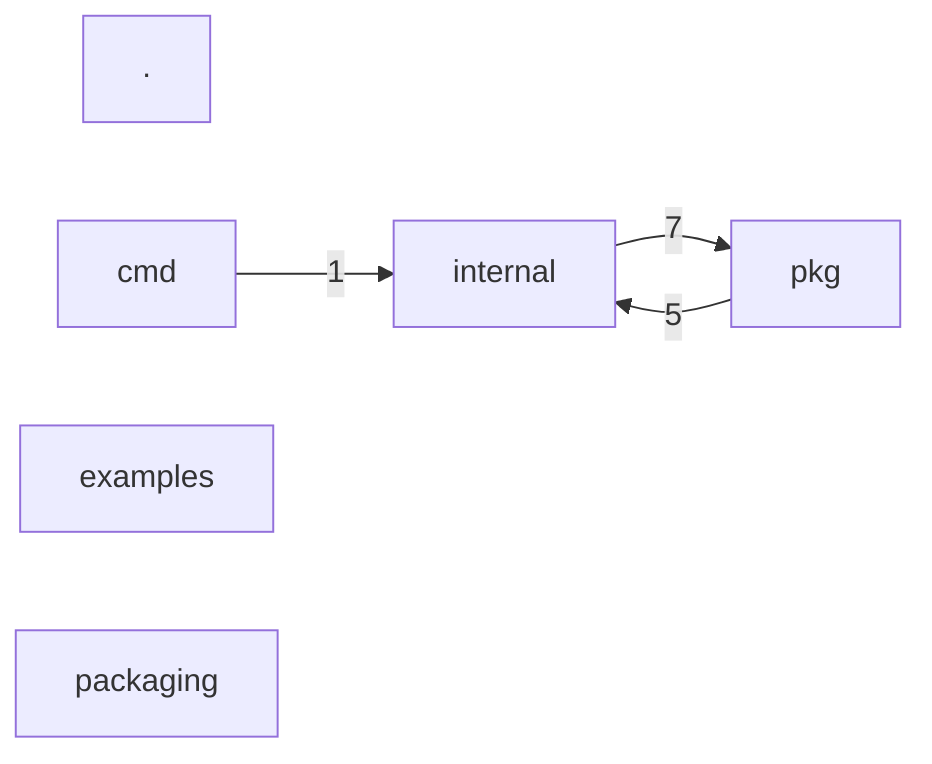

# System map

> /workspace/upstream-src/enola  ·  2026-09-22 14:15 UTC
> facts: config, domain, entrypoints, fingerprint, flows, graph, history, metrics, redundancy, resolve, runtime, sequences, structure, syntax
> Coverage: 1021/1021 (100%) · imports resolved 85/5691 · entry points 37
> Generated from deterministic facts with no model call.

## Languages

| Language | Files | Lines |
|---|---|---|
| go | 985 | 293269 |
| c | 12 | 2311 |
| ruby | 6 | 1423 |
| bash | 9 | 1367 |
| javascript | 2 | 280 |
| python | 1 | 256 |
| typescript | 6 | 88 |
| other | 8 | 71 |

## Entry points

| Surface | Method | Route | Handler | Location | Framework |
|---|---|---|---|---|---|
| cli | — | build_wheel | main | packaging/pypi/build_wheel.py:176 | argparse |
| cli | — | build_wheel | main | packaging/pypi/build_wheel.py:254 | python_script |
| http | ANY | / | s.handleIndex | pkg/dashboard/dashboard.go:140 | go_http |
| http | ANY | /courses | — | internal/engine/cache.go:593 | go_http |
| http | ANY | /orders | listOrders | examples/cross-repo/api/server.go:28 | go_http |
| http | ANY | /orders/{id} | getOrder | examples/cross-repo/api/server.go:27 | go_http |
| http | ANY | /path | handler | internal/extractors/goextractor/routes.go:158 | go_http |
| http | ANY | /path | handler | internal/extractors/goextractor/routes.go:173 | go_http |
| http | GET | /path | handler | internal/extractors/goextractor/routes.go:296 | go_http |
| http | ANY | /path | handler | internal/extractors/goextractor/routes.go:393 | go_http |
| http | ANY | GET | — | internal/engine/cache.go:1466 | go_http |
| http | ANY | GET | — | internal/extractors/goextractor/routes.go:297 | go_http |
| http | ANY | GET | — | internal/extractors/goextractor/routes.go:317 | go_http |

+24 entry points declared inside test code, listed in the fact records only.

## Structural groupings

| Directory | Files | Lines |
|---|---|---|
| internal | 801 | 255377 |
| pkg | 175 | 38767 |
| examples | 37 | 2194 |
| cmd | 9 | 1361 |
| packaging | 5 | 1240 |
| . | 2 | 126 |

## Most depended upon

| File | Fan-in | Fan-out |
|---|---|---|
| pkg/facts/facts.go | 27 | 0 |
| internal/extractors/detectnames/detectnames.go | 16 | 0 |
| internal/version/version.go | 15 | 0 |
| internal/extractors/extcoverage/extcoverage.go | 6 | 0 |
| internal/linkers/crossrepo/signals/imports/imports.go | 5 | 0 |
| internal/extractors/swiftextractor/grammar/binding.go | 4 | 0 |
| internal/extractors/dartextractor/grammar/binding.go | 3 | 0 |
| examples/custom-client/sdk/src/http/http-request.service.ts | 1 | 0 |
| internal/drift/drift.go | 1 | 0 |
| internal/extractors/dartextractor/grammar/src/scanner.c | 1 | 1 |
| internal/extractors/dartextractor/grammar/src/tree_sitter/alloc.h | 1 | 0 |
| internal/extractors/dartextractor/grammar/src/tree_sitter/parser.h | 1 | 0 |
| internal/extractors/swiftextractor/grammar/src/scanner.c | 1 | 1 |
| internal/extractors/swiftextractor/grammar/src/tree_sitter/alloc.h | 1 | 0 |
| internal/extractors/swiftextractor/grammar/src/tree_sitter/parser.h | 1 | 0 |

## Not examined

- unresolved or ambiguous imports: 1345
- dynamic or undetected invocation surfaces: 5
- sensitive config files listed but never read: 0
- Files no path from a detected entry point reaches: 1009
