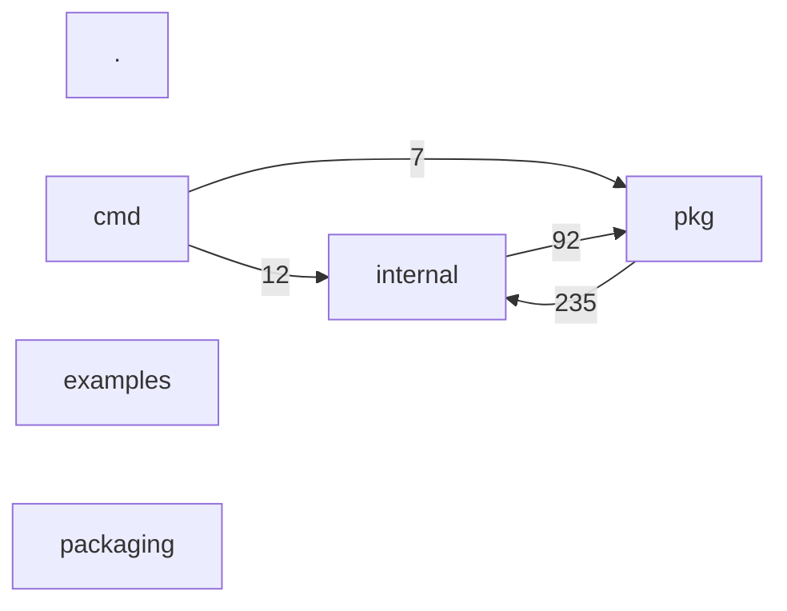

# System map

> /workspace/upstream-src/enola  ·  2026-09-23 15:44 UTC
> facts: config, domain, entrypoints, fingerprint, flows, graph, history, metrics, redundancy, resolve, runtime, sequences, structure, syntax
> Coverage: 1021/1021 (100%) · imports resolved 1397/5691 · entry points 50
> Generated from deterministic facts with no model call.

## Languages

| Language | Files | Lines |
|---|---|---|
| go | 985 | 293269 |
| c | 12 | 2311 |
| ruby | 6 | 1423 |
| bash | 9 | 1367 |
| javascript | 2 | 280 |
| python | 1 | 256 |
| typescript | 6 | 88 |
| other | 8 | 71 |

## Entry points

| Surface | Method | Route | Handler | Location | Framework |
|---|---|---|---|---|---|
| cli | — | baseline | Baseline | pkg/command/command.go:175 | go_dispatch_case |
| cli | — | blame | Blame | pkg/command/command.go:186 | go_dispatch_case |
| cli | — | build_wheel | main | packaging/pypi/build_wheel.py:176 | argparse |
| cli | — | build_wheel | main | packaging/pypi/build_wheel.py:254 | python_script |
| cli | — | check | Check | pkg/command/command.go:141 | go_dispatch_case |
| cli | — | cluster | Cluster | pkg/command/command.go:146 | go_dispatch_case |
| cli | — | constraints | Constraints | pkg/command/command.go:147 | go_dispatch_case |
| cli | — | coverage | Coverage | pkg/command/command.go:159 | go_dispatch_case |
| cli | — | dashboard | Dashboard | pkg/command/command.go:172 | go_dispatch_case |
| cli | — | diff | Diff | pkg/command/command.go:183 | go_dispatch_case |
| cli | — | doctor | Doctor | pkg/command/command.go:166 | go_dispatch_case |
| cli | — | endpoint | Endpoint | pkg/command/command.go:163 | go_dispatch_case |
| cli | — | gc | GC | pkg/command/command.go:189 | go_dispatch_case |
| cli | — | history | History | pkg/command/command.go:192 | go_dispatch_case |
| cli | — | hook | Hook | pkg/command/command.go:195 | go_dispatch_case |
| cli | — | install | Install | pkg/command/command.go:201 | go_dispatch_case |
| cli | — | log | Log | pkg/command/command.go:178 | go_dispatch_case |
| cli | — | main | main | cmd/enola/main.go:29 | go_main |
| cli | — | plan | Plan | pkg/command/command.go:158 | go_dispatch_case |
| cli | — | providers | Providers | pkg/command/command.go:168 | go_dispatch_case |
| cli | — | server | main | examples/cross-repo/api/server.go:15 | go_main |
| cli | — | show | Show | pkg/command/command.go:180 | go_dispatch_case |
| cli | — | uninstall | Install | pkg/command/command.go:201 | go_dispatch_case |
| http | ANY | / | s.handleIndex | pkg/dashboard/dashboard.go:52 | go_http |
| http | ANY | /orders | listOrders | examples/cross-repo/api/server.go:12 | go_http |
| http | ANY | /orders/{id} | getOrder | examples/cross-repo/api/server.go:12 | go_http |

+24 entry points declared inside test code, listed in the fact records only.

## Structural groupings

| Directory | Files | Lines |
|---|---|---|
| internal | 801 | 255377 |
| pkg | 175 | 38767 |
| examples | 37 | 2194 |
| cmd | 9 | 1361 |
| packaging | 5 | 1240 |
| . | 2 | 126 |

## Most depended upon

| File | Fan-in | Fan-out |
|---|---|---|
| internal/facts/accessors.go | 578 | 0 |
| internal/factpath/factpath.go | 79 | 0 |
| internal/config/config.go | 53 | 3 |
| internal/intent/constraints.go | 43 | 0 |
| pkg/plugin/linker.go | 43 | 1 |
| internal/diff/counts.go | 34 | 1 |
| internal/engine/baseline.go | 32 | 2 |
| internal/extractors/tsutil/kinds.go | 32 | 0 |
| pkg/bootstrap/bootstrap.go | 32 | 67 |
| internal/linkers/vocab/overlay.go | 29 | 0 |
| pkg/facts/facts.go | 27 | 1 |
| pkg/history/blame.go | 27 | 0 |
| internal/explainers/common/cap.go | 25 | 0 |
| internal/parallel/parallel.go | 18 | 0 |
| internal/extractors/goextractor/funcvalues.go | 17 | 0 |

## Not examined

- unresolved or ambiguous imports: 33
- dynamic or undetected invocation surfaces: 1
- sensitive config files listed but never read: 0
- Files no path from a detected entry point reaches: 922
