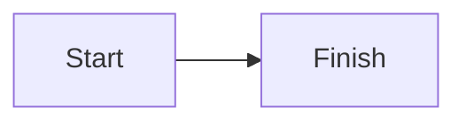
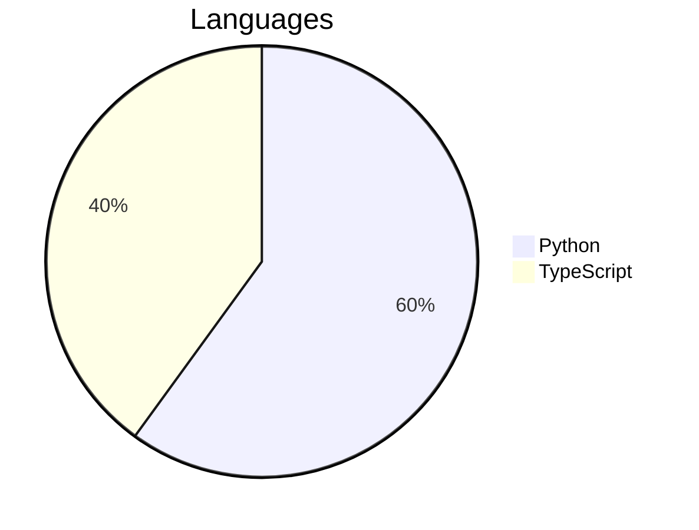

# Every element

An opening paragraph with **strong**, *emphasis*, ~~deleted~~ and `code`, a card TASK-001 and a footnote.[^why]

## Callouts

> [!NOTE]
> A note for the reader.

> [!TIP]
> A tip.

> [!IMPORTANT]
> Something important.

> [!WARNING]
> A warning.

> [!CAUTION]
> A caution.

> An ordinary quote.

## Tasks

- [x] Done task
- [ ] Open task

## Code

```python
def add(a, b):
    return a + 1  # a comment
```

```
plain text with [^why] inside a fence
[^fake]: not a footnote
```

## Diagrams





## Table

| Name | Files | Share |
|------|------:|-------|
| eaos | 1,204 | 62.5% |
| studio | 310 | 16% |
| docs | — | 3.1% |

## Figure


Second footnote here.[^2]

[^why]: Because the reader needs one.
[^2]: The second one,
    on two lines.
